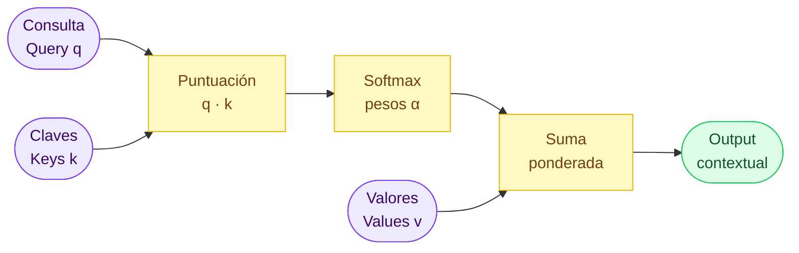
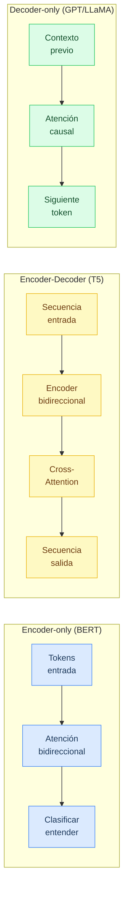
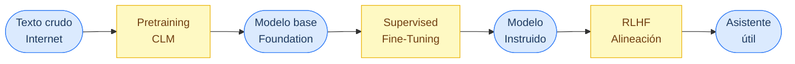
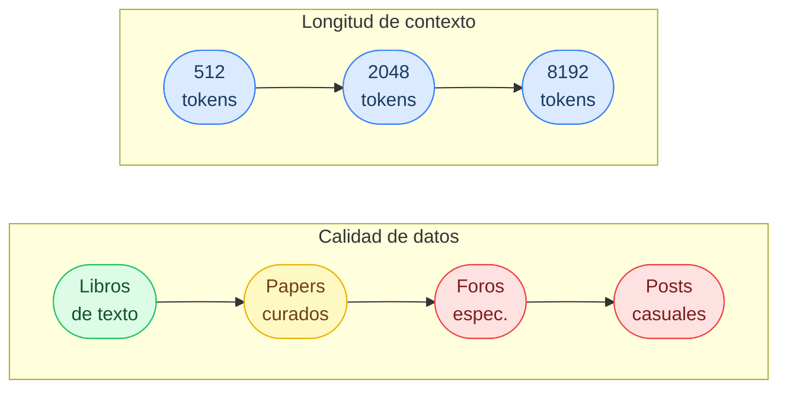
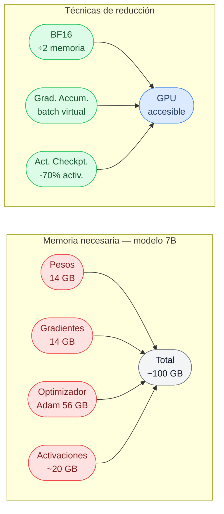

# Capítulo 1 — El mapa del territorio: Transformers, pretraining y la pipeline de entrenamiento de LLMs

> Basado en "The Finetuning Landscape — A Map of Modern LLM Training" y "Modern Pretraining Strategies: A Hands-On Guide" (The Neural Maze, Finetuning Sessions · Lesson 1 / Lab 1).

Antes de hablar de fine-tuning, hay que entender de dónde viene el modelo que vamos a afinar. Es como intentar aprender a tunear un motor sin saber cómo funciona la combustión interna: puedes seguir una receta, pero no entenderás por qué algo falla ni cómo arreglarlo. Este capítulo construye esa base. No es un desvío — es el mapa sin el que el resto del libro no tiene sentido.

---

## De las RNNs al Transformer: por qué cambió todo

Antes de que los Transformers se convirtieran en el estándar universal de la inteligencia artificial, el campo de procesamiento de lenguaje natural estaba dominado por las redes neuronales recurrentes — en inglés Recurrent Neural Networks, o RNNs. Y dentro de ellas, la arquitectura más capaz era la LSTM (Long Short-Term Memory, memoria a largo-corto plazo), diseñada para recordar patrones a lo largo de secuencias.

La idea detrás de las RNNs es intuitiva: para entender una frase, vas leyendo palabra por palabra, y en cada paso actualizas un "estado oculto" que se supone que resume todo lo que has leído hasta ese momento. Es como leer un libro y tomar notas en un post-it que sobrescribes continuamente: al llegar al capítulo 20, el post-it ya no recuerda bien lo del capítulo 1.

Eso es exactamente el problema. Las RNNs y LSTMs sufrían de lo que se llama el problema de las dependencias de largo alcance: cuando una frase es larga o la información relevante está lejos, el estado oculto "olvida" los detalles iniciales antes de poder usarlos. Tradúcelo a la práctica: si una oración tiene 200 palabras y el sujeto está en la primera, la red tenía dificultades para conectar el sujeto con el verbo 190 palabras más tarde.

Además, existía un problema estructural de rendimiento: las RNNs procesan los tokens en secuencia, uno después del otro. Eso las hace inherentemente lentas de entrenar, porque no puedes paralelizar el procesamiento sobre los tokens de una misma frase. En la era del hardware masivamente paralelo (GPUs, TPUs), esa limitación era especialmente dolorosa.

La solución vino de una dirección inesperada — no reemplazando las RNNs con algo completamente nuevo, sino añadiéndoles un componente que resultó ser tan poderoso que terminó haciendo las RNNs irrelevantes: el mecanismo de atención.

---

## El mecanismo de atención: un buscador diferencial

La atención fue introducida originalmente como una mejora a los modelos encoder–decoder basados en RNNs para tareas de traducción automática. Para entender por qué fue revolucionaria, hay que entender el problema que resolvía.

Los modelos de traducción de la época funcionaban así: un encoder (codificador) leía toda la frase de entrada y la comprimía en un único vector de tamaño fijo — una especie de "resumen" de la frase. Luego un decoder (decodificador) intentaba generar la traducción a partir de ese vector. El problema: comprimir "The cat that the dog chased sat on the mat near the window" en un vector de 512 números y esperar que el decodificador pueda generar una traducción fiel es pedir demasiado. Información se perdía.

La atención propuso algo elegante: en lugar de comprimir todo en un vector, ¿por qué no dejar que el decodificador consulte directamente los estados del encoder en cada paso de la decodificación? La metáfora útil aquí es un sistema de recuperación de información. Imagina que tienes una base de datos de fichas:

- Cada ficha tiene una **clave** (key, o $k$) que describe su contenido.
- Cada ficha tiene un **valor** (value, o $v$) que es el contenido real.
- Cuando buscas algo, formulas una **consulta** (query, o $q$) que expresa qué estás buscando.

El mecanismo compara tu consulta contra todas las claves, calcula una puntuación de relevancia para cada una, normaliza esas puntuaciones (con una función softmax, que las convierte en probabilidades que suman 1), y luego produce una combinación ponderada de todos los valores. Las fichas más relevantes para tu consulta contribuyen más; las menos relevantes contribuyen poco o nada.

Pongamos un ejemplo con números pequeños. Supón que estás decodificando la palabra "chased" en una traducción y tienes tres fichas del encoder: "dog" ($k_1$), "cat" ($k_2$), "mat" ($k_3$). Tu consulta $q$ representa "quiero saber quién realiza la acción de perseguir". El mecanismo calcula:

- Puntuación("dog") = 4.2 → muy relevante
- Puntuación("cat") = 1.1 → algo relevante  
- Puntuación("mat") = 0.1 → casi irrelevante

Después de la softmax, estas puntuaciones se convierten en pesos que suman 1 (por ejemplo, 0.93, 0.06, 0.01). El output de la atención es $0.93 \cdot v_{dog} + 0.06 \cdot v_{cat} + 0.01 \cdot v_{mat}$ — básicamente, el valor de "dog" con pequeñas contribuciones de los demás. El modelo puede "mirar" exactamente donde necesita.

> **Descripción visual:** Diagrama de flujo horizontal. A la izquierda, tres óvalos morados representan las entradas: "Consulta Query q", "Claves Keys k" y "Valores Values v". Query y Claves convergen en un rectángulo amarillo "Puntuación q·k", que fluye a otro rectángulo amarillo "Softmax pesos α". Desde Softmax y Valores, ambas flechas confluyen en un rectángulo amarillo "Suma ponderada", que desemboca en un óvalo verde "Output contextual". Fondo blanco, tipografía sans-serif, estilo limpio.

La clave de este mecanismo es que es diferencial (differentiable): las puntuaciones se aprenden durante el entrenamiento vía gradiente descendente. El modelo aprende, por sí solo, qué vale la pena atender en cada contexto.

---

## Self-attention: cuando la secuencia se lee a sí misma

La atención original conectaba dos secuencias distintas: la de entrada (encoder) con la de salida (decoder). Pero alguien hizo la pregunta obvia: ¿qué pasa si aplicamos el mismo mecanismo dentro de una sola secuencia?

Eso es la self-attention (auto-atención): cada token de la secuencia produce su propia consulta, su propia clave, y su propio valor, y luego "asiste" a todos los demás tokens — incluyéndose a sí mismo. El resultado es que la representación de cada token se actualiza con información de todos los demás tokens de la misma frase.

Considera la frase: "El banco aprobó el préstamo porque tenía buenas reservas." ¿A qué se refiere "tenía"? ¿Al banco o al solicitante? Para un humano es obvio — "el banco tenía buenas reservas". Con self-attention, el token "tenía" puede computar alta atención hacia "banco" y baja atención hacia otros candidatos, resolviendo la ambigüedad en la representación vectorial misma.

El proceso técnico es el siguiente. Dado un token en posición $i$ con representación $x_i$:

1. Se proyecta $x_i$ con tres matrices de pesos distintas para obtener $q_i$, $k_i$, $v_i$.
2. La puntuación del token $i$ respecto al token $j$ es $s_{ij} = q_i \cdot k_j$ (producto punto).
3. Para estabilizar la magnitud de las puntuaciones (que crecen con la dimensión del vector), se dividen entre $\sqrt{d_k}$, donde $d_k$ es la dimensión de las claves.
4. Se aplica softmax sobre todas las puntuaciones $s_{ij}$ para obtener pesos de atención $\alpha_{ij}$.
5. La nueva representación del token $i$ es $\sum_j \alpha_{ij} \cdot v_j$.

La fórmula compacta que resume todo esto es:

$$\text{Attention}(Q, K, V) = \text{softmax}\left(\frac{QK^T}{\sqrt{d_k}}\right)V$$

donde $Q$, $K$, $V$ son matrices que apilan las consultas, claves y valores de todos los tokens de la secuencia. Esta operación se puede hacer sobre toda la secuencia de golpe, en paralelo — algo imposible con las RNNs. Es exactamente esto lo que hace al Transformer tan eficiente de entrenar.

Hay una consecuencia crucial que vale la pena subrayar: la self-attention no tiene noción inherente de posición. Para el mecanismo, los tokens son como un conjunto desordenado — no importa si "perro" está al principio o al final de la frase. Esa información hay que inyectarla por separado.

---

## Codificación posicional: enseñarle al modelo que el orden importa

Dado que la self-attention trata los tokens como un conjunto sin orden, el Transformer original añade vectores de codificación posicional (positional encodings) directamente a las representaciones de los tokens antes de procesarlos. Estos vectores codifican la posición de cada token en la secuencia de manera que el modelo puede aprender a usarlos.

La elección del paper original "Attention Is All You Need" fue usar funciones sinusoidales a distintas frecuencias. Cada dimensión del vector de posición usa una sinusoide diferente:

$$PE_{(pos, 2i)} = \sin\left(\frac{pos}{10000^{2i/d_{model}}}\right)$$
$$PE_{(pos, 2i+1)} = \cos\left(\frac{pos}{10000^{2i/d_{model}}}\right)$$

donde $pos$ es la posición del token (0, 1, 2...), $i$ es el índice de la dimensión, y $d_{model}$ es la dimensión del modelo. Las dimensiones de baja frecuencia capturan información gruesa sobre posición (¿estoy al principio, al medio, al final?), mientras que las dimensiones de alta frecuencia capturan diferencias finas entre posiciones adyacentes.

La intuición práctica es: imagina un reloj con múltiples manecillas. La manecilla de las horas da información gruesa (en qué parte del día estás), la de los minutos da información más fina, y la de los segundos da información muy precisa. Las codificaciones sinusoidales funcionan igual, pero con dimensiones del vector en lugar de manecillas.

Los modelos modernos han adoptado alternativas como las Rotary Position Embeddings (RoPE), que integran la información posicional de forma más elegante dentro del mecanismo de atención mismo, en lugar de añadirla externamente. Pero el principio es el mismo: el modelo necesita saber dónde está cada token en la secuencia.

---

## Multi-head attention: ver la misma frase con distintos ojos

Un único mecanismo de self-attention produce una única "vista" de las relaciones entre tokens. Pero las relaciones en el lenguaje son multidimensionales: dos palabras pueden estar relacionadas sintácticamente (sujeto-verbo), semánticamente (sinonimia), posicionalmente (adyacencia), y más. Un solo conjunto de pesos de atención tiene que comprometer entre todos estos tipos de relación a la vez.

La multi-head attention (atención multi-cabeza) resuelve esto corriendo la self-attention en paralelo varias veces, con diferentes proyecciones aprendidas. Si el modelo tiene $h$ cabezas (heads) de atención, cada cabeza $i$ tiene sus propias matrices de proyección $W_i^Q$, $W_i^K$, $W_i^V$ de dimensión reducida $d_k = d_{model}/h$. Cada cabeza produce su propio conjunto de outputs de atención, y al final todos se concatenan y se proyectan de vuelta a $d_{model}$:

$$\text{MultiHead}(Q, K, V) = \text{Concat}(\text{head}_1, ..., \text{head}_h) \cdot W^O$$

donde $\text{head}_i = \text{Attention}(QW_i^Q, KW_i^K, VW_i^V)$.

El resultado práctico es que distintas cabezas se especializan en distintos tipos de relaciones. En modelos analizados empíricamente, se ha observado que algunas cabezas se especializan en relaciones sintácticas (quien es el sujeto del verbo), otras en correferencia (a qué se refiere "él"), y otras en posiciones relativas (el siguiente token, el anterior). El modelo no es programado para hacer esto — emerge solo del entrenamiento.

Por qué importa para el fine-tuning, que es el tema central de este libro: cuando apliquemos técnicas como [[03-lora-adaptacion-de-bajo-rango|LoRA]] (que veremos en capítulos posteriores), estaremos modificando estas mismas matrices de proyección $W^Q$, $W^K$, $W^V$, $W^O$. Entender qué hace cada una es fundamental para tomar buenas decisiones sobre qué modificar y qué dejar intacto.

---

## El Transformer completo: juntando las piezas

Con self-attention y multi-head attention como bloques fundamentales, el Transformer añade algunos ingredientes más para completar la arquitectura:

**Feed-forward por posición.** Después de la atención, cada token pasa por una red neuronal feed-forward (totalmente conectada) que opera de forma independiente en cada posición. Esta red tiene dos capas con una activación no lineal en el medio (originalmente ReLU, hoy más frecuente GELU). Su función es procesar y transformar las representaciones que la atención ha mezclado entre tokens — si la atención mezcla información entre posiciones, el feed-forward procesa cada posición en profundidad.

**Normalización de capa (Layer Norm).** Para estabilizar el entrenamiento con redes tan profundas, se aplica normalización de capa antes o después de cada sub-bloque. Sin ella, los gradientes pueden explotar o desvanecerse a medida que el error se propaga hacia atrás por decenas de capas.

**Conexiones residuales.** Cada sub-bloque (atención + feed-forward) tiene una conexión directa que suma la entrada al output del sub-bloque. La idea es simple pero poderosa: si el bloque no aprende nada útil, el gradiente puede seguir fluyendo hacia atrás directamente sin pasar por él. Esto hace que la optimización sea mucho más estable y permite entrenar redes de 100+ capas.

Un bloque Transformer apila estos componentes: la entrada llega, pasa por multi-head self-attention, se suma con la conexión residual, se normaliza, pasa por el feed-forward, se suma de nuevo con otra conexión residual, y se normaliza. Ese bloque se repite $N$ veces (en GPT-3 eran 96 veces; en LLaMA 3 70B son 80). La profundidad es la que da capacidad al modelo.

---

## Tres arquitecturas, tres filosofías

Cuando se habla de "LLMs", la mayoría piensa en ChatGPT o Claude — modelos que generan texto. Pero el Transformer como arquitectura base admite tres configuraciones distintas, cada una adecuada para un tipo diferente de tarea.

### Encoder-only: para entender, no para generar

Los modelos encoder-only como BERT procesan toda la secuencia de entrada con self-attention bidireccional: cada token puede atender a todos los demás, tanto los que vienen antes como los que vienen después. Esto produce representaciones extremadamente ricas del significado de cada token en su contexto completo.

La palabra "banco" en "fui al banco a sacar dinero" tiene una representación diferente a "banco" en "me senté en el banco del parque" — y el modelo puede distinguirlas porque ve toda la frase a la vez. Esta capacidad hace que los modelos encoder-only sean ideales para clasificación de texto, extracción de entidades, análisis de sentimiento, y búsqueda semántica.

Lo que no pueden hacer es generar texto. Un encoder-only no tiene mecanismo para predecir el siguiente token — su objetivo de entrenamiento (el masked language modeling, donde se enmascaran tokens aleatorios y se predice qué debería haber allí) no está diseñado para generación secuencial.

### Encoder–decoder: para transformar secuencias

La arquitectura encoder–decoder es la del Transformer original, diseñada para traducción automática. El encoder procesa la secuencia de entrada con atención bidireccional y produce representaciones de alta calidad. El decoder genera la secuencia de salida token a token, usando dos mecanismos de atención:

- **Causal self-attention** (o masked self-attention): en el decoder, cuando se genera el token en la posición $t$, solo puede atender a los tokens generados anteriormente (posiciones 1 hasta $t-1$). Esto es lo que hace la generación autorregresiva — no puede "hacer trampa" mirando el futuro.
- **Cross-attention**: el decoder consulta las representaciones del encoder para obtener información sobre la entrada. Es aquí donde fluye la información de "lo que hay que traducir" hacia "cómo traducirlo".

Modelos como T5 y BART usan esta arquitectura. Son poderosos para tareas donde tanto la entrada como la salida son secuencias de longitud variable: traducción, resumen, reformulación, pregunta-respuesta.

### Decoder-only: la arquitectura que gobierna el mundo actual

Los modelos decoder-only eliminan el encoder por completo. Solo tienen un decoder con causal self-attention: cada token solo puede atender a los tokens que lo preceden. El objetivo de entrenamiento es simplemente predecir el siguiente token.

A primera vista parece una simplificación radical — ¿no es mejor tener un encoder que procese la entrada completa con atención bidireccional? La respuesta empírica es sorprendente: no necesariamente. Con suficientes parámetros y datos, los modelos decoder-only aprenden a hacer todo lo que los encoder-decoders hacen, y más. Y tienen una ventaja fundamental: un modelo entrenado para predecir el siguiente token puede resolver cualquier tarea si esa tarea se formula como completar una secuencia. Traducción, resumen, codificación, razonamiento matemático, respuesta a preguntas — todo puede formularse como "dado este texto, ¿cuál es la continuación natural?"

Esta flexibilidad, combinada con la simplicidad del objetivo de entrenamiento (que lo hace escalable a enormes cantidades de datos), explica por qué GPT, LLaMA, Qwen, Mistral, y prácticamente todos los LLMs de vanguardia actuales son decoder-only. Es la arquitectura que estudiaremos en el resto del libro.

> **Descripción visual:** Diagrama con tres subgrafos lado a lado, cada uno con orientación vertical interna. El subgrafo izquierdo (fondo azul claro, borde azul) representa "Encoder-only (BERT)" con tres rectángulos apilados: "Tokens entrada", "Atención bidireccional" y "Clasificar / entender". El subgrafo central (fondo amarillo pálido, borde dorado) representa "Encoder-Decoder (T5)" con cuatro rectángulos: "Secuencia entrada", "Encoder bidireccional", "Cross-Attention" y "Secuencia salida". El subgrafo derecho (fondo verde claro, borde verde) representa "Decoder-only (GPT/LLaMA)" con tres rectángulos: "Contexto previo", "Atención causal" y "Siguiente token". Flechas descendentes dentro de cada subgrafo. Fondo blanco, tipografía sans-serif, estilo comparativo.

---

## Leyes de escala: por qué más grande es más inteligente (hasta cierto punto)

Una de las observaciones más importantes de la última década en IA es que el rendimiento de los Transformers mejora de forma predecible y continua al aumentar tres magnitudes: el número de parámetros del modelo, la cantidad de datos de entrenamiento, y el cómputo total utilizado.

Esta relación se formaliza en lo que se conoce como leyes de escala (scaling laws). Publicadas originalmente por Kaplan et al. (2020) de OpenAI, muestran que la pérdida de un modelo (su error en predecir el siguiente token) sigue una relación de ley de potencias (power-law) con estas tres variables. Matemáticamente, si tienes $N$ parámetros, $D$ tokens de datos, y $C$ FLOPs de cómputo:

$$L \propto N^{-\alpha}, \quad L \propto D^{-\beta}, \quad L \propto C^{-\gamma}$$

donde $\alpha$, $\beta$, $\gamma$ son exponentes empíricos. La consecuencia práctica es dramática: si duplicas el número de parámetros manteniendo todo lo demás constante, puedes predecir aproximadamente cuánto va a mejorar el modelo. No es lineal, pero sí predecible.

Chinchilla (2022) refinó esta intuición: dado un presupuesto de cómputo fijo, la distribución óptima no es "el modelo más grande posible". Es una distribución balanceada entre parámetros y tokens de entrenamiento — aproximadamente 20 tokens por parámetro. Un modelo de 7B parámetros debería ver idealmente 140B tokens. Un modelo de 70B parámetros debería ver 1.4T tokens. Modelos que habían entrenado con pocos datos para su tamaño estaban "compute-suboptimal" — habían gastado cómputo de forma ineficiente.

Para el fine-tuning, las leyes de escala tienen una implicación directa: el modelo base que vamos a afinar ya parte de un punto muy capaz. El fine-tuning no "enseña" capacidades nuevas de cero — refina y direcciona capacidades que ya existen. Esa distinción cambia fundamentalmente cómo debemos pensar sobre el proceso.

---

## Pretraining: donde se forja la inteligencia

Llegamos al concepto central de este capítulo. El pretraining (preentrenamiento) es la primera y más fundamental fase del entrenamiento de un LLM. Es donde el modelo aprende el lenguaje desde cero — o, más precisamente, aprende a modelar la distribución estadística del lenguaje humano.

El objetivo es deceptivamente simple: dado un texto de entrada, predecir el siguiente token. Para un modelo decoder-only, esto se llama causal language modeling (CLM, modelado de lenguaje causal). Dado un fragmento de texto $x_1, x_2, ..., x_t$, el modelo aprende a predecir $x_{t+1}$.

La función de pérdida (loss function, la medida de cuán equivocado está el modelo) que se minimiza durante el pretraining es la entropía cruzada negativa (negative cross-entropy):

$$\mathcal{L}_{CLM} = -\frac{1}{T} \sum_{t=1}^{T} \log P(x_t \mid x_1, ..., x_{t-1}; \theta)$$

donde $T$ es el número de tokens en el batch, $P(x_t \mid x_1, ..., x_{t-1}; \theta)$ es la probabilidad que el modelo con parámetros $\theta$ asigna al token correcto $x_t$ dado el contexto anterior. Cuando el modelo asigna alta probabilidad al token correcto, el logaritmo es cercano a cero y la pérdida es baja. Cuando asigna baja probabilidad al token correcto (se equivoca), el logaritmo es muy negativo, y la pérdida sube.

Esto es aprendizaje auto-supervisado (self-supervised learning): no necesitas etiquetas elaboradas por humanos. La supervisión está en los propios datos — el token $t+1$ es la etiqueta del contexto $x_1, ..., x_t$. Eso es lo que hace el pretraining escalable: el internet entero es un conjunto de entrenamiento gratuito y enorme.

El resultado del pretraining es lo que se llama un modelo base (base model o foundation model). Este modelo ha visto cantidades astronómicas de texto — LLaMA 3 fue entrenado en 15 billones de tokens — y ha absorbido gramática, sintaxis, semántica, hechos del mundo, patrones de razonamiento, código, múltiples idiomas, y mucho más. Es extraordinariamente capaz de completar texto de forma coherente y factual.

Pero también es un modelo peculiar. Si le preguntas "¿Cuál es la capital de Francia?", es igual de probable que complete con "es París" que con "es una pregunta frecuente en exámenes de geografía" o con "¿Cuál es la capital de Alemania?". El modelo no tiene concepto de "responder preguntas" — solo tiene el concepto de "continuar texto de forma plausible". Le falta algo crucial: saber cómo comportarse.

---

## La pipeline completa: de texto crudo a asistente útil

El camino de un modelo base a un asistente como ChatGPT fue formalizado en 2022 por el paper de InstructGPT (OpenAI), y desde entonces se ha convertido en el estándar de la industria. La pipeline tiene tres etapas principales:

**Etapa 1: Pretraining.** Como hemos descrito. Un modelo decoder-only entrena sobre billones de tokens de texto crudo. El output es un modelo base — capaz, pero sin comportamiento definido.

**Etapa 2: [[02-supervised-finetuning|Supervised Fine-Tuning]] (SFT, ajuste fino supervisado).** Se toma el modelo base y se entrena sobre un dataset (conjunto de datos) de pares de instrucción-respuesta cuidadosamente elaborados por humanos. "¿Cuál es la capital de Francia?" → "La capital de Francia es París." El modelo aprende el formato de la interacción: qué significa una pregunta y cómo se ve una respuesta adecuada. Tras el SFT, el modelo ya responde como un asistente — pero sus preferencias sobre qué es una "buena" respuesta todavía no están bien calibradas.

**Etapa 3: Alignment mediante [[05-rlhf-alineacion-llms|RLHF]].** RLHF significa Reinforcement Learning from Human Feedback — Aprendizaje por Refuerzo con Feedback Humano. Dado que el término aparecerá repetidamente en el libro, conviene definirlo desde ya: es un proceso donde el modelo recibe señales de calidad sobre sus outputs (generadas por evaluadores humanos o por un modelo recompensa entrenado para ello), y ajusta sus pesos para generar outputs que reciben mejor valoración. El resultado es un modelo que no solo responde correctamente sino que responde de formas que los humanos encuentran útiles, seguras, y apropiadas.

> **Descripción visual:** Diagrama de flujo horizontal con siete nodos alternando entre estadios de datos (óvalos azul claro) y procesos de entrenamiento (rectángulos amarillo pálido). Los óvalos representan artefactos: "Texto crudo / Internet", "Modelo base / Foundation", "Modelo Instruido" y "Asistente útil". Los rectángulos representan fases: "Pretraining CLM", "Supervised Fine-Tuning" y "RLHF Alineación". Las flechas son grises con punta triangular, dirección izquierda a derecha. Fondo blanco, tipografía sans-serif, estilo minimalista.

Hay también una forma alternativa de ver este proceso que resulta útil: se puede dividir en solo dos fases. La primera fase es el pretraining, donde el modelo construye capacidades lingüísticas y de conocimiento del mundo. La segunda fase es el post-training, que agrupa el SFT y el RLHF — todo lo que ocurre después del pretraining para dar forma al comportamiento del modelo. Ambas perspectivas (tres etapas vs. dos fases) describen el mismo proceso; la diferencia es de énfasis conceptual.

En el resto de este libro nos concentramos casi exclusivamente en el post-training: cómo tomar un modelo base o un modelo SFT existente y adaptarlo a nuestras necesidades específicas. Pero sin entender de dónde viene ese modelo, sin saber qué aprendió durante el pretraining y por qué, las técnicas que vamos a estudiar — LoRA, QLoRA, DPO, GRPO — quedan sin sustento.

---

## Pretraining continuo: cuando el modelo base necesita aprender más

Con la teoría en claro, llegamos a la primera técnica práctica del libro: el Continued Pre-Training (CPT, o Pretraining Continuo). Es aquí donde la teoría se vuelve acción, y donde muchos proyectos reales de fine-tuning encuentran su primer obstáculo.

El escenario es frecuente: tienes un modelo base potente (por ejemplo, LLaMA 3 8B) entrenado sobre texto general de internet. Necesitas que ese modelo entienda un dominio especializado — vocabulario médico, documentación técnica interna, normativa legal, patrones matemáticos avanzados. El problema: esos conceptos estaban subrepresentados en el dataset original del modelo.

¿Por qué no simplemente hacer SFT directamente sobre ese dominio? Porque el SFT funciona mejor cuando el modelo base ya tiene representaciones internas del dominio. Si le pides al modelo que responda preguntas de jurisprudencia pero nunca ha procesado texto jurídico en profundidad, el SFT puede enseñarle el formato de las respuestas, pero no puede insertar el conocimiento que falta. El resultado son respuestas que suenan confiadas pero son inexactas — el temido fenómeno de las alucinaciones.

El CPT resuelve esto volviendo al mismo objetivo del pretraining original: predecir el siguiente token sobre texto crudo del dominio objetivo. No hay pares instrucción-respuesta, no hay etiquetas humanas — solo documentos del dominio, tokenizados y procesados con la misma pérdida CLM. La diferencia con el pretraining original es que partimos de pesos ya entrenados (no de pesos aleatorios), lo cual hace el proceso mucho más eficiente y rápido.

Las ventajas concretas del CPT son tres. Primero, el vocabulario especializado: los modelos de propósito general suelen tokenizar términos técnicos de forma ineficiente, dividiéndolos en sub-tokens que no capturan bien su significado. Tras el CPT, el modelo aprende las relaciones entre esos términos y su contexto. "Hipoteca variable indexada al Euribor" deja de ser una sucesión de tokens sin cohesión y pasa a tener representaciones propias del ecosistema financiero. Segundo, el conocimiento del mundo actualizado: si el modelo base fue entrenado en 2023 y el mundo ha cambiado, el CPT puede incorporar información reciente. Tercero, la mejor base para SFT: un modelo que ya comprende el dominio responde mejor a la instrucción — los gradientes del SFT tienen menos trabajo que hacer porque el "terreno" ya está preparado.

---

## Aprendizaje por currículum: el orden de los datos importa más de lo que crees

Una vez que decides hacer CPT, la pregunta inmediata es: ¿en qué orden presento los datos al modelo? La respuesta intuitiva sería "en cualquier orden aleatorio" — y esa respuesta sería incorrecta.

El curriculum learning (aprendizaje por currículum) es la práctica de organizar los datos de entrenamiento de menor a mayor dificultad, replicando cómo los maestros humanos estructuran la enseñanza. No enseñas cálculo diferencial antes de que el alumno sepa álgebra. Lo mismo aplica a los modelos.

El problema que el currículum resuelve es la saturación. Cuando un modelo en fase de pretraining o CPT recibe datos de máxima complejidad desde el primer momento, los gradientes — las señales de corrección que fluyen hacia atrás durante el entrenamiento — pueden volverse inestables. El modelo no tiene un punto de apoyo desde el que interpretar la complejidad, y los pesos convergen hacia soluciones subóptimas. En el peor caso, el proceso de entrenamiento colapsa completamente.

La implementación práctica del currículum para CPT tiene dos dimensiones:

**Ordenar por calidad de la señal.** Un dataset de matemáticas podría contener libros de texto universitarios, papers académicos, soluciones de problemas en foros especializados, y posts casuales en Reddit sobre matemáticas. Estos cuatro tipos de datos tienen relaciones señal-ruido muy distintas. El currículum sugiere empezar con los libros de texto (gold standard: datos limpios, bien estructurados, densos en conocimiento verdadero) y gradualmente introducir los foros y los posts casuales (long tail: datos ruidosos, a veces incorrectos, pero que aportan variedad de expresión). El modelo aprende primero la lógica matemática limpia y luego aprende a operar en la messy realidad de cómo la gente escribe sobre matemáticas.

**Escalar la longitud del contexto progresivamente.** Empezar con ventanas de contexto de 512 tokens y escalar gradualmente a 4.096, luego a 8.192, y finalmente a la ventana máxima del modelo. La razón es que las dependencias de corto alcance (sintaxis local, coherencia de frase) son más fáciles de aprender que las de largo alcance (coherencia de párrafo, argumentación que se desarrolla a lo largo de páginas). Un modelo que intenta aprender dependencias de 128K tokens desde el primer día tiene dificultades para establecer las relaciones locales sobre las que se apoyan las relaciones largas.

> **Descripción visual:** Diagrama con dos subgrafos horizontales apilados verticalmente. El subgrafo superior "Calidad de datos" muestra cuatro óvalos conectados de izquierda a derecha: "Libros de texto" (verde, máxima calidad), "Papers curados" (amarillo), "Foros espec." (rojo claro) y "Posts casuales" (rojo claro, mayor ruido). El subgrafo inferior "Longitud de contexto" muestra tres óvalos azules conectados: "512 tokens", "2048 tokens" y "8192 tokens", representando escala progresiva. Las flechas indican dirección de progresión en el entrenamiento. Fondo blanco, tipografía sans-serif, estilo limpio y didáctico.

El resultado de un currículum bien diseñado es convergencia más rápida, menor pérdida final, y modelos más robustos. Es una de esas optimizaciones que no requiere hardware adicional ni modificaciones de arquitectura — solo disciplina en la preparación de los datos.

---

## Destilación del conocimiento: cómo un modelo pequeño hereda la sabiduría de uno grande

Otra técnica que aparece frecuentemente en los pipelines modernos de pretraining y post-training es la destilación del conocimiento (knowledge distillation). Merece un lugar en este capítulo porque es la explicación detrás de un fenómeno que quizás hayas observado: modelos de 7B parámetros que en ciertas tareas superan a modelos de 70B no destilados.

La idea parte de una observación sobre el entrenamiento estándar. Cuando un modelo aprende a predecir el siguiente token, recibe una etiqueta dura (hard label): el token correcto es este, los demás son incorrectos. Pero esta supervisión binaria ignora información valiosa que está implícita en la distribución de probabilidades del modelo: el hecho de que "París" sea la respuesta correcta, pero "Lyon" tenga un 5% de probabilidad y "Madrid" tenga un 1%, dice algo sobre la estructura del espacio semántico que la etiqueta dura no captura.

A estas probabilidades distribuidas las llamamos soft labels (etiquetas suaves). Y la idea de la destilación es usar las soft labels de un modelo grande (el "profesor" o teacher) para entrenar un modelo más pequeño (el "alumno" o student). El alumno no aprende simplemente que la respuesta es "París" — aprende que "París" tiene 90% de probabilidad, que "Lyon" tiene 8%, y que "Londres" tiene 1%. Esa información estructural sobre las relaciones entre conceptos es lo que los investigadores llaman dark knowledge (conocimiento oscuro): el conocimiento que no está en las respuestas correctas, sino en la estructura de las respuestas incorrectas.

La función de pérdida del alumno combina dos términos:

$$\mathcal{L}_{distill} = (1 - \lambda) \cdot \mathcal{L}_{CE}(y, \hat{y}_{student}) + \lambda \cdot \mathcal{L}_{KL}(p_{teacher}^{(T)}, p_{student}^{(T)})$$

donde $\mathcal{L}_{CE}$ es la pérdida de entropía cruzada estándar contra la etiqueta dura, $\mathcal{L}_{KL}$ es la divergencia KL entre las distribuciones del profesor y el alumno (ambas "suavizadas" con temperatura $T > 1$ para hacer las soft labels más informativas), y $\lambda$ es un hiperparámetro que balancea cuánto pesa el conocimiento del profesor vs. la supervisión directa.

Una variante especialmente relevante para LLMs es la Chain-of-Thought Distillation: en lugar de destilar distribuciones de probabilidad sobre tokens, se usan las cadenas de razonamiento paso a paso del modelo profesor como datos de entrenamiento del alumno. Si el profesor tiene 70B parámetros y genera trazas de razonamiento matemático de alta calidad, el alumno de 7B puede aprender esos patrones de razonamiento directamente. Esto explica por qué modelos como DeepSeek-R1-Distill son capaces de razonar de forma sorprendente a pesar de su tamaño reducido.

---

## El muro de la memoria: por qué entrenar es más difícil de lo que parece

Aquí es donde la teoría choca con la física. Supón que tienes un modelo de 7B parámetros almacenados en precisión FP16 (punto flotante de 16 bits, 2 bytes por parámetro). El tamaño de los pesos es $7 \times 10^9 \times 2 = 14$ GB. Tienes una GPU con 16 GB de VRAM. ¿Caben? En inferencia, sí. En entrenamiento, no.

Durante el entrenamiento, el modelo necesita almacenar mucho más que los pesos:

- **Gradientes**: por cada parámetro, hay que guardar cuánto cambiar ese parámetro. Mismo tamaño que los pesos: otros 14 GB.
- **Estados del optimizador**: si usas Adam (el optimizador más común), hay que guardar dos momentos estadísticos por parámetro (la media y la varianza del gradiente). En FP32 (4 bytes), eso son $7 \times 10^9 \times 4 \times 2 = 56$ GB solo para el optimizador.
- **Activaciones**: durante el forward pass, el modelo calcula y guarda las activaciones intermedias de cada capa (los valores que produce antes de aplicar la siguiente operación). En un modelo grande con batches grandes, esto puede ser otros 20-30 GB.

Total: un modelo de 7B puede necesitar más de 100 GB de VRAM para entrenarse. Eso es más que una sola GPU H100 (80 GB). Este es el muro de la memoria, y todo el ecosistema de técnicas de eficiencia que estudiaremos en capítulos posteriores existe para derrumbarlo.

Hay tres palancas principales para reducir el consumo de memoria durante el entrenamiento:

**Precisión mixta (BF16).** El formato Brain Float 16 usa solo 16 bits por número, pero con un rango de magnitudes equivalente al de FP32 (32 bits). Esto es crucial porque FP32 estándar usa 8 bits para el exponente (el rango de magnitudes) y 23 para la mantisa (la precisión decimal). BF16 sacrifica precisión decimal (solo 7 bits de mantisa) pero conserva el rango (8 bits de exponente), lo que hace el entrenamiento estable. El resultado: los pesos del modelo pueden almacenarse en BF16, reduciendo a la mitad el tamaño. Los estados del optimizador suelen mantenerse en FP32 para estabilidad, pero los gradientes pueden calcularse en BF16. Una regla práctica: pasar de FP32 a BF16 en pesos y activaciones puede reducir el consumo a la mitad con impacto mínimo en calidad.

**Gradient accumulation (acumulación de gradiente).** Si no puedes entrenar con el batch size óptimo por limitaciones de memoria, puedes simular batches grandes dividiendo el batch en micro-batches más pequeños, calculando gradientes para cada uno, y acumulándolos (sumándolos) antes de hacer el paso de optimización. Si quieres un batch effective de 64 samples pero solo caben 8 en memoria, haces 8 pasos de forward+backward con 8 samples cada uno, acumulas los gradientes, y luego actualizas los pesos. El modelo "ve" efectivamente 64 samples por update, pero nunca más de 8 a la vez en VRAM.

**Activation checkpointing.** Durante el forward pass, el modelo calcula una cascada de activaciones intermedias (los outputs de cada capa antes de pasarlos a la siguiente). Para calcular los gradientes en el backward pass, necesitas esas activaciones. La solución estándar es guardarlas todas en memoria durante el forward pass — costoso. Activation checkpointing propone guardar solo un subconjunto (checkpoints) y recalcular el resto durante el backward pass cuando se necesitan. El trade-off es concreto: reduces el consumo de VRAM de activaciones en aproximadamente un 70-80%, a costa de aumentar el tiempo de cómputo en un ~25% por los recálculos. En muchos escenarios, ese es un intercambio que vale la pena.

> **Descripción visual:** Diagrama con dos subgrafos horizontales. El subgrafo izquierdo "Memoria necesaria — modelo 7B" tiene cuatro óvalos rojos (pesos 14 GB, gradientes 14 GB, optimizador Adam 56 GB, activaciones ~20 GB) con flechas que convergen en un óvalo gris neutro "Total ~100 GB". El subgrafo derecho "Técnicas de reducción" tiene tres óvalos verdes (BF16 ÷2 memoria, Grad. Accum. batch virtual, Act. Checkpt. -70% activ.) con flechas que convergen en un óvalo azul "GPU accesible". Fondo blanco, tipografía sans-serif, estilo problema-solución.

---

## Paralelismo en múltiples GPUs: el modelo como orquesta

Incluso con todas las optimizaciones de memoria anteriores, los modelos más grandes simplemente no caben en una sola GPU. La solución es distribuir el trabajo entre múltiples GPUs — lo que se llama entrenamiento paralelo. Hay cuatro estrategias principales:

**Data Parallelism (DP, paralelismo de datos).** La estrategia más simple: copias el modelo completo en cada GPU, pero cada GPU procesa una porción diferente del batch de datos. Al final de cada paso, las GPUs sincronizan sus gradientes — cada GPU comparte cuánto quería cambiar cada parámetro, y todos promedian. El resultado es que el modelo se actualiza como si un solo proceso hubiera procesado todo el batch. La limitación: si el modelo no cabe en una sola GPU, este enfoque no funciona.

**Tensor Parallelism (TP, paralelismo de tensores).** Cuando una sola capa del modelo es demasiado grande para una GPU, se divide la capa en fragmentos que van a distintas GPUs. Por ejemplo, una matriz de atención de 8.192 × 8.192 puede dividirse en dos matrices de 8.192 × 4.096, cada una en una GPU diferente. Las GPUs deben comunicarse constantemente durante cada forward pass — literalmente en cada operación de multiplicación matricial — por lo que esta estrategia requiere interconexiones de muy alta velocidad como NVLink (la tecnología de NVIDIA para comunicación GPU-GPU directa, con anchos de banda de cientos de GB/s). Sin NVLink, la comunicación se convierte en el cuello de botella.

**Pipeline Parallelism (PP, paralelismo de pipeline).** En lugar de dividir las capas horizontalmente (TP), se divide el modelo verticalmente por grupos de capas: GPU 0 procesa las capas 1-20, GPU 1 procesa las capas 21-40, etc. Los activations fluyen de una GPU a la siguiente como en una cadena de montaje. El problema clásico son las "burbujas" (bubbles): cuando GPU 1 espera los outputs de GPU 0 para empezar a procesar, está ociosa. Hay técnicas para reducir estas burbujas (como el micro-batching en pipeline), pero siempre habrá algo de ineficiencia inherente.

**Sequence Parallelism (SP, paralelismo de secuencia).** Cuando el contexto es extremadamente largo (pienso en modelos con ventanas de 128K tokens), las activaciones asociadas a esa secuencia pueden ser enormes. SP distribuye la secuencia entre GPUs: GPU 0 procesa los tokens 1-32K, GPU 1 procesa los 32K-64K, etc. Es complementario al TP y se usa frecuentemente en conjunto.

La solución estándar moderna que combina varias de estas estrategias es FSDP (Fully Sharded Data Parallelism, Paralelismo de Datos Completamente Fragmentado). En lugar de replicar el modelo completo en cada GPU (DP), FSDP fragmenta los pesos, gradientes, y estados del optimizador entre todas las GPUs. Cuando una GPU necesita una porción de los pesos para calcular, los recupera de las otras GPUs en ese momento. El resultado es la eficiencia de memoria del model parallelism con la escalabilidad del data parallelism. Frameworks como DeepSpeed y PyTorch FSDP implementan esta estrategia y son el estándar en proyectos serios de fine-tuning a gran escala.

---

## El lab: pretraining continuo en matemáticas con un SLM

Con la teoría clara, vamos a ensuciarnos las manos. El experimento de este capítulo ilustra CPT en su forma más directa: tomamos un Small Language Model (SLM, Modelo de Lenguaje Pequeño) preentrenado y lo sumergimos en un corpus de matemáticas para adaptar sus representaciones internas al razonamiento matemático.

La decisión de usar un SLM en lugar de un LLM grande es deliberada. Primero, hace el experimento reproducible en hardware accesible (una sola GPU). Segundo, los principios que aplican a 7B parámetros son exactamente los mismos que aplican a 70B — la única diferencia es la escala. Si entiendes el experimento con el modelo pequeño, entiendes los fundamentos.

El setup de referencia del experimento es:

- **Modelo base**: un SLM con arquitectura decoder-only preentrenado en texto general (la elección exacta puede variar, pero modelos como Qwen2.5 0.5B o Smollm2 360M son candidatos típicos para este tipo de experimento).
- **Dataset**: un corpus de matemáticas con datos de distinta calidad — desde libros de texto bien estructurados hasta derivaciones de foros, organizados en currículum de menor a mayor ruido.
- **Objetivo**: causal language modeling estándar (predecir el siguiente token).
- **Hardware típico**: una GPU con 24 GB de VRAM (por ejemplo, RTX 3090 o A10G).

Tres decisiones de implementación merecen atención especial:

**El currículum de datos.** El dataset no se mezcla aleatoriamente. Los primeros epochs (pasadas completas por el dataset; un epoch significa que el modelo ha visto cada ejemplo una vez) procesan los datos de mayor calidad — libros de texto, papers curados. Los epochs posteriores introducen datos más ruidosos. Esta estructura no requiere modificaciones de código complejas: basta con concatenar los archivos de datos en el orden correcto antes de comenzar el entrenamiento.

**La longitud de contexto progresiva.** El entrenamiento comienza con `max_seq_length=512`. Después de un número determinado de pasos, se escala a 1024, luego a 2048. Esto se implementa modificando el DataLoader entre fases de entrenamiento, o usando callbacks que ajustan el parámetro en caliente.

**Las métricas a vigilar.** La métrica primaria durante CPT es la perplexity (perplejidad) sobre el dominio objetivo. La perplejidad mide cuán "sorprendido" está el modelo por los datos — una perplejidad de 5 significa que el modelo, en promedio, considera 5 tokens igualmente probables en cada posición. Una perplejidad de 2 indica que el modelo está mucho más seguro. Durante el CPT, deberías ver la perplejidad en el conjunto de validación matemática descender progresivamente a lo largo de las horas de entrenamiento. Si la perplejidad en el dominio objetivo baja pero la perplejidad en texto general sube dramáticamente, estás sufriendo catastrophic forgetting (olvido catastrófico) — el modelo está perdiendo sus capacidades generales para ganar capacidades matemáticas. La proporción típica para evitar esto es mezclar un 5-10% de datos generales con los datos del dominio objetivo.

La señal de que el CPT funcionó no es solo la perplejidad baja — es la calidad de las respuestas en el SFT posterior. Un modelo que ha hecho CPT sobre matemáticas generará razonamientos matemáticos más coherentes cuando se instruccione después, con menos alucinaciones en los pasos intermedios. Ese efecto compuesto — CPT como preparación del terreno para SFT — es la razón por la que vale la pena invertir el tiempo en este paso.

---

## Qué viene después

Este capítulo ha construido los cimientos. Entendemos qué es un Transformer y por qué funciona, conocemos las tres arquitecturas y por qué los modelos decoder-only dominan, sabemos cómo un modelo base adquiere sus capacidades durante el pretraining, y hemos explorado las primeras técnicas prácticas: CPT, currículum de datos, destilación, y optimizaciones de memoria y paralelismo.

Lo que aún no hemos respondido es la pregunta central del libro: ¿cómo tomamos ese modelo base y lo convertimos en algo útil para una tarea específica sin el costo prohibitivo de reentrenarlo desde cero? El siguiente capítulo introduce el Supervised Fine-Tuning — la primera y más directa respuesta a esa pregunta — y comienza a explorar cómo los avances en eficiencia de memoria (en particular, [[04-qlora-cuantizacion-4bit|QLoRA]]) hacen posible el fine-tuning en hardware accesible.

---

## Tags

#arquitectura/transformer #concepto/atención #concepto/self-attention #técnica/pretraining #concepto/causal-language-modeling #concepto/modelo-base #técnica/knowledge-distillation #nivel/introducción #tipo/lección #estado/completo
