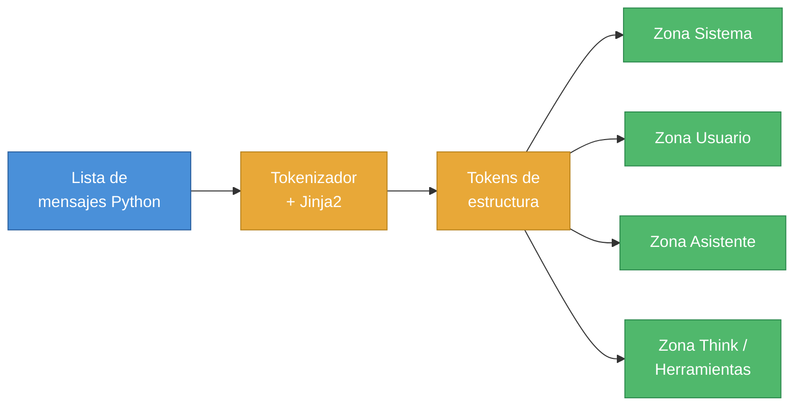
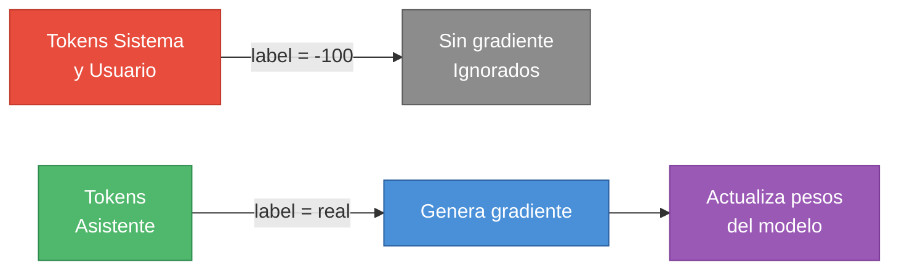
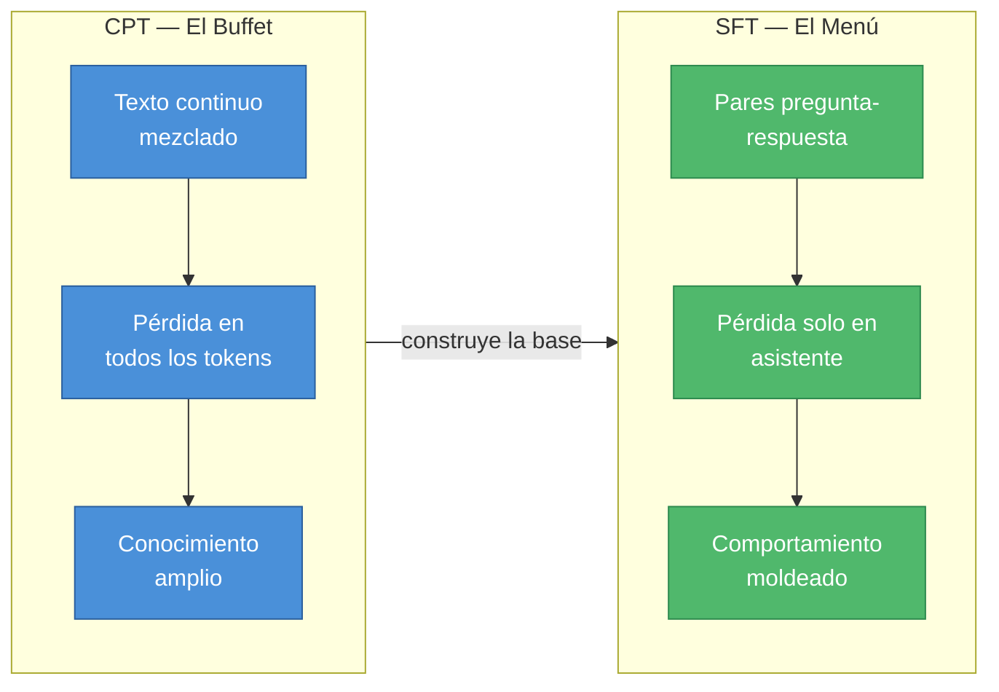
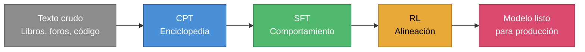
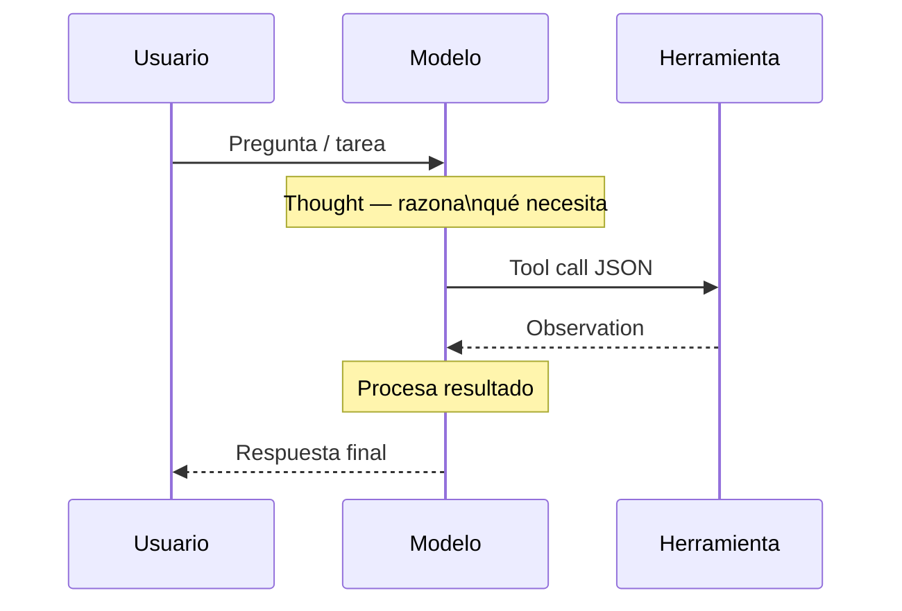

# Capítulo 2 — Supervised Fine-Tuning: Cómo un Modelo Aprende a Conversar

> Basado en "The Engineer's Guide to Supervised Finetuning" y "Supervised Finetuning for Reasoning Models (From Dataset to Deployment)", The Neural Maze, Finetuning Sessions · Lesson 2 & Lab 2.

Imagina que contratas a alguien que ha leído toda la biblioteca pública de tu ciudad. Sabe de física, de cocina, de historia medieval, de contratos de alquiler. Pero si le pides que atienda el teléfono de atención al cliente de tu empresa, se va a quedar mirándote. No porque no sepa cosas — sabe demasiadas — sino porque nunca aprendió el ritmo de una conversación estructurada: cuándo escuchar, cuándo responder, qué tono usar, cómo terminar un turno. Ese es exactamente el problema que resuelve el Supervised Fine-Tuning.

Un modelo que solo ha pasado por preentrenamiento es ese empleado enciclopédico: asombroso en conocimiento, inútil en protocolo. El SFT es el proceso de entrenamiento que le enseña el protocolo.

---

## De la predicción de texto a la conversación estructurada

Para entender qué hace el SFT, primero hay que entender qué hace el preentrenamiento y dónde se queda corto.

Durante el preentrenamiento — o más precisamente durante el Continued Pretraining (CPT, preentrenamiento continuado) — el modelo recibe un flujo masivo e ininterrumpido de texto. Libros, artículos de Wikipedia, hilos de Reddit, código fuente, foros de física cuántica, recetas de cocina: todo mezclado en una secuencia gigantesca. El objetivo del modelo en esta etapa es sencillo y brutal: dado el texto que has visto hasta ahora, predice el siguiente token.

Un token es la unidad mínima con la que trabaja el modelo. No es exactamente una palabra ni exactamente un carácter — es algo intermedio. La palabra "tokenización" se convierte, según el vocabulario del modelo, en algo como ["token", "ización"] o ["tok", "en", "iza", "ción"]. El proceso de convertir texto en estos fragmentos se llama tokenización. Todo lo que el modelo procesa — preguntas, respuestas, código, markdown — pasa primero por este filtro y se convierte en una secuencia de enteros que representan posiciones en el vocabulario.

Con suficiente texto y suficiente cómputo, el modelo aprende correlaciones estadísticas profundas. "Quantum" aparece frecuentemente junto a "physics" y "entanglement". "La solución a la ecuación diferencial" tiende a ir seguido de pasos algebraicos. El modelo no entiende estas relaciones en ningún sentido filosófico — simplemente las ha visto tantas veces que las ha internalizado como patrones predictivos. El resultado es un sistema muy bueno completando texto.

El problema es exactamente ese: solo sabe completar texto. No tiene ningún concepto de turno. Si le preguntas "¿Cuál es la capital de Francia?", puede que responda "París. La ciudad fue fundada por la tribu celta de los Parisios hacia el siglo III a.C. y..." — y siga generando texto indefinidamente. No sabe que debía parar tras "París". No sabe que había una pregunta, que hay alguien esperando, ni que su papel es el de asistente. Simplemente continúa el flujo.

Aquí entra el SFT. El Supervised Fine-Tuning (entrenamiento supervisado por ajuste fino) no añade conocimiento nuevo al modelo — la enciclopedia ya está dentro. Lo que hace es enseñarle estructura: quién habla cuándo, dónde empieza una respuesta, dónde termina, qué tono adoptar. Es la diferencia entre saber mucho y saber comportarse.

---

## El chat template: traducir conversaciones a tokens

Hay una pregunta que suena filosófica pero es completamente práctica: ¿dónde termina "tú" y empieza "yo" dentro de un [[01-fundamentos-transformers-y-pretraining|transformer]]?

A nivel de pesos y matrices, no hay ninguna distinción. Solo hay una secuencia de tokens fluyendo por capas de atención. El modelo no sabe que algunos de esos tokens son del usuario y otros son suyos — a menos que se lo enseñemos explícitamente.

Eso es lo que hace el chat template (plantilla de conversación). Es la capa de traducción entre la representación limpia que usamos en Python — una lista de diccionarios con campos `role` y `content` — y la cadena plana de texto con tokens especiales que el modelo realmente ve. Sin esta plantilla, todo colapsa en un único stream indiferenciado.

Cuando en Python escribes algo así:

```python
messages = [
    {"role": "system", "content": "Eres un asistente útil."},
    {"role": "user", "content": "¿Cuál es la capital de Francia?"},
    {"role": "assistant", "content": "La capital de Francia es París."}
]
```

El tokenizador, siguiendo su chat template, convierte eso en algo parecido a esto (usando el formato de Qwen3 como ejemplo):

```
<|im_start|>system
Eres un asistente útil.<|im_end|>
<|im_start|>user
¿Cuál es la capital de Francia?<|im_end|>
<|im_start|>assistant
La capital de Francia es París.<|im_end|>
```

Esos tokens especiales — `<|im_start|>`, `<|im_end|>`, las etiquetas de rol — no son lenguaje natural. Son señales estructurales. El modelo aprende durante el SFT a asociar `<|im_start|>assistant` con el estado de "ahora me toca a mí responder", y `<|im_end|>` con "aquí termino". Es análogo a las señales de tráfico: no forman parte del paisaje, pero sin ellas el tráfico se caotiza.

Esta plantilla vive dentro del archivo `tokenizer_config.json` del modelo, generalmente escrita en Jinja2, un lenguaje de plantillas. El hecho de que esté en Jinja2 no es trivial: significa que la plantilla puede incluir lógica condicional. Por ejemplo, el template puede omitir el bloque `<think>...</think>` si el usuario desactiva el razonamiento, o formatear los tool calls de forma diferente según el modelo.



> **Descripción visual:** Diagrama de flujo horizontal que se expande en abanico hacia la derecha. Un bloque azul ("Lista de mensajes Python") apunta a un bloque amarillo ("Tokenizador + Jinja2"), que a su vez apunta a otro bloque amarillo ("Tokens de estructura"). Desde este bloque central parten cuatro flechas hacia cuatro bloques verdes dispuestos verticalmente: "Zona Sistema", "Zona Usuario", "Zona Asistente" y "Zona Think / Herramientas". Las flechas son grises con punta triangular. Fondo blanco, bloques con esquinas redondeadas, tipografía sans-serif.

Aquí yace una trampa que atrapa a muchos equipos. Si entrenas un modelo con un chat template y luego lo despliegas con otro, la estructura que el modelo aprendió ya no coincide con los tokens que recibe en producción. El modelo empieza a comportarse de forma extraña: responde en el turno del usuario, ignora el token de fin de turno, genera respuestas interminables. Estos bugs son difíciles de diagnosticar porque no producen errores de Python — solo comportamiento ilógico. La solución es simple pero requiere disciplina: guardar siempre la plantilla junto al modelo y usarla de forma consistente en entrenamiento y en inferencia.

El chat template se vuelve especialmente crítico en escenarios de razonamiento. Modelos como Qwen3 o DeepSeek-R1 usan etiquetas `<think>` y `</think>` para delimitar un espacio de razonamiento interno. El modelo genera pensamiento dentro de esas etiquetas — como un borrador que el usuario no ve — y luego produce la respuesta final. Sin el template correcto, esas etiquetas no tienen semántica y el modelo no aprende a usarlas.

Los sistemas agénticos van un paso más allá. Cuando el modelo necesita llamar a herramientas externas, el template introduce tokens como `<|tool_call|>` y `<|tool_response|>`. Ahora la conversación no es solo texto — es texto con zonas arquitectónicas: zona de usuario, zona de asistente, zona de herramienta, zona de observación. El template es lo que hace legible toda esa estructura para el modelo.

---

## CPT vs. SFT: el buffet y el menú de degustación

La diferencia entre Continued Pretraining y Supervised Fine-Tuning no es solo el tipo de datos — es fundamentalmente distinta la forma en que el modelo aprende de esos datos.

El CPT es un buffet. El modelo ingiere texto en volúmenes masivos, maximizando la cantidad de conocimiento absorbido por FLOP (Floating-point Operation — operación de punto flotante, la unidad básica de cómputo que usan las GPUs). No importa si los textos son de géneros distintos o hablan de temas sin relación. El objetivo es la amplitud: que el modelo vea tantos patrones lingüísticos y factuales como sea posible. En el CPT, el modelo calcula una pérdida — es decir, una penalización por predecir incorrectamente el siguiente token — sobre absolutamente cada token de la secuencia.

El SFT es un menú de degustación. El orden importa, la presentación importa, la separación entre platos importa. Y aquí está la diferencia técnica más importante: el enmascaramiento de pérdida, o loss masking.

En SFT, no queremos que el modelo aprenda a predecir las palabras del usuario — queremos que aprenda a responder a esas palabras. Para lograrlo, durante el SFT solo calculamos la pérdida en los tokens del asistente, no en los del usuario ni del sistema. En PyTorch, la función de pérdida estándar para este problema es `CrossEntropyLoss`. Esta función tiene un parámetro `ignore_index` que, cuando se establece en `-100`, le dice al optimizador: "ignora este token, no lo uses para actualizar los pesos". Así, los tokens de usuario reciben la etiqueta `-100` y el modelo los procesa para entender contexto pero no intenta aprender a predecirlos. Solo los tokens del asistente generan gradiente.



> **Descripción visual:** Diagrama de flujo horizontal con dos caminos paralelos que confluyen en la derecha. Camino superior: un bloque rojo ("Tokens Sistema y Usuario") apunta con una flecha etiquetada "label = -100" a un bloque gris ("Sin gradiente / ignorados"). Camino inferior: un bloque verde ("Tokens Asistente") apunta con una flecha etiquetada "label = real" a un bloque azul ("Genera gradiente"), que a su vez apunta a un bloque morado ("Actualiza pesos del modelo"). Los bloques tienen esquinas redondeadas. El camino superior es visualmente apagado (gris), el inferior es vivo y progresivo. Fondo blanco, tipografía sans-serif.

La pérdida de entropía cruzada mide cuánto se equivoca el modelo. Si el token correcto era "París" y el modelo le asignó probabilidad 0.1 (10%), la pérdida es alta — el modelo debe ajustar sus pesos para aumentar esa probabilidad. Si el modelo ya asignaba 0.9 (90%), la pérdida es baja y el ajuste es mínimo. Este mecanismo, repetido millones de veces sobre millones de tokens del asistente, es lo que da forma al comportamiento conversacional del modelo.



> **Descripción visual:** Diagrama de flujo horizontal con dos subgrafos paralelos conectados por una flecha central. El subgrafo izquierdo (fondo azul oscuro, etiqueta "CPT — El Buffet") contiene tres bloques verticales azul medio: "Texto continuo mezclado", "Pérdida en todos los tokens" y "Conocimiento amplio", unidos por flechas descendentes. El subgrafo derecho (fondo verde oscuro, etiqueta "SFT — El Menú") replica la estructura con bloques verdes: "Pares pregunta-respuesta", "Pérdida solo en asistente" y "Comportamiento moldeado". Una flecha gris etiquetada "construye la base" une el subgrafo izquierdo con el derecho. Estilo limpio, fondo blanco, tipografía sans-serif.

### El Packing Paradox

En CPT, es habitual usar una técnica llamada packing (empaquetado): concatenar múltiples documentos en una sola ventana de contexto de 8k o 128k tokens para mantener las GPUs trabajando a plena capacidad. Si los documentos son cortos, en lugar de desperdiciar espacio los apilamos uno tras otro. Tiene todo el sentido: la GPU procesa bloques completos y el throughput se maximiza.

Pero en SFT, el packing ingenuo produce un problema sutil y devastador: la contaminación cruzada. Imagina que el final de la conversación A y el inicio de la conversación B quedan en el mismo bloque de contexto sin separación adecuada. El mecanismo de atención del transformer — que por diseño puede "mirar" cualquier token anterior en la secuencia — puede crear conexiones entre el final de A y el inicio de B. El modelo empieza a contaminar el contexto de un diálogo con el de otro, como si el asistente estuviera respondiendo una pregunta mezclando información de dos conversaciones completamente distintas.

La solución moderna combina dos tecnologías. La primera es Flash Attention 2, una implementación eficiente de la atención que soporta secuencias de longitud variable (Varlen sequences). La segunda es el tensor `cu_seqlens` (cumulative sequence lengths — longitudes de secuencia acumuladas). En lugar de rellenar las conversaciones cortas con ceros inútiles (padding) o concatenarlas sin separación, le pasamos a la GPU un tensor que le dice exactamente dónde termina cada conversación. La GPU procesa el batch completo — con múltiples conversaciones de diferentes longitudes — pero mantiene un cortafuegos rígido entre ellas. Ningún token de la conversación A puede "contaminar" la conversación B. Librerías como Hugging Face TRL y Unsloth implementan esto de forma transparente.

El resultado es lo mejor de ambos mundos: throughput cercano al packing puro, con integridad estructural de SFT.

---

## La taxonomía del entrenamiento: lo que SFT es y lo que no es

En la industria, los términos se confunden regularmente. Se habla de "modelos de instrucción" y "modelos de razonamiento" como si fueran categorías taxonómicas distintas, dos especies diferentes de LLM. No lo son.

SFT no es un tipo de modelo. Es un paso de entrenamiento. Una herramienta.

El principio subyacente es simple: el modelo aprende a mapear un tipo de entrada a un tipo de salida. Si los datos de entrenamiento contienen respuestas cortas y directas, el modelo aprende a producir respuestas cortas y directas. Si contienen largas cadenas de razonamiento explícito, aprende a producir largas cadenas de razonamiento. La diferencia entre un "modelo de instrucción" y un "modelo de razonamiento" no reside en un algoritmo secreto — reside en los datos con los que se hizo el SFT.

Una confusión relacionada, y más perniciosa, es creer que el Reinforcement Learning (RL — aprendizaje por refuerzo) es el ingrediente mágico que "hace pensar" a un modelo. Esa narrativa oculta cómo funciona el pipeline real.

El SFT es el que le da al modelo la estructura del razonamiento. Expone al sistema a ejemplos de cómo se descomponen los problemas, cómo fluye la lógica, cómo se estructura un argumento. En otras palabras, el SFT enseña al modelo qué aspecto tiene el razonamiento. El RL llega después. Su papel no es inventar el razonamiento desde cero — es reforzar el buen comportamiento y desincentivar los atajos. Empuja al modelo hacia respuestas más claras, más verídicas, más eficientes. Pero si el modelo nunca vio razonamiento estructurado durante el SFT, no hay nada que el RL pueda refinar.

DeepSeek-R1 es el ejemplo canónico. Antes de aplicar RL, el equipo ejecutó una fase de "cold start" de SFT sobre datos de alta calidad de Chain-of-Thought (CoT — cadena de pensamiento, es decir, razonamiento explícito paso a paso escrito en texto). Esa fase sembró el comportamiento de razonamiento secuencial. Solo después de establecida esa base, el RL entró a premiar la consistencia y penalizar la lógica débil. Sin el SFT previo, el RL no sabía qué recompensar.

La forma correcta de pensar en el pipeline de entrenamiento es como capas:

- CPT construye conocimiento amplio — la enciclopedia.
- SFT da forma al comportamiento — la persona conversacional y las reglas de interacción.
- RL refina la alineación — fomentando precisión, coherencia y preferencias humanas.

Cada capa construye sobre la anterior. Juntas, mueven al sistema desde patrones estadísticos crudos hacia comportamiento estructurado y alineado.



> **Descripción visual:** Diagrama de flujo horizontal con cinco bloques rectangulares redondeados conectados en línea por flechas grises con punta triangular. De izquierda a derecha: "Texto crudo / Libros, foros, código" (gris neutro), "CPT / Enciclopedia" (azul), "SFT / Comportamiento" (verde), "RL / Alineación" (amarillo oscuro), "Modelo listo para producción" (rojo-rosa). Cada bloque tiene dos líneas de texto: la primera en negrita indica la etapa, la segunda indica el resultado. Las flechas son de igual tamaño y el layout es perfectamente lineal. Fondo blanco, estilo minimalista.

---

## Curación de datos: la hipótesis LIMA y la calidad sobre la cantidad

Durante mucho tiempo, la ecuación era simple: más datos igual a mejor modelo. Datasets más grandes, mayor cobertura, más ejemplos — esa era la fórmula. Resultó estar equivocada, al menos para el SFT.

El paper LIMA (Less Is More for Alignment — Menos es Más para la Alineación, 2023) sacudió esa premisa. Los investigadores tomaron un [[01-fundamentos-transformers-y-pretraining|modelo base]] y lo ajustaron con apenas 1.000 ejemplos cuidadosamente curados. El resultado derrotó en benchmarks de comportamiento a modelos entrenados con decenas de miles de ejemplos de peor calidad. Mil frente a decenas de miles, y el más pequeño ganó.

¿Por qué? Porque el SFT es absorbente de maneras que van más allá del contenido factual. El modelo no solo aprende qué decir — aprende cómo decirlo. Y eso incluye los vicios. Si el dataset contiene razonamientos descuidados, respuestas vagas, o inconsistencias de formato, el modelo los internaliza como la norma. No distingue entre "este es un ejemplo mediocre" y "este es el estándar de comportamiento que debo seguir". Trata todo lo que ve como el patrón correcto.

Eso convierte la curación de datos en una tarea de composición, no de recolección. Un dataset de SFT fuerte es como una sinfonía bien orquestada: necesitas razonamiento matemático para afinar la lógica, código de alta calidad para reforzar la estructura, ejemplos conversacionales para moldear el tono y la persona, muestras con restricciones de seguridad para anclar el comportamiento dentro de límites aceptables. La proporción importa tanto como el contenido individual.

Por eso muchos labs han abandonado los grandes datasets de instrucciones extraídos de internet y han migrado hacia pipelines sintéticos. En lugar de recopilar lo que está disponible, generan ejemplos de alta calidad usando modelos "teacher" potentes — modelos más grandes que actúan como tutores — y luego filtran agresivamente. El objetivo no es cantidad sino densidad: que cada ejemplo esté cargado de estructura útil y claridad máxima.

El pipeline del lab de este capítulo ilustra esto bien. Partiendo de 20.000 transcripciones de audio del dataset YouTube Commons, se aplicó NVIDIA Nemotron-3-Nano-30B-A3B como teacher model para generar respuestas estructuradas de alta calidad — incluyendo trazas de razonamiento. La inferencia corrió en batch sobre vLLM en una sola H100 GPU durante unas 3 horas y 20 minutos. El resultado: un dataset sintético limpio, denso, con las dos variantes que se necesitaban para el experimento.

---

## SFT para razonamiento: entrenar el proceso, no solo la respuesta

El SFT tradicional tiene una arquitectura conceptual simple: entra una pregunta, sale una respuesta. El modelo aprende a mapear A directamente a C. Para muchas tareas, eso funciona perfectamente. Pero también incentiva los atajos. Si el modelo puede ir de A a C sin pasar por B, lo hará — incluso cuando debería razonar. Y esos atajos son exactamente donde aparecen las alucinaciones: el modelo genera una respuesta que suena plausible pero es factualmente incorrecta, porque nunca construyó el razonamiento que habría detectado el error.

El SFT orientado a razonamiento cambia el patrón. En lugar de entrenar el salto A → C, entrenamos el camino completo: A → B → C. Ese paso intermedio — B — es la traza de razonamiento. El desglose paso a paso. El pensamiento visible. Lo que se entrena no es la respuesta final, sino el proceso que conduce a ella.

Una traza de razonamiento bien construida se ve así. Dada la pregunta "¿Cuántos segundos hay en una semana?", en lugar de responder directamente "604.800", la traza mostraría:

```
<think>
Una semana tiene 7 días.
Un día tiene 24 horas.
Una hora tiene 60 minutos.
Un minuto tiene 60 segundos.
Entonces: 7 × 24 × 60 × 60 = 7 × 24 × 3.600 = 7 × 86.400 = 604.800.
</think>

Hay 604.800 segundos en una semana.
```

El modelo que se entrena con ejemplos así aprende algo sutil pero poderoso: antes de producir una respuesta, existe una fase dedicada a trabajar el problema. La etiqueta `<think>` crea un espacio protegido para ese proceso. El modelo internaliza que ese espacio no es opcional — es parte del protocolo.

La clave, y esto fue central en DeepSeek-R1, es que no puedes esperar que el RL invente este comportamiento desde cero. El espacio de búsqueda es demasiado grande. Sin ejemplos de razonamiento estructurado en el SFT, el modelo no tiene plantilla que optimizar. Deambula. El hábito de razonamiento tiene que sembrarse primero en el SFT, y solo entonces el RL puede refinarlo — recompensando derivaciones correctas y penalizando saltos injustificados.

La diferencia práctica es visible incluso en modelos pequeños. En el experimento de este capítulo, entrenamos dos versiones de Qwen3-0.6B con el mismo dataset pero columnas diferentes: una con las respuestas directas (`messages_no_thinking`) y otra con las trazas de razonamiento (`messages_thinking`). Al desplegar ambos modelos y hacerles la misma pregunta matemática, el modelo sin razonamiento produce una respuesta que puede ser correcta o no — pero no puedes saber por qué. El modelo con razonamiento muestra su trabajo: si se equivoca, puedes identificar exactamente en qué paso. Y si acierta, tienes confianza en que no fue por azar.

---

## Los detalles que importan: masking, shift-right y batching

El SFT parece conceptualmente simple, pero su implementación exige una precisión que el CPT no requiere. Tres problemas específicos aparecen sistemáticamente.

### El shift-right y la frontera usuario-asistente

Los modelos de lenguaje causal — Causal Language Models (CLM) — son aquellos que predicen el siguiente token basándose únicamente en los tokens anteriores, nunca en los futuros. Esto es lo que permite que la generación sea autoregresiva: el modelo genera un token, lo añade a la secuencia, y predice el siguiente. Es el paradigma de todos los LLMs modernos tipo GPT, Llama, Qwen.

Esta arquitectura tiene una consecuencia importante en el entrenamiento: el modelo siempre predice la posición siguiente, no la actual. Esto se llama setup shift-right (desplazamiento a la derecha). Si la secuencia de tokens de entrada es [A, B, C, D], los targets (lo que el modelo debe predecir) son [B, C, D, E]. Cada posición predice la siguiente.

El problema de la frontera surge aquí. El último token del prompt del usuario no es un token cualquiera — es el token que precede al primer token de la respuesta del asistente. Cuando el modelo predice lo que viene después de ese último token del usuario, está aprendiendo el inicio de la respuesta del asistente. Si el masking está desplazado en un token — si pones la etiqueta `-100` un token de más o de menos — el modelo puede aprender a iniciar respuestas de forma incorrecta. Los síntomas son sutiles: el modelo empieza sus respuestas de manera extraña, usa el token incorrecto de apertura, o no respeta el formato del rol de asistente.

La precisión aquí no es opcional. El DataCollator (el componente que prepara los batches de datos) debe construir el tensor de etiquetas colocando `-100` en exactamente los tokens correctos — sistema y usuario — y dejando los tokens del asistente con sus valores reales para que contribuyan a la pérdida.

### Gradiente spikes en la frontera

Hay otro efecto en esa frontera usuario-asistente que merece atención. Cuando el modelo pasa de procesar tokens ignorados (-100) a procesar tokens activos (los del asistente), se produce un salto abrupto en la señal de entrenamiento. Los primeros tokens de la respuesta del asistente — el token de apertura del rol, el primer token del contenido — de repente pasan de "no contribuir nada" a "contribuir completamente al gradiente". Este salto puede provocar picos de gradiente (gradient spikes) que desestabilizan el entrenamiento temprano.

La solución estándar es doble: usar un learning rate (tasa de aprendizaje — cuánto cambian los pesos en cada actualización) conservador, y aplicar un warm-up schedule (programación de calentamiento). El warm-up comienza con un learning rate muy bajo — quizás 10x menor que el objetivo — y lo sube gradualmente durante los primeros cientos de pasos. Esto le da al modelo tiempo para "sentir" la frontera antes de que los gradientes alcancen su magnitud completa. Sin warm-up, es común ver que las primeras iteraciones producen pérdidas erráticamente altas seguidas de colapsos parciales del modelo.

### Batching agrupado vs. packing puro

En CPT, el packing constante es la norma. Rellenas cada contexto hasta el límite y maximizas el throughput. En SFT, ya vimos que el packing puro es peligroso por la contaminación cruzada. Pero tampoco puedes simplemente no empaquetar nada — eso desperdiciaría la GPU con padding (tokens de relleno) en conversaciones cortas.

La solución intermedia es el grouped batching (batching agrupado): agrupar secuencias de longitud similar en el mismo batch. Si tienes conversaciones de 200, 210, 195 y 205 tokens, meterlas en el mismo batch significa que el padding que necesitas para igualar longitudes es mínimo. Sacrificas un poco de throughput versus packing puro, pero mantienes la integridad estructural — y evitas el caos de mezclar conversaciones. Con Flash Attention 2 y `cu_seqlens`, puedes ir un paso más lejos y eliminar el padding completamente incluso dentro del batch.

---

## SFT Agéntico: cuando el modelo aprende a usar herramientas

Hasta aquí, el SFT enseña al modelo a hablar. El SFT agéntico enseña al modelo a actuar.

En un sistema agéntico, el modelo no solo genera texto — genera acciones. Reconoce cuándo una tarea requiere información externa que no tiene, produce una llamada a una herramienta en el formato correcto, espera el resultado, y construye su respuesta final con esa información. Un asistente que puede consultar una API de precios en tiempo real, buscar en una base de datos vectorial, o ejecutar código en un sandbox es un sistema agéntico.

Para que el modelo aprenda este comportamiento, los datos de entrenamiento deben reflejarlo. Un dataset de SFT agéntico sigue un loop estructurado:

**Thought → Action → Action Input → Observation → Final Response**

Primero, el modelo razona sobre qué necesita hacer (Thought). Luego genera la llamada a la herramienta en formato JSON estricto (Action + Action Input). En ese punto, la generación se pausa — el sistema ejecuta realmente la herramienta — y el resultado se introduce en el contexto como Observation. Solo entonces el modelo produce la respuesta final.



> **Descripción visual:** Diagrama de secuencia con tres participantes dispuestos horizontalmente: "Usuario" (izquierda, bloque azul claro), "Modelo" (centro, bloque verde), "Herramienta" (derecha, bloque amarillo). Las líneas de vida descienden verticalmente. Una flecha sólida va de Usuario a Modelo ("Pregunta / tarea"), seguida de una nota flotante sobre Modelo ("Thought — razona qué necesita"). Luego una flecha sólida de Modelo a Herramienta ("Tool call JSON") y una flecha discontinua de vuelta ("Observation"). Una segunda nota sobre Modelo ("Procesa resultado") y finalmente una flecha discontinua de Modelo a Usuario ("Respuesta final"). Las notas son rectángulos amarillo pálido. Estilo técnico, fondo blanco, tipografía monospace para los labels de acciones.

Un ejemplo concreto con llamada a API de precios de acciones:

```
<think>
El usuario pregunta por el precio actual de Apple. 
No tengo esa información en mis parámetros (mi conocimiento tiene fecha de corte).
Necesito llamar a la herramienta get_stock_price.
</think>

<|tool_call|> get_stock_price {"ticker": "AAPL"} <|eot_id|>

[Sistema ejecuta la herramienta y obtiene: {"price": 189.43, "currency": "USD"}]

<|tool_response|> {"price": 189.43, "currency": "USD"} <|eot_id|>

El precio actual de Apple (AAPL) es de $189.43 USD.
```

El aspecto crítico aquí es la disciplina de formato. Si el JSON tiene un corchete mal cerrado, la herramienta falla. Si el nombre del campo es `ticker_symbol` en lugar de `ticker`, la API devuelve un error. El agente se rompe. Por eso en el SFT agéntico, la sintaxis tiene el mismo peso que el contenido. El modelo debe internalizar el schema exacto — no aproximarlo.

Esto explica por qué los datasets de SFT agéntico suelen ser sintéticos y extremadamente limpios. No puedes permitirte variabilidad en el formato de las llamadas a herramientas. Cada ejemplo debe mostrar exactamente el patrón correcto, sin excepciones. Un solo ejemplo malformado puede enseñar al modelo que "más o menos" está bien — y en producción, "más o menos" rompe el pipeline.

El cambio conceptual que produce el SFT agéntico es profundo. El modelo deja de ser un sistema cerrado de conocimiento y pasa a ser un componente de un sistema mayor. Sabe que no sabe el precio actual de las acciones de Apple — y sabe exactamente qué secuencia de tokens producir para solicitarlo. Eso convierte al LLM de una biblioteca estática en un agente que opera dentro de un entorno.

---

## Evaluación: más allá de la curva de pérdida

En el CPT, evaluar es sencillo. Observas la pérdida de validación — si baja, el modelo mejora. Si la pérdida de entrenamiento cae pero la de validación sube, estás sobreajustando. El mecanismo es directo.

En el SFT, una pérdida muy baja puede ser una señal de alarma. No una buena señal — una mala. ¿Por qué? Porque pérdida muy baja puede significar que el modelo memorizó el wording exacto del dataset. En lugar de aprender cómo responder bien, aprendió a reproducir las respuestas de entrenamiento. El resultado es lo que se llama coloquialmente un "loro pulido" (polished parrot): el modelo recita con fluidez pero no ha internalizado la intención detrás de las respuestas.

Puedes detectar esto comparando pérdida de entrenamiento versus validación. Pero la pérdida de validación tampoco te dice si el modelo realmente se comporta bien — solo si reproduce tokens similares a los de validación. Por eso el sector ha migrado a evaluaciones más ricas.

### LLM-as-a-judge

El paradigma actual es usar un modelo más potente como evaluador. Le das al juez el prompt original y la respuesta generada por el modelo evaluado, y le pides que puntúe en dimensiones como claridad, utilidad, seguimiento de instrucciones, y corrección factual. El juez puede ser GPT-4, Claude, o cualquier modelo suficientemente capaz. Esta aproximación captura calidad semántica que la pérdida no puede ver.

### Benchmarks de seguimiento de instrucciones

IFEval (Instruction Following Evaluation) es un benchmark que impone restricciones verificables mecánicamente: "responde en menos de 100 palabras", "no uses la letra Q", "tu respuesta debe contener exactamente 3 párrafos". Estas restricciones son binarias — se cumplen o no — y testean si el SFT reestructuró las prioridades del modelo. Un modelo que pasa IFEval no solo parece que sigue instrucciones; las sigue cuando se mide objetivamente.

### Benchmarks agénticos

Para sistemas agénticos, la barra es más alta. Un modelo puede generar respuestas hermosas a preguntas individuales pero fallar miserablemente en tareas de múltiples pasos. Los benchmarks más relevantes aquí son:

- **GAIA** (General AI Assistants): Tareas cotidianas de asistente que requieren uso de herramientas y multimodalidad. Por ejemplo: "Encuentra el precio de un vuelo Madrid-Tokyo para el próximo viernes con menos de una escala". Requiere navegación real, no solo conocimiento estático.

- **SWE-bench**: El modelo actúa como ingeniero de software. Recibe un issue real de GitHub y debe producir un parche de código que pase los tests unitarios del repositorio. Mide capacidad de razonar sobre código en contexto real.

- **WebShop / Mind2Web**: El modelo navega por interfaces web para completar tareas. "Compra este producto específico por menos de $50 en Amazon". Requiere coordinar navegación, lectura de UI, y toma de decisiones.

La métrica común en todos estos benchmarks no es la pérdida — es la tasa de éxito en la tarea. O lo hace o no lo hace.

---

## El lab: dos modelos, una verdad

Con la teoría clara, el lab de esta lección la vuelve tangible con un experimento concreto y ejecutable. La configuración es deliberadamente simple para que la comparación sea limpia: mismo modelo base (Qwen3-0.6B), mismo dataset, misma cantidad de pasos de entrenamiento (200 steps), mismo hardware (A10G GPU). La única variable es la columna de datos usada.

### El modelo y la elección del full fine-tuning

Qwen3-0.6B es un modelo de 600 millones de parámetros — pequeño para los estándares actuales, pero suficientemente capaz para demostrar el efecto del SFT sobre el razonamiento. La elección de full fine-tuning (actualización de todos los parámetros del modelo) es intencionalmente pedagógica: en producción, [[03-lora-adaptacion-de-bajo-rango|LoRA]] o QLoRA (que veremos en capítulos posteriores) son la norma porque son más eficientes. Pero el full fine-tuning expone el mecanismo sin capas de abstracción adicionales.

### El dataset sintético

El dataset proviene de un proceso de [[01-fundamentos-transformers-y-pretraining|destilación]] sobre YouTube Commons — 20.000 transcripciones de vídeos de YouTube, procesadas con NVIDIA Nemotron-3-Nano-30B-A3B como teacher model. El resultado tiene dos columnas:

- `messages_no_thinking`: pares pregunta-respuesta donde la respuesta es directa, sin razonamiento explícito.
- `messages_thinking`: los mismos pares, pero la respuesta incluye una traza `<think>...</think>` generada por el teacher model antes de la respuesta final.

El teacher model no solo generó respuestas — generó razonamientos. Esas trazas son el "cómo llegué aquí" que el modelo pequeño aprenderá a imitar.

### Los comandos de entrenamiento

El entrenamiento corre via Hugging Face Jobs, que aprovisiona hardware automáticamente. El script principal recibe como argumentos qué columna usar y cuántos pasos entrenar:

```bash
# Modelo sin razonamiento
hf jobs uv run --flavor a10g-small \
  -e COMET_PROJECT_NAME="finetuning-sessions-full-finetuning-no-thinking" \
  -s COMET_API_KEY="YOUR_COMET_API_KEY" \
  -s HF_TOKEN="YOUR_HF_TOKEN" \
  --timeout 3h main.py -- \
  --hub_model_id Qwen3-0.6B-Full-Finetuning-No-Thinking \
  --dataset_column messages_no_thinking \
  --max_steps 200

# Modelo con razonamiento
hf jobs uv run --flavor a10g-small \
  -e COMET_PROJECT_NAME="finetuning-sessions-full-finetuning-thinking" \
  -s COMET_API_KEY="YOUR_COMET_API_KEY" \
  -s HF_TOKEN="YOUR_HF_TOKEN" \
  --timeout 3h main.py -- \
  --hub_model_id Qwen3-0.6B-Full-Finetuning-Thinking \
  --dataset_column messages_thinking \
  --max_steps 200
```

El flag `--flavor a10g-small` especifica el tipo de GPU. El `--timeout 3h` es un límite de seguridad para no acumular costes si algo va mal. Los secrets (`-s`) se pasan de forma segura sin exponerlos en el comando.

### Qué vigilar en las curvas de entrenamiento

Las curvas de pérdida en Comet ML permiten diagnosticar el entrenamiento en tiempo real. Con 200 steps, el comportamiento esperado es:

- **Primeros 20-40 steps**: La pérdida cae rápidamente. El modelo está aprendiendo el formato básico — los chat tokens, el ritmo de turnos, cómo iniciar una respuesta. Este es el aprendizaje más rápido porque parte de cero en cuanto a estructura conversacional.

- **Steps 40-150**: La caída se ralentiza. El modelo está refinando contenido — no solo "responde de esta manera" sino "responde esta cosa concreta". La curva puede tener pequeñas oscilaciones; es normal.

- **Steps finales**: Si la pérdida de entrenamiento sigue cayendo pero la de validación se estanca o sube ligeramente, estás al borde del overfitting. Con 200 steps en un dataset de esta escala, generalmente no llegas al overfitting — pero es la señal a vigilar.

El modelo de razonamiento (`messages_thinking`) típicamente tiene una pérdida inicial más alta y una caída más lenta. Esto es esperable: las trazas `<think>` añaden tokens que el modelo debe aprender a generar, incrementando la complejidad del objetivo. Si las curvas de ambos modelos son idénticas, algo está mal — probablemente el masking no está diferenciando correctamente entre las dos columnas.

### Interpretando los resultados

Al desplegar ambos modelos y compararlos con la misma pregunta, las diferencias son inmediatas. El modelo sin razonamiento responde con confianza y brevedad. El modelo con razonamiento hace visible su proceso: puedes seguir cómo llega a la respuesta, identificar si el razonamiento es correcto o contiene un error, y entender por qué produce lo que produce.

Este segundo modelo no es más "inteligente" en el sentido de tener más conocimiento — ambos parten del mismo Qwen3-0.6B. Lo que tiene es un patrón de comportamiento diferente: ha internalizado que ante un problema, la acción correcta es trabajarlo antes de responderlo. Y eso, cuando el RL venga a refinar el comportamiento en capítulos posteriores, le dará una base sobre la cual optimizar.

---

## Guía de métricas para SFT

Al entrenar, estas son las señales que debes vigilar y sus umbrales orientativos:

| Métrica | Valor de referencia | Señal de alarma |
|---|---|---|
| Training loss (primeros steps) | Caída rápida en los primeros 50 steps | No cae o sube — problema de masking o learning rate |
| Training loss final | Debe estabilizarse, no llegar a 0 | Llega a 0 — overfitting severo |
| Val loss vs. train loss | Val loss ligeramente superior | Val loss sube mientras train cae — overfitting |
| Gradient norm | Estable, bajo (~1-3) | Picos de 10x o más — sube el gradient clipping |
| Learning rate (con warm-up) | Empieza en 10-20% del LR objetivo, sube gradualmente | LR completo desde el step 0 puede causar spikes iniciales |
| Eval qualitativa (LLM-as-judge) | Mejora vs. modelo base | Respuestas formulaicas o memorizadas |

Una nota sobre el gradient clipping (recorte de gradiente): es un mecanismo de seguridad que limita la magnitud máxima del gradiente. Si el gradiente es demasiado grande — por un batch atípico o por la frontera usuario-asistente que discutimos — puede modificar los pesos de forma tan drástica que destruya lo aprendido anteriormente. El gradient clipping recorta el vector de gradiente para que su norma no supere un umbral (típicamente 1.0). Si pones el umbral demasiado bajo (0.1), el aprendizaje se vuelve innecesariamente lento. Si lo pones muy alto (10.0), vuelves al problema original.

---

## El panorama completo

El SFT es el puente entre el conocimiento en bruto del preentrenamiento y el comportamiento útil que esperamos de un asistente. No añade hechos al modelo — reorienta cómo usa los que tiene. Le enseña el protocolo de la conversación, la estructura de la respuesta, el ritmo de los turnos, la disciplina del formato.

Pero hay algo más profundo. El SFT es también el punto donde el diseñador de datos tiene más control sobre la personalidad del sistema. La forma en que se estructura un dataset de SFT determina si el modelo es directo o elaborado, conciso o detallado, cauteloso o asertivo. Esas no son propiedades del algoritmo — son propiedades de los datos de entrenamiento. Y eso pone una responsabilidad inusual en manos del ingeniero que diseña el dataset.

En el próximo capítulo, veremos cómo LoRA y QLoRA permiten hacer este mismo proceso de forma dramáticamente más eficiente, sin necesidad de actualizar todos los parámetros del modelo. Eso abre el SFT a hardware convencional — y cambia completamente la economía del fine-tuning.

---

## Tags

#técnica/sft #concepto/chat-template #concepto/loss-masking #técnica/chain-of-thought #técnica/continued-pretraining #concepto/transformer #técnica/reinforcement-learning #nivel/introducción #tipo/lección #estado/completo
