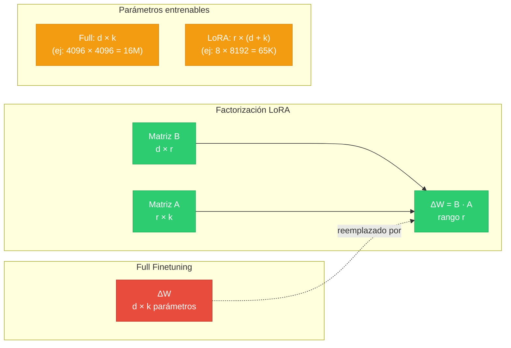
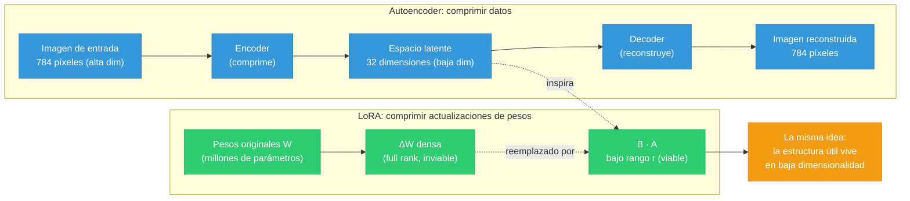
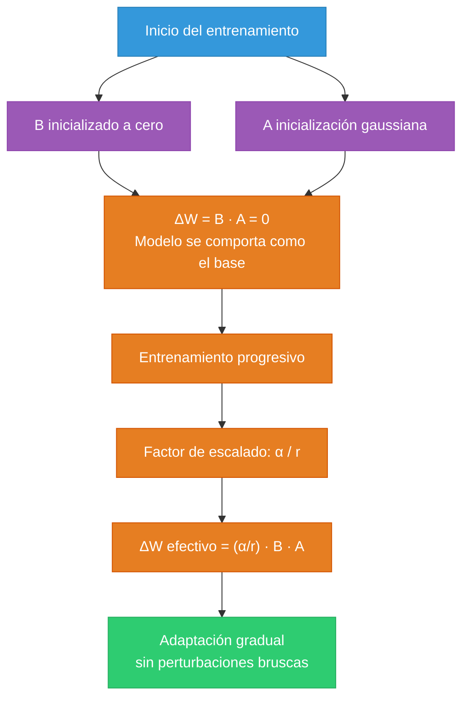
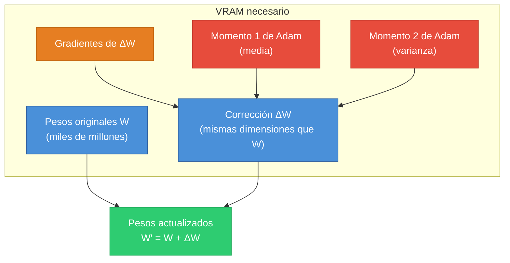
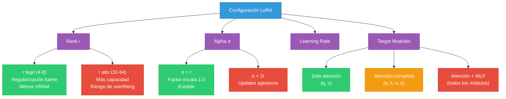
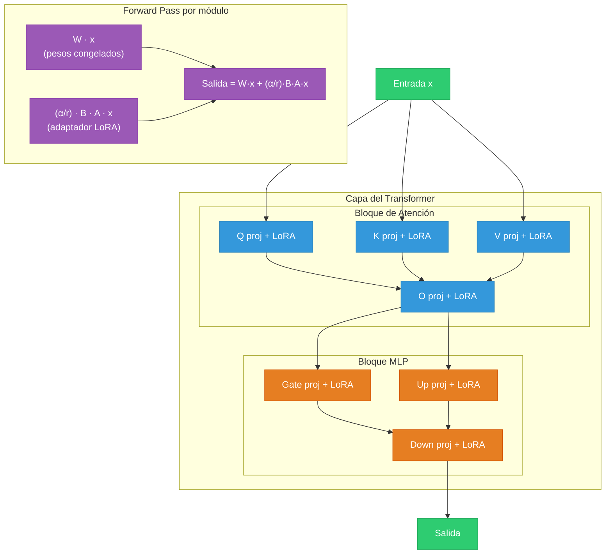
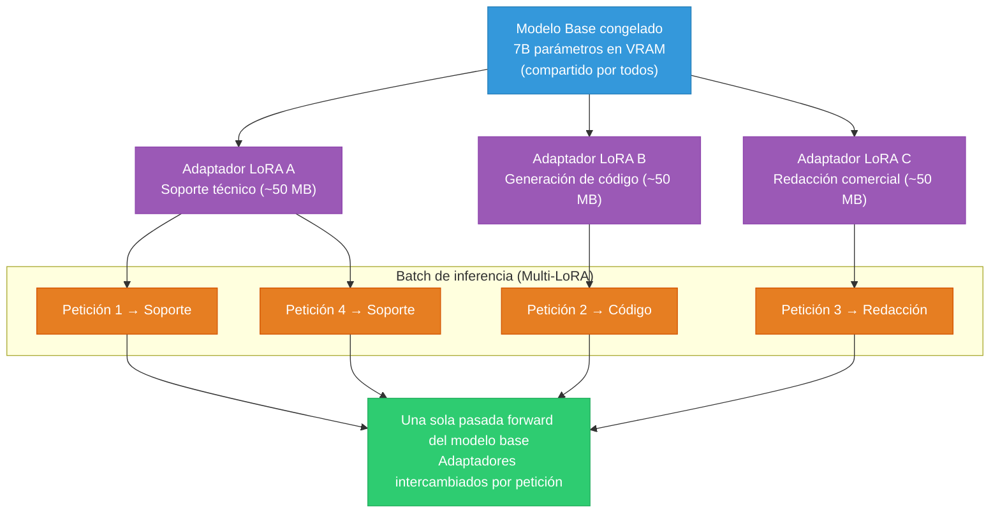
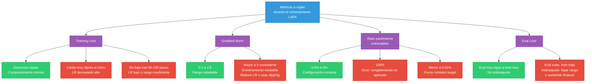

# Capítulo 3 — LoRA: Adaptación de Bajo Rango desde los Fundamentos

> Basado en "Understanding LoRA from First Principles" y "Engineering LoRA for Real-World Finetuning" — The Neural Maze, Finetuning Sessions, Lecciones 3 y Lab 3.

Imagina que has pasado cinco años aprendiendo a hablar mandarín. Tu cerebro ha reorganizado millones de conexiones neuronales para almacenar vocabulario, gramática, entonación. Ahora alguien te pide que también aprendas a cocinar pasta italiana. ¿Tienes que olvidar el mandarín para aprender a cocinar? Por supuesto que no. Las nuevas habilidades se construyen sobre una base existente, activando circuitos específicos sin borrar los que ya funcionaban.

El fine-tuning completo de un LLM, en cambio, funciona más como si le pidieras a ese cerebro que rehaga todas sus conexiones desde cero cada vez que aprende algo nuevo. Es radical, potente, y devastadoramente caro. LoRA (Low-Rank Adaptation — adaptación de bajo rango) propone algo mucho más inteligente: aprender solo las correcciones necesarias, en el subespacio mínimo donde esas correcciones viven, sin tocar lo que ya funciona.

Este capítulo te lleva desde la intuición geométrica hasta la implementación práctica, pasando por la aritmética exacta de por qué LoRA hace posible el fine-tuning en hardware de consumo.

---

## Los pesos de un modelo son una biblioteca, no un archivo ejecutable

Antes de entender qué hace LoRA, necesitamos entender qué son esos pesos que pretende modificar.

Un modelo de lenguaje como Llama-3 o Mistral-7B es, en esencia, una composición de matrices de pesos. Cada capa del [[01-fundamentos-transformers-y-pretraining|Transformer]] contiene varias de estas matrices, y cada una transforma un vector de entrada en otro vector de salida. Esta transformación lineal es el vocabulario básico de todo lo que el modelo sabe hacer.

Para hacerlo concreto: en un modelo con dimensión de embedding $d = 4096$, la matriz de proyección de queries en la capa de atención tiene forma $\mathbb{R}^{4096 \times 4096}$, es decir, algo así como 16.7 millones de parámetros en una sola matriz. Un modelo de 7B parámetros tiene docenas de estas capas, cada una con múltiples proyecciones. Los números se acumulan rápido.

Cuando hacemos fine-tuning completo (Full Fine-Tuning o FFT, que exploramos en el capítulo anterior), dejamos que todos esos parámetros sean modificables. Si la matriz original es $W$, el proceso de entrenamiento aprende una corrección $\Delta W$, y la nueva matriz queda como:

$$W' = W + \Delta W$$

La actualización $\Delta W$ tiene exactamente las mismas dimensiones que $W$: 4096 × 4096 en nuestro ejemplo. Hay que calcular gradientes para cada uno de esos 16.7 millones de valores, almacenar los estados del optimizador (momento y varianza en Adam, que explicaremos más adelante), y hacer todo esto en paralelo para decenas de capas. El resultado es una factura de memoria que rompe cualquier tarjeta gráfica de consumo.

Pero hay algo más profundo que la memoria. El fine-tuning completo tiene otro problema estructural: le da al modelo demasiada libertad.

---

## El problema de la libertad irrestricta: olvido catastrófico

El olvido catastrófico (catastrophic forgetting) es uno de los fenómenos más estudiados y más frustrantes del aprendizaje automático. Ocurre cuando un modelo aprende una tarea nueva y, al hacerlo, sobreescribe los pesos que le permitían hacer bien la tarea anterior.

Piensa en esto con el ejemplo del mandarín: si el proceso de "aprender a cocinar pasta" consistiera en reescribir todas las conexiones neuronales del cerebro con igual probabilidad, habría un riesgo real de borrar la gramática del mandarín. En el fine-tuning completo, el gradiente no distingue entre "información útil para la nueva tarea" y "conocimiento general que llevé años adquiriendo". Simplemente minimiza la pérdida sobre el nuevo dataset, y si eso requiere mover pesos que codifican razonamiento general, los mueve.

En la práctica, esto se manifiesta de formas concretas: un modelo entrenado en diagnóstico médico puede empeorar en benchmarks de razonamiento lógico general. Uno ajustado para código puede volverse más rígido en lenguaje natural. El problema no es que los nuevos datos sean malos — es que la optimización no tiene ninguna restricción que preserve el conocimiento previo.

El fine-tuning completo tiene, en términos técnicos, demasiados grados de libertad. Puede mover cualquier parámetro en cualquier dirección. Sin una restricción estructural, nada garantiza que el update $\Delta W$ sea "quirúrgico" en lugar de "invasivo".

LoRA introduce exactamente esa restricción estructural.

---

## La hipótesis del rango intrínseco

En 2021, investigadores de Microsoft publicaron el paper "LoRA: Low-Rank Adaptation of Large Language Models" con una apuesta teórica audaz: la corrección $\Delta W$ que necesitas para adaptar un modelo a una nueva tarea no requiere ser una matriz densa y de rango completo. Puede vivir en un subespacio de mucho menor dimensión.

Esta idea se llama la **hipótesis del rango intrínseco** (intrinsic rank hypothesis). Antes de explicarla formalmente, necesitamos clarificar qué significa "rango" en este contexto.

El **rango de una matriz** es el número de filas (o columnas) linealmente independientes que contiene. Dicho de otra forma, es la dimensión del espacio que esa matriz puede "alcanzar". Una matriz de rango completo de tamaño $4096 \times 4096$ puede apuntar en 4096 direcciones independientes en el espacio de representaciones. Una matriz de rango 8 solo puede apuntar en 8 direcciones.

¿Por qué importa esto? Porque la hipótesis de LoRA dice que la adaptación relevante — el cambio que necesita el modelo para comportarse bien en la nueva tarea — solo ocurre en unas pocas de esas 4096 direcciones. El resto del espacio es "ruido" para la nueva tarea. No necesitas actualizar todas las dimensiones; solo necesitas actualizar el subespacio correcto.

La analogía más útil viene del mundo del audio. Cuando grabas una sala de conciertos, el micrófono capta miles de frecuencias. Pero si quieres aislar el violín, no necesitas remezclar todas las frecuencias — solo las que corresponden al registro del violín. El resto puedes dejarlo tal cual. LoRA hace lo mismo con el espacio de pesos: identifica el "registro" relevante para la nueva tarea y solo toca ahí.

---

## La matemática de LoRA: descomposición de bajo rango

Para implementar la hipótesis del rango intrínseco, LoRA recurre a un truco de álgebra lineal: la descomposición de bajo rango de una matriz.

En lugar de aprender directamente $\Delta W \in \mathbb{R}^{d \times d}$ (una matriz de rango potencialmente completo), LoRA la factoriza en el producto de dos matrices más pequeñas:

$$\Delta W = B \cdot A$$

donde:
- $A \in \mathbb{R}^{r \times d}$ es la **matriz de proyección descendente** (down-projection), que comprime el input a una representación de dimensión $r$.
- $B \in \mathbb{R}^{d \times r}$ es la **matriz de proyección ascendente** (up-projection), que expande esa representación comprimida de vuelta a la dimensión original.
- $r$ es el **rango** del adaptador (rank), y es el hiperparámetro central de LoRA. Típicamente $r \ll d$.

El número de parámetros entrenables pasa de $d \times d$ a $r \times d + d \times r = 2rd$. Para $d = 4096$ y $r = 8$, eso es $2 \times 8 \times 4096 = 65{,}536$ parámetros en lugar de $16{,}777{,}216$. Una reducción de 256 veces.

Con esta factorización, la salida de una capa modificada con LoRA queda como:

$$h = W x + \frac{\alpha}{r} B A x$$

donde $x$ es el vector de entrada, $W$ son los pesos congelados del modelo preentrenado, $BA$ es la corrección de bajo rango, y $\frac{\alpha}{r}$ es un factor de escala que controla la fuerza de la actualización. Explicaremos cada uno de estos componentes en detalle.

La clave estructural es que $W$ está **congelado** — sus pesos no cambian durante el fine-tuning. Solo $A$ y $B$ son entrenables. El [[01-fundamentos-transformers-y-pretraining|modelo base]] se preserva intacto, y la adaptación vive enteramente en las matrices pequeñas.

Esta separación no es solo un truco de eficiencia: es una decisión arquitectónica que tiene consecuencias profundas para la estabilidad del entrenamiento y para la prevención del olvido catastrófico. Al no tocar $W$, garantizas que el conocimiento preentrenado no puede ser sobrescrito accidentalmente.

> **Descripción visual:** Diagrama horizontal con tres subgrafos. A la izquierda, un bloque rojo etiquetado "ΔW / d × k parámetros" representa el enfoque de full finetuning. En el centro, dos bloques verdes ("Matriz B / d × r" y "Matriz A / r × k") convergen con flechas hacia un tercer bloque verde "ΔW = B · A / rango r", mostrando la factorización LoRA. Una flecha punteada de izquierda a centro indica la sustitución. Abajo, un subgrafo naranja compara los recuentos numéricos de parámetros de ambos enfoques. Fondo blanco, tipografía sans-serif, estilo limpio.

---

## La conexión con los autoencoders: por qué funciona la compresión

Para entender por qué una representación de rango bajo puede capturar actualizaciones útiles, es valioso hacer una parada en un concepto de arquitecturas más antiguas: el autoencoder.

Un autoencoder es una red neuronal que aprende a comprimir datos y luego reconstruirlos. Consiste en dos partes: un **encoder** que toma una entrada de alta dimensión (por ejemplo, una imagen de 784 píxeles) y la comprime a un espacio latente de baja dimensión (por ejemplo, 32 dimensiones), y un **decoder** que reconstruye la imagen original desde esa representación comprimida.

El hecho de que los autoencoders funcionen tan bien para compresión nos dice algo fundamental sobre la estructura de los datos del mundo real: los datos de alta dimensión tienden a vivir en subespacios de mucho menor dimensión. Una imagen de 784 píxeles puede ser representada con 32 números porque los píxeles no son independientes — están correlacionados por la estructura visual del mundo.

LoRA hace exactamente la misma apuesta, pero sobre el espacio de actualizaciones de pesos en lugar del espacio de datos. La hipótesis es que el cambio útil $\Delta W$ para adaptar un modelo a una nueva tarea no es un punto arbitrario en el espacio de matrices de $d \times d$ dimensiones — vive en un subespacio de mucho menor dimensión.

La intuición es: un LLM preentrenado ya aprendió representaciones ricas y generales del lenguaje. Adaptar ese modelo a, digamos, responder preguntas médicas, no requiere reordenar todo ese conocimiento. Requiere ajustar unas pocas "direcciones" en el espacio de representaciones — los conceptos y patrones específicos del dominio médico. Esas pocas direcciones son el subespacio de rango bajo que LoRA captura con sus matrices $A$ y $B$.

> **Descripción visual:** Diagrama horizontal con dos subgrafos en paralelo y un nodo central de conclusión. El subgrafo superior (bloques azules en cadena horizontal) muestra el pipeline del autoencoder: "Imagen 784px" → "Encoder" → "Espacio latente 32 dim" → "Decoder" → "Imagen reconstruida". El subgrafo inferior (bloques verdes) muestra la analogía LoRA: "Pesos W" → "ΔW densa" con flecha punteada hacia "B·A / bajo rango r". Una flecha punteada diagonal conecta el espacio latente con el bloque B·A indicando la inspiración. Ambos convergen en un bloque naranja central "La estructura útil vive en baja dimensionalidad". Fondo blanco, tipografía sans-serif.

---

## Inicialización: el truco que hace posible el arranque

La inicialización de las matrices de LoRA no es trivial. Si inicializaras $A$ y $B$ de forma aleatoria, el producto $BA$ empezaría con un valor no nulo, y la primera pasada del modelo sería diferente del modelo preentrenado. Eso significaría empezar el fine-tuning desde un punto de partida perturbado, lo que desestabiliza el entrenamiento.

LoRA resuelve esto con una decisión elegante: **$B$ se inicializa a cero**. Esto garantiza que en el momento $t=0$ de entrenamiento:

$$\Delta W = B \cdot A = 0 \cdot A = 0$$

Y por tanto la salida de la capa es idéntica a la del modelo preentrenado:

$$h = W x + \frac{\alpha}{r} \cdot 0 \cdot x = W x$$

El modelo arranca exactamente donde dejó el preentrenamiento. No hay perturbación inicial. A medida que el entrenamiento progresa, $B$ aprende valores no nulos y la corrección $\Delta W$ crece gradualmente desde cero hasta el nivel que la nueva tarea requiere.

¿Y $A$? Se inicializa con valores aleatorios de una distribución gaussiana. La razón: si ambas matrices se inicializaran a cero, los gradientes sobre $A$ serían también cero (ya que el gradiente de $B$ sobre $A$ es cero cuando $B = 0$), y $A$ nunca aprendería nada. Inicializar $A$ con ruido gaussiano garantiza que, cuando $B$ empiece a alejarse de cero, tenga direcciones en el espacio de input desde las cuales construir la corrección.

---

## El factor de escala $\alpha$: desacoplando capacidad de magnitud

La fórmula completa del update de LoRA es:

$$h = W x + \frac{\alpha}{r} B A x$$

El parámetro $\alpha$ (alpha) es un escalar que controla la magnitud de la corrección relativa al modelo base. Para entender por qué es necesario, considera lo que pasa sin él.

Sin $\alpha$, si decides aumentar el rango de 8 a 32 para capturar actualizaciones más complejas, el producto $BA$ cambia de escala automáticamente porque ahora tienes más dimensiones contribuyendo. Tendrías que reajustar el learning rate para compensar. Eso es inconveniente: cada vez que cambias el rango, debes volver a tunear la tasa de aprendizaje.

El factor $\alpha/r$ desacopla la selección de rango de la magnitud del update. Cuando $\alpha = r$, el escalar $\alpha/r = 1$ y el update no está amplificado ni reducido. Cuando $\alpha = 2r$, el escalar es 2 y el update tiene el doble de impacto sobre el modelo base. Esto permite cambiar $r$ sin que la magnitud efectiva del update cambie, siempre que mantengas la relación $\alpha/r$ constante.

Un ejemplo numérico: supón que tienes $r = 8$ y $\alpha = 16$ (la heurística $\alpha = 2r$). Entonces $\alpha/r = 2$. Si subes a $r = 32$ y mantienes $\alpha = 64$ (siempre $\alpha = 2r$), el escalar sigue siendo 2. El update tiene la misma magnitud pero más capacidad expresiva. Si en cambio mantuvieras $\alpha = 16$ con $r = 32$, el escalar sería $16/32 = 0.5$ — el update tendría la mitad de impacto, y el modelo aprendería más despacio de lo que podría.

La regla práctica: **mantén $\alpha = r$ o $\alpha = 2r$**. La primera es la elección más conservadora y estable; la segunda es más agresiva y funciona bien cuando el dominio objetivo está lejos del preentrenamiento.

> **Descripción visual:** Diagrama de flujo vertical con ocho nodos. En la cima, un bloque azul "Inicio del entrenamiento" se ramifica hacia dos bloques púrpura en paralelo: "B inicializado a cero" y "A inicialización gaussiana". Ambos convergen en un bloque naranja "ΔW = B·A = 0 / Modelo se comporta como el base". La cadena continúa verticalmente con bloques naranjas para "Entrenamiento progresivo", "Factor de escalado α/r" y "ΔW efectivo = (α/r)·B·A", terminando en un bloque verde "Adaptación gradual sin perturbaciones bruscas". Flechas rectas descendentes. Fondo blanco, estilo limpio.

---

## La aritmética de la memoria: por qué LoRA cambia las reglas del juego

Con la teoría clara, hagamos la aritmética exacta del ahorro de memoria. Los números son el argumento más convincente a favor de LoRA, y vale la pena tenerlos internalizados.

En el fine-tuning completo con el optimizador Adam — el estándar de facto para LLMs — necesitas almacenar en GPU las siguientes cantidades por cada parámetro del modelo:

- **El peso en sí**: si trabajas en precisión simple FP32 (4 bytes por parámetro), o en BF16 (2 bytes) para ahorrar memoria.
- **El gradiente**: del mismo tamaño que el peso. En FP32: 4 bytes.
- **El momento de primer orden de Adam** ($m_t$, la media móvil de los gradientes): 4 bytes por parámetro en FP32.
- **El momento de segundo orden de Adam** ($v_t$, la media móvil de los gradientes cuadrados): 4 bytes por parámetro en FP32.

En total, en FP32 completo: $4 + 4 + 4 + 4 = 16$ bytes por parámetro. Para un modelo de 7 mil millones de parámetros:

$$16 \text{ bytes} \times 7 \times 10^9 = 112 \text{ GB}$$

Ciento doce gigabytes solo para los estados del modelo. Una NVIDIA A100 tiene 80 GB. Una RTX 4090 tiene 24 GB. El fine-tuning completo de un 7B queda completamente fuera del alcance del hardware de consumo.

LoRA rompe esta barrera con un cambio estructural: **congela el 99% de los parámetros**. Los pesos congelados no necesitan gradientes ni estados del optimizador. Solo ocupan memoria estática. Esto cambia la contabilidad dramáticamente:

**Base model (congelado) en BF16:** $2 \text{ bytes} \times 7 \times 10^9 = 14$ GB. Esto no cambia durante el entrenamiento.

**Adaptadores LoRA (entrenables) en FP32:** Si LoRA añade aproximadamente el 1% de parámetros extra — unos 70 millones de parámetros — y los entrena con Adam en FP32: $16 \text{ bytes} \times 70 \times 10^6 = 1.12$ GB.

**Total de estados del modelo: $14 + 1.12 \approx 15.12$ GB.**

Pasamos de 112 GB a 15 GB — una reducción de 7x. De requerir un clúster de datacenter a caber en una sola A100 con margen para el batch de activaciones.

Y esto solo cuenta los estados del modelo. En la práctica, también hay memoria para activaciones (que escala con la longitud de secuencia y el tamaño del batch), pero los estados del modelo son el cuello de botella dominante para modelos grandes, y LoRA lo elimina casi completamente.

> **Descripción visual:** Diagrama de flujo vertical encuadrado en un subgrafo "VRAM necesario". En la parte superior, dos bloques azules ("Pesos originales W" y "Corrección ΔW") apuntan hacia abajo a un bloque verde "Pesos actualizados W'=W+ΔW". Un bloque naranja "Gradientes de ΔW" apunta hacia el bloque ΔW. Dos bloques rojos ("Momento 1 de Adam / media" y "Momento 2 de Adam / varianza") también apuntan hacia ΔW. El subgrafo con borde gris encierra todos los bloques excepto el resultado final, enfatizando lo que debe residir en VRAM. Fondo blanco, flechas rectas, tipografía sans-serif.

---

## Los hiperparámetros de LoRA: el espacio de decisiones

LoRA reduce drásticamente el número de parámetros entrenables, pero no elimina la necesidad de tomar decisiones. De hecho, porque el espacio de adaptación es ahora más pequeño y más deliberado, las decisiones de configuración son más críticas. Una mala elección de rango o de alpha puede hacer que el adaptador no aprenda nada útil — o que aprenda pero destruya el comportamiento base.

Estos son los parámetros que debes entender y tunear:

### Rango ($r$)

El rango es el parámetro más importante de LoRA. Define cuántas dimensiones independientes tiene el adaptador para expresar la corrección. Piénsalo como el "vocabulario" del adaptador: un rango mayor le da más palabras para describir el cambio necesario, pero también le da más oportunidades de memorizar ruido o de sobreajustarse.

Con $r = 4$: el adaptador puede moverse en 4 direcciones ortogonales del espacio de pesos. Útil para tareas de adaptación de estilo o seguimiento de instrucciones simples donde el dominio objetivo no es radicalmente distinto del preentrenamiento.

Con $r = 8$ o $r = 16$: el rango recomendado por defecto para la mayoría de tareas de instruction-tuning. Suficiente capacidad para capturar patrones de dominio moderadamente especializados sin riesgo alto de sobreajuste.

Con $r = 64$, $r = 128$, o $r = 256$: necesario para dominios técnicos complejos como código, matemáticas, o razonamiento formal, donde la distancia entre el preentrenamiento y la tarea objetivo es grande. A estos rangos, LoRA empieza a aproximarse al poder expresivo del fine-tuning completo, pero el costo de memoria y el riesgo de sobreajuste también crecen.

Un error común: subir el rango sin datos suficientes. Si tienes 1.000 ejemplos de entrenamiento y usas $r = 128$, el adaptador tiene tanta capacidad que simplemente memoriza el dataset de entrenamiento sin generalizar. Como regla empírica, más datos permiten rangos más altos.

### Alpha ($\alpha$) y la regla de proporcionalidad

Como explicamos antes, $\alpha$ controla la magnitud del update relativa al modelo base a través del factor de escala $\alpha/r$.

La práctica recomendada, respaldada por múltiples estudios empíricos, es mantener $\alpha = r$ o $\alpha = 2r$. Así el factor de escala es siempre 1 o 2, independientemente del rango que elijas.

Hay una advertencia crítica que el artículo fuente menciona y merece subrayarse: si mantienes $\alpha$ fijo mientras aumentas $r$, el factor $\alpha/r$ decrece. Por ejemplo, con $\alpha = 8$ fijo y $r = 64$, el factor es $8/64 = 0.125$ — el update tiene apenas el 12.5% de la magnitud que tendrías con $\alpha = r$. El modelo subutiliza la capacidad del adaptador y puede sufrir olvido catastrófico porque las correcciones son demasiado débiles para superar el "ruido" del preentrenamiento.

### Tasa de aprendizaje (learning rate): la regla del factor 10x

Aquí viene una de las contradicciones más contraintuitivas de LoRA: aunque estás entrenando muchos menos parámetros, necesitas una **tasa de aprendizaje más alta** que en fine-tuning completo, no más baja.

¿Por qué? Recuerda que $B$ se inicializa a cero. En los primeros pasos del entrenamiento, el update $\Delta W = BA$ es prácticamente cero — el adaptador no tiene casi ningún impacto sobre las salidas del modelo. El gradiente sobre $B$ es proporcional a $Ax$, que en los primeros pasos es pequeño porque $A$ está aleatoriamente inicializada pero $B$ no ha "dado señal" todavía al modelo.

Para que el adaptador empiece a aprender de forma significativa desde esa situación de "update cero", necesitas tasas de aprendizaje más agresivas que en FFT. La regla práctica: si el learning rate óptimo para FFT es $2 \times 10^{-5}$, el learning rate óptimo para LoRA estará cerca de $2 \times 10^{-4}$ — exactamente un orden de magnitud mayor.

Dicho esto, esta regla no es universal. Depende de la arquitectura, del scheduler de learning rate, y del tamaño del dataset. Úsala como punto de partida, no como verdad absoluta.

### Módulos objetivo (target modules): dónde aplicas los adaptadores

En el artículo de teoría mencionamos que LoRA puede aplicarse a cualquier matriz lineal del Transformer. Pero ¿a cuáles deberías aplicarlo? Esta decisión tiene más impacto del que parece.

Las implementaciones tempranas de LoRA aplicaban los adaptadores solo a las matrices de queries ($W_q$) y values ($W_v$) de la atención. Era una elección razonable dada la teoría original, pero los estudios empíricos posteriores demostraron que esta configuración "attention-only" subestimaba el potencial de LoRA.

La razón: las capas MLP (Multi-Layer Perceptron) de cada bloque Transformer contienen la mayoría de los parámetros del modelo y son donde se almacena la mayor parte del conocimiento factual. En un Transformer decoder moderno, el bloque MLP típicamente tiene tres proyecciones:

- `gate_proj`: determina qué información "pasa" a través de la función de activación.
- `up_proj`: expande la representación a una dimensión mayor (típicamente 4x el tamaño del embedding).
- `down_proj`: comprime de vuelta a la dimensión original.

Si no aplicas LoRA a estas capas, el adaptador puede ajustar cómo el modelo procesa información (a través de la atención), pero no puede modificar qué conocimiento el modelo considera relevante. Para especialización de dominio — diagnóstico médico, código especializado, razonamiento matemático — necesitas modificar ambas partes.

La configuración recomendada para maximizar rendimiento es aplicar LoRA a **todos los módulos lineales principales**: `q_proj`, `k_proj`, `v_proj`, `o_proj`, `gate_proj`, `up_proj`, `down_proj`. El costo de memoria adicional es modesto (más módulos = más parámetros de adaptador, pero todos siguen siendo mucho menores que los pesos congelados), y el ganancia de rendimiento suele ser sustancial.

> **Descripción visual:** Diagrama de árbol vertical. En la raíz, un bloque azul "Configuración LoRA" se ramifica en cuatro nodos púrpura: "Rank r", "Alpha α", "Learning Rate" y "Target Modules". Cada uno de los tres primeros se expande en dos hojas, y "Target Modules" en tres. Las hojas verdes indican opciones conservadoras (r bajo, α=r, solo q/v), las rojas indican opciones agresivas (r alto, α=2r, todos los módulos), y las naranjas opciones intermedias. Flechas descendentes rectas. Fondo blanco, tipografía sans-serif.

---

## Dentro del bloque de atención: qué modifica cada proyección

Para entender por qué los módulos objetivo importan tanto, es útil ver exactamente qué hace cada proyección en el mecanismo de atención.

El mecanismo de **self-attention** (auto-atención), que es el núcleo del Transformer, funciona proyectando cada vector de token en tres espacios distintos: el espacio de queries, el espacio de keys, y el espacio de values.

**Queries ($W_q$):** La proyección de query transforma cada token en una "pregunta" — una representación de qué información está buscando ese token en el resto de la secuencia. Si aplicas LoRA a $W_q$, le estás dando al adaptador la capacidad de modificar qué tipo de relaciones busca el modelo.

**Keys ($W_k$):** La proyección de key transforma cada token en una "etiqueta" — una representación de qué información contiene ese token. Los attention scores se calculan como el producto escalar entre queries y keys. Modificar $W_k$ cambia cómo cada token "se anuncia" a los demás.

**Values ($W_v$):** La proyección de value determina qué información se pasa efectivamente hacia adelante una vez que los pesos de atención están calculados. Es la "carga útil" que el modelo transporta: puedes pensar en queries y keys como el mecanismo de enrutamiento, y en values como el contenido que se enruta.

**Output ($W_o$):** Después de computar la atención con múltiples cabezas, los resultados de cada cabeza se concatenan y se proyectan con $W_o$ de vuelta a la dimensión del modelo. Esta proyección controla cómo se mezclan las diferentes perspectivas de las distintas cabezas de atención.

Para un modelo de 7B con dimensión de embedding $d = 4096$ y 32 capas, cada una de estas matrices de proyección tiene $4096 \times 4096 = 16.7M$ parámetros. Hay 4 por capa (q, k, v, o) y 32 capas: son $4 \times 32 \times 16.7M \approx 2.1B$ parámetros solo en las proyecciones de atención. Añade los MLP y llegas al total de 7B.

Cuando defines `target_modules = ["q_proj", "v_proj"]`, lo que realmente estás haciendo es insertar un adaptador LoRA en paralelo a cada una de esas matrices en cada capa:

$$h_{attn} = W_q x + \frac{\alpha}{r} B_q A_q x$$

Los pesos originales de $W_q$ siguen haciendo su trabajo. El adaptador $B_q A_q$ añade una corrección de bajo rango encima.

> **Descripción visual:** Diagrama de flujo vertical con subgrafos anidados. Un bloque verde "Entrada x" apunta hacia abajo a una capa con dos subgrafos internos. El subgrafo de "Bloque de Atención" contiene cuatro bloques azules (Q, K, V, O proj + LoRA) donde Q, K, V convergen en O. El subgrafo "Bloque MLP" contiene tres bloques naranjas (Gate, Up, Down proj + LoRA). A la derecha, un subgrafo púrpura muestra la ecuación del forward pass: "W·x (pesos congelados)" y "(α/r)·B·A·x (adaptador LoRA)" convergen en "Salida = W·x + (α/r)·B·A·x". Al final, un bloque verde "Salida". Fondo blanco, tipografía sans-serif.

---

## Tabla de referencia: cuándo usar qué configuración

| Escenario | Rango ($r$) | Alpha ($\alpha$) | Módulos objetivo | LR recomendado |
|---|---|---|---|---|
| Ajuste de estilo / tono | 4–8 | $r$ o $2r$ | q, v | $1 \times 10^{-4}$ |
| Instruction tuning general | 8–16 | $r$ o $2r$ | q, k, v, o | $2 \times 10^{-4}$ |
| Especialización de dominio moderada | 16–32 | $2r$ | q, k, v, o, gate, up, down | $2 \times 10^{-4}$ |
| Dominio técnico complejo (código, math) | 64–128 | $2r$ | Todos los lineales | $1 \times 10^{-4}$ |
| Proximidad a FFT (alta capacidad) | 256+ | $2r$ | Todos los lineales | $5 \times 10^{-5}$ |

Nota sobre el learning rate en rangos altos: a $r = 256$, el adaptador tiene tanta capacidad que puede sobreajustarse con learning rates agresivos. Por eso el LR baja a $5 \times 10^{-5}$, más cerca del territorio de FFT.

---

## Multi-LoRA: cuando los adaptadores se convierten en infraestructura

Hasta aquí hemos discutido LoRA como una herramienta de entrenamiento. Pero sus implicaciones van mucho más allá del lab de fine-tuning — llegan hasta la arquitectura de sistemas de producción.

Porque los adaptadores LoRA son pequeños — típicamente entre 5 y 500 MB dependiendo del rango y el número de módulos objetivo, frente a los 14+ GB del modelo base — abren una posibilidad que el fine-tuning completo hace inviable: tener **múltiples adaptadores especializados sobre una única copia del modelo base**.

Imagina una empresa que necesita un asistente de IA para tres departamentos: legal, ingeniería, y marketing. Con fine-tuning completo, tendrían que mantener tres copias completas del modelo (3 × 14 GB = 42 GB solo de pesos). Con LoRA, mantienen una sola copia del modelo base (14 GB) más tres adaptadores pequeños (~50 MB cada uno). El ahorro de almacenamiento es masivo, pero el ahorro más importante es en VRAM de inferencia.

### Serving multi-tenant con LoRA

Sistemas de serving modernos como **Punica** y **S-LoRA** explotan esta propiedad para servir docenas de adaptadores distintos desde una sola GPU. El modelo base está cargado en VRAM. Cuando llega una petición para el asistente legal, se carga el adaptador legal y se aplica durante el forward pass. Cuando llega una petición para el asistente de ingeniería, se usa el adaptador de ingeniería — potencialmente en el mismo batch.

¿Cómo es posible procesar peticiones con diferentes adaptadores en el mismo batch? Aquí entra el truco de álgebra lineal. En un batch de $N$ tokens, la salida de la capa adaptada es:

$$H = W X + \frac{\alpha}{r} B A X$$

Donde $X$ es la matriz de inputs del batch. Si diferentes elementos del batch usan diferentes adaptadores $(B_1, A_1)$, $(B_2, A_2)$, etc., la operación $BAX$ puede computarse como una suma ponderada de productos de bajo rango — una operación que las GPU modernas ejecutan de forma extremadamente eficiente gracias a sus unidades de multiplicación matricial.

El resultado: en lugar de tener que serializar las peticiones (primero todas las de legal, luego todas las de ingeniería), el sistema puede mezclar peticiones de diferentes tenants en un solo forward pass, maximizando la utilización de la GPU.

### Entrenamiento concurrente con Multi-LoRA

La idea va más allá del serving. Sistemas como **mLoRA** y **LoRAFusion** permiten entrenar múltiples adaptadores distintos en paralelo, compartiendo el mismo modelo base congelado en GPU.

Esto resuelve un problema práctico que los equipos de ML enfrentan constantemente: la variación en la longitud de las secuencias de entrenamiento. En un dataset real, algunas secuencias tienen 128 tokens y otras tienen 4096. En entrenamiento distribuido tradicional, esto crea desequilibrios: la GPU que procesa las secuencias cortas termina primero y espera a la que procesa las largas. Ese tiempo de espera se llama "burbuja de pipeline" y puede representar un 20-30% de ineficiencia.

Multi-LoRA resuelve esto tratando el batch como un problema de bin-packing: si el batch actual de un job tiene secuencias cortas que dejan espacio en la GPU, el scheduler puede rellenar ese espacio con secuencias de otro job de fine-tuning. Los dos adaptadores se entrenan simultáneamente, compartiendo el modelo base. La GPU siempre está al máximo de utilización.

El resultado es que el throughput total (tokens procesados por segundo) crece sustancialmente sin necesitar hardware adicional — simplemente mejor gestión del tiempo de cómputo.

> **Descripción visual:** Diagrama de flujo vertical con forma de árbol invertido. En la cima, un bloque azul grande "Modelo Base congelado / 7B parámetros en VRAM / compartido por todos" se ramifica hacia tres bloques púrpura en paralelo: "Adaptador LoRA A / Soporte técnico (~50 MB)", "Adaptador LoRA B / Generación de código (~50 MB)" y "Adaptador LoRA C / Redacción comercial (~50 MB)". Cada adaptador apunta hacia bloques naranjas de peticiones individuales dentro de un subgrafo "Batch de inferencia". Los cuatro bloques naranjas convergen en un bloque verde final "Una sola pasada forward / Adaptadores intercambiados por petición". Fondo blanco, tipografía sans-serif, estilo limpio.

---

## El lab: ingeniería de LoRA en un experimento real

Con la teoría sólida, es hora de ver cómo estas decisiones se traducen a un experimento de fine-tuning concreto. El setup del lab combina las ideas anteriores en una configuración práctica reproducible.

### Setup del experimento

El modelo base elegido es un Llama o Mistral de 7B, que ofrece el equilibrio justo para experimentar: suficientemente grande para que el ahorro de LoRA sea dramáticamente visible, suficientemente pequeño para que quepa en hardware razonable con BF16.

La configuración de LoRA de referencia para el lab:
- **Rango $r = 16$**: suficiente para instruction-tuning general, sin exceso de capacidad que invite al sobreajuste.
- **Alpha $\alpha = 32$** (la heurística $\alpha = 2r$): escala de update moderadamente agresiva.
- **Módulos objetivo**: todos los lineales principales (`q_proj`, `k_proj`, `v_proj`, `o_proj`, `gate_proj`, `up_proj`, `down_proj`).
- **Learning rate $= 2 \times 10^{-4}$**: el orden de magnitud esperado para LoRA.
- **Modelo base en BF16**: ahorro de memoria sin pérdida de calidad significativa.

El propósito del lab es variar estas configuraciones y medir el impacto. Por ejemplo:
- ¿Qué pasa si pasamos de `target_modules = ["q_proj", "v_proj"]` a todos los lineales? ¿Cuánto mejora la métrica de evaluación? ¿Cuánta memoria extra consume?
- ¿Cómo cambia la curva de training loss cuando duplicamos el rango de 16 a 32?
- ¿El learning rate de $2 \times 10^{-4}$ converge de forma estable, o hay que aplicar gradient clipping?

### Métricas a vigilar durante el entrenamiento

El entrenamiento con LoRA tiene sus propias señales de advertencia que debes monitorizar. Aquí están las más importantes, con valores de referencia:

**Training loss:** Debe bajar de forma suave y monótona (con oscilaciones normales del batch). Una bajada demasiado rápida al principio — de 2.5 a 0.3 en los primeros 100 pasos — suele indicar sobreajuste al dataset de entrenamiento, especialmente si el dataset es pequeño. El rango normal de convergencia depende de la tarea, pero para instruction-tuning típico esperas bajar de ~2.5 a ~0.8–1.2 al final del entrenamiento.

**Validation loss (pérdida en validación):** El indicador de generalización. Si training loss sigue bajando pero validation loss empieza a subir, el adaptador está memorizando el dataset de entrenamiento. Considera reducir el rango, añadir dropout sobre los adaptadores, o reducir el número de épocas.

**Gradient norm:** La norma del gradiente sobre los parámetros LoRA debe ser estable. Si ves spikes — valores de 50, 100, o más — en los primeros pasos, es señal de que el learning rate es demasiado alto. El gradient clipping (típicamente en `max_norm = 1.0`) es tu primera línea de defensa.

**VRAM utilizada:** Con la configuración descrita ($r = 16$, todos los lineales, modelo 7B en BF16), el consumo de VRAM debería estar en el rango de 18–22 GB incluyendo activaciones para batch size de 4 y longitud de secuencia de 2048. Si ves números muy diferentes, revisa si el modelo base está realmente cargado en BF16 o si alguna capa quedó en FP32.

**Tokens por segundo (throughput):** Con LoRA, el overhead computacional respecto al forward pass del modelo base es mínimo — estás añadiendo dos multiplicaciones matriciales pequeñas por capa. Si el throughput de entrenamiento es significativamente menor que el esperado para un forward+backward pass del modelo base, revisa si el overhead viene del dataloading o de operaciones en CPU.

> **Descripción visual:** Diagrama de árbol vertical con raíz azul "Métricas a vigilar durante el entrenamiento LoRA". Se ramifica en cuatro nodos púrpura de segundo nivel: "Training Loss", "Gradient Norm", "Ratio parámetros entrenables" y "Eval Loss". Cada uno se expande en dos o tres hojas. Las hojas verdes indican comportamiento normal o saludable. Las hojas rojas indican señales de advertencia o error. Flechas descendentes rectas. Fondo blanco, tipografía sans-serif, estilo diagnóstico de semáforo verde/rojo.

### Interpretación de resultados: cuándo es "suficientemente bueno"

Una pregunta que surge siempre en el lab: ¿cómo sé si mi adaptador LoRA ha aprendido lo suficiente? No hay una respuesta universal, pero hay indicadores prácticos:

Si la tarea de evaluación es **generación con prompts similares al entrenamiento**: evalúa con una muestra representativa del dominio objetivo y mide con métricas automáticas (ROUGE, perplexity sobre el dominio) o evaluación humana. Un adaptador entrenado correctamente debería mostrar mejoras claras sobre el modelo base en el dominio objetivo y degradación mínima en benchmarks generales.

Si la tarea es **instruction-following** con una métrica clara (accuracy en una tarea de clasificación, F1 en extracción de información): traza la curva de la métrica de validación a lo largo del entrenamiento. El punto donde la mejora marginal por paso adicional es menor que el ruido de medición es una señal natural de parada.

El fine-tuning completo suele establecer el "techo" de rendimiento que LoRA puede aspirar a alcanzar. En benchmarks estándar, LoRA configurado correctamente (todos los lineales, rango adecuado) suele alcanzar el 90–95% del rendimiento del fine-tuning completo con una fracción del cómputo.

---

## Resumen de comprensión: el mapa conceptual de LoRA

Antes de cerrar, vale la pena conectar todos los conceptos en una cadena de razonamiento coherente que puedas reproducir sin consultar notas.

Los LLMs codifican su conocimiento en matrices de pesos de alta dimensión. Adaptar esos modelos a nuevas tareas mediante fine-tuning completo requiere actualizar todas esas matrices — un proceso que consume cientos de GB de VRAM y arriesga destruir el conocimiento previo a través del olvido catastrófico.

LoRA parte de la hipótesis del rango intrínseco: el cambio útil $\Delta W$ para cualquier nueva tarea vive en un subespacio de mucho menor dimensión que el espacio completo de la matriz. Esto es análogo a cómo un autoencoder demuestra que los datos de alta dimensión pueden comprimirse en representaciones latentes de baja dimensión sin perder su estructura esencial.

Para explotar esta hipótesis, LoRA factoriza $\Delta W = BA$ donde $A$ y $B$ son matrices de rango $r \ll d$. Solo $A$ y $B$ son entrenables; los pesos originales $W$ están congelados. Esto reduce los parámetros entrenables en órdenes de magnitud, colapsando el consumo de VRAM de estados del modelo de 112 GB a ~15 GB para un modelo de 7B.

La estabilidad del entrenamiento se garantiza inicializando $B = 0$, lo que hace que el update empiece en cero y crezca gradualmente. El factor de escala $\alpha/r$ desacopla la capacidad (rango) de la magnitud (alpha), permitiendo cambiar $r$ sin reajustar el learning rate.

En producción, el pequeño tamaño de los adaptadores (megabytes vs gigabytes) abre el paradigma Multi-LoRA: múltiples adaptadores especializados sobre un único modelo base en GPU, permitiendo serving multi-tenant eficiente y entrenamiento concurrente de varios fine-tuning jobs.

Los hiperparámetros clave — rango, alpha, módulos objetivo, learning rate — no son detalles de implementación sino decisiones de arquitectura con consecuencias medibles en rendimiento, memoria, y estabilidad. Entender la mecánica detrás de cada uno, como hemos hecho en este capítulo, es lo que separa el uso de LoRA como caja negra del uso de LoRA como herramienta de ingeniería.

En el siguiente capítulo, exploraremos [[04-qlora-cuantizacion-4bit|QLoRA]] — la extensión de LoRA que introduce cuantización del modelo base para reducir aún más el footprint de memoria, llevando el fine-tuning de modelos de 70B al rango de posibilidad en hardware de consumo.

---

## Tags

#técnica/lora #técnica/low-rank-adaptation #concepto/intrinsic-rank-hypothesis #concepto/factorización-de-bajo-rango #concepto/olvido-catastrófico #modelo/transformer #técnica/qlora #nivel/intermedio #tipo/lección #estado/completo
