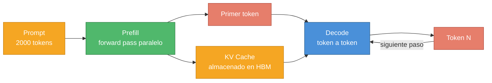
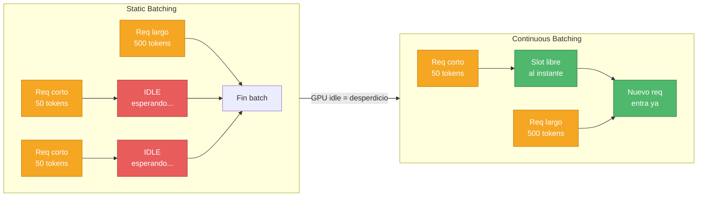
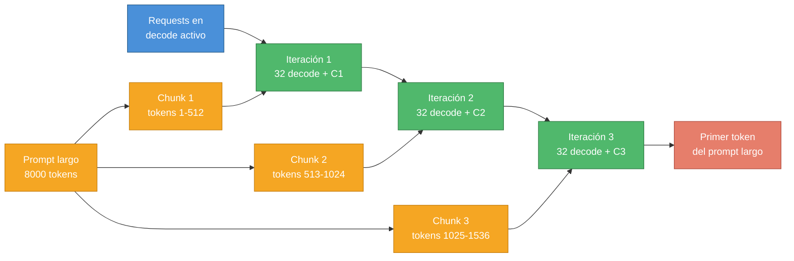
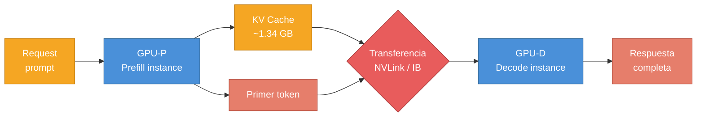
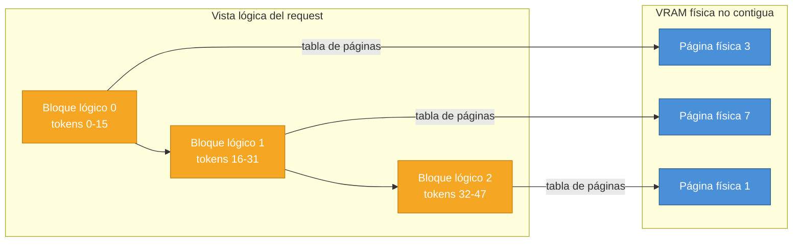

# Capítulo 8 — Inferencia LLM a Escala: de un Request a Miles de Usuarios

> Basado en "A Practical Guide to LLM Inference at Scale" y "Run the World's Best OCR on Your Own Laptop", The Neural Maze, Lección y Lab 8/8.

Siete capítulos han girado en torno a la misma pregunta: ¿cómo hacer que un modelo aprenda mejor? Arquitecturas, [[03-lora-adaptacion-de-bajo-rango|LoRA]], [[04-qlora-cuantizacion-4bit|QLoRA]], [[05-rlhf-alineacion-llms|RLHF]], GRPO, fine-tuning multimodal. Todo ese trabajo tiene un único destino: un modelo entrenado que alguien va a usar. Y es en ese momento — cuando el modelo pasa de archivo de pesos a servicio real con usuarios reales — cuando un conjunto completamente distinto de problemas aparece en escena.

El fine-tuning puede estar perfecto. El modelo puede alcanzar state-of-the-art en tu benchmark. Y aun así, si el sistema de inferencia está mal configurado, cada usuario espera 30 segundos por el primer token, la GPU está al 12% de utilización, y el coste de servir mil usuarios concurrentes supera lo que cobras. Eso no es un problema de modelo. Es un problema de infraestructura de inferencia.

Lo que hace fascinante este problema es que, en el fondo, es una historia de dos fases que se odian la una a la otra. Una quiere toda la potencia de cálculo de la GPU. La otra necesita todo el ancho de banda de memoria. Y las dos compiten en el mismo hardware, al mismo tiempo, por cada request que llega. Toda la historia de la inferencia LLM moderna es el intento de negociar esa tensión de forma cada vez más elegante — y cada solución introduce un nuevo problema que la siguiente solución tiene que resolver.

En este capítulo trazaremos esa cadena completa: desde cómo funciona un único request, pasando por cinco generaciones de estrategias de batching y scheduling, hasta sistemas de producción como vLLM y kvcached. Y lo remataremoos ensuciándonos las manos con GLM-OCR, un modelo de OCR de 0.9B parámetros que alcanza el estado del arte en comprensión de documentos complejos, usándolo localmente con Ollama y analizando exactamente por qué el tiempo hasta el primer token es de casi tres minutos mientras que la generación tarda solo nueve segundos — una demostración perfecta de los conceptos teóricos en acción.

---

## El ciclo de vida de un request: prefill, decode y KV cache

Para entender por qué la inferencia a escala es difícil, hay que entender primero qué le ocurre a un único request desde que llega hasta que termina. Hay dos fases, y son computacionalmente tan distintas que en sistemas avanzados se ejecutan en hardware físicamente separado.

### La fase de prefill: leer el libro completo de una vez

Cuando un usuario envía un prompt — digamos, un documento de 2.000 tokens para resumir — el modelo no puede generar la respuesta sin antes procesar toda esa entrada. La fase de **prefill** (también llamada *prompt processing* o *context ingestion*) es precisamente eso: el modelo hace un único forward pass sobre todos los tokens del prompt, calculando sus representaciones internas en paralelo.

La palabra clave es "en paralelo". El [[01-fundamentos-transformers-y-pretraining|transformer]] procesa los 2.000 tokens simultáneamente mediante multiplicaciones de matrices masivas. Eso es lo que hace a esta fase **compute-bound** (limitada por capacidad de cómputo): la GPU está ejecutando FLOPs a máxima velocidad, y el cuello de botella es el número de operaciones aritméticas que puede hacer por segundo.

La métrica de rendimiento que mide esta fase es el **TTFT (Time to First Token)**, es decir, cuánto tiempo tarda el usuario en recibir el primer token de respuesta desde que envió su prompt. Para aplicaciones de chat en tiempo real, un TTFT por encima de 1-2 segundos empieza a sentirse lento. Para agentes que procesan documentos largos en pipeline, puede tolerarse un TTFT mayor.

Al final de la fase de prefill, el modelo ha generado el primer token. Pero además — y esto es crucial — ha calculado y almacenado en memoria GPU algo llamado el **KV cache**.

### El KV cache: la optimización que desplaza el cuello de botella

Durante el forward pass de la fase de prefill, cada capa del transformer computa matrices de consultas (Q), claves (K) y valores (V) para cada token. El mecanismo de atención necesita las matrices K y V de todos los tokens anteriores para calcular la atención del token actual. Sin caché, habría que recalcular K y V de los 2.000 tokens de entrada para cada nuevo token generado — un coste cuadrático que haría la inferencia prohibitivamente lenta.

La solución es guardar en memoria las matrices K y V calculadas durante el prefill. A esto se le llama **KV cache**. Con él, generar cada nuevo token solo requiere calcular Q, K y V para ese único token nuevo, y combinarlos con las K y V ya almacenadas. El coste por token pasa de cuadrático a lineal.

¿Cuánta memoria ocupa esto? La fórmula es:

$$\text{Tamaño KV cache} = 2 \times n_\text{layers} \times n_\text{heads} \times d_\text{head} \times L \times \text{bytes\_por\_elemento}$$

Donde:
- El factor $2$ aparece porque guardamos tanto K como V (dos matrices separadas).
- $n_\text{layers}$ es el número de capas transformer del modelo.
- $n_\text{heads}$ es el número de cabezas de atención por capa.
- $d_\text{head}$ es la dimensión de cada cabeza, normalmente $d_\text{model} / n_\text{heads}$.
- $L$ es la longitud de la secuencia (tokens de entrada más tokens generados hasta el momento).
- $\text{bytes\_por\_elemento}$ es 2 bytes para FP16/BF16, 4 bytes para FP32.

Pongamos números concretos para un modelo de 66B parámetros con arquitectura típica: supongamos $n_\text{layers} = 80$, $d_\text{model} = 8.192$, y cabezas de 64 dimensiones cada una (lo que implica $n_\text{heads} = 128$). Para una secuencia de 512 tokens en FP16:

$$\text{Tamaño KV cache} = 2 \times 80 \times 128 \times 64 \times 512 \times 2 \text{ bytes}$$

$$= 2 \times 80 \times 8.192 \times 512 \times 2 \text{ bytes}$$

$$= 2 \times 80 \times 8.388.608 \text{ bytes}$$

$$= 2 \times 671.088.640 \text{ bytes} \approx 1.34 \text{ GB}$$

Más de un gigabyte por request de 512 tokens en un único modelo grande. Si sirves 100 requests concurrentes con contextos de 2.000 tokens, el KV cache solo ocupa más de 20 GB de VRAM — incluso antes de contar los propios pesos del modelo. Esta es la razón por la que la memoria de la GPU se convierte en el recurso más escaso de la inferencia a escala, y la razón por la que toda la ingeniería de los últimos años se ha centrado en gestionarla con más inteligencia.

### La fase de decode: escribir la carta palabra a palabra

Una vez que el prefill ha terminado y el primer token está generado, comienza la fase de **decode** (también llamada *autoregressive generation* o *generation phase*). Aquí el modelo genera los tokens de la respuesta uno a uno, de forma secuencial e inevitable: no puedes generar el token 5 sin haber generado el token 4, porque cada nuevo token se convierte en parte del contexto del siguiente.

En cada paso de decode, el modelo procesa exactamente un token — el último generado — y produce el siguiente. El KV cache almacena el contexto de todos los tokens anteriores, así que la carga computacional por paso es pequeña. Pero hay un problema fundamental: aunque el cómputo es mínimo, el modelo todavía tiene que cargar sus parámetros completos (decenas o cientos de gigabytes) desde la **HBM (High-Bandwidth Memory, la VRAM de la GPU)** al **SRAM (la memoria on-chip ultra-rápida de los núcleos de cálculo)** en cada paso.

Cargar pesos masivos para hacer muy poco trabajo con ellos es el problema definitorio de la fase de decode: la GPU está **memory-bandwidth bound** (limitada por el ancho de banda de memoria). Sus miles de núcleos de cálculo están infrautilizados porque la operación dominante no es calcular — es mover bytes. El cómputo termina en microsegundos, pero espera a que los datos lleguen desde la HBM durante milisegundos.

La métrica que mide esta fase es el **TPOT (Time Per Output Token)**, el tiempo entre tokens consecutivos. También se llama *inter-token latency* (latencia entre tokens). Para una experiencia de streaming fluida, valores por debajo de 50ms por token son razonables; por encima de 100ms empieza a sentirse entrecortado.

La analogía que fija estos conceptos: el **prefill es como leer un libro completo de una sola vez** — consumes toda la información en paralelo, es cognitivamente intenso, y tarda en función de cuántas páginas tiene. El **decode es como escribir una carta a mano, palabra por palabra** — en cada momento solo escribes una palabra, pero tienes que ir al archivador a buscar tu vocabulario completo antes de cada una. El trabajo por palabra es mínimo, pero el tiempo de acceso al archivador domina el proceso.



*Figura 8.1 — Flujo prefill → decode: el prompt se procesa en paralelo (compute-bound), se construye el KV cache, y luego el decode itera token a token leyendo ese cache (memory-bandwidth-bound).*

> **Descripción visual:** Diagrama de flujo horizontal izquierda a derecha. Un bloque naranja "Prompt 2000 tokens" apunta a un bloque verde "Prefill forward pass paralelo". Desde prefill salen dos flechas: una a un bloque naranja "KV Cache almacenado en HBM" y otra a un bloque rojo "Primer token". Ambos convergen en un bloque azul "Decode token a token", que apunta a un bloque rojo "Token N" con una flecha de retorno etiquetada "siguiente paso". Fondo blanco, tipografía sans-serif, estilo limpio.

---

## Batching estático: el autobús que no sale hasta que todos bajan

Con las dos fases claras, el problema de escala empieza a tomar forma. Una GPU de alto rendimiento puede ejecutar decenas de miles de FLOPs por nanosegundo. Servir requests uno a uno desperdicia casi toda esa capacidad. La solución natural es procesar varios requests a la vez: **batching**.

La forma más simple de batching es el **static batching** (batching estático). El motor de inferencia espera hasta tener un número fijo de requests — digamos, un batch de 8 — y los procesa todos a la vez como una única operación de tensor. Al procesar un batch, los pesos del modelo se cargan una sola vez desde HBM y se usan para calcular los 8 requests simultáneamente. En términos de utilización de GPU, esto es mucho mejor que procesar cada request por separado.

Hay un requisito técnico que complica el static batching: las operaciones de tensor estándar trabajan con tensores rectangulares. Si los 8 prompts de un batch tienen longitudes distintas (50 tokens, 340 tokens, 120 tokens...), no puedes apilarlos en una matriz sin igualar sus longitudes. La solución clásica es **padding**: añadir tokens especiales al final de los prompts más cortos hasta que todos tengan la misma longitud que el más largo. Si el prompt más largo tiene 340 tokens y el más corto tiene 50, el prompt corto lleva 290 tokens de relleno que no contienen información pero sí consumen cómputo.

El coste de este padding es cuadrático en el desequilibrio: un batch con un outlier muy largo pagará padding masivo en todos los demás.

Pero el padding es el problema menor. El problema mayor del static batching es su política de finalización: **el batch entero termina cuando termina el último request**. Imagina un batch de 8 requests donde 7 generan respuestas cortas de 50 tokens pero uno necesita 500 tokens. Los 7 requests cortos terminan rápido, pero sus slots en la GPU quedan completamente ociosos esperando a que el octavo termine. La GPU sigue cargando los pesos completos del modelo en cada iteración de decode, pero la mayor parte del trabajo se desperdicia en slots que ya no tienen nada que generar.

La analogía es exacta: **el static batching es el autobús que no puede salir hasta que todos los pasajeros lleguen, y no puede dejar subir a nadie nuevo hasta que el último pasajero del viaje anterior se baje**. En horas pico, la consecuencia es un autobús que sale casi vacío cada vez, o que tiene a la mitad de los pasajeros esperando en la parada durante un viaje entero.

En producción, esto se traduce en:

- **Infrautilización severa de GPU**: si la distribución de longitudes de salida tiene varianza alta (y siempre la tiene en producción), una fracción grande del tiempo de GPU se gasta en padding o en slots ociosos esperando al request más largo.
- **Latencia adicional para nuevos requests**: un usuario que llega justo después de que empieza el batch tiene que esperar a que el batch entero termine antes de ser procesado. En el peor caso, espera tanto tiempo como el request más largo del batch anterior.

Hay una variante llamada **dynamic batching** que mejora ligeramente el static batching: en lugar de esperar un número fijo de requests, espera un tiempo fijo (digamos 100ms) y agrupa los que lleguen en ese ventana. Esto balancea mejor el throughput y la latencia, pero no resuelve el problema fundamental: los requests cortos siguen esperando a que terminen los largos.



*Figura 8.2 — Static vs. continuous batching: en static los slots ociosos (rojo) esperan al request más largo; en continuous el slot se libera de inmediato y entra el siguiente request.*

> **Descripción visual:** Diagrama de flujo horizontal con dos subgrafos. Izquierda, "Static Batching": tres bloques naranja de requests apuntan a dos bloques rojos "IDLE esperando" que convergen en "Fin batch". Derecha, "Continuous Batching": dos bloques naranja apuntan a un bloque verde "Slot libre al instante" y a "Nuevo req entra ya". Una flecha etiquetada "GPU idle = desperdicio" conecta los dos subgrafos. Fondo blanco, estilo limpio.

---

## Continuous batching: la cinta transportadora que nunca para

La solución definitiva a las limitaciones del static batching es el **continuous batching**, también conocido como **iteration-level scheduling** (scheduling a nivel de iteración). El nombre "iteration-level" captura la idea clave: en lugar de tomar decisiones de scheduling a nivel de batch (al principio y al final), las decisiones se toman en cada iteración de decode.

La mecánica es la siguiente. En cada paso de generación, el scheduler inspecciona el estado del batch:

1. ¿Algún request acaba de generar un token de fin de secuencia (EOS)? Si es así, ese request ha terminado. Su slot se libera inmediatamente.
2. ¿Hay requests esperando en la cola? Si hay un slot libre, el siguiente request de la cola se inserta en el batch ahora mismo.

No se espera a que el batch entero termine. No hay fronteras rígidas entre batches. El batch es un conjunto vivo de requests en distintos estados de generación, que se actualiza en cada iteración.

La analogía correcta es la **cinta transportadora**: en una fábrica con cinta transportadora, cuando una pieza sale de la línea, inmediatamente entra la siguiente. No hay esperas entre ciclos. El throughput depende de la velocidad de la cinta, no del tiempo que tarda la pieza más lenta.

Esto plantea un problema técnico: si los requests del batch están en iteraciones distintas (uno en el token 3, otro en el token 47, otro recién insertado empezando el prefill), sus secuencias tienen longitudes distintas en cada momento. El padding rectangular ya no es factible — el derroche sería enorme si tuvieras que igualar longitudes en cada iteración con requests en estados tan dispares.

La solución es el **ragged batching** (batching irregular o jagged). En lugar de apilar los tokens en una matriz rectangular con padding, los tokens de todos los requests se concatenan en una única secuencia larga y plana. Un request con 23 tokens y otro con 147 tokens simplemente se pegan uno detrás del otro, formando una secuencia de 170 tokens.

Para que la atención funcione correctamente — es decir, para que los tokens del primer request no "vean" los tokens del segundo request en el mecanismo de atención — el sistema usa **attention masks** (máscaras de atención) precisas que permiten la atención dentro de cada request pero la bloquean entre requests distintos. Este uso de masks no es nuevo; lo viste en el capítulo 2 durante el [[02-supervised-finetuning|SFT]]. Aquí simplemente se usa de forma más agresiva para permitir mezclar secuencias de longitudes completamente arbitrarias.

El continuous batching también introduce una nueva complejidad: ¿cómo mezclar la fase de prefill (compute-bound) de los nuevos requests con la fase de decode (memory-bandwidth-bound) de los requests en curso? Los frameworks modernos como vLLM implementan schedulers que alternan prefill y decode de forma inteligente — por ejemplo, no insertar el prefill de un prompt de 8.000 tokens si eso va a bloquear el decode de 32 requests en curso durante 500ms. Esta tensión entre prefill y decode dentro del continuous batching es precisamente el problema que resuelve la siguiente técnica.

---

## Chunked prefill: trocear el problema para repartir el dolor

El continuous batching resuelve el problema de los slots ociosos, pero descubre un problema nuevo: la **prefill-decode interference** (interferencia prefill-decode).

Cuando llega un nuevo request con un prompt muy largo — digamos, un documento de 8.000 tokens para analizar —, el sistema tiene que ejecutar su prefill antes de empezar a generar respuesta. Ese prefill de 8.000 tokens es una operación masiva, compute-bound, que puede tardar cientos de milisegundos. Si este prefill entra en el batch junto con requests en fase de decode, esos requests de decode tienen que esperar a que termine el prefill para avanzar al siguiente token. Su TPOT se dispara — el usuario que estaba recibiendo respuesta fluida de repente ve una pausa larga y antinatural.

El **chunked prefill** (prefill en trozos) ataca este problema dividiéndolo. En lugar de procesar el prompt largo de 8.000 tokens en un único forward pass monolítico, el sistema lo divide en **chunks** (fragmentos) de tamaño fijo — por ejemplo, 512 tokens cada uno. El scheduler procesa un chunk de prefill en cada iteración, intercalado con los pasos de decode de los otros requests.

El mecanismo se apoya en el KV cache. En el primer chunk, el modelo procesa los tokens 1-512 del prompt y guarda sus estados KV. En el segundo chunk, el modelo procesa los tokens 513-1024 y puede reutilizar (añadir al) KV cache ya calculado para el primer chunk, actualizando la attention mask para reflejar el contexto acumulado. Así sucesivamente hasta completar el prompt.

¿Por qué funciona esto? Porque el scheduler puede ahora "presupuestar" tokens por iteración. Si impone un límite de, digamos, 2.048 tokens por iteración, y hay 32 requests en decode (32 tokens) más un prefill pendiente, puede meter 32 tokens de decode más 512 tokens de prefill (= 544 tokens en total, bien dentro del presupuesto) en la misma iteración. Los requests de decode avanzan sin pausas significativas. El prefill progresa en segundo plano.

Pero el chunked prefill no es gratis. Introduce dos trade-offs importantes:

**Trade-off 1: TTFT aumenta para el request en prefill.** El usuario cuyo prompt se está procesando en chunks tiene que esperar más iteraciones antes de recibir su primer token, porque el prefill se reparte entre múltiples iteraciones compartidas. Con prefill monolítico, ese usuario esperaría, pongamos, 300ms (todo el prefill de golpe) y luego recibiría el primer token. Con chunked prefill, el prefill se distribuye en 16 chunks de 50 tokens cada uno, intercalados con decode de otros requests, y el usuario podría esperar 800ms para el primer token — más tiempo total, pero sin bloquear a nadie más.

**Trade-off 2: overhead cuadrático de recarga del KV cache.** Para procesar el chunk $k$, el motor tiene que cargar desde HBM al SRAM el KV cache de todos los chunks anteriores 1 a $k-1$. Este coste de carga crece cuadráticamente con el número de chunks, porque cada nuevo chunk carga más contexto. Con contextos muy largos y chunks muy pequeños, este overhead puede dominar el coste total del prefill.

En la práctica, el tamaño del chunk es un hiperparámetro crítico. Chunks muy pequeños (128 tokens) minimizan la interferencia en el TPOT de los requests de decode pero maximizan el overhead de recarga y aumentan el TTFT del request en prefill. Chunks grandes (2.048 tokens) tienen el efecto contrario. Los frameworks de producción típicamente usan valores entre 512 y 2.048 tokens y los exponen como parámetro configurable.



*Figura 8.3 — Chunked prefill: el prompt de 8000 tokens se divide en chunks que se intercalan iteración a iteración con los pasos de decode de requests en curso, sin bloquearlos.*

> **Descripción visual:** Diagrama de flujo horizontal. Un bloque naranja grande "Prompt largo 8000 tokens" diverge en tres bloques naranja (Chunk 1, 2, 3). Un bloque azul "Requests en decode activo" y los chunks convergen en tres bloques verdes de iteraciones encadenados de izquierda a derecha. El último bloque verde apunta a un bloque rojo "Primer token del prompt largo". Fondo blanco, estilo limpio.

---

## Disaggregación prefill-decode: separar físicamente lo que no puede coexistir

El chunked prefill suaviza la interferencia prefill-decode, pero no la elimina. A escala de miles de usuarios concurrentes, incluso una interferencia pequeña se amplifica hasta hacerse intolerable — y la causa fundamental sigue siendo la misma: prefill y decode tienen necesidades radicalmente distintas del hardware, pero comparten los mismos chips.

El prefill es compute-bound: quiere alta densidad de cómputo por unidad de tiempo. Se beneficia de intra-operator parallelism: dividir la multiplicación de matrices de atención entre muchos núcleos de GPU usando tensor parallelism. El decode es memory-bandwidth-bound: quiere alta velocidad de lectura desde HBM. Se beneficia de tener más requests en el batch simultáneamente para amortizar la carga de pesos entre más secuencias.

Estas necesidades no solo son distintas — son conflictivas. Optimizar la partición de GPU para prefill (más tensor parallelism, más núcleos) la hace peor para decode, y viceversa.

La solución arquitectónica de última generación es la **prefill-decode disaggregation** (disaggregación prefill-decode): asignar las dos fases a GPUs físicamente distintas.

En un sistema disaggregado:
- Las **prefill instances** son GPUs dedicadas exclusivamente a procesar prompts. Están configuradas con alta paralelización para maximizar el throughput de prefill.
- Las **decode instances** son GPUs dedicadas exclusivamente a la generación token a token. Están configuradas para maximizar el tamaño del batch y la eficiencia de memoria.

El flujo de un request es: llega a una prefill instance, que procesa el prompt completo y genera el primer token. Una vez que el prefill termina, la prefill instance transfiere el KV cache generado y el primer token a una decode instance, que toma el control y genera el resto de la respuesta.

Esta separación elimina totalmente la interferencia: ningún prefill puede bloquear ningún decode, porque viven en GPUs distintas. Además, permite escalar cada fase de forma independiente: si los prompts de tu servicio son muy largos (documentos, código), necesitas más prefill instances; si las respuestas son muy largas, necesitas más decode instances. Esta flexibilidad de escalado independiente es muy difícil de conseguir con arquitecturas colocalizadas.

### El cuello de botella de la transferencia: 90 Gbps no es suficiente

La disaggregación introduce un nuevo problema de primera magnitud: **transferir el KV cache** entre las prefill instances y las decode instances a través de la red.

Calculemos el volumen de datos involucrado. En la sección anterior ya vimos que servir un request de 512 tokens en un modelo de 66B parámetros genera más de 1 GB de KV cache. Ahora imaginemos que estamos sirviendo 100 requests por segundo. El volumen de KV cache que hay que transferir es:

$$\text{Ancho de banda requerido} = 100 \text{ req/s} \times 1.34 \text{ GB/req} = 134 \text{ GB/s}$$

Una red InfiniBand HDR moderna ofrece aproximadamente 200 Gbps = 25 GB/s. Incluso eso es insuficiente para este escenario. ¿Y una red Ethernet de 100 Gbps = 12.5 GB/s? La transferencia de KV cache se convierte en el cuello de botella primario, reemplazando exactamente el problema que la disaggregación vino a resolver.

El umbral citado en la literatura de producción — al menos 90 Gbps solo para hacer invisible el overhead de transferencia en workloads moderados — ya supera lo que muchos clusters de datacenter tienen en conectividad GPU-a-GPU a través de la red. Con 90 Gbps = 11.25 GB/s, y nuestro cálculo de 134 GB/s para 100 req/s con prompts de 512 tokens, queda claro que 90 Gbps es el umbral mínimo para workloads ligeros, no el número cómodo para producción a escala.

### Topology-aware placement: colocar las instancias donde el ancho de banda es gratuito

La solución práctica es la **topology-aware placement** (ubicación consciente de la topología de red). La idea es simple: si el ancho de banda de red inter-nodo no es suficiente para la transferencia de KV cache, coloca las prefill instances y decode instances correspondientes en el mismo nodo físico, de modo que la transferencia pueda usar las conexiones intra-nodo.

En nodos equipados con GPUs NVIDIA modernas, las GPUs dentro del mismo nodo están conectadas mediante **NVLink**, el bus de interconexión propietario de NVIDIA. Las versiones actuales de NVLink ofrecen hasta 600 GB/s de ancho de banda bidireccional entre GPUs del mismo nodo. Con 600 GB/s disponibles, transferir 1.34 GB de KV cache tarda aproximadamente 2.2 milisegundos — tiempo que el usuario no percibe como latencia.

Comparación clara:

| Interconexión | Ancho de banda | Tiempo transferencia (1.34 GB KV cache) |
|---|---|---|
| Ethernet 100G | ~12.5 GB/s | ~107 ms |
| InfiniBand HDR | ~25 GB/s | ~54 ms |
| NVLink (NVIDIA Hopper) | ~600 GB/s | ~2.2 ms |

Solo NVLink hace la transferencia invisible al usuario. Esto convierte la disaggregación en una técnica viable solo en clusters con NVLink intra-nodo, o en clusters con InfiniBand de alta generación (NDR o XDR, con ~50-100 GB/s) donde el overhead de transferencia puede amortizarse con bufferización inteligente.

Cuando ni NVLink ni InfiniBand de alta velocidad están disponibles, el sistema recurre a la colocación forzada prefill-decode en el mismo nodo, degradando graciosamente a un régimen semi-disaggregado donde parte del aislamiento se mantiene pero las limitaciones de ancho de banda son más relajadas.



*Figura 8.4 — Disaggregación prefill-decode: GPU-P procesa el prompt y transfiere el KV cache vía NVLink/InfiniBand (cuello de botella, en rojo) a GPU-D, que genera el resto de la respuesta de forma aislada.*

> **Descripción visual:** Diagrama de flujo horizontal. Un bloque naranja "Request prompt" apunta a un bloque azul "GPU-P Prefill instance". Desde GPU-P salen dos flechas: a un bloque naranja "KV Cache ~1.34 GB" y a un bloque rojo "Primer token". Ambos convergen en un rombo rojo "Transferencia NVLink / IB" (cuello de botella). El rombo apunta a un bloque azul "GPU-D Decode instance" que termina en un bloque rojo "Respuesta completa". Fondo blanco, estilo limpio.

---

## vLLM y PagedAttention: la memoria virtual de los LLMs

Todo lo que hemos discutido hasta aquí asume implícitamente que la memoria de GPU está disponible para los requests que la necesitan. Pero hay un problema de gestión de memoria que, en los frameworks de inferencia tradicionales, descarta de forma silenciosa entre el 60% y el 80% de la VRAM disponible.

El problema es la **fragmentación de memoria**. Los frameworks tradicionales asignan, para cada request, un bloque contiguo de memoria GPU igual al KV cache máximo posible del request — que es el KV cache para la longitud de contexto máxima del modelo. Si el modelo tiene un contexto máximo de 32.768 tokens y el KV cache por token es 0.5 MB (para simplificar), eso es 16 GB reservados para ese request, aunque el usuario solo vaya a generar 200 tokens de respuesta.

El problema no es que se reserve ese espacio — es que se reserva como bloque contiguo y no se puede compartir ni reutilizar hasta que el request termina. Con 24 GB de VRAM total, este esquema permite servir exactamente 1 request activo, con 8 GB desperdigados en fragmentos internos inutilizables. Eso es el 80% de fragmentación que citan los papers originales de vLLM.

**vLLM** (Virtual Large Language Model inference engine) es el framework de producción más ampliamente adoptado para servir LLMs, y su innovación central es **PagedAttention**: un nuevo mecanismo de gestión de memoria para el KV cache inspirado directamente en el sistema de memoria virtual de los sistemas operativos.

### La analogía del sistema operativo

En un SO moderno, la memoria de los procesos no es contigue en la RAM física. El SO mantiene una tabla de páginas que mapea páginas virtuales (lo que el proceso cree que tiene) a páginas físicas (dónde están realmente en la RAM). Esto permite:
- Que la memoria de un proceso sea no contigua físicamente.
- Que se asigne solo la memoria que realmente se usa (demanda paginada).
- Que páginas inactivas se desplacen al disco (swap) y vuelvan cuando se necesiten.
- Que múltiples procesos compartan páginas de memoria de solo lectura (páginas compartidas).

PagedAttention aplica exactamente la misma abstracción al KV cache de los LLMs.

### Cómo funciona PagedAttention

En lugar de asignar un bloque contiguo de memoria para el KV cache completo de un request, PagedAttention divide el KV cache en **bloques de tamaño fijo** (típicamente 16 o 32 tokens cada uno). Estos bloques no tienen que estar contiguos en memoria. El **Block Manager** (gestor de bloques) de vLLM mantiene una tabla de correspondencia entre:
- **Logical blocks** (bloques lógicos): el KV cache tal como el request lo "ve", numerado secuencialmente desde el principio del contexto.
- **Physical blocks** (bloques físicos): dónde están realmente esos datos en la VRAM.

Al inicio de un request, vLLM no reserva ningún bloque físico. Conforme el request genera tokens y el KV cache crece, el Block Manager asigna bloques físicos bajo demanda (*just-in-time allocation*). Cuando el request termina, los bloques físicos se marcan como libres instantáneamente y están disponibles para el siguiente request.

¿Qué fragmentación queda? Solo la del último bloque parcialmente lleno de cada request — en promedio, medio bloque. Si los bloques son de 32 tokens, la fragmentación máxima por request es de 16 tokens de KV cache. En términos de VRAM, eso es menos del 4% de fragmentación total, comparado con el 60-80% del esquema naive.



*Figura 8.5 — PagedAttention: los bloques lógicos del KV cache (visión del request) se mapean mediante tabla de páginas a páginas físicas no contiguas en VRAM, eliminando fragmentación.*

> **Descripción visual:** Diagrama de flujo horizontal con dos subgrafos. Izquierda, "Vista lógica del request": tres bloques naranja encadenados (Bloque lógico 0, 1, 2). Derecha, "VRAM física no contigua": tres bloques azules desordenados (Página física 3, 7, 1). Flechas diagonales etiquetadas "tabla de páginas" conectan cada bloque lógico con su página física correspondiente. Fondo blanco, estilo limpio.

### El impacto de PagedAttention en throughput

La reducción de fragmentación del 80% al 4% libera una cantidad enorme de VRAM. Esa VRAM recuperada se usa para mantener más requests activos simultáneamente — es decir, aumenta el batch size efectivo del motor. Un batch más grande en decode significa que cada carga de pesos desde HBM se amortiza entre más sequences, mejorando la utilización de GPU.

El resultado empírico es dramático: vLLM consigue entre **23x y 24x más throughput** que sistemas de static batching como Hugging Face Transformers inference naive, medido en tokens generados por segundo. Esto no es magia — es el efecto compuesto de:
1. Continuous batching (elimina slots ociosos).
2. PagedAttention (elimina fragmentación, permite batches más grandes).
3. Un scheduler preemptivo que puede pausar, reanudar y reordenar requests para maximizar la utilización.

Simultáneamente, la latencia p50 baja, porque el sistema puede manejar workloads bursting sin que los nuevos requests esperen a que un batch completo termine.

PagedAttention también permite implementar dos características avanzadas que hubieran sido imposibles con gestión de memoria contigua:

**Copy-on-Write para beam search**: en beam search, el modelo explora múltiples hipótesis de respuesta en paralelo. Hasta que una hipótesis diverge de las demás, comparten el mismo KV cache. Con PagedAttention, las hipótesis pueden literalmente compartir los mismos bloques físicos hasta el punto de divergencia, y solo copiarlos cuando es necesario escribir en ellos. Esto ahorra una fracción significativa de la memoria del KV cache en inferencia con beam search.

**Prefix caching**: si múltiples requests comparten el mismo prefijo de prompt (por ejemplo, todos los usuarios de un chatbot comparten el system prompt), los bloques del KV cache correspondientes al prefijo común pueden almacenarse una sola vez y compartirse entre todos los requests. El prefill de ese prefijo se hace una vez; los demás requests solo hacen el prefill de su parte privada.

---

## Elastic resource allocation: kvcached y la compartición de GPU sin fronteras

PagedAttention resuelve el problema de la fragmentación dentro de un único motor de inferencia sirviendo un único modelo. Pero en producción, un cluster de GPUs suele ejecutar múltiples modelos simultáneamente: un modelo de routing, un modelo de reranking, varios modelos de inferencia principal, modelos de visión. La pregunta es: ¿cómo compartir la VRAM del GPU entre todos ellos de forma eficiente?

**MIG (Multi-Instance GPU)** es la solución a nivel de hardware que NVIDIA ofrece. MIG permite dividir físicamente una GPU en particiones aisladas — por ejemplo, una A100 de 80 GB puede dividirse en hasta 7 particiones de ~10 GB cada una. Cada partición es invisible a las demás y puede ejecutar un modelo distinto. La ventaja es el aislamiento perfecto. La desventaja es la rigidez: las particiones son fijas en tamaño, no pueden redimensionarse sin reiniciar la GPU, y la memoria no utilizada en una partición no puede prestarse a otra que la necesite.

**kvcached** es un proyecto open-source que ataca el mismo problema desde el software, con mucha más flexibilidad. Su insight fundamental es que la VRAM de la GPU, como la RAM de un servidor, puede gestionarse con las mismas abstracciones que los SOs llevan décadas usando para gestionar memoria: direccionamiento virtual, asignación bajo demanda, y reclamación dinámica.

### El mecanismo de kvcached

Cuando un motor de inferencia como vLLM arranca con kvcached, en lugar de reservar físicamente toda la VRAM que necesitará para el KV cache al inicio (lo que haría por defecto), solo reserva el **espacio de direcciones virtuales** en la GPU. La memoria física se asigna estrictamente bajo demanda, bloque a bloque, a medida que los requests realmente necesitan espacio de KV cache.

kvcached implementa un sistema de dos niveles:
- **Fast path**: para bloques de KV cache que caben en VRAM, la asignación es directa y rápida (microsegundos).
- **Slow path**: cuando la presión de memoria es alta, kvcached puede desalojar bloques de KV cache menos usados a memoria de CPU (con latencia de milisegundos) o incluso a almacenamiento NVMe, y recuperarlos cuando sea necesario.

Este mecanismo tiene consecuencias importantes para varios escenarios de producción:

**Multi-LLM serving**: si tienes tres modelos compartiendo la misma GPU, y el Modelo A está recibiendo una ráfaga de requests mientras B y C están ociosos, kvcached permite que A use el 90% de la VRAM disponible durante esa ráfaga, y que la memoria se redistribuya automáticamente cuando B y C vuelvan a recibir tráfico. No hay particiones fijas — la memoria fluye hacia donde se necesita.

**Serverless LLM**: en arquitecturas serverless, los modelos solo están activos mientras sirven requests. Con gestión de memoria estática, mantener un modelo cargado pero ocioso reserva VRAM que ningún request está usando. Con kvcached, un modelo ocioso libera su KV cache y retiene solo los pesos del modelo (que deben estar cargados para poder responder rápido). Esta separación de "pesos siempre cargados, KV cache solo cuando hay requests" reduce el coste de cold start y permite una densidad mucho mayor de modelos por GPU.

**Colocación con otros workloads**: un GPU que sirve inferencia de LLMs también puede ejecutar trabajos de fine-tuning de baja prioridad, procesamiento de visión, o entrenamiento, usando la VRAM que la inferencia no está usando en ese momento. Con gestión de memoria estática, esto era imposible sin MIG. Con kvcached, es automático.

### El impacto en TTFT: 2x-28x de mejora

El beneficio medido más llamativo de kvcached es en TTFT bajo carga concurrente. ¿Por qué afecta kvcached al TTFT?

Con gestión de memoria estática, cuando la cola de requests crece — por ejemplo, durante un pico de tráfico — el motor no puede aceptar nuevos requests hasta que haya VRAM libre para su KV cache. Los requests esperan en cola hasta que un request activo termina y libera su bloque de VRAM. Si todos los bloques están ocupados, la cola crece y el TTFT se dispara.

Con kvcached, el motor puede aceptar nuevos requests usando memoria virtual que todavía no tiene backing físico. Conforme los requests en curso terminan y liberan VRAM física, esa memoria se asigna a los requests entrantes. En workloads con alta concurrencia y distribución de duraciones de request variable (exactamente lo que se ve en producción), esto se traduce en tiempos de espera en cola mucho menores.

El rango de mejora de **2x a 28x** refleja la varianza de los workloads de producción: un servicio con requests de duración muy variable (muchos cortos y pocos muy largos) se beneficia más, porque la gestión estática desperdicia más VRAM esperando a que los requests largos terminen. Un servicio con duraciones uniformes (todos los requests generan respuestas de longitud similar) se beneficia menos, porque la fragmentación dinámica es menor.

---

## Ecosistema de frameworks: Ollama, llama.cpp, vLLM y SGLang

Antes de pasar al laboratorio, conviene mapear el ecosistema de herramientas disponibles. No todas las situaciones requieren vLLM; la elección depende del hardware, la escala, y el caso de uso.

### llama.cpp: el motor de inferencia sin GPU

**llama.cpp** es un motor de inferencia escrito en C++ por Georgi Gerganov que implementa la inferencia de LLMs de forma eficiente en CPUs de consumo (y GPUs a través de backends opcionales como CUDA o Metal). Su filosofía es maximizar la eficiencia en hardware no especializado.

El nombre engaña — llama.cpp no solo ejecuta LLaMA. Soporta docenas de arquitecturas modernas, y su formato nativo de pesos es **GGUF** (Georgi's GPT-Unified Format), un formato binario único que encapsula los pesos del modelo junto con todos los metadatos necesarios para la inferencia (arquitectura, vocabulario, configuración de cuantización). Antes de GGUF existía GGML; si ves archivos con extensión `.bin` de modelos llama.cpp antiguos, son formato GGML.

La clave de la eficiencia de llama.cpp en CPU es la **cuantización**. Los pesos del modelo, normalmente almacenados en FP16 (2 bytes por parámetro), se comprimen a representaciones de menor precisión:

- **Q4_K_M**: cuantización de 4 bits con agrupación y matrices de escala separadas. Es el punto óptimo para la mayoría de los casos — reduce el tamaño del modelo en ~4x respecto a FP16 con una degradación mínima de calidad en la mayoría de las tareas.
- **Q2_K**: cuantización de 2 bits. Comprime en ~8x respecto a FP16, pero con degradación de calidad más visible en tareas de razonamiento complejo. Útil cuando la memoria es extremadamente limitada.
- **Q8_0**: cuantización de 8 bits, casi sin pérdida de calidad. Comprime en ~2x respecto a FP16. Para producción con GPUs dedicadas donde la calidad importa más que el tamaño.

La nomenclatura es importante: el número denota los bits por parámetro; la letra y sufijo siguientes indican el esquema de agrupación (K = agrupamiento por bloques con factores de escala cuantizados también, M = variante mixta). Más detalles de precisión se cuantifican a mayor número de bits.

¿Qué se pierde con cuantización agresiva? La respuesta varía por tarea. Para OCR y reconocimiento de documentos, la degradación de Q4 es prácticamente invisible — la tarea es suficientemente determinista. Para razonamiento matemático profundo o generación de código complejo, Q2 puede introducir errores que Q4 evitaría.

### Ollama: la interfaz humana de llama.cpp

**Ollama** es una herramienta que envuelve llama.cpp en una interfaz amigable para desarrolladores. La relación entre ambos es análoga a la que existe entre Git y GitHub Desktop: llama.cpp es el motor potente que hace el trabajo real; Ollama añade la capa de UX que lo hace accesible sin necesidad de compilar código C++ ni manejar argumentos de línea de comandos complejos.

Ollama gestiona:
- **Descarga de modelos**: `ollama pull llama3.2` descarga y cachea el modelo automáticamente.
- **Gestión del daemon**: mantiene el servidor de inferencia en background.
- **API REST**: expone un endpoint en `localhost:11434` con una API compatible con las convenciones de OpenAI.
- **Modelfiles**: permite crear versiones personalizadas de modelos con parámetros específicos (contexto, temperatura, system prompt), guardadas como una "receta" que puede reproducirse.

La limitación de Ollama es que está diseñado para uso local y no para producción a escala. No implementa continuous batching (es single-request por defecto), no tiene PagedAttention, y no soporta multi-GPU de forma nativa. Para producción con múltiples usuarios concurrentes, el salto a vLLM o SGLang es necesario.

### vLLM: producción en GPU

Ya describimos los mecanismos de vLLM en detalle. Su perfil de uso es: tienes acceso a una o más GPUs NVIDIA, quieres servir uno o varios modelos a múltiples usuarios concurrentes, y la eficiencia importa. vLLM expone una API compatible con OpenAI (`/v1/chat/completions`), soporta LoRA adapters en tiempo real, y puede servir modelos de hasta cientos de GB con tensor parallelism multi-GPU.

### SGLang: alto rendimiento para workflows complejos

**SGLang** (Structured Generation Language) es un framework de inferencia de alto rendimiento con soporte de primera clase para **structured outputs** (salidas estructuradas: JSON schemas, gramáticas formales), **multi-turn conversations**, y **workflows complejos** que mezclan múltiples llamadas al modelo. En benchmarks de throughput puro, SGLang iguala o supera a vLLM en muchos escenarios, especialmente con contextos largos y outputs estructurados.

Para el caso de uso de OCR a escala (múltiples documentos, extracción estructurada de datos), SGLang es una alternativa legítima a vLLM con ventajas específicas en la gestión de outputs JSON.

| Framework | Mejor para | Continuous batching | PagedAttention | GPU requerida |
|---|---|---|---|---|
| llama.cpp | Dev local, CPU-only | No | No | Opcional |
| Ollama | Prototipado, uso personal | No | No | Opcional |
| vLLM | Producción multi-usuario | Sí | Sí | Sí |
| SGLang | Producción, outputs estructurados | Sí | Sí | Sí |

---

## Lab: GLM-OCR con Ollama — de documento a Markdown en local

Con la teoría en mano, es hora de ensuciarnos las manos. El modelo que usaremos en el lab es **GLM-OCR**, desarrollado por Z.ai, un [[07-finetuning-multimodal-vision-tts|modelo de visión-lenguaje (VLM)]] de solo 0.9 billones de parámetros que en el momento de su lanzamiento alcanza un score de 94.62 en OmniDocBench V1.5 — el benchmark estándar para evaluación de comprensión de documentos complejos — situándose en el primer puesto del ranking, por encima de modelos propietarios y modelos de mucho mayor tamaño.

¿Cómo puede un modelo de 0.9B superar a modelos diez veces más grandes? La respuesta está en su especialización y en su arquitectura de dos etapas.

### GLM-OCR: arquitectura y ventajas

GLM-OCR está basado en la familia GLM (General Language Model) con un encoder de visión (GLM-V), pero su desempeño en OCR no proviene solo de la arquitectura base. Dos innovaciones en el entrenamiento son responsables:

**Multi-Token Prediction (MTP) loss**: en lugar de entrenar el modelo para predecir solo el siguiente token, MTP entrena simultáneamente para predecir los siguientes $k$ tokens. Para OCR, esto resulta en una generación más fluida del texto reconocido — el modelo aprende la estructura del documento a nivel de frase, no solo de carácter. Por ejemplo, si está reconociendo "Total $755", haberle entrenado para predecir múltiples tokens a la vez le ayuda a entender que el "$" debe ir seguido de un número y no de una palabra aleatoria.

**Full-task reinforcement learning**: el modelo se entrena con RL sobre la tarea completa de OCR — no solo sobre la pérdida token a token, sino sobre métricas de calidad del documento final (¿se preservó la estructura de la tabla? ¿Las fórmulas están bien formadas?). Esto ajusta el modelo para optimizar el resultado final que importa al usuario, no solo la probabilidad de cada token individual.

El segundo elemento clave es la integración con **PP-DocLayout-V3** de PaddlePaddle, un modelo de detección de layout que analiza primero la estructura del documento (dónde están los títulos, tablas, fórmulas, columnas de texto, imágenes incrustadas) antes de pasársela al decoder de OCR. Esta detección de layout permite manejar documentos complejos con layouts no lineales — una columna de tablas seguida de texto a dos columnas, código fuente intercalado con fórmulas matemáticas — que romperían la lectura secuencial simple.

### Paso 0: identificar el hardware

El rendimiento en CPU depende críticamente del número de **núcleos físicos**. Los procesadores modernos usan hyperthreading (SMT) para presentar el doble de núcleos lógicos que físicos, pero llama.cpp bajo el capó de Ollama se beneficia de núcleos físicos reales — el hyperthreading añade poco en cargas de inferencia LLM porque el cuello de botella es el acceso a memoria, no la ejecución de instrucciones.

```bash
# Linux
lscpu | grep -E '^CPU\(s\):|Core\(s\) per socket|Thread\(s\) per core'

# macOS
sysctl -n hw.physicalcpu hw.logicalcpu
```

```powershell
# Windows PowerShell
Get-WmiObject -Class Win32_Processor | Select-Object Name, NumberOfCores, NumberOfLogicalProcessors
```

La regla para `num_thread` es: iguala el número de núcleos físicos, no los lógicos. Si tienes un procesador de 8 núcleos con hyperthreading (16 núcleos lógicos), usa `num_thread 8`. Usar 16 típicamente degrada el rendimiento porque los hilos compiten por los mismos recursos de memoria.

### Paso 1: lanzar el contenedor Ollama

Usamos Docker para aislar Ollama y evitar conflictos de versiones. El volumen `ollama_storage` es crucial: los modelos GGUF de GLM-OCR pesan entre 2 y 4 GB, y sin un volumen persistente tendrías que descargarlos de nuevo cada vez que borrases el contenedor.

```bash
docker run -d \
  --name ollama-server \
  -v ollama_storage:/root/.ollama \
  -p 11434:11434 \
  ollama/ollama
```

Desglose de flags:
- `-d`: detached mode, el contenedor corre en background.
- `--name ollama-server`: nombre fijo para referenciar el contenedor en comandos posteriores.
- `-v ollama_storage:/root/.ollama`: monta un volumen Docker nombrado en el directorio donde Ollama guarda los modelos. El volumen persiste aunque el contenedor se borre.
- `-p 11434:11434`: expone el puerto 11434 del contenedor (donde escucha la API de Ollama) en el mismo puerto del host.

### Paso 2: descargar el modelo

```bash
docker exec -it ollama-server ollama pull glm-ocr
```

Esto descarga el modelo GLM-OCR desde el Ollama model hub, en su formato GGUF con cuantización por defecto. `docker exec -it` ejecuta el comando dentro del contenedor ya corriendo (`-it` = interactive + pseudo-TTY, necesario para ver el progreso de la descarga).

### Paso 3: el Modelfile y por qué importa

El problema con la configuración por defecto de Ollama para modelos de visión es que el contexto estándar (2.048 o 4.096 tokens) es insuficiente para procesar imágenes de documentos. Una imagen de factura a 1024px se tokeniza como cientos de tokens visuales antes de que el decoder empiece a generar el texto. Sin suficiente contexto, el modelo trunca la imagen y pierde información.

Un **Modelfile** es la forma de Ollama de declarar una versión personalizada de un modelo. Es análogo a un Dockerfile para Docker: especifica la base y las modificaciones.

```bash
# Entramos al contenedor
docker exec -it ollama-server bash

# Creamos el Modelfile
cat <<EOF > GLM-Config
FROM glm-ocr

# Context and hardware
PARAMETER num_ctx 16384
PARAMETER num_thread 6

# Generation parameters (hardcoded for OCR)
PARAMETER num_predict 8192
PARAMETER temperature 0
PARAMETER top_p 0.00001
PARAMETER top_k 1
PARAMETER repeat_penalty 1.1
EOF

# Creamos la versión personalizada
ollama create glm-ocr-optimized -f GLM-Config

exit
```

Explicación de cada parámetro:

**`num_ctx 16384`**: el tamaño de la ventana de contexto en tokens. Para una imagen de 1024×1024 px, el encoder visual de GLM-OCR genera típicamente entre 1.000 y 4.000 tokens visuales dependiendo de la complejidad de la imagen. Con el contexto por defecto de 2.048, una imagen de tamaño moderado consumiría casi todo el contexto antes de que el modelo genere una sola palabra. Con 16.384, hay espacio más que suficiente tanto para la imagen como para una respuesta larga. El coste es memoria: un contexto de 16.384 tokens ocupa bastante más VRAM/RAM que uno de 2.048 — en una máquina con 8 GB de RAM esto puede ser ajustado.

**`num_thread 6`**: el número de hilos CPU para la inferencia. Aquí se asume una máquina con 6 núcleos físicos (o Performance Cores en un Intel híbrido). Adaptar según tu hardware siguiendo el Paso 0.

**`num_predict 8192`**: el número máximo de tokens de salida. Para un documento denso con tablas y código, la salida Markdown puede ser larga — 8.192 tokens garantiza que el modelo puede generar la transcripción completa sin truncar.

**`temperature 0` + `top_p 0.00001` + `top_k 1`**: esta combinación implementa **greedy decoding** — el modelo siempre elige el token más probable. Para OCR, no queremos creatividad ni diversidad: queremos la transcripción más probable de lo que hay en la imagen. Cualquier temperatura mayor a 0 introduciría varianza aleatoria que podría alterar palabras, números o signos de puntuación.

**`repeat_penalty 1.1`**: penaliza ligeramente repetir los mismos tokens. Sin esto, el modelo puede quedarse en bucle repitiendo líneas o secuencias de caracteres, especialmente en documentos con patrones repetitivos (tablas, listas).

Estos parámetros se hardcodean en el Modelfile, no se pasan en cada request, porque para esta tarea específica los parámetros óptimos son siempre los mismos. Para un chatbot de propósito general no harías esto — querrías flexibilidad en temperatura para distintos tipos de request.

### Paso 4: enviar imágenes a la API

Las imágenes deben enviarse como strings Base64. **Base64** es un esquema de codificación que convierte datos binarios (como los bytes de una imagen JPEG) en una cadena de caracteres ASCII imprimibles. Esto permite incluir la imagen directamente en el body JSON de la request HTTP sin necesidad de archivos adjuntos o URLs externas.

```python
import requests
import base64
import ollama
import time
from io import BytesIO
from PIL import Image

# --- Configuración ---
IMAGE_URL = "https://marketplace.canva.com/EAE92Pl9bfg/6/0/1131w/canva-black-and-gray-minimal-freelancer-invoice-wPpAXSlmfF4.jpg"
MODEL_NAME = "glm-ocr-optimized"
MAX_DIMENSION = 1024  # Redimensiona al borde más largo a 1024px


def get_optimized_image_b64(url: str) -> str:
    """
    Descarga la imagen, la redimensiona si es mayor de MAX_DIMENSION,
    y la codifica en Base64 JPEG.
    
    Usamos JPEG (no PNG) porque:
    - El OCR no necesita transparencia (que PNG preserva pero JPEG no).
    - JPEG comprime mucho más que PNG para imágenes de documentos típicos.
    - Menos bytes de Base64 = request más pequeña = menos tiempo de parsing.
    """
    print("Descargando imagen...")
    response = requests.get(url)
    img = Image.open(BytesIO(response.content))
    
    orig_w, orig_h = img.size
    print(f"Tamaño original: {orig_w}x{orig_h}")
    
    # Solo redimensionar si la imagen supera MAX_DIMENSION en algún eje
    if max(img.size) > MAX_DIMENSION:
        # thumbnail respeta el aspect ratio automáticamente
        img.thumbnail((MAX_DIMENSION, MAX_DIMENSION), Image.Resampling.LANCZOS)
        print(f"Redimensionado a: {img.width}x{img.height}")
    
    buffered = BytesIO()
    img.save(buffered, format="JPEG", quality=85)
    return base64.b64encode(buffered.getvalue()).decode("utf-8")


def run_ocr():
    image_b64 = get_optimized_image_b64(IMAGE_URL)
    
    print("Enviando a Ollama (esperando primer token)...")
    start_time = time.time()
    first_token = True
    
    # Stream: recibimos tokens conforme se generan
    # Esto permite medir el TTFT con precisión
    stream = ollama.generate(
        model=MODEL_NAME,
        prompt="Text recognition:",  # Prompt estándar de GLM-OCR
        images=[image_b64],
        stream=True
    )
    
    for chunk in stream:
        if first_token:
            ttft = time.time() - start_time
            print(f"\nTTFT: {ttft:.2f}s\n")
            first_token = False
        
        # flush=True asegura que el texto aparece en terminal conforme llega
        print(chunk["response"], end="", flush=True)
    
    total_time = time.time() - start_time
    print(f"\n\nTiempo total: {total_time:.2f}s")


if __name__ == "__main__":
    run_ocr()
```

El prompt `"Text recognition:"` no es arbitrario — es el prompt de instrucción estándar con el que GLM-OCR fue entrenado. Usar un prompt diferente puede degradar la calidad de reconocimiento porque el modelo espera ese formato específico de instrucción.

### Paso 5: interpretar los resultados de docker stats

Mientras el script corre, ejecuta en otra terminal:

```bash
docker stats
```

Verás algo similar a:

```
CONTAINER ID   NAME            CPU %     MEM USAGE / LIMIT     MEM %
0ca7a28d6fe2   ollama-server   600.42%   4.359GiB / 7.607GiB   57.31%
```

Dos cosas llaman la atención aquí y vale la pena entenderlas en profundidad.

**CPU al 600%**: en Linux/Docker, el CPU% puede superar el 100% porque el porcentaje se calcula respecto a un único núcleo. 600% significa que el proceso está usando el equivalente a 6 núcleos completos a máxima capacidad. Esto corresponde exactamente al `num_thread 6` que configuramos — todos los hilos están trabajando al límite. Esto es correcto y esperado: es la fase de prefill visual, la parte compute-bound del pipeline.

**RAM al 57%**: el modelo de 0.9B en Q4 más el KV cache de 16.384 tokens de contexto ocupa unos 4.4 GB de los 7.6 GB disponibles en el sistema del ejemplo. El resto del sistema operativo ocupa lo demás. Si el MEM% se acercara al 100%, el sistema empezaría a hacer swapping a disco, lo que multiplicaría la latencia por 10x o más.

**El dato más revelador son los tiempos:**

```
TTFT: 174.96s
Total Processing Time: 183.39s
```



```mermaid
flowchart LR
    IMG[Imagen\ndocumento] --> RS[Resize\n1024 px max]
    RS --> B64[Base64\ncodificación]
    B64 --> OLL[Ollama\nGLM-OCR]
    OLL --> VE[Vision Encoder\nprefill visual]
    VE --> KV[KV Cache\nconstruido]
    KV --> DEC[Decoder\ntokens de texto]
    DEC --> MD[Markdown\nestructurado]

    VE -. "TTFT: 174s\ncompute-bound" .-> KV
    DEC -. "Decode: 9s\nmemory-BW-bound" .-> MD

    classDef datos    fill:#F5A623,stroke:#C47D0E,color:#fff
    classDef proceso  fill:#50B86C,stroke:#2D7A42,color:#fff
    classDef modelo   fill:#4A90D9,stroke:#2C5F8A,color:#fff
    classDef alerta   fill:#E85C5C,stroke:#A83C3C,color:#fff
    classDef metrica  fill:#E67E6B,stroke:#B04A3C,color:#fff

    class IMG,B64 datos
    class RS proceso
    class OLL,VE,DEC modelo
    class KV datos
    class MD metrica
```

*Figura 8.6 — Pipeline GLM-OCR con Ollama: el 95% del tiempo total cae en el Vision Encoder (prefill visual, compute-bound); el decoder genera el Markdown en segundos una vez que el KV cache está construido.*

> **Descripción visual:** Diagrama de flujo horizontal. Bloques naranjas "Imagen documento" y "Base64 codificación", bloque verde "Resize 1024 px max", bloques azules "Ollama GLM-OCR", "Vision Encoder prefill visual", "Decoder tokens de texto", bloque naranja "KV Cache construido", bloque rojo "Markdown estructurado". Flechas punteadas etiquetadas "TTFT: 174s compute-bound" y "Decode: 9s memory-BW-bound" marcan los dos bottlenecks. Fondo blanco, estilo limpio.

El tiempo hasta el primer token es de **174.96 segundos — casi tres minutos**. El tiempo de generación posterior es de solo **8.43 segundos** (183.39 - 174.96). ¿Qué nos dice esto?

Que el 95.4% del tiempo total del pipeline está en la fase de prefill — específicamente, en el encoder visual procesando la imagen. El decoder LLM, que genera el texto token a token, es comparativamente instantáneo. Esta es la demostración práctica perfecta de por qué las fases de prefill y decode son tan distintas: el encoder visual realiza multiplicaciones de matrices masivas sobre las representaciones de la imagen (compute-bound al 100%), mientras que la generación de texto aprovecha el KV cache ya construido y produce tokens en cuestión de centésimas de segundo cada uno.

Esta observación tiene implicaciones prácticas directas:

1. **En producción, el cuello de botella de GLM-OCR es el encoder visual.** Más VRAM no te ayuda (no hay OOM). Más RAM no te ayuda. Lo que te ayuda es una GPU que pueda hacer el forward pass del encoder en paralelo masivo. Con una NVIDIA A10G (24 GB VRAM), el mismo pipeline corre en 2-5 segundos totales en lugar de 183.

2. **El TTFT de 175s no es un mal diseño — es la física del hardware.** Una CPU, por muy buena que sea, no puede competir con una GPU en operaciones matriciales masivas. La CPU del ejemplo procesa ~4 GFLOPs; una A100 hace 312 TFLOPs en BF16 — 78.000 veces más throughput de cómputo.

3. **La fase de decode es un argumento a favor del chunked prefill y la disaggregación.** Si este modelo tuviera que servir 100 usuarios concurrentes en CPU, el prefill de cada uno sería tan largo que el continuous batching no podría rescatarlo — los nuevos requests esperarían horas en cola. El salto a GPU resuelve el problema en el orden correcto.

### Paso 6: el SDK de GLM-OCR con PP-DocLayout-V3

Para documentos más complejos — el paper técnico de Qwen3, una presentación con columnas y tablas, documentación de código — la API básica de Ollama tiene limitaciones. El SDK oficial de GLM-OCR integra PP-DocLayout-V3, el modelo de detección de layout de PaddlePaddle, que primero analiza la estructura del documento y luego pasa cada región al encoder de visión de forma independiente.

¿Por qué este pipeline de dos etapas? Porque el encoder visual de GLM-OCR tiene una resolución fija — procesa la imagen como un todo. Para un documento A4 con tres columnas de texto, tabla con 20 filas, y dos figuras, procesar la imagen completa a 1024px hace que el detalle de texto en columnas sea demasiado pequeño para reconocerse correctamente. PP-DocLayout-V3 detecta primero las regiones del documento (bounding boxes de cada bloque), y luego el encoder procesa cada región de forma recortada y normalizada — el equivalente a leer cada párrafo en primer plano en lugar de intentar leer toda la página desde lejos.

```python
import requests
from PIL import Image
from glmocr import GlmOcr

LOCAL_FILENAME = "documento_complejo.jpg"


def run_sdk_ocr(image_path: str):
    # Resize a 1024px para optimizar la inferencia en CPU
    # (el sweet spot entre resolución suficiente y velocidad)
    with Image.open(image_path) as img:
        if max(img.size) > 1024:
            img.thumbnail((1024, 1024), Image.Resampling.LANCZOS)
            img.save(image_path)
            print(f"Imagen redimensionada para inferencia en CPU.")
    
    print("Inicializando GLM-OCR SDK...")
    
    # GlmOcr como context manager gestiona la carga y descarga del modelo
    # config.yaml especifica las rutas al modelo, idioma, y parámetros del detector
    with GlmOcr(config_path="./config.yaml") as parser:
        print("Analizando estructura del documento...")
        result = parser.parse(image_path)
        
        # El resultado incluye el Markdown con toda la estructura preservada:
        # - Títulos como # ## ###
        # - Tablas como Markdown tables
        # - Fórmulas matemáticas como LaTeX
        # - Listas con su jerarquía
        print(result.markdown_result)


if __name__ == "__main__":
    run_sdk_ocr(LOCAL_FILENAME)
```

El `config.yaml` que acompaña al SDK configura:
- Ruta al modelo GLM-OCR (en formato safetensors, no GGUF — el SDK usa HuggingFace Transformers, no llama.cpp).
- Ruta al modelo PP-DocLayout-V3.
- Idiomas soportados para la detección.
- Umbrales de confianza para la detección de regiones.
- Modo de paralelización de regiones.

El output del SDK para la primera página del Qwen3 Technical Report incluye el abstract completo con su estructura, los títulos de las tablas de benchmarks, y el contenido de las tablas en formato Markdown perfectamente estructurado — incluyendo las celdas de cabecera alineadas a la izquierda (`:---`) y los valores numéricos de los benchmarks en cada celda. Esto es lo que hace a GLM-OCR útil para pipelines de procesamiento de documentos: el output no es texto plano sino Markdown estructurado que puede parsearse programáticamente.

### Paso 7: cuándo saltar a vLLM/SGLang

Ollama con GLM-OCR funciona perfectamente para uso personal, prototipado, o procesamiento de documentos de baja frecuencia (unos pocos documentos al día). Los límites se hacen evidentes cuando:

- **El throughput importa**: si necesitas procesar 100 documentos/hora, los 183 segundos por documento en CPU son prohibitivos. Con vLLM en una GPU A10G, ese tiempo cae a 3-5 segundos — 40-60x más rápido.
- **Hay múltiples usuarios concurrentes**: Ollama no implementa continuous batching. El segundo usuario espera a que el primero termine, incluyendo los 175 segundos de prefill. Con vLLM, múltiples requests de OCR pueden pipelinearse.
- **Necesitas endpoints compatibles con OpenAI a escala**: vLLM expone `/v1/chat/completions` con soporte de throughput alto. La configuración recomendada por la documentación oficial de GLM-OCR para producción es vLLM con `max_workers` y `connection_pool_size` ajustados para evitar errores 503 bajo carga.

```bash
# Servir GLM-OCR con vLLM (requiere GPU)
vllm serve THUDM/glm-ocr \
  --max-model-len 16384 \
  --max-num-seqs 32 \
  --tensor-parallel-size 1
```

Con esta configuración, vLLM aplica automáticamente todos los mecanismos del capítulo: continuous batching, PagedAttention, y chunked prefill si se configura. El tiempo de prefill visual cae a 2-4 segundos porque la GPU paraleliza las multiplicaciones de matrices que la CPU hacía en 175 segundos.

---

## Cierre del capítulo — El arco completo del fine-tuning al deployment

Hemos llegado al final del libro, y vale la pena hacer una pausa para ver el camino completo que hemos recorrido y cómo se conecta.

El **Capítulo 1** estableció los fundamentos: transformers, atención, pretraining. Aprendimos que los LLMs aprenden representaciones del lenguaje a través de la predicción del siguiente token sobre corpus masivos.

Los **Capítulos 2 y 3** construyeron las técnicas centrales del fine-tuning: SFT para alinear el modelo con instrucciones, y LoRA para hacerlo de forma eficiente modificando solo matrices de bajo rango. Aprendimos a adaptar modelos preentrenados a tareas específicas sin necesidad de actualizar todos los parámetros.

El **Capítulo 4** añadió QLoRA, que combina cuantización de 4 bits con LoRA para llevar el fine-tuning a hardware de consumo. La misma cuantización que hace posible ejecutar GLM-OCR en un portátil es la que permite finetunear modelos de 7B en una RTX 3090.

Los **Capítulos 5 y 6** abrieron la dimensión del alignment: RLHF, DPO, y GRPO para entrenar modelos que no solo generan texto coherente sino que alinean su comportamiento con preferencias humanas. Los mismos modelos de RLHF que has aprendido a entrenar son los que viven detrás de ChatGPT, Claude, y Gemini — y que, después de entrenados, deben servirse eficientemente.

El **Capítulo 7** expandió el dominio a modalidades no textuales: VLMs para visión y TTS para síntesis de voz. GLM-OCR, el modelo de este capítulo, es precisamente un VLM — y los principios de fine-tuning que aprendiste en el Capítulo 7 (cómo se entrena un vision encoder, cómo se conecta al decoder LLM, qué técnicas como MTP loss mejoran el rendimiento) explican por qué GLM-OCR es tan bueno con tan pocos parámetros.

Este **Capítulo 8** cierra el ciclo preguntando: ¿y una vez entrenado, cómo lo servimos? La respuesta no es obvia. El modelo más capaz del mundo, servido con un framework naive de static batching, puede ser más lento y caro que un modelo menor servido con continuous batching y PagedAttention. La inferencia eficiente es la diferencia entre un modelo que vive en un paper y un modelo que usan millones de usuarios.

La tensión central del capítulo — prefill vs decode queriendo cosas opuestas del hardware — se resuelve progresivamente en cinco generaciones de técnicas:

1. **Static batching**: agrupa requests, pero el batch es tan lento como el request más largo.
2. **Continuous batching**: libera slots al instante y los rellena en cada iteración — end-to-end.
3. **Chunked prefill**: divide los prefills largos para que no bloqueen el decode de otros requests.
4. **Prefill-decode disaggregation**: separa físicamente las dos fases en hardware optimizado para cada una.
5. **PagedAttention + kvcached**: gestiona la VRAM con la misma inteligencia con la que un SO gestiona la RAM.

Lo que ves en el lab con GLM-OCR — 175 segundos de prefill, 9 segundos de decode, 600% de CPU — es la manifestación directa de estos principios: la fase compute-bound dominando en CPU, y la fase memory-bandwidth-bound siendo casi gratuita una vez que el KV cache está construido.

El salto de Ollama en CPU a vLLM en GPU es el mismo salto conceptual que el libro entero ha estado describiendo: de prototipar algo que funciona a construir algo que escala. Las herramientas cambian. Los principios — gestión eficiente de recursos, eliminación de bottlenecks, separación de concerns computacionales — son los mismos en el entrenamiento que en la inferencia.

Si has llegado hasta aquí y entiendes por qué un ratio de importancia se recorta en PPO, por qué un adaptador LoRA de rango 8 funciona casi igual que un fine-tuning completo, y por qué el TTFT de un modelo VLM en CPU es tan alto, entonces has construido una base sólida sobre la que operar como ingeniero de LLMs en producción. El siguiente paso, inevitablemente, es ensuciarte las manos con tus propios modelos, tus propios datos, y tus propios casos de uso. Todo lo que necesitas para empezar está en este libro.

---

## Tags

#inferencia #serving #vllm #paged-attention #kv-cache #prefill #decode #chunked-prefill #disaggregation #ollama #llama-cpp #glm-ocr #multimodal #nivel/avanzado #tipo/lab #estado/completo
