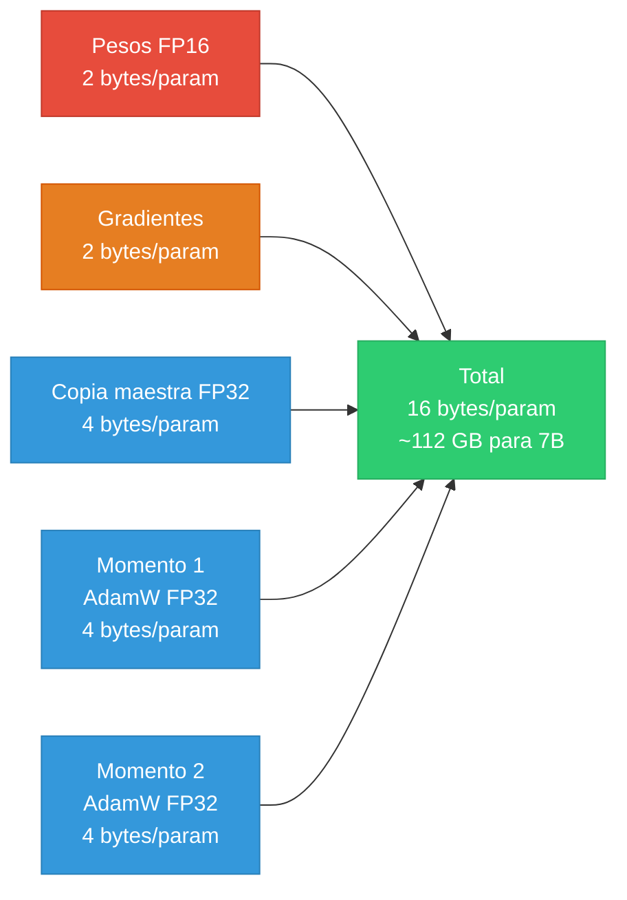
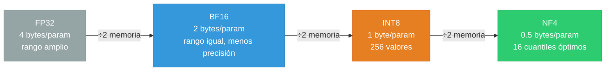
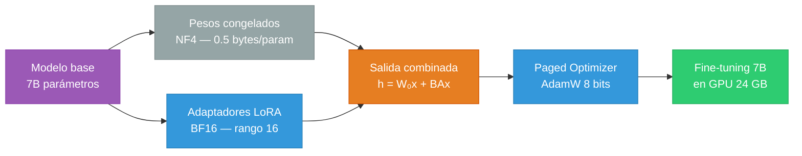

# Capítulo 4 — QLoRA: Cómo la Cuantización a 4 Bits Rompe el Muro de la VRAM

> Basado en "QLoRA Explained - How 4 Bit Quantization Unlocks Frontier Models" y "Engineering QLoRA for memory-efficient LLM Finetuning" — The Neural Maze, Finetuning Sessions Lección 4.

Hay un momento que todo practicante de fine-tuning conoce bien: abres el terminal, lanzas el script que tanto has preparado, y treinta segundos después aparece en pantalla un mensaje rojo que dice `CUDA out of memory`. El modelo no cabe en la GPU. No porque el código esté mal, sino porque la física de la memoria de vídeo tiene sus propias reglas, y tú acabas de chocar contra ellas.

El capítulo anterior resolvió el problema de *cuántos parámetros entrenamos* mediante **LoRA** (Low-Rank Adaptation — adaptación de rango bajo), que reemplaza actualizaciones completas de matrices de millones de elementos por matrices de rango bajo entrenables. Pero LoRA tiene un límite: aunque no entrenes los pesos originales, esos pesos siguen viviendo en la GPU. Un modelo de 70B parámetros en precisión de 16 bits ocupa 140 GB de VRAM antes de que hayas procesado un solo token. En una H100, la GPU más potente del mercado, solo tienes 80 GB. El muro no ha desaparecido; simplemente se ha desplazado.

QLoRA — Quantized LoRA, es decir, LoRA sobre pesos cuantizados — ataca ese muro desde un ángulo diferente: no reduce lo que entrenamos, sino que repiensa *cómo almacenamos lo que no entrenamos*. El resultado es un modelo congelado a 4 bits de precisión, combinado con adaptadores LoRA en alta precisión para el aprendizaje. En la práctica, esto significa poder hacer fine-tuning de un modelo de 70B parámetros en una GPU de 48 GB, o de un modelo de 7B en una tarjeta de consumo de 24 GB que cuesta menos de mil euros.

Este capítulo explica por qué eso es posible sin que el modelo pierda la cabeza, y cómo poner todo eso en práctica con código real.

---

## El coste fijo de entrenar: por qué 7B parámetros no son 14 GB

Antes de entender la solución, hay que entender en profundidad el problema. Y el problema tiene capas que no son evidentes a primera vista.

Cuando dices "tengo un modelo de 7 mil millones de parámetros en FP16", la cuenta más obvia es: 7.000.000.000 parámetros × 2 bytes por parámetro (que es lo que ocupa un número en FP16, o "Float de 16 bits") = 14 GB. Hasta aquí, todo bien. Pero esa cifra solo cubre los pesos del modelo — lo que el modelo *sabe*. Para que el modelo *aprenda*, necesitas tres cosas adicionales.

La primera es el gradiente. Durante el entrenamiento, cada peso del modelo tiene asociada una señal de error que le dice en qué dirección moverse para reducir la pérdida. Ese gradiente tiene exactamente el mismo tamaño que el peso: 2 bytes por parámetro, otros 14 GB. Hasta ahora vas por 28 GB.

La segunda y tercera son los estados del optimizador. El optimizador estándar en la industria para fine-tuning es AdamW — una variante de Adam (Adaptive Moment Estimation — estimación de momento adaptativo) con regularización de peso desacoplada. AdamW no actualiza los pesos usando solo el gradiente crudo del momento actual; mantiene dos memorias históricas por cada parámetro:

- El **primer momento** (también llamado momentum o $m_t$): un promedio exponencial de los gradientes pasados. Sirve para que el optimizador "recuerde" la dirección en que venía moviéndose y no cambie de rumbo bruscamente con cada batch. Ocupa 4 bytes por parámetro (en FP32, precisión de 32 bits).
- El **segundo momento** (también llamado varianza o $v_t$): un promedio exponencial del cuadrado de los gradientes pasados. Sirve para ajustar el tamaño del paso de forma diferente para cada parámetro — parámetros con gradientes grandes y variables reciben pasos pequeños; parámetros con gradientes pequeños y estables reciben pasos más grandes. También 4 bytes por parámetro en FP32.

Además, AdamW mantiene una **copia maestra de los pesos en FP32** (4 bytes por parámetro), incluso cuando el modelo trabaja en FP16, porque la acumulación de actualizaciones pequeñas en FP16 introduce errores de redondeo que pueden desestabilizar el entrenamiento a largo plazo.

El desglose completo por parámetro queda así:

| Tensor | Precisión | Bytes/parámetro |
|---|---|---|
| Pesos del modelo | FP16 | 2 |
| Gradientes | FP16 | 2 |
| Copia maestra (pesos) | FP32 | 4 |
| Primer momento AdamW | FP32 | 4 |
| Segundo momento AdamW | FP32 | 4 |
| **Total** | | **16** |



> **Descripción visual:** Diagrama de flujo horizontal con cinco bloques de origen convergiendo en un bloque destino. Los bloques de la izquierda están coloreados en degradado: rojo (Pesos FP16), naranja (Gradientes), azul (tres tensores del optimizador — Copia maestra, Momento 1, Momento 2). Todos ellos apuntan con flechas grises hacia un bloque verde a la derecha etiquetado "Total: 16 bytes/param — 112 GB para 7B". Fondo blanco, tipografía sans-serif, estilo limpio y técnico.

16 bytes por parámetro. Para un modelo de 7B: 7.000.000.000 × 16 = 112 GB. Para un modelo de 70B: 1,12 TB. No terabytes de disco: terabytes de VRAM, la memoria ultrarrápida que vive directamente dentro de la GPU.

Eso es lo que se llama el **coste fijo** del entrenamiento — en inglés, *model states*. Es el "depósito de entrada" que hay que pagar antes de procesar un solo ejemplo de entrenamiento.

Y esto crea un problema que se retroalimenta. Lo que sobra después de pagar el coste fijo es lo que la literatura llama *residual states* — la memoria dinámica disponible para los estados intermedios de la red durante el paso hacia adelante (*activations*) y para el KV Cache durante la generación. Cada gigabyte que se traga el coste fijo es un gigabyte que no está disponible para el batch size ni para el contexto.

El batch size — el número de ejemplos que se procesan en paralelo en cada paso de actualización — tiene un impacto directo en la calidad del entrenamiento. Con un batch size de 1, el gradiente que calculas en cada paso es el gradiente de un solo ejemplo, que puede ser muy ruidoso (atípico respecto al dataset completo). Con un batch size de 32, el gradiente es el promedio de 32 ejemplos, mucho más estable y representativo. Dicho de otro modo: trabajar con batch size bajo no solo es lento; introduce ruido en las actualizaciones que puede obligarte a hacer más pasos para alcanzar la misma calidad, consumiendo más tiempo y compute.

QLoRA ataca precisamente el coste fijo de los pesos. Si en lugar de almacenar cada peso en 2 bytes (FP16) lo almacenas en 0,5 bytes (4 bits), reduces el peso del modelo en un 75%. Para el modelo de 7B: pasas de 14 GB solo en pesos a 3,5 GB. Esa diferencia — 10,5 GB liberados — se puede reinvertir en un batch size mayor, en contextos más largos, o en modelos directamente más grandes que de otra forma no cabrían.

---

## El KV Cache: la segunda pared de memoria que nadie te cuenta

Hay un segundo tipo de memoria que crece de forma silenciosa y que puede asfixiarte incluso cuando el modelo ya cabe: el KV Cache.

Para entenderlo, hay que recordar cómo funciona la atención en un Transformer. Cuando el modelo genera un nuevo token, necesita "mirar" todos los tokens anteriores de la secuencia para calcular la atención — es decir, para decidir qué información de contexto es relevante para el siguiente paso. Si tienes una secuencia de 4.000 tokens y estás generando el token número 4.001, el modelo necesita considerar los 4.000 anteriores.

Sin optimización, recalcular todas las representaciones internas de esos 4.000 tokens en cada paso sería computacionalmente insostenible — la complejidad es $O(n^2)$ en la longitud de la secuencia. La solución es el **KV Cache** (Key-Value Cache — caché de claves y valores): almacenar en VRAM los tensores intermedios de claves ($K$) y valores ($V$) de la capa de atención para cada token ya procesado, de modo que solo haya que calcular los del nuevo token.

Es una optimización brillante para la velocidad, pero tiene un coste de memoria que escala linealmente con cuatro factores: longitud de la secuencia, tamaño del batch, número de capas del modelo, y dimensión de las cabezas de atención. Para un modelo de 70B con 80 capas y cabezas de 128 dimensiones, una ventana de contexto de 4.000 tokens puede consumir fácilmente 2,5 GB de VRAM por solicitud activa.

En inferencia esto se convierte en un problema de concurrencia. Si tu modelo de 70B, cuantizado a 4 bits, ocupa 35 GB, y cada usuario activo necesita 2,5 GB para su contexto, en una GPU de 80 GB tienes espacio para: (80 - 35) / 2,5 = 18 usuarios concurrentes antes de quedarte sin VRAM. Si el modelo no estuviera cuantizado y ocupara 140 GB... directamente no cabría en ninguna GPU individual.

Pero el KV Cache no solo es un problema de capacidad. También es un problema de **ancho de banda de memoria**. Durante la inferencia, la GPU pasa la mayor parte del tiempo moviendo datos desde la HBM (High Bandwidth Memory — la VRAM de alta velocidad) hacia los núcleos de cómputo, no haciendo las operaciones matemáticas en sí. Este cuello de botella se llama ser *memory-bound* (limitado por memoria). Cuando cuantizas el modelo a 4 bits, mueves 4 veces menos datos por peso en cada paso, lo que alivia ese cuello de botella y se traduce directamente en más tokens generados por segundo y menor latencia para el usuario final.

La combinación de pesos cuantizados a 4 bits con arquitecturas modernas de atención como GQA (Grouped Query Attention — atención por grupos de consultas, que reduce el número de cabezas K y V) produce un cambio cualitativo: se pasa de un mundo donde el cuello de botella es el *tamaño del modelo* a un mundo donde el cuello de botella es el *tamaño del contexto*. Eso abre la puerta a aplicaciones de contexto largo — como sistemas RAG (Retrieval-Augmented Generation — generación aumentada por recuperación) que necesitan leer documentos de cientos de páginas en un solo prompt.

---

## De FP32 a 4 bits: la geometría de la precisión

Para comprender cómo es posible comprimir pesos a 4 bits sin destruir el modelo, hay que entender qué significa precisión en el contexto de los números de punto flotante y cómo los distintos formatos hacen sus concesiones.

Un número en **FP32** (Float de 32 bits, también llamado single precision) utiliza 32 bits organizados en tres campos:

- 1 bit de signo (positivo o negativo)
- 8 bits de exponente (controla el rango, es decir, qué órdenes de magnitud puede representar)
- 23 bits de mantisa (controla la precisión, es decir, cuántos decimales significativos tiene el número)

Con 23 bits de mantisa, FP32 puede representar aproximadamente 7 dígitos decimales de precisión y cubrir magnitudes desde $10^{-38}$ hasta $10^{38}$. Es como una regla con marcas cada nanómetro — perfecta para simulaciones físicas donde un error de redondeo puede comprometer el resultado, pero excesiva para los pesos de una red neuronal que van a ser ajustados iterativamente de todas formas.

**BF16** (Brain Float 16 — float de 16 bits del cerebro, desarrollado por Google Brain) fue el primer gran paso hacia la eficiencia. Sus 16 bits se distribuyen como: 1 de signo, 8 de exponente, 7 de mantisa. La clave es que mantiene los mismos 8 bits de exponente que FP32, conservando el mismo rango dinámico. Sacrifica precisión (de 23 bits de mantisa a 7), pero los ingenieros de Google observaron que las redes neuronales son más sensibles al orden de magnitud de un peso que a su valor exacto — lo que importa es saber si algo vale "alrededor de 0.3" más que si vale exactamente "0.2998742". BF16 fue adoptado masivamente porque permitía entrenar sin cambiar la convergencia de los modelos, simplemente usando la mitad de la memoria.



> **Descripción visual:** Diagrama de flujo horizontal con cuatro bloques rectangulares en cadena de izquierda a derecha. El primero (gris) representa FP32 con 4 bytes/param. El segundo (azul) BF16 con 2 bytes. El tercero (naranja) INT8 con 1 byte. El cuarto (verde) NF4 con 0.5 bytes. Las flechas entre bloques llevan la etiqueta "÷2 memoria". Los colores van aclarándose hacia la derecha, reflejando la reducción progresiva de bits. Fondo blanco, estilo técnico minimalista.

**INT8** (Integer de 8 bits) marcó la primera transición desde números de coma flotante hacia enteros. Con 8 bits, solo tienes 256 valores posibles (de -128 a 127 si usas representación con signo). El proceso de asignar pesos continuos a esos 256 slots discretos se llama **cuantización**, y requiere **calibración**: elegir los valores mínimo y máximo del rango de pesos que vas a mapear, de modo que los pesos extremos no queden fuera de los 256 slots disponibles. Si calibras mal y el rango es demasiado estrecho, los pesos que sobresalen se "recortan" (clipping) y pierden información; si el rango es demasiado amplio, los 256 slots se distribuyen en un espacio grande y la resolución entre slots adyacentes se hace grosera. INT8 funcionó bien para inferencia a gran escala en centros de datos, pero resultó frágil para modelos generativos modernos.

**El salto a 4 bits** es donde la geometría cambia de forma dramática. Con 4 bits solo tienes $2^4 = 16$ valores posibles para representar un peso. Imagina que quieres pintar un retrato fotorrealista pero solo tienes 16 colores en tu paleta — y además no puedes elegir qué 16 colores. Si esos 16 colores están distribuidos de forma uniforme entre el negro absoluto y el blanco absoluto, vas a tener problemas para capturar los tonos medios donde están todos los detalles.

Eso es exactamente lo que pasa con la cuantización lineal de 4 bits: los 16 slots se distribuyen a intervalos iguales por el rango de los pesos, ignorando que la distribución de los pesos no es uniforme.

Para entender por qué importa, hay que fijarse en cómo se distribuyen realmente los pesos de una red neuronal entrenada. Invariablemente, siguen una distribución **gaussiana** (campana de Gauss) centrada en cero. La gran mayoría de los pesos son valores pequeños, cercanos a cero — digamos entre -0.5 y 0.5. Solo unos pocos pesos tienen valores grandes, como -2.0 o +1.8. Si distribuyes tus 16 slots de forma uniforme entre -2.0 y 2.0, con intervalos de 0.25, estás dedicando la misma resolución a la zona poco poblada de los extremos que a la zona densamente poblada del centro. Es un desperdicio de información.

---

## NF4: los bits en el lugar correcto

La solución que propone QLoRA se llama **NF4** (NormalFloat 4-bit — punto flotante normal de 4 bits). Es un tipo de dato diseñado específicamente para la forma en que los pesos de redes neuronales se distribuyen.

La idea central es la siguiente: en lugar de espaciar los 16 slots a intervalos iguales, los colocamos donde realmente viven los datos. Para una distribución gaussiana estándar, esto equivale a definir los 16 valores de NF4 como los **cuantiles** de esa distribución — los puntos que dividen la distribución en 17 zonas de igual probabilidad. En términos concretos:

- Si el 10% más pequeño de los pesos cae entre -2.0 y -1.2, hay un slot de NF4 en ese rango que cubre todo ese 10%.
- Si el 10% siguiente va de -1.2 a -0.85, otro slot cubre ese intervalo.
- Y así sucesivamente, acumulando slots en la zona central donde hay más pesos.

El resultado es que cada slot de NF4 cubre aproximadamente el mismo *volumen de datos* aunque no el mismo *rango de valores*. La resolución es mayor donde más la necesitas (cerca del cero) y menor donde menos la necesitas (en los extremos). Este diseño, fundamentado en la teoría de la información — específicamente en el principio de minimizar la entropía cuantizada — logra que la cuantización NF4 introduzca mucho menos error que INT4 lineal con los mismos 4 bits.

El proceso concreto de cuantización NF4 tiene dos fases. Primero, se normaliza un bloque de pesos (típicamente 64 pesos consecutivos) dividiéndolos por el valor absoluto máximo del bloque, de modo que todos caigan en el rango $[-1, 1]$. Segundo, ese valor normalizado se mapea al índice NF4 más cercano de los 16 predefinidos, que se almacena como un entero de 4 bits. En total, se almacena el índice (4 bits) más una constante de escala por bloque (16 bits en FP16): el overhead de la constante de escala es pequeño — por cada 64 pesos de 4 bits usamos 64 × 4 bits + 1 × 16 bits = 272 bits, frente a los 64 × 16 bits = 1024 bits en FP16. Eso es una reducción de 3.76x en almacenamiento, prácticamente el 4x teórico.

Para deshacer la cuantización (dequantización) cuando el modelo necesita hacer una operación, el proceso es inverso: se toma el índice de 4 bits, se busca el valor NF4 correspondiente en la tabla de 16 entradas, y se multiplica por la constante de escala del bloque. Este proceso ocurre en cada capa durante el paso hacia adelante, y es lo suficientemente rápido como para que el overhead sea mínimo en hardware moderno.

```mermaid
flowchart LR
    BLQ["Bloque 64 pesos\n(valores continuos)"]
    NORM["Normalización\ndividir por max"]
    MAP["Mapeo a cuantil\n16 valores NF4"]
    IDX["Índice 4 bits\n+ escala FP16"]
    DEQNT["Dequantización\ncada forward pass"]
    BF16["Tensor BF16\npara cómputo"]

    BLQ --> NORM
    NORM --> MAP
    MAP --> IDX
    IDX --> DEQNT
    DEQNT --> BF16

    classDef entrada fill:#9b59b6,stroke:#8e44ad,color:#fff
    classDef proceso fill:#3498db,stroke:#2980b9,color:#fff
    classDef almacen fill:#e67e22,stroke:#d35400,color:#fff
    classDef salida fill:#2ecc71,stroke:#27ae60,color:#fff

    class BLQ entrada
    class NORM,MAP proceso
    class IDX almacen
    class DEQNT proceso
    class BF16 salida
```



> **Descripción visual:** Diagrama de flujo horizontal con seis bloques en cadena. El primero (morado) representa el bloque de 64 pesos continuos. Los siguientes dos (azules) son las fases de proceso: normalización y mapeo al cuantil NF4. El cuarto (naranja) representa el almacenamiento comprimido: índice de 4 bits más escala FP16. El quinto (azul) es la dequantización que ocurre en cada forward pass. El sexto (verde) es el tensor BF16 resultante listo para cómputo. Las flechas son lineales de izquierda a derecha. Fondo blanco, tipografía sans-serif, estilo técnico.

---

## Double Quantization: cuantizando las constantes de escala

Hay un detalle de ingeniería adicional en QLoRA que parece un truco de magia de prestidigitación pero tiene un impacto real: la **Double Quantization** (cuantización doble).

Recuerda que cada bloque de 64 pesos necesita almacenar su propia constante de escala en FP16 (16 bits). Para un modelo de 7B parámetros con bloques de 64, necesitas almacenar: 7.000.000.000 / 64 = ~109.375.000 constantes de escala, cada una en FP16. Eso son 109.375.000 × 2 bytes = ~218 MB solo en constantes de escala.

La double quantization observa que estas constantes de escala también son números continuos y también tienen su propia distribución — son básicamente los "rangos locales" de cada bloque de pesos, y tienden a ser razonablemente uniformes. Así que las trata como un segundo nivel de datos y las cuantiza a su vez: agrupa bloques de constantes de escala (típicamente 256 constantes por superbloque) y cuantiza esas constantes de escala de FP16 a FP8, manteniendo una única constante de superescala por superbloque en FP32.

El ahorro de bits por parámetro que consigue la double quantization es: en el sistema sin double quantization, la constante de escala FP16 cuesta 16 bits / 64 parámetros = 0.25 bits por parámetro. Con double quantization (constante FP8 en bloques de 256 dentro de un superbloque con constante FP32): la constante FP8 cuesta 8/64 = 0.125 bits por parámetro, más la constante FP32 del superbloque que cuesta 32 / (256 × 64) ≈ 0.002 bits por parámetro. El ahorro total es de 0.25 - 0.127 ≈ 0.123 bits por parámetro, que los autores de QLoRA reportan como aproximadamente 0.37 bits por parámetro considerando todo el overhead del sistema.

¿Por qué importa ese ahorro aparentemente minúsculo? Para un modelo de 70B parámetros: 70.000.000.000 × 0.37 bits / 8 bits por byte ≈ 3.24 GB. Tres gigabytes que aparecen de la nada — espacio suficiente para aumentar el batch size de 4 a 12, o para extender el contexto de 2K a 6K tokens sin tocar nada más del setup.


> **Descripción visual:** Diagrama de flujo horizontal con cinco bloques en cadena. Los dos primeros (azules) representan los pesos NF4 y la escala FP16 por bloque. Los dos siguientes (naranjas) representan el superbloque de 256 escalas y la escala FP8 resultante. El último bloque (verde) muestra el ahorro total de aproximadamente 0.37 bits por parámetro, equivalente a 3 GB en un modelo de 70B. Las flechas son lineales de izquierda a derecha. Fondo blanco, estilo técnico minimalista.

---

## Paged Optimizers: el seguro contra el OOM

Incluso con todo el modelo en 4 bits, hay un momento durante el entrenamiento donde la VRAM puede desbordarse de forma inesperada: el backpropagation sobre los adaptadores LoRA. Durante el paso hacia atrás, los gradientes de los adaptadores se acumulan, y en ciertos puntos del batch — especialmente con secuencias largas o ejemplos con activaciones extremas — puede producirse un **gradient spike**, un pico temporal de uso de memoria que supera lo que la GPU tiene disponible. El resultado es un error `CUDA out of memory` que aborta el entrenamiento, potencialmente después de horas de ejecución.

La solución de QLoRA a este problema se llama **Paged Optimizer** (optimizador con paginación), y usa una función del hardware NVIDIA llamada Unified Memory (memoria unificada). Normalmente, la VRAM de la GPU y la RAM del sistema son espacios de memoria completamente separados — el código que corre en la GPU no puede acceder directamente a la RAM del sistema, y viceversa. Unified Memory rompe esa barrera creando un espacio de direcciones virtual compartido: el sistema operativo puede mover páginas de memoria automáticamente entre la RAM del sistema y la VRAM de la GPU según las necesidades.

El Paged Optimizer aprovecha esto para los **estados del optimizador** — los primeros y segundos momentos de AdamW. En condiciones normales, esos estados viven en VRAM para poder participar en la actualización de pesos. Con la paginación activada, cuando la GPU detecta que se está acercando al límite de VRAM (por ejemplo, durante un gradient spike), puede "desalojar" los estados del optimizador hacia la RAM del sistema — que en un servidor moderno puede ser de 128 GB o más — y traerlos de vuelta cuando los necesita para el próximo step de actualización.

La penalización de latencia por este movimiento de datos existe, pero es aceptable: el movimiento ocurre entre steps de actualización, no en medio del cálculo del gradiente, y solo cuando hay presión de memoria. El 95% del tiempo los estados del optimizador están en VRAM como de costumbre; la paginación solo se activa como válvula de seguridad en los momentos críticos. La alternativa — que el run se aborte con OOM — es obviamente peor.

En la práctica, el Paged Optimizer transforma el comportamiento del entrenamiento de "todo o nada" a "siempre completa el run". Puedes configurar batch sizes más agresivos sabiendo que si el memoria se desborda en algún ejemplo extremo, el sistema se recupera automáticamente en lugar de crashear.


> **Descripción visual:** Diagrama de flujo horizontal con ramificación. El flujo principal va de izquierda a derecha: "Step de entrenamiento" (azul) hacia "Estados AdamW en VRAM" (azul) hacia un rombo de decisión naranja "Presión de memoria". Desde el rombo salen dos caminos: el superior (etiquetado "normal") lleva directamente al bloque verde "Actualización pesos LoRA"; el inferior (etiquetado "pico OOM") lleva a dos bloques rojos en secuencia — "Offload a RAM" y "Retorno a VRAM" — que luego convergen en el bloque verde. Fondo blanco, tipografía sans-serif, estilo técnico.

---

## El mapa completo de QLoRA: tres piezas, una arquitectura

Con todos los componentes definidos, conviene ver cómo encajan en un pipeline coherente. QLoRA combina tres innovaciones:

**Primera pieza — Modelo base congelado en NF4.** El **modelo pre-entrenado** (digamos, Qwen3-7B con 7.000 millones de parámetros) se carga y se cuantiza a NF4. Sus pesos no se actualizan durante el fine-tuning — están congelados. Pero la cuantización no es una operación destructiva irreversible: en cada paso hacia adelante, los bloques de pesos se dequantizan a BF16 para hacer los cálculos, y ese tensor temporal se descarta al terminar el paso. El modelo "piensa" en BF16, pero "duerme" en NF4.

**Segunda pieza — Adaptadores LoRA en BF16.** Sobre las capas proyección de atención del modelo congelado (Q, K, V, O y opcionalmente las capas de feedforward), se inyectan matrices LoRA de bajo rango en precisión completa BF16. Estas matrices sí se actualizan durante el entrenamiento. Para un modelo de 7B con rango $r = 16$ y 32 capas Transformer, el total de parámetros entrenables es del orden de 20-40 millones — menos del 0.6% del modelo original, lo que permite que los gradientes sean pequeños, limpios y computacionalmente baratos.

La interacción entre el modelo congelado en NF4 y los adaptadores en BF16 funciona así en cada capa: la entrada $x$ pasa por el peso cuantizado dequantizado $W_0$ (que produce la salida "base"), y también pasa por los adaptadores LoRA $BA$ (que producen el "delta" de la tarea). Ambas contribuciones se suman:

$$h = W_0 x + \frac{\alpha}{r} BAx$$

donde $\alpha$ es el hiperparámetro lora_alpha que escala la contribución del adaptador, $r$ es el rango de los adaptadores, $B \in \mathbb{R}^{d \times r}$ y $A \in \mathbb{R}^{r \times k}$ son las matrices LoRA. Esta suma ocurre en BF16, con el gradiente fluyendo solo a través del término $BA$ — el modelo congelado $W_0$ no recibe gradientes.

**Tercera pieza — Paged Optimizer con AdamW en 8 bits.** Los estados del optimizador para los adaptadores LoRA se mantienen en 8 bits (no en 32 bits como en AdamW estándar) gracias a la librería `bitsandbytes`. Esto reduce el overhead del optimizador de 8 bytes por parámetro (4 para el primer momento + 4 para el segundo en FP32) a 2 bytes (1 + 1 en INT8). Para 30 millones de parámetros entrenables, la diferencia es: (8 - 2) bytes × 30.000.000 = 180 MB — no enorme, pero tampoco despreciable. La paginación por encima de esto actúa como red de seguridad.

El resultado del sistema completo: un modelo de 7B que en entrenamiento estándar con AdamW en FP16 necesitaría ~112 GB de VRAM, con QLoRA necesita aproximadamente 10-12 GB, incluyendo activaciones y KV Cache de training. Eso entra cómodamente en una GPU de 24 GB como la RTX 4090.



> **Descripción visual:** Diagrama de flujo horizontal con bifurcación y convergencia. Un bloque morado a la izquierda ("Modelo base 7B") se divide en dos ramas paralelas: la superior gris ("Pesos congelados NF4") y la inferior azul ("Adaptadores LoRA BF16"). Ambas ramas convergen en un bloque naranja central ("Salida combinada h = W₀x + BAx"). De ahí fluye hacia un bloque azul ("Paged Optimizer AdamW 8 bits") y finalmente al bloque verde resultado ("Fine-tuning 7B en GPU 24 GB"). Las flechas son limpias y lineales. Fondo blanco, tipografía sans-serif, estilo técnico arquitectónico.

---

## La evolución del hardware: de Turing a Blackwell

QLoRA es software, pero su impacto real depende de con qué hardware interactúa. La historia de la cuantización en GPUs NVIDIA es también la historia de cómo el silicon fue adaptándose para convertir lo que era un truco de software en una operación nativa.

La arquitectura **Turing** (2018, GPUs T4) fue la primera en introducir Tensor Cores dedicados a la multiplicación de matrices — aceleradores de hardware especializados que multiplican matrices de 4×4 en una sola operación en lugar de hacerlo elemento por elemento. Turing estableció FP16 como el formato estándar de entrenamiento. La cuantización a 4 bits en Turing era un truco de software: los pesos se almacenaban en 4 bits, pero para operar se dequantizaban a FP16, haciendo las operaciones en ese formato. El ahorro era en almacenamiento y ancho de banda, no en velocidad de cómputo.

**Ampere** (2020, A100) resolvió el problema de estabilidad de BF16 e introdujo soporte nativo para enteros de 8 bits (INT8) en sus Tensor Cores. Un A100 puede hacer multiplicaciones de matrices directamente en INT8, sin dequantizar. También introdujo el concepto de Transformer Engine, una capa hardware-software que monitoriza la magnitud de los tensores en tiempo real y elige automáticamente entre FP16 y BF16 por capa. Para 4 bits, sin embargo, Ampere todavía usaba emulación por software.

**Hopper** (2022, H100) dio el siguiente salto con soporte nativo para FP8 — números de punto flotante de 8 bits con diferentes configuraciones de exponente y mantisa (E4M3 y E5M2). El Transformer Engine en Hopper gestiona FP8 de forma transparente: elige qué capas usar en FP8 y cuáles en BF16, ajustando factores de escala para prevenir desbordamientos. La velocidad de throughput de FP8 en H100 dobla la de BF16. Para 4 bits, Hopper todavía recurría a emulación en INT8 — los pesos de 4 bits se desempaquetaban a INT8 antes de operar.

**Blackwell** (2024, B200/GB200) es la primera arquitectura con soporte nativo para 4 bits en hardware: sus Tensor Cores de quinta generación pueden operar directamente en NVFP4 sin desempaquetar ni dequantizar. El formato NVFP4 que usa Blackwell — que discutimos en la sección anterior — usa bloques de 16 pesos con una escala compartida de 8 bits en formato E4M3, permitiendo factores de escala fraccionarios (1.5x, 2.25x, etc.) en lugar de los saltos discretos de potencias de dos que usaba MXFP4. Esto le permite "abrazar" la distribución real de los datos con mucha más precisión.

El resultado práctico: Blackwell puede ejecutar inferencia en NVFP4 a hasta 15 PetaFLOPS por GPU — 30x más throughput que las arquitecturas Pascal de apenas ocho años antes. Y más importante, lo hace sin necesitar la dequantización que introducía latencia adicional. El hardware ahora "piensa" en el mismo idioma de 4 bits en que almacena los pesos.

Para el practicante, esto cambia el cálculo de dónde invertir. En una H100, la cuantización a 4 bits beneficia principalmente la huella de memoria pero no la velocidad de cómputo (que todavía opera en INT8 emulado). En una B200, la cuantización a 4 bits beneficia simultáneamente la memoria *y* el throughput — de modo que modelos que antes necesitaban multi-GPU para alcanzar latencias aceptables pueden ahora correr en una sola GPU Blackwell.

---

## De la teoría al terminal: el lab de QLoRA con Unsloth

Con la arquitectura de QLoRA completamente interiorizada, es el momento de ver cómo se materializa en código. El lab usa la librería **Unsloth** — una librería Python de código abierto que reimplementa las capas críticas de Transformers con kernels CUDA optimizados a mano, consiguiendo 2-3x de velocidad adicional sobre una implementación estándar de Hugging Face + PEFT. Unsloth abstrae los detalles de NF4, double quantization y paged optimizers en una API que se parece mucho a Hugging Face Transformers, lo que facilita enormemente la adopción.

El punto de entrada es `FastLanguageModel.from_pretrained`, que en la práctica hace tres cosas: descarga el modelo desde Hugging Face Hub, lo cuantiza a NF4 usando la librería `bitsandbytes` (la implementación de referencia de cuantización en 4 bits para PyTorch), y lo carga en VRAM en ese formato comprimido. El parámetro que activa todo esto es `load_in_4bit=True`:

```python
from unsloth import FastLanguageModel

model, tokenizer = FastLanguageModel.from_pretrained(
    model_name = "Qwen/Qwen3-0.6B",
    max_seq_length = 2048,
    load_in_4bit = True,      # Activa NF4 + double quantization
    dtype = None,             # Unsloth elige BF16 automáticamente si el hardware lo soporta
)
```

La diferencia entre `load_in_4bit=True` y `load_in_4bit=False` parece trivial en el código, pero en VRAM es una reducción del 75% en el peso del modelo. Para Qwen3-0.6B (600 millones de parámetros), la diferencia es de ~1.2 GB a ~0.3 GB — en este caso prácticamente irrelevante. Pero para Qwen3-7B: de ~14 GB a ~3.5 GB. Para Qwen3-72B: de ~144 GB — imposible en una sola GPU — a ~36 GB, que cabe en una A100 o H100 con margen para activaciones y contexto.

Después de cargar el modelo base, se inyectan los adaptadores LoRA mediante `get_peft_model`:

```python
model = FastLanguageModel.get_peft_model(
    model,
    r = 16,                   # Rango de los adaptadores: balance entre capacidad y eficiencia
    target_modules = ["q_proj", "k_proj", "v_proj", "o_proj",
                      "gate_proj", "up_proj", "down_proj"],  # Qué capas adaptar
    lora_alpha = 16,           # Factor de escala alpha (suele igualarse a r)
    lora_dropout = 0,          # Unsloth recomienda 0 para máxima velocidad
    bias = "none",             # No adaptar sesgos
    use_gradient_checkpointing = "unsloth",  # Técnica para reducir memoria de activaciones
)
```

El parámetro `target_modules` merece atención. En este ejemplo se adaptan no solo las proyecciones de atención (q, k, v, o) sino también las capas de feedforward de Qwen3 (gate, up, down). Añadir las capas feedforward al fine-tuning LoRA aumenta la capacidad del adaptador — más parámetros entrenables, más capacidad de adaptar comportamiento — a cambio de ligeramente más uso de VRAM y computo. Para tareas de instrucción siguiendo un formato estructurado, las capas de atención suelen ser suficientes. Para tareas que requieren cambiar el "vocabulario" de respuesta del modelo de forma significativa — por ejemplo, entrenarlo en un dominio técnico muy específico — incluir las capas feedforward puede ser importante.

El `use_gradient_checkpointing = "unsloth"` es una técnica que merece una explicación aparte. Durante el paso hacia adelante de una red neuronal, todas las activaciones intermedias (los tensores que produce cada capa para ser usados por las capas siguientes durante el backpropagation) se almacenan en VRAM. En modelos grandes con secuencias largas, estas activaciones pueden consumir tanto como los pesos del modelo. El gradient checkpointing resuelve esto guardando solo un subconjunto de activaciones y recalculando el resto durante el backpropagation cuando se necesitan. El coste es aproximadamente un 33% más de tiempo de cómputo a cambio de reducir la memoria de activaciones drásticamente. La versión de Unsloth tiene optimizaciones adicionales que reducen ese overhead.

---

## Elegir el hardware: la decisión arquitectónica que nadie documenta bien

Cuando se lanza un job de entrenamiento en Hugging Face (o en cualquier plataforma cloud), elegir la GPU no es solo una decisión de precio — es una decisión arquitectónica que afecta qué puede y qué no puede hacer tu entrenamiento. Vale la pena entender qué implica cada opción.

**T4 (16 GB VRAM, Turing, ~$0.5/hora en HF Jobs):** La GPU que NVIDIA ofrece para inferencia de bajo coste. Tiene Tensor Cores de primera generación (FP16 nativo) pero carece de soporte para BF16 hardware y tiene un ancho de banda de memoria limitado comparado con GPUs más modernas. Con QLoRA, puedes hacer fine-tuning de modelos hasta ~1B parámetros cómodamente, ~3B con ajustes agresivos. Ideal para verificar que tu pipeline y tu código funcionan antes de gastar dinero en hardware más caro. No la uses para producción si el modelo tiene más de 3B.

**A10G (24 GB VRAM, Ampere, ~$1.5/hora en HF Jobs):** El punto óptimo para QLoRA en la nube. 24 GB de VRAM con la eficiencia de Ampere y BF16 nativo. Con QLoRA puedes hacer fine-tuning de modelos de 7B cómodamente y de 13B con contextos moderados. Esta es la GPU donde QLoRA "brilla" en el sentido original del artículo: la diferencia entre poder y no poder entrenar un 7B es exactamente el salto de FP16 (14 GB solo en pesos) a NF4 (~3.5 GB en pesos). El A10G es también el hardware de referencia para equipos que quieren iterar rápido sin comprometer calidad.

**A100 (40 GB o 80 GB VRAM, Ampere, ~$3-6/hora en HF Jobs):** El caballo de trabajo de la era post-GPT-3. 80 GB de VRAM con ancho de banda de 2 TB/s. Sin cuantización puedes entrenar modelos de hasta ~30B; con QLoRA, modelos de hasta ~70B. El Transformer Engine de Hopper no está disponible aquí (A100 es Ampere), pero la cantidad bruta de VRAM hace que muchas limitaciones de batch size desaparezcan. Úsalo cuando necesites contextos muy largos (>16K tokens) o batch sizes grandes para estabilidad del gradiente.

**H100 (80 GB VRAM, Hopper, ~$6-8/hora en HF Jobs):** El estándar de oro actual para entrenamiento a escala. Añade FP8 nativo sobre A100, lo que con el Transformer Engine permite throughput casi doble. Para QLoRA específicamente, la diferencia respecto al A100 es menos dramática (ambos dequantizan a BF16 para operar), pero el mayor ancho de banda de memoria de H100 (3.35 TB/s vs 2 TB/s del A100) reduce el tiempo que el modelo pasa esperando datos. Úsalo para runs de producción donde el tiempo de entrenamiento es importante o cuando necesitas el máximo contexto posible.

La estrategia práctica es simple pero frecuentemente ignorada: **empieza siempre en el hardware más pequeño que permita correr el modelo**. Lanza 50 steps en A10G para verificar que la pérdida baja correctamente y que no hay bugs en el pipeline. Solo cuando el experimento está validado, escala a hardware más caro para el run completo. Un run completo en H100 que falla porque el learning rate está mal es dinero tirado; ese fallo se habría detectado en A10G por una décima parte del coste.

---

## Los adaptadores LoRA como unidad de despliegue

El concepto final del lab que merece atención explícita es la naturaleza de lo que produce un fine-tuning con QLoRA: un adaptador, no un modelo.

Cuando termina el entrenamiento y ejecutas `model.push_to_hub("mi-adaptador")`, lo que sube al repositorio de Hugging Face no son los ~3.5 GB del modelo cuantizado — ese es el modelo base, que ya está en Hugging Face y cualquiera puede descargarlo. Lo que sube son solo los pesos de los adaptadores LoRA: las matrices $A$ y $B$ para cada capa objetivo. Para un modelo de 7B con rango 16 y cubriendo las 7 capas de proyección más feedforward en 32 capas Transformer, eso son aproximadamente 80-100 MB. No gigabytes: megabytes.

Esta separación entre **base** (el conocimiento general) y **adaptador** (la habilidad específica) tiene implicaciones prácticas importantes. En producción, puedes mantener un único modelo base en memoria y cargar adaptadores distintos para distintos usuarios o distintas tareas. Un servidor con un Qwen3-7B en NF4 y tres adaptadores (uno para soporte técnico, otro para generación de código, otro para resumen de documentos) ocupa: ~3.5 GB de modelo + 3 × 0.1 GB de adaptadores ≈ 3.8 GB. Puedes hacer inferencia con cualquiera de las tres especialidades cambiando solo cuál adaptador está activo, sin recargar el modelo base.

Esta arquitectura también significa que el resultado de tu trabajo de fine-tuning es extremadamente portable. Un adaptador de 100 MB puede enviarse por email, guardarse en un repositorio git, o desplegarse en un edge device. El receptor solo necesita el modelo base (que puede descargar de Hugging Face Hub) para reconstruir el modelo completo. En términos de distribución y actualización de modelos, es un cambio de paradigma comparable al paso de distribuir aplicaciones compiladas a distribuir solo los patches.

---

## Qué vigilar durante el entrenamiento: las métricas que importan

Un entrenamiento de QLoRA en marcha produce una corriente de datos que puede ser abrumadora si no sabes qué buscar. Estas son las señales críticas y lo que dicen:

**Pérdida de entrenamiento (training loss).** Debe descender de forma monótona en las primeras épocas. El patrón típico tiene un "codo" o caída pronunciada en los primeros 10-20% de los steps (el modelo adapta rápidamente su comportamiento a la distribución del dataset), seguido de una caída más gradual. Si la pérdida oscila violentamente o sube y baja sin dirección clara después de los primeros steps, sospecha del learning rate — probablemente demasiado alto para la precisión cuantizada del modelo base.

Los **gradient spikes** son picos abruptos en la pérdida seguidos de recuperación. En QLoRA son más frecuentes que en entrenamiento en precisión completa porque la dequantización introduce un ruido adicional en el gradiente. El gradient clipping — limitar la norma L2 del vector de gradiente a un valor máximo como 1.0 — ayuda a contener estos spikes sin eliminar la señal del gradiente. Si los spikes son frecuentes e intensos, considera reducir el learning rate en un factor de 2-5x.

**GPU Utilization vs. GPU Memory.** Si la memoria es una línea plana cercana al 95-100% pero la utilización de los núcleos de cómputo es baja (digamos, 40-60%), estás limitado por el batch size — el modelo espera que lleguen más datos pero no tiene dónde ponerlos. Con QLoRA, la respuesta correcta es aumentar el `per_device_train_batch_size` o el `gradient_accumulation_steps` (que simula un batch size mayor acumulando gradientes de varios mini-batches antes de hacer el step del optimizador).

**Norma del gradiente (gradient norm).** Debe ser estable en el rango de 0.1 a 10. Valores consistentemente por encima de 100 sugieren que el learning rate es demasiado alto o que la tarea de adaptación es demasiado difícil para el rango LoRA elegido. Valores consistentemente cercanos a 0 sugieren que los adaptadores no están aprendiendo nada útil — puede que la tarea esté ya bien cubierta por el modelo base, o que el dataset sea demasiado pequeño para producir una señal clara.

**Pérdida de validación (validation loss).** Si tu dataset tiene un split de validación, la pérdida de validación debe seguir a la de entrenamiento de cerca. Si la pérdida de entrenamiento sigue bajando pero la de validación se estabiliza o sube, estás sobreajustando el adaptador al dataset de entrenamiento. En QLoRA, el sobreajuste es relativamente común con datasets pequeños (<1000 ejemplos) porque los adaptadores tienen suficiente capacidad para memorizar los ejemplos en lugar de generalizar. Las soluciones incluyen: reducir el rango $r$, aumentar el dropout en los adaptadores, o conseguir más datos.

---

## El ecosistema de cuantización más allá de NF4

Para terminar de situar NF4 en el mapa, conviene mencionar brevemente los otros formatos de cuantización que encontrarás en la práctica, porque la elección entre ellos tiene consecuencias concretas.

**GGUF** (formato desarrollado por llama.cpp) es el estándar de facto para inferencia local en CPU y GPUs de consumo. Los modelos en GGUF están cuantizados a nivel de peso y se dequantizan a FP16 o BF16 para computar. Hay múltiples niveles: Q4_K_M, Q5_K_M, Q8_0, etc. La ventaja es la portabilidad extrema — funciona en Mac, Linux, Windows, y en hardware sin soporte CUDA. La desventaja respecto a NF4 es que está diseñado para inferencia, no para entrenamiento; no puedes hacer fine-tuning con un modelo en GGUF.

**GPTQ** (Generative Pre-Trained Transformer Quantization) usa optimización de segundo orden para minimizar el error de cuantización capa por capa. En lugar de quantizar cada peso independientemente, ajusta los pesos no cuantizados de una capa para compensar el error introducido por los pesos cuantizados. Es más preciso que la cuantización lineal pero más lento de aplicar (el proceso de cuantización puede tardar horas para modelos grandes). Diseñado para inferencia.

**AWQ** (Activation-Aware Weight Quantization) identifica el ~1% de pesos "salientes" — aquellos que interactúan con activaciones de alta magnitud y que por tanto tienen mayor impacto en el output del modelo — y les aplica un factor de escala que los protege de la pérdida de información al cuantizar. El resto de los pesos se cuantizan normalmente. El resultado es que el modelo mantiene su "inteligencia" en los puntos más críticos aunque su footprint global sea pequeño. AWQ supera a GPTQ en calidad con tasas de compresión similares, pero como GPTQ, está orientado a inferencia.

**NF4** (el formato de QLoRA) es el único de esta lista diseñado específicamente para *fine-tuning*: está integrado con el flujo de gradientes de PyTorch y permite que los adaptadores LoRA reciban gradientes correctos mientras el modelo base permanece cuantizado. Para inferencia post-fine-tuning, lo habitual es exportar el modelo mergado a GGUF o AWQ para mayor compatibilidad y velocidad.

La regla de oro es esta: usa NF4 para entrenar, y luego convierte a GGUF/AWQ/GPTQ para servir, dependiendo de tu hardware de inferencia.

---

## El resultado: el muro de la VRAM como puerta de entrada

El muro de la VRAM que parecía infranqueable al inicio de este capítulo no ha desaparecido — la física del hardware no cambia por decreto. Lo que ha cambiado es que ahora tenemos las herramientas matemáticas e ingenieriles para negociar con ese muro de forma inteligente.

QLoRA demuestra que la restricción de memoria, cuando se aborda con rigor, se convierte en una palanca de innovación. NF4 prueba que no necesitas más bits — solo necesitas que tus bits estén en el lugar correcto, donde viven los datos. La double quantization muestra que aplicar la misma lógica un nivel más arriba recupera memoria adicional sin coste de calidad. El Paged Optimizer convierte los crashes de OOM en pausas gestionadas. Y los adaptadores LoRA en BF16 garantizan que todo el aprendizaje ocurre en alta precisión aunque el modelo base duerma comprimido.

El resultado práctico es que un modelo de 7B — con la capacidad de razonar, generar código, resumir documentos o mantener conversaciones complejas — ahora puede entrenarse con datos propios en una GPU de 24 GB que cuesta menos que un mes de suscripción a un servicio cloud empresarial. Un modelo de 70B, que antes requería un cluster de ocho A100s, cabe en dos GPUs modernas o en una sola con contextos moderados.

El próximo capítulo explorará cómo elegir los hiperparámetros de LoRA — rango, alpha, qué capas adaptar — con un enfoque sistemático en lugar de heurístico, y cómo interpretar el comportamiento del modelo durante el entrenamiento para tomar decisiones informadas antes de que el run termine.

---

## Tags

#técnica/qlora #técnica/cuantizacion-4bit #concepto/nf4 #técnica/double-quantization #técnica/paged-optimizer #herramienta/unsloth #herramienta/bitsandbytes #nivel/intermedio #tipo/lección #estado/completo
