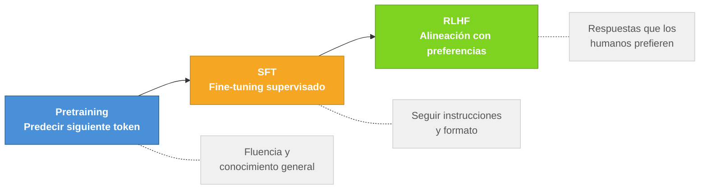
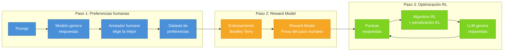
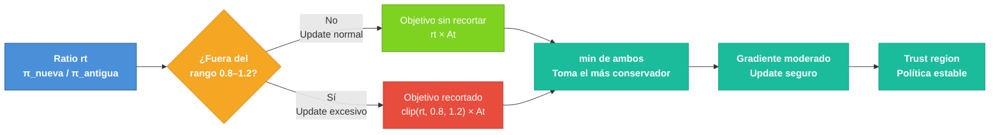
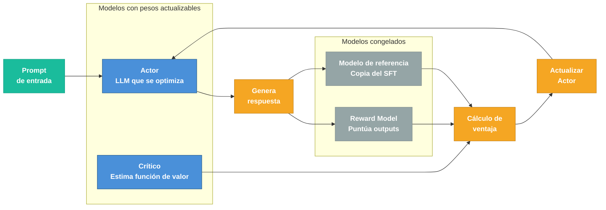
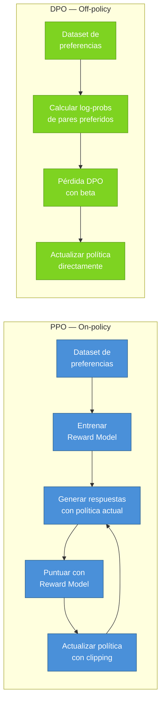

# Capítulo 5 — RLHF: Cómo Enseñarle a un LLM Qué es lo que los Humanos Prefieren

> Basado en "The RLHF Landscape - Aligning LLMs Beyond SFT" — The Neural Maze, Lección 5/8.

Imagina que entrenas a un modelo durante semanas. Los benchmarks son buenos. La pérdida bajó según lo previsto. Le haces una pregunta de química orgánica y contesta correctamente con terminología impecable. Luego le preguntas cómo explicarle eso mismo a un adolescente, y la respuesta es un muro de texto técnico que cualquier persona normal abandonaría a mitad de la segunda frase.

O peor: le preguntas si deberías mezclar lejía con amoniaco para limpiar mejor, y te da instrucciones detalladas. Técnicamente correcto. Totalmente inaceptable.

El problema no es que el modelo no sepa. El problema es que no entiende qué tipo de saber importa en cada contexto, ni qué comportamientos son deseables para los humanos. Eso es el problema de alineación, y es exactamente donde el fine-tuning supervisado deja de ser suficiente. Este capítulo explica la familia de técnicas que lo abordan: RLHF, o Reinforcement Learning from Human Feedback — aprendizaje por refuerzo a partir de feedback humano.

---

## El techo del aprendizaje supervisado

Para entender por qué necesitamos algo más allá del **fine-tuning supervisado** (SFT, Supervised Fine-Tuning), vale la pena desmenuzar exactamente qué puede y qué no puede aprender un modelo con SFT.

En el entrenamiento supervisado, el modelo aprende imitando. Le muestras un prompt y una respuesta ejemplar, y el objetivo es que el modelo aprenda a producir respuestas similares a las del ejemplo. El mecanismo matemático que hace esto posible es el gradiente: calculamos cuánto se equivoca el modelo con respecto a la respuesta correcta, y ajustamos los parámetros en la dirección que minimiza ese error.

La clave está en esa palabra: "equivoca". Para que el gradiente exista, necesitamos una función de pérdida diferenciable — una función matemática suave que relacione la salida del modelo con la respuesta correcta. En SFT esa función es la entropía cruzada: mide cuánta probabilidad asigna el modelo a los tokens correctos.

Pero ahora considera un escenario diferente. Un evaluador humano compara la respuesta A y la respuesta B del modelo, y dice simplemente: "Prefiero A". No hay una fórmula matemática que conecte ese juicio subjetivo con los parámetros del modelo. El evaluador humano es, desde la perspectiva del modelo, una caja negra: entra una respuesta, sale una preferencia, pero no hay ninguna función suave ni diferenciable en medio.

Aquí está el muro. SFT puede enseñarle al modelo a imitar ejemplos buenos. Pero no puede enseñarle a optimizar para preferencias humanas que no se pueden expresar como una función de pérdida diferenciable.

La solución viene de un campo completamente distinto: el aprendizaje por refuerzo.

---

## Una introducción honesta al aprendizaje por refuerzo

El aprendizaje por refuerzo (RL, Reinforcement Learning) tiene fama de ser difícil. En parte es merecida — puede ser notoriamente inestable — pero la intuición central es sorprendentemente simple. Y la mejor manera de entenderla es con una analogía que probablemente ya conoces.

Imagina que estás enseñándole a un perro a sentarse. Dices "¡Siéntate!" y esperas. Si el perro se sienta, le das un premio. Si no, no pasa nada y lo intentas de nuevo. Después de muchas repeticiones, el perro aprende que la acción de sentarse al escuchar esa orden le genera un resultado positivo. No le explicaste la anatomía del movimiento. No le mostraste videos de perros sentándose. Solo conectaste una acción con una consecuencia.

El aprendizaje por refuerzo funciona exactamente así, pero con un agente computacional en lugar del perro. Hay cinco componentes fundamentales que definen cualquier sistema de RL:

**Agente.** El aprendiz que toma decisiones. En nuestro caso, el propio modelo de lenguaje.

**Entorno.** El mundo con el que interactúa el agente. El entorno observa las acciones del agente y devuelve feedback. En videojuegos, el entorno es el juego en sí. Para LLMs, el entorno es más abstracto — lo exploraremos en un momento.

**Acción.** Lo que el agente puede hacer en cada paso. Un jugador de ajedrez mueve una pieza. Un robot mueve un brazo. Un modelo de lenguaje... elige el siguiente token.

**Recompensa.** Una señal escalar — un número — que le dice al agente qué tan bien lo hizo. Las recompensas positivas refuerzan las acciones buenas; las negativas las desincentivan. Esta señal de recompensa es lo que hace que el RL sea fundamentalmente diferente del aprendizaje supervisado: no necesitas decirle al agente qué hacer exactamente, solo evaluarle qué tan bien lo hizo.

**Política.** La estrategia que usa el agente para elegir acciones dado el estado actual del entorno. Es la función que queremos optimizar. Al principio puede ser aleatoria o muy básica. A través del entrenamiento, la política aprende a escoger las acciones que maximizan la recompensa acumulada.

El bucle de entrenamiento en RL tiene esta forma: el agente observa su estado actual, elige una acción siguiendo su política actual, recibe una recompensa del entorno, y actualiza su política para favorecer las acciones que trajeron mejores recompensas. Luego repite. Muchas veces.

La diferencia crucial con SFT es que no hay un dataset fijo de "respuestas correctas". El agente genera su propia experiencia a través de la exploración, y la calidad de esa experiencia depende de la política actual. Esto crea un bucle de retroalimentación que puede ser extraordinariamente potente, pero también inestable si no se maneja con cuidado — un tema al que volveremos repetidamente en este capítulo.

```mermaid
flowchart LR
    S["Estado actual\nPrompt + tokens generados"] --> P["Política\nModelo de lenguaje"]
    P --> A["Acción\nElegir siguiente token"]
    A --> E["Entorno\nEvaluación del output"]
    E --> R["Recompensa\nPuntuación de calidad"]
    R --> U["Actualizar política\nReforzar buenas acciones"]
    U --> S

    classDef estado fill:#4A90D9,stroke:#2C5F8A,color:#FFFFFF,font-weight:bold
    classDef agente fill:#9B59B6,stroke:#7D3C98,color:#FFFFFF,font-weight:bold
    classDef accion fill:#F5A623,stroke:#C4841C,color:#FFFFFF,font-weight:bold
    classDef entorno fill:#E74C3C,stroke:#C0392B,color:#FFFFFF,font-weight:bold
    classDef recompensa fill:#7ED321,stroke:#5A9A18,color:#FFFFFF,font-weight:bold
    classDef update fill:#1ABC9C,stroke:#16A085,color:#FFFFFF,font-weight:bold

    class S estado
    class P agente
    class A accion
    class E entorno
    class R recompensa
    class U update
```

> **Descripción visual:** Diagrama de flujo circular horizontal con seis bloques de colores distintos conectados en ciclo. "Estado actual" en azul, "Política" en púrpura, "Acción" en naranja, "Entorno" en rojo, "Recompensa" en verde, "Actualizar política" en verde azulado. Las flechas forman un ciclo continuo que enfatiza la naturaleza iterativa del aprendizaje por refuerzo. Cada bloque tiene dos líneas de texto: el nombre del componente en negrita y una descripción en cursiva debajo. Fondo blanco, estilo minimalista.

### Por qué el RL puede aprender lo que SFT no puede

Volvamos al problema del gradiente. Cuando el evaluador humano dice "prefiero A", no tenemos una función diferenciable. Pero el RL tiene una solución elegante: los **métodos de gradiente de política** (policy gradient methods) no necesitan diferenciar a través del proceso que genera la recompensa. En cambio, usan la recompensa como un peso para ajustar los gradientes de la política misma.

El mecanismo conceptual es simple: las acciones que llevaron a recompensas altas se vuelven más probables en el futuro; las que llevaron a recompensas bajas, menos probables. No necesitamos saber cómo el evaluador llegó a su juicio. Solo necesitamos ese juicio — el número de recompensa — para ajustar la política en la dirección correcta.

Esto nos permite entrenar modelos con señales de feedback completamente arbitrarias, incluyendo preferencias humanas subjetivas. Esa es la apertura que RLHF explota.

---

## RLHF en el contexto del pipeline completo de LLMs

Antes de profundizar en los algoritmos específicos, necesitamos situar RLHF en el contexto del pipeline completo de entrenamiento de un LLM moderno. Porque RLHF no sustituye a las etapas anteriores — las complementa.

**Etapa 1: Preentrenamiento.** El modelo se entrena en cantidades masivas de texto con un objetivo autosupervisado: predecir el siguiente token. Esta etapa le da al modelo fluidez en el lenguaje, conocimiento del mundo, y capacidades de razonamiento básicas. El resultado es algo así como un motor de autocompletado extremadamente sofisticado. Puede generar texto coherente y factualmente correcto, pero no tiene ningún concepto de ser útil. No sabe qué comportamientos son deseables y cuáles no.

**Etapa 2: Fine-tuning supervisado (SFT).** El modelo preentrenado se ajusta sobre demostraciones curadas de comportamiento de asistente deseable. Esto le enseña a seguir instrucciones, producir estructuras específicas de respuesta, y adoptar un estilo útil. Es efectivo, pero limitado: solo puede enseñar mediante ejemplos. No puede optimizar para preferencias subjetivas que son difíciles de codificar en un dataset.

**Etapa 3: RLHF.** Aquí pasamos de "mostrarle al modelo qué decir" a "enseñarle qué es lo que los humanos prefieren". En lugar de proporcionar respuestas ideales, proporcionamos juicios comparativos. El modelo aprende a optimizar directamente para esas preferencias.

Esta tercera etapa es lo que transforma un generador de texto competente en un asistente alineado — un modelo que no solo sabe cómo hablar, sino que entiende qué tipo de respuestas los humanos realmente valoran.

> **Descripción visual:** Diagrama de flujo horizontal con tres bloques principales conectados por flechas de izquierda a derecha. El bloque "Pretraining" es azul intenso, "SFT" es naranja, "RLHF" es verde. De cada bloque cuelga una nota gris con fondo claro que describe lo que aporta esa etapa. Las flechas punteadas conectan cada etapa con su nota descriptiva. Estilo limpio, fondo blanco, tipografía sans-serif. La progresión visual de azul a naranja a verde refuerza la idea de etapas sucesivas hacia la alineación.

### Cómo el RL se mapea sobre la generación de texto

Hay una simetría elegante entre el framework de RL y la generación de texto en LLMs que vale la pena hacer explícita:

- **Política** → El modelo de lenguaje. Sus parámetros definen una distribución de probabilidad sobre el vocabulario de tokens dado un contexto. Esto es exactamente lo que es una política en RL: una función que mapea estados a distribuciones sobre acciones.

- **Estado** → La secuencia de texto actual: el prompt más los tokens generados hasta el momento. Cada vez que el modelo genera un token, el estado se actualiza.

- **Acción** → Elegir el siguiente token. Con vocabularios típicos de 32.000 a 128.000 tokens, el espacio de acciones es enorme.

- **Recompensa** → Una puntuación de calidad para la respuesta completa generada. Crucialmente, esta recompensa llega solo al final del episodio — después de que el modelo ha generado el último token de su respuesta.

- **Episodio** → Una generación completa: desde el primer token de la respuesta hasta el token de fin de secuencia.

Este mapeo tiene una implicación importante: a diferencia del ajedrez, donde el agente recibe feedback después de cada movimiento, en la generación de texto el modelo produce potencialmente cientos de tokens antes de recibir cualquier señal de recompensa. Esto hace que el problema del crédito — ¿qué tokens específicamente causaron que la respuesta fuera buena o mala? — sea particularmente difícil.

---

## El proceso RLHF paso a paso

Ahora que tenemos el framework claro, veamos cómo funciona RLHF en la práctica. El proceso tiene tres pasos que se ejecutan en secuencia.

### Paso 1: Recolectar preferencias humanas

Para un conjunto de prompts, el modelo SFT genera múltiples respuestas candidatas. Anotadores humanos las comparan en pares: "¿Es la respuesta A o la respuesta B mejor?"

Por ejemplo: el prompt es "Explica cómo funciona la fotosíntesis a un niño de 10 años". El modelo genera cuatro respuestas diferentes. Los anotadores comparan A vs B, A vs C, B vs D, y así sucesivamente, marcando cuál prefieren en cada par.

El resultado es un dataset de preferencias: pares (respuesta_ganadora, respuesta_perdedora) para cada prompt. Este dataset captura el juicio humano de forma escalable — una vez recogido, lo podemos usar muchas veces sin necesitar un humano para cada evaluación futura.

La calidad de este dataset es crítica. Si los anotadores tienen criterios inconsistentes — unos valoran la concisión, otros la exhaustividad, sin directrices claras — el ruido en los datos se propagará a todo lo que viene después. Volvemos a este punto más adelante.

### Paso 2: Entrenar un modelo de recompensa

Con el dataset de preferencias en mano, entrenamos un modelo separado — el reward model o modelo de recompensa — para predecir qué respuestas los humanos prefieren. Este modelo toma como entrada un prompt y una respuesta, y produce como salida un número escalar: una puntuación de calidad.

El modelo de recompensa aprende a asignar puntuaciones más altas a las respuestas que los humanos marcaron como preferidas, y puntuaciones más bajas a las rechazadas. Una vez entrenado, se convierte en un proxy escalable del juicio humano: puede evaluar miles de respuestas por segundo sin necesitar un humano para cada una.

La arquitectura típica parte del mismo modelo base (o uno similar), añade una cabeza de regresión lineal sobre el último token, y se entrena con una pérdida de ranking que maximiza la diferencia de puntuación entre la respuesta ganadora y la perdedora para cada par.

Una advertencia importante: el modelo de recompensa no es infalible. Solo ha visto el dataset de preferencias, que es finito y recogido bajo condiciones específicas. Si el modelo de lenguaje que estamos entrenando aprende a explotar los puntos ciegos del modelo de recompensa — produciendo respuestas que puntúan alto pero no son genuinamente buenas — el entrenamiento se descarrila. Por eso necesitamos el siguiente mecanismo.

### Paso 3: Optimizar la política con RL

Con el modelo de recompensa listo, comenzamos el entrenamiento de RL. El flujo es el siguiente:

1. El modelo de lenguaje (la política) recibe un prompt del dataset de entrenamiento.
2. Genera una respuesta completa de forma autorregresiva, token a token.
3. El modelo de recompensa puntúa esa respuesta.
4. Un algoritmo de RL usa esa puntuación para actualizar los parámetros de la política, haciéndola más probable de generar respuestas similares si la puntuación fue alta, y menos probable si fue baja.
5. Repetir.

El detalle crítico: en cada paso de entrenamiento, hay una penalización por divergencia KL — una medida de cuánto se ha alejado la política actual del modelo SFT original.

> **Descripción visual:** Diagrama de flujo horizontal dividido en tres subgrafos con fondo de colores suaves. El subgrafo izquierdo (azul claro) representa la recolección de preferencias humanas, con cuatro bloques conectados en secuencia. El subgrafo central (naranja claro) muestra el entrenamiento del Reward Model con dos bloques. El subgrafo derecho (verde claro) muestra el bucle de optimización RL con cuatro bloques en ciclo. Las conexiones entre subgrafos son flechas horizontales gruesas. Estilo profesional con texto blanco sobre bloques de colores sólidos.

Sin esta penalización, el modelo aprende rápidamente a "hackear" el modelo de recompensa: descubre que ciertas frases o estructuras obtienen puntuaciones altas independientemente de si la respuesta es genuinamente útil, y las repite hasta producir outputs degenerados. Con la penalización KL, el modelo tiene un incentivo para quedarse cerca de su baseline SFT, lo que limita este tipo de exploits.

La divergencia KL (Kullback-Leibler divergence) es una medida estadística de cuán diferente es una distribución de probabilidad de otra. En este contexto, mide cuánto ha cambiado la distribución de tokens que genera el modelo respecto al modelo SFT de referencia. Si la KL divergencia es alta, el modelo se ha alejado mucho de su baseline — señal de que está explotando el modelo de recompensa en lugar de mejorar genuinamente. Profundizamos en esto al final del capítulo.

---

## PPO: El algoritmo que entrenó a los primeros asistentes

PPO, o Proximal Policy Optimization (Optimización de Política Proximal), es el algoritmo de RL que impulsó InstructGPT — el trabajo que popularizó RLHF para LLMs y que fue el precursor directo de ChatGPT. Si hay un algoritmo que debes entender en este espacio, es este.

### El problema que PPO viene a resolver: REINFORCE y la varianza

Para entender PPO, necesitamos empezar un paso antes, con REINFORCE — el algoritmo de gradiente de política más simple que existe y el ancestro conceptual de PPO.

La idea de REINFORCE es directa: ejecuta la política actual durante un episodio completo, observa la recompensa total que obtuvo, y ajusta los parámetros para que las acciones que llevaron a esa recompensa sean más o menos probables en el futuro. El gradiente que guía esta actualización es:

$$\nabla_\theta J(\theta) = \mathbb{E}_{\tau \sim \pi_\theta} \left[ \sum_{t=0}^{T} \nabla_\theta \log \pi_\theta(a_t | s_t) \cdot R(\tau) \right]$$

Donde:
- $\theta$ son los parámetros de la política (los pesos del modelo de lenguaje).
- $\pi_\theta(a_t | s_t)$ es la probabilidad que la política actual asigna a la acción $a_t$ — en nuestro caso, la probabilidad de generar el token $a_t$ dado el contexto $s_t$.
- $R(\tau)$ es la recompensa total del episodio completo $\tau$ — la puntuación del modelo de recompensa para la respuesta entera.
- $\nabla_\theta \log \pi_\theta(a_t | s_t)$ es el gradiente del log-probability de la acción: la dirección en el espacio de parámetros que aumenta la probabilidad de esa acción.

En lenguaje llano: para cada token que el modelo generó en esa respuesta, calcula cuánto cambiarían los parámetros para hacer ese token más probable, y escala ese cambio por la recompensa total de la respuesta. Si la respuesta fue buena (recompensa alta), todos los tokens de esa respuesta se vuelven más probables. Si fue mala, menos probables.

El problema es severo: la recompensa $R(\tau)$ es una señal muy ruidosa. Imagina que el modelo generó una respuesta de 200 tokens y obtuvo una recompensa de 0.7 (en una escala de 0 a 1). El algoritmo sube la probabilidad de todos y cada uno de esos 200 tokens — pero ¿cuáles específicamente contribuyeron a la buena puntuación? Quizás los primeros 100 tokens fueron brillantes y los últimos 100 mediocres. REINFORCE no puede distinguirlo: trata toda la respuesta como igualmente responsable del resultado.

Este problema se llama alta varianza en el estimador del gradiente. Formalmente, la varianza es el grado en que las estimaciones del gradiente difieren de un batch de entrenamiento a otro. Cuando la varianza es alta, los pasos de gradiente apuntan en direcciones inconsistentes de una iteración a la siguiente, y el entrenamiento se vuelve errático e inestable.

Para un LLM generando respuestas de cientos de tokens, esta varianza puede ser catastrófica. Necesitamos algo más sofisticado.

### La función de ventaja: midiendo la calidad relativa

PPO introduce una mejora conceptual crucial: en lugar de ponderar cada acción por la recompensa total del episodio, la pondera por la **ventaja** — cuánto mejor fue esa acción específica comparada con lo que el modelo esperaba en ese punto.

La ventaja se define formalmente como:

$$A(s_t, a_t) = Q(s_t, a_t) - V(s_t)$$

Donde:
- $Q(s_t, a_t)$ es el valor Q — el retorno esperado de tomar la acción $a_t$ en el estado $s_t$ y continuar siguiendo la política. En términos de LLMs: "si genero este token aquí, ¿qué puntuación total espero obtener?".
- $V(s_t)$ es la función de valor — el retorno esperado desde el estado $s_t$ independientemente de qué acción se tome. Es la "línea de base" del modelo: "en este contexto, ¿qué puntuación espero obtener en promedio?".
- $A(s_t, a_t)$ es la ventaja: si es positiva, esta acción es mejor de lo esperado; si es negativa, es peor.

Pongamos un ejemplo concreto para que esto sea tangible. El modelo está generando una explicación de la fotosíntesis y ha llegado al punto donde necesita decidir el siguiente token. La línea de base del modelo para ese estado (función de valor) es 0.6 — en promedio, desde este punto, espera una puntuación de 0.6. Si genera la palabra "luz" como siguiente token y eventualmente obtiene una puntuación de 0.8, la ventaja de ese token es $0.8 - 0.6 = +0.2$: fue mejor de lo esperado. Si genera "complicado" y la puntuación final es 0.4, la ventaja es $0.4 - 0.6 = -0.2$: peor de lo esperado.

Usar la ventaja en lugar de la recompensa bruta reduce la varianza dramáticamente porque estamos midiendo calidad relativa, no absoluta. Dos respuestas que obtienen puntuaciones de 0.8 y 0.6 respectivamente pueden tener la misma estructura de ventajas internas si las expectativas del modelo eran distintas en cada caso.

En la práctica, la ventaja se estima usando una técnica llamada Estimación de Ventaja Generalizada (GAE, Generalized Advantage Estimation), que combina estimaciones de ventaja a corto plazo y largo plazo para balancear sesgo y varianza. No entraremos en los detalles matemáticos de GAE aquí, pero el concepto clave es que nos da una estimación más estable de qué tan buena fue cada acción individual dentro de un episodio.

Para calcular la función de valor $V(s_t)$, PPO mantiene una red separada llamada **el crítico** (critic). El crítico toma el estado actual como entrada y predice el retorno esperado. Es básicamente un modelo que aprende a evaluar "qué tan buena es la situación en este punto de la generación". Volveremos al crítico cuando hablemos del setup de cuatro modelos de PPO.

### El objetivo surrogate recortado: el seguro de velocidad de PPO

La ventaja resuelve el problema de la varianza. Pero PPO introduce una segunda innovación igualmente importante: el **objetivo surrogate recortado** (clipped surrogate objective). Este es el mecanismo que hace que PPO sea "proximal" — que mantenga las actualizaciones dentro de una región segura.

Para entender por qué es necesario, considera este escenario: el modelo ve un batch de ejemplos donde generar una cierta frase produce una ventaja positiva muy alta. Sin ningún límite, el gradiente podría actualizar los pesos agresivamente para hacer esa frase mucho más probable — quizás triplicando o cuadruplicando su probabilidad en una sola iteración. Pero el modelo de recompensa solo vio esa frase en el contexto de los ejemplos de entrenamiento actuales. Si el modelo la hace muchísimo más probable de forma generalizada, probablemente empiece a usarla en contextos donde no es apropiada, destruyendo el comportamiento aprendido previamente.

PPO limita cuánto puede cambiar la política en un solo paso de entrenamiento. Lo hace a través del **ratio de probabilidad** entre la política nueva (después del update) y la política antigua (antes del update):

$$r_t(\theta) = \frac{\pi_\theta(a_t | s_t)}{\pi_{\theta_{\text{old}}}(a_t | s_t)}$$

Este ratio mide cuánto ha cambiado la probabilidad de una acción específica. Si $r_t = 1$, la probabilidad no cambió. Si $r_t = 2$, se duplicó. Si $r_t = 0.5$, se redujo a la mitad.

El objetivo PPO es:

$$L^{CLIP}(\theta) = \mathbb{E}_t \left[ \min\left( r_t(\theta) \cdot A_t, \; \text{clip}(r_t(\theta), 1-\varepsilon, 1+\varepsilon) \cdot A_t \right) \right]$$

Donde:
- $A_t$ es la ventaja estimada en el paso $t$.
- $\varepsilon$ (epsilon) es el parámetro de recorte, típicamente $\varepsilon = 0.2$.
- $\text{clip}(r_t, 1-\varepsilon, 1+\varepsilon)$ recorta el ratio para que nunca sea menor que $0.8$ ni mayor que $1.2$.
- $\min(\cdot, \cdot)$ toma el menor de los dos términos, lo que crea un techo conservador.

Trabajemos esto con números reales para que la mecánica quede clara.

**Escenario 1 — ventaja positiva, update excesivo.** El modelo quería aumentar la probabilidad de un token. Antes del update, $\pi_{\theta_{\text{old}}}(a_t|s_t) = 0.10$. Después de calcular el gradiente, $\pi_\theta(a_t|s_t) = 0.25$. El ratio es $r_t = 0.25 / 0.10 = 2.5$. La ventaja es $A_t = +0.8$.

Sin recorte, el término sería $2.5 \times 0.8 = 2.0$.

Con recorte, el ratio se limita a $1.2$ (ya que $\varepsilon = 0.2$), dando $1.2 \times 0.8 = 0.96$.

El objetivo toma el mínimo de $2.0$ y $0.96$, que es $0.96$. El gradiente se calcula sobre este valor recortado, no sobre el valor sin recortar. El resultado: el update se produce, pero de forma mucho más moderada.

**Escenario 2 — ventaja negativa, update excesivo en la otra dirección.** El modelo quería reducir la probabilidad de un token malo. Antes: $0.30$. Después: $0.05$. Ratio: $r_t = 0.05 / 0.30 = 0.167$. Ventaja: $A_t = -0.6$.

Sin recorte: $0.167 \times (-0.6) = -0.1$.

Con recorte: el ratio se limita a $0.8$ (el límite inferior), dando $0.8 \times (-0.6) = -0.48$.

El objetivo toma el mínimo de $-0.1$ y $-0.48$, que es $-0.48$. Esto también recorta, pero en la dirección contraria.

> **Descripción visual:** Diagrama de flujo horizontal con bifurcación central. El bloque de entrada "Ratio rt" es azul. El rombo de decisión "¿Fuera del rango?" es naranja con dos salidas: la rama inferior verde ("Objetivo sin recortar", update normal) y la rama superior roja ("Objetivo recortado", update excesivo que se frena). Ambas ramas convergen en un bloque verde azulado "min de ambos" que selecciona el más conservador. La salida final "Trust region / Política estable" es verde azulado. Las flechas muestran claramente cómo el clipping evita actualizaciones destructivas. Estilo técnico con colores semáforo (verde=seguro, rojo=peligroso).

El efecto neto es que PPO crea una **trust region** — una región de confianza — alrededor de la política actual. Los updates que llevarían la política fuera de esa región (más allá del factor $1 \pm \varepsilon$) se recortan. El gradiente queda efectivamente a cero para esos updates, lo que significa que la política no puede hacer cambios catastróficos en un solo batch.

¿Qué pasa si eliges $\varepsilon$ demasiado pequeño, como $0.05$? El modelo aprende con extrema lentitud. Cada iteración solo puede mover la política una cantidad ínfima, y necesitas diez veces más pasos para converger. ¿Y si lo pones en $0.5$? Vuelves al problema original: updates tan grandes que el entrenamiento se desestabiliza. El valor de $0.2$ es el consenso empírico — ofrece un buen equilibrio entre velocidad de convergencia y estabilidad, y ha funcionado bien en una gran variedad de experimentos.

### El setup de cuatro modelos: por qué PPO es caro

Aquí llegamos a la parte que hace que los equipos con presupuestos limitados se pongan nerviosos. Un entrenamiento PPO completo para RLHF requiere cuatro modelos simultáneos en memoria:

**Actor (la política).** El modelo de lenguaje que estamos optimizando. Este es el que actualiza sus pesos durante el entrenamiento. Para un modelo de 7B parámetros en precisión BFloat16, esto ocupa aproximadamente 14 GB de VRAM.

**Crítico (la red de valor).** Un modelo separado que estima la función de valor $V(s_t)$ — el retorno esperado desde cada estado. Típicamente tiene la misma arquitectura que el actor, aunque a veces se usa una versión más pequeña. En la práctica, muchos frameworks inicializan el crítico desde el mismo checkpoint que el actor y lo entrenan en paralelo. Otro bloque de ~14 GB.

**Modelo de recompensa.** El modelo entrenado en el paso 2 sobre las preferencias humanas. Permanece congelado durante el entrenamiento RL — sus pesos no se actualizan. Su único rol es puntuar las respuestas del actor. Otros ~14 GB (asumiendo mismo tamaño).

**Modelo de referencia.** Una copia congelada del modelo SFT. Se usa exclusivamente para calcular la penalización por divergencia KL: en cada paso, calculamos la KL entre la distribución del actor actual y la del modelo de referencia, y añadimos esa penalización al objetivo para evitar que el actor derive demasiado. Otros ~14 GB.

Total para un modelo de 7B: aproximadamente 56 GB de VRAM solo para los pesos. A eso hay que añadir los gradientes, los estados del optimizador, las activaciones durante el forward pass, los tokens generados... En la práctica, para un modelo de 7B necesitas uno o varios nodos A100 de 80 GB.

Para un modelo de 70B, la matemática escala brutalmente: cuatro modelos de ~140 GB cada uno. Necesitas un clúster de varias GPUs solo para tener los pesos en memoria, más toda la infraestructura de generación autorregresiva en cada paso de entrenamiento.

> **Descripción visual:** Diagrama de flujo con dos subgrafos diferenciados. El subgrafo izquierdo azul ("Modelos actualizables") contiene el Actor y el Crítico en azul intenso. El subgrafo derecho gris ("Modelos congelados") contiene el Reward Model y el Modelo de referencia en gris. El flujo parte del Prompt en verde azulado, pasa por el Actor que genera una respuesta, y esa respuesta es evaluada por los tres modelos de soporte. Las evaluaciones convergen en el cálculo de ventaja (naranja) que actualiza el Actor. Las flechas muestran el ciclo de entrenamiento on-policy. Leyenda visual: azul = activo, gris = congelado.

Esto no significa que PPO sea impracticable. Funciona, y funciona bien. Pero el costo de infraestructura es significativo, y es la razón principal por la que DPO — que presentamos a continuación — ha ganado tanto terreno.

### Cuándo usar PPO

PPO brilla cuando necesitas máxima calidad de alineación y tienes el compute para soportarlo. Su naturaleza on-policy — el hecho de que los datos de entrenamiento siempre reflejan el comportamiento actual del modelo — crea un bucle de retroalimentación ajustado y autocorrector. El modelo explora, recibe feedback, ajusta, explora de nuevo. Con suficientes iteraciones, puede mejorar más allá de lo que cualquier dataset estático de preferencias puede capturar.

Si estás entrenando un modelo frontier donde la calidad de alineación es la prioridad absoluta, PPO es la elección probada. Si estás trabajando con un presupuesto de compute limitado o necesitas iteraciones rápidas, sigue leyendo.

---

## DPO: Alineación sin el bucle de RL

DPO (Direct Preference Optimization — Optimización Directa de Preferencias) llegó en 2023 con una pregunta provocadora: ¿y si pudiéramos obtener la alineación de RLHF sin necesitar RL en absoluto?

La respuesta resultó ser sí. Y cambió la conversación práctica en el campo.

### La intuición matemática detrás de DPO

Recuerda el objetivo que PPO está optimizando: maximizar la recompensa esperada (según el modelo de recompensa) mientras se mantiene cerca del modelo SFT de referencia (a través de la penalización KL). Formalmente:

$$\max_{\pi} \mathbb{E}_{x \sim \mathcal{D}, y \sim \pi} \left[ r(x, y) \right] - \beta \cdot \mathbb{KL}\left[ \pi(y|x) \, \| \, \pi_{\text{ref}}(y|x) \right]$$

Donde $r(x, y)$ es la puntuación del modelo de recompensa para la respuesta $y$ al prompt $x$, y $\beta$ es un coeficiente que controla cuánto peso damos a la penalización KL.

Los autores de DPO se preguntaron: ¿podemos resolver este problema analíticamente? Es decir, ¿podemos encontrar la política óptima $\pi^*$ en forma cerrada, sin necesitar un proceso iterativo de RL?

La respuesta es sí. La política óptima tiene la forma:

$$\pi^*(y|x) = \frac{1}{Z(x)} \cdot \pi_{\text{ref}}(y|x) \cdot \exp\left(\frac{r(x,y)}{\beta}\right)$$

Donde $Z(x)$ es una constante de normalización.

Lo que esto dice: la política óptima es la política de referencia, reescalada por la exponencial de la recompensa dividida por $\beta$. Las respuestas con alta recompensa reciben más peso; las de baja recompensa, menos. El coeficiente $\beta$ controla cuánto se amplifica esa diferencia.

Hasta aquí parece un resultado teórico interesante pero no directamente útil, porque aún necesitamos el modelo de recompensa $r(x,y)$ para evaluar esa fórmula. Pero los autores fueron un paso más lejos: invirtieron la relación. Si sabemos cómo es la política óptima, podemos expresar la función de recompensa en términos de la política:

$$r(x,y) = \beta \cdot \log \frac{\pi^*(y|x)}{\pi_{\text{ref}}(y|x)} + \beta \cdot \log Z(x)$$

Y dado que los humanos usan las recompensas para expresar preferencias, podemos sustituir este modelo de recompensa implícito directamente en el objetivo de preferencias. El resultado es la función de pérdida DPO:

$$L_{DPO}(\pi_\theta; \pi_{\text{ref}}) = -\mathbb{E}_{(x, y_w, y_l) \sim \mathcal{D}} \left[ \log \sigma \left( \beta \cdot \log \frac{\pi_\theta(y_w|x)}{\pi_{\text{ref}}(y_w|x)} - \beta \cdot \log \frac{\pi_\theta(y_l|x)}{\pi_{\text{ref}}(y_l|x)} \right) \right]$$

Donde:
- $x$ es el prompt.
- $y_w$ es la respuesta ganadora (preferred response) — la que el humano prefirió.
- $y_l$ es la respuesta perdedora (rejected response) — la que el humano rechazó.
- $\pi_\theta$ es la política que estamos entrenando (el modelo cuyo pesos actualizamos).
- $\pi_{\text{ref}}$ es la política de referencia congelada (el modelo SFT original, cuyos pesos no cambian).
- $\beta$ es un coeficiente (típicamente entre 0.1 y 0.5) que controla cuánto puede desviarse la política entrenada de la referencia. Un $\beta$ alto mantiene el modelo cerca del baseline; un $\beta$ bajo le da más libertad.
- $\sigma$ es la función sigmoide, que mapea cualquier número real a un valor entre 0 y 1.

### Desglose de la pérdida DPO con números concretos

Para que esta fórmula no sea solo símbolos, trabajémosla con un ejemplo. Tienes el prompt "Explica qué es una neurona". La respuesta ganadora $y_w$ es "Una neurona es la célula básica del sistema nervioso. Recibe señales de otras neuronas y, si son suficientemente fuertes, genera un impulso eléctrico que transmite a sus vecinas." La respuesta perdedora $y_l$ es "Las neuronas son unidades computacionales biológicas que procesan señales a través de mecanismos electroquímicos transmembrana."

Supón que el modelo de referencia $\pi_{\text{ref}}$ asigna log-probabilidades de $-15$ a $y_w$ y $-18$ a $y_l$ (los modelos base tienden a preferir levemente el lenguaje más técnico). El modelo que estamos entrenando $\pi_\theta$ actualmente asigna $-14$ a $y_w$ y $-19$ a $y_l$.

Los log-ratios (diferencias entre log-probabilidades de modelo entrenado y referencia) son:

$$\log \frac{\pi_\theta(y_w|x)}{\pi_{\text{ref}}(y_w|x)} = -14 - (-15) = +1.0$$

$$\log \frac{\pi_\theta(y_l|x)}{\pi_{\text{ref}}(y_l|x)} = -19 - (-18) = -1.0$$

Con $\beta = 0.3$, el argumento de la sigmoide es:

$$\beta \cdot (1.0 - (-1.0)) = 0.3 \cdot 2.0 = 0.6$$

Y $\sigma(0.6) \approx 0.646$. La pérdida para este ejemplo es $-\log(0.646) \approx 0.437$.

Si el modelo estuviera perfectamente alineado — asignando mucho más log-probability a $y_w$ que a $y_l$ — el argumento de la sigmoide sería grande y positivo, $\sigma$ estaría cerca de 1, y $-\log(\sigma)$ estaría cerca de 0: pérdida mínima. El gradiente empuja al modelo en exactamente esa dirección: aumentar el log-ratio de $y_w$ relativo a la referencia, y disminuir el de $y_l$.

En lenguaje llano: para cada par de preferencias, haz que la respuesta ganadora sea más probable que la referencia, y la perdedora menos probable. Eso es DPO.

### Por qué esto es revolucionario en la práctica

El impacto práctico de esta reformulación es enorme. Compara el setup de PPO con el de DPO:

| Aspecto | PPO | DPO |
|---|---|---|
| Modelos en memoria | 4 (actor, crítico, reward model, referencia) | 2 (política + referencia) |
| Generación durante entrenamiento | Sí, en cada paso | No |
| Velocidad de entrenamiento | Lenta (similar a inferencia repetida) | Rápida (similar a SFT) |
| Infraestructura necesaria | Alta | Media |
| Hiperparámetros críticos | Muchos ($\varepsilon$, coef. KL, tasa de aprendizaje del crítico...) | Pocos (principalmente $\beta$) |
| Tipo de datos necesarios | Prompts (genera durante entrenamiento) | Dataset de preferencias estático |

> **Descripción visual:** Diagrama comparativo lado a lado con dos subgrafos de colores contrastantes. El subgrafo izquierdo azul ("PPO — On-policy") muestra cinco bloques conectados con un ciclo de retroalimentación entre los pasos 3 y 5, enfatizando la naturaleza iterativa. El subgrafo derecho verde ("DPO — Off-policy") muestra cuatro bloques en secuencia lineal sin bucle, comunicando la simplicidad del flujo. Las etiquetas en las cajas son cortas y descriptivas. El contraste azul/verde y la presencia/ausencia del ciclo son el mensaje visual clave. Fondo blanco, tipografía sans-serif, estilo técnico limpio.

DPO no requiere generar texto durante el entrenamiento — simplemente calcula las log-probabilidades de respuestas que ya existen en el dataset. Esto hace que el entrenamiento sea órdenes de magnitud más rápido: se parece más a un fine-tuning supervisado que a un bucle de RL completo.

Para un ingeniero con un par de GPUs A100, DPO es la diferencia entre poder experimentar con alineación de modelos y no poder hacerlo en absoluto.

### Las limitaciones que no debes ignorar

DPO no es un almuerzo gratis. Tiene limitaciones reales que importan en producción.

**Es un método off-policy.** DPO aprende de un dataset de preferencias estático — recolectado en algún punto del pasado, con alguna versión del modelo. Si la distribución del modelo que estás entrenando se desvía significativamente de la distribución con la que se recolectaron las preferencias, la calidad del aprendizaje se degrada. El modelo que generó $y_w$ y $y_l$ puede ser muy diferente al modelo que estás entrenando ahora, y DPO no tiene mecanismo para corregir esto.

Contrasta esto con PPO: al ser on-policy, siempre genera respuestas con la política actual, obtiene feedback sobre esas respuestas, y aprende directamente de esa experiencia. El dataset de entrenamiento se actualiza en cada iteración.

**Overfitting más rápido.** Estudios empíricos han encontrado que DPO tiende a sobreajustarse al dataset de preferencias más rápido que PPO. Cuando el modelo ha memorizado los patrones del dataset, empieza a optimizar para los tokens específicos de las respuestas ganadoras en lugar de generalizar las preferencias humanas subyacentes.

**Techo de calidad inferior.** En benchmarks de alineación difíciles — tareas que requieren que el modelo explore más allá de lo que el dataset de preferencias captura — PPO consistentemente supera a DPO cuando el compute no es un factor limitante. DPO cambia algo de calidad máxima de alineación por una enorme reducción en costo y complejidad.

La elección entre PPO y DPO no es sobre cuál es "mejor" en abstracto. Es sobre qué trade-offs son aceptables dado tu contexto.

---

## El ecosistema más amplio: otros algoritmos que debes conocer

PPO y DPO son los protagonistas, pero el espacio RLHF está activo y nuevas variantes aparecen con frecuencia. Aquí está un tour de los más relevantes:

**REINFORCE / Gradientes de política básicos.** El ancestro de PPO que ya describimos. Simple de implementar y útil para construir intuición. Raramente usado directamente en producción para LLMs debido a su alta varianza, pero reaparece en variantes modernas como GRPO (que cubriremos en el siguiente capítulo).

**IPO (Identity Preference Optimization).** Una variante de DPO con una función de pérdida modificada que es más robusta al overfitting. IPO añade una regularización explícita que penaliza cuando el ratio entre la respuesta ganadora y la perdedora crece demasiado. Si estás usando DPO y ves que el modelo sobreajusta tu dataset de preferencias rápidamente, IPO es el primer lugar donde mirar.

**KTO (Kahneman-Tversky Optimization).** Un enfoque interesante que rompe con el paradigma de comparaciones en pares. En lugar de necesitar pares (buena respuesta, mala respuesta) para el mismo prompt, KTO solo necesita saber si una respuesta individual es "buena" o "mala" — sin necesitar una comparación directa. Esto simplifica enormemente la recolección de datos: cualquier conjunto de respuestas etiquetadas con thumbs up / thumbs down sirve. La contrapartida es que la señal de aprendizaje es más débil, ya que no hay contexto comparativo.

**Rejection Sampling / Best-of-N.** Genera N respuestas candidatas para cada prompt, puntúalas con el modelo de recompensa, y fine-tunea el modelo sobre las mejores. Conceptualmente simple y sorprendentemente efectivo. No requiere RL en absoluto. La desventaja es que escala linealmente con N — generar 10 respuestas por prompt es 10 veces más caro que generar 1. Útil como complemento a PPO o como paso intermedio cuando aún no tienes un pipeline de RL completo.

**RLAIF (RL from AI Feedback).** En lugar de anotadores humanos, usa un LLM más grande como juez para generar las preferencias. Reduce dramáticamente el costo y el tiempo de recolección de datos. El riesgo es que el modelo juez tiene sus propios sesgos, que se propagan al modelo que estás entrenando. En la práctica, RLAIF funciona sorprendentemente bien para muchas tareas, y la combinación de RLHF (para calibrar el juez inicial) + RLAIF (para escalar) es cada vez más común.

---

## La KL divergencia: el guardián silencioso de la alineación

Hemos mencionado la penalización por divergencia KL varias veces. Merece una explicación más profunda porque es posiblemente el mecanismo más subestimado del proceso RLHF.

La divergencia KL entre dos distribuciones de probabilidad $P$ y $Q$ se define como:

$$\mathbb{KL}[P \| Q] = \sum_x P(x) \log \frac{P(x)}{Q(x)}$$

Intuitivamente, mide cuánta información se pierde cuando usamos $Q$ para aproximar $P$. Si $P = Q$, la KL es cero. Mientras más diferentes sean, mayor la KL.

En RLHF, la penalización KL mide cuánto ha cambiado la distribución del modelo de lenguaje respecto al modelo SFT de referencia. En cada paso de entrenamiento, el objetivo incluye:

$$\text{objetivo total} = \mathbb{E}[r(x,y)] - \beta \cdot \mathbb{KL}[\pi_\theta(y|x) \, \| \, \pi_{\text{ref}}(y|x)]$$

El primer término quiere maximizar la recompensa. El segundo término penaliza el alejamiento del modelo de referencia. El coeficiente $\beta$ controla el equilibrio entre estos dos objetivos.

¿Por qué es esto tan importante? Considera lo que pasa sin esta penalización. El modelo de recompensa, aunque fue entrenado cuidadosamente, es imperfecto. Solo vio un subset de posibles respuestas durante su entrenamiento, y hay inevitablemente regiones del espacio de respuestas que no exploró. Un modelo de lenguaje optimizando únicamente por recompensa aprenderá a explotar esas regiones — encontrará patrones de texto que obtienen puntuaciones altas del modelo de recompensa pero que son inútiles o incluso perjudiciales para usuarios reales.

Los ejemplos documentados en la literatura son ilustrativos: modelos que aprenden a generar listas de bullet points vacías que el modelo de recompensa puntúa bien por su apariencia de estructura, o modelos que generan respuestas extremadamente largas porque el modelo de recompensa fue entrenado con sesgo hacia la longitud. Sin la penalización KL, el modelo optimiza el proxy (el modelo de recompensa) en lugar del objetivo real (ser genuinamente útil).

La penalización KL actúa como un ancla. Dice: "puedes mejorar respecto al modelo SFT, pero no puedes alejarte tanto que empieces a generar comportamientos completamente distintos a lo que el modelo base haría". Mantiene al modelo dentro de una región del espacio de comportamientos que fue validada durante el preentrenamiento y el SFT.

El valor de $\beta$ importa enormemente. Un $\beta$ alto (por ejemplo, 1.0) mantiene el modelo muy cerca del baseline — aprende despacio y la mejora de alineación es modesta. Un $\beta$ bajo (por ejemplo, 0.01) le da al modelo mucha más libertad para optimizar la recompensa — puede mejorar rápidamente, pero también puede desestabilizarse y explotar el modelo de recompensa con más facilidad. En DPO, los valores típicos de $\beta$ están entre 0.1 y 0.5. En PPO, el coeficiente KL suele ser aún más pequeño porque hay otros mecanismos de estabilización (el clipping del surrogate objective).

---

## Guía práctica: decisiones que importan en el entrenamiento RLHF

Antes de cerrar el capítulo, vale la pena repasar los aspectos prácticos que cortan transversalmente todos los algoritmos y que nadie te cuenta hasta que cometes los errores.

### La calidad de los datos de preferencia es el factor que más importa

Es fácil quedar hipnotizado por la elegancia de PPO o la eficiencia de DPO y olvidar que ambos son completamente dependientes de la calidad de los datos de preferencia que los alimentan.

Un dataset de preferencias ruidoso produce un modelo de recompensa ruidoso, y un modelo de recompensa ruidoso produce una política mal alineada — independientemente de si usas PPO, DPO, o cualquier otra cosa. El garbage in, garbage out nunca ha sido más verdad que aquí.

Los problemas más comunes en datasets de preferencias:

**Inconsistencia entre anotadores.** Si un anotador valora la concisión y otro valora la exhaustividad, y no hay directrices claras que los alineen, el modelo de recompensa aprenderá señales contradictorias. Invertir en guías de anotación detalladas y en métricas de acuerdo entre anotadores (como el coeficiente kappa de Cohen) vale más que añadir más datos ruidosos.

**Sesgo de posición.** Los anotadores humanos tienen tendencia a preferir la primera respuesta que ven, o la más larga, o la más confiada en tono — independientemente del contenido real. Rotar el orden de las respuestas en las comparaciones y contrabalancear el diseño del experimento mitiga esto.

**Prompts mal seleccionados.** Si todos los prompts de entrenamiento son similares, el modelo aprendió preferencias muy localizadas. La diversidad de prompts — en dominio, dificultad, estilo de pregunta — determina la generalización de la alineación resultante.

### Métricas para vigilar durante el entrenamiento RLHF

Si estás ejecutando PPO, hay señales clave que indican si el entrenamiento va bien o está a punto de descarrilarse:

**Recompensa media.** Debe aumentar gradualmente. Si se estanca, el modelo no está aprendiendo. Si aumenta demasiado rápido, probablemente está explotando el modelo de recompensa.

**Divergencia KL respecto al modelo de referencia.** Debe mantenerse dentro de un rango controlado. Si crece sin control, el modelo está derivando demasiado. Ajusta el coeficiente $\beta$ al alza o revisa el $\varepsilon$ del clipping.

**Ratio de clipping (PPO).** El porcentaje de actualizaciones que fueron recortadas por el mecanismo de clipping. Si es demasiado alto (>30%), el modelo intenta hacer updates muy grandes consistentemente — considera reducir la tasa de aprendizaje. Si es demasiado bajo (<5%), el clipping no está siendo necesario y puedes ser más agresivo.

**Entropía de la política.** La entropía mide cuán diversas son las distribuciones de tokens que genera el modelo. Si la entropía colapsa, el modelo se ha vuelto demasiado determinístico — está generando siempre los mismos tipos de respuestas. Un poco de entropía es deseable para mantener diversidad en las respuestas.

Para DPO, el indicador principal es la **accuracy en el dataset de preferencias**: ¿con qué frecuencia el modelo asigna mayor log-probability a $y_w$ que a $y_l$? Debe crecer durante el entrenamiento y estabilizarse. Si llega al 100% muy rápido, probablemente hay overfitting — considera añadir regularización o usar IPO en su lugar.

### El modelo de recompensa no es el objetivo final

Para los métodos que usan un modelo de recompensa explícito (PPO, rejection sampling), es fundamental recordar que el modelo de recompensa es un proxy — una aproximación imperfecta del objetivo real. Optimizar el modelo de recompensa no es lo mismo que optimizar la alineación real.

Las áreas de investigación activa incluyen ensembles de modelos de recompensa (usar varios modelos de recompensa y promediar sus puntuaciones para reducir la explotación de cualquier modelo individual), modelos de recompensa basados en procesos (que puntúan los pasos intermedios del razonamiento, no solo la respuesta final), y refinamiento iterativo del modelo de recompensa (reentrenarlo periódicamente con preferencias actualizadas sobre las respuestas del modelo actualmente entrenado).

---

## De la teoría al mapa de decisiones

Con todo este contexto, la decisión práctica entre PPO y DPO — y cuándo considerar las alternativas — se simplifica bastante.

Elige PPO cuando:
- Tienes acceso a un clúster de GPUs con suficiente VRAM para los cuatro modelos.
- La calidad de alineación es la métrica crítica y no puedes permitirte sacrificarla.
- Tu tarea requiere que el modelo explore respuestas que no están representadas en ningún dataset de preferencias estático.
- Estás entrenando un modelo frontier que va a servir a millones de usuarios.

Elige DPO cuando:
- Tienes presupuesto de compute limitado o quieres iteraciones rápidas.
- Ya dispones de un dataset de preferencias de buena calidad.
- Estás empezando a experimentar con alineación y necesitas un punto de partida manejable.
- El modelo es relativamente pequeño (7B-13B) y el gap de calidad frente a PPO es aceptable.

Un patrón que muchos equipos adoptan en producción es un enfoque escalonado: primero DPO para una alineación rápida y económica, luego PPO si la evaluación muestra que el modelo no ha alcanzado el nivel de calidad requerido. Esto optimiza tanto el tiempo de iteración como el uso de recursos.

---

## Cierre: la alineación es un pipeline, no un algoritmo

RLHF ha pasado de ser una técnica de investigación de nicho a convertirse en un componente estándar del pipeline de producción de LLMs. Pero el mayor error que puedes cometer al aplicarlo es tratarlo como un paso único con una solución técnica única.

La alineación es un pipeline con múltiples pasos interdependientes: recolección de preferencias humanas cuidadosa, entrenamiento de un modelo de recompensa que generalice bien, y optimización de la política con el algoritmo correcto para tu contexto. La calidad de cada paso determina el techo de calidad del siguiente.

PPO ha demostrado ser la elección probada para máxima calidad de alineación, con su naturaleza on-policy creando un bucle de retroalimentación que se ajusta continuamente al comportamiento actual del modelo. DPO ha hecho la alineación fuerte accesible a un espectro mucho más amplio de practicantes, colapsando la complejidad del RL en un flujo de trabajo supervisado. Y las variantes más recientes — IPO, KTO, RLAIF — continúan expandiendo el toolkit disponible.

En el siguiente capítulo, exploraremos GRPO (Group Relative Policy Optimization), un enfoque más reciente que replantea cómo comparamos y puntuamos las salidas del modelo durante el entrenamiento — y que está ganando terreno rápidamente como alternativa a PPO en escenarios donde el razonamiento estructurado importa.

---

## Tags

#técnica/rlhf #técnica/ppo #técnica/dpo #concepto/reward-model #concepto/kl-divergence #técnica/supervised-fine-tuning #técnica/policy-gradient #nivel/intermedio #tipo/lección #estado/completo
