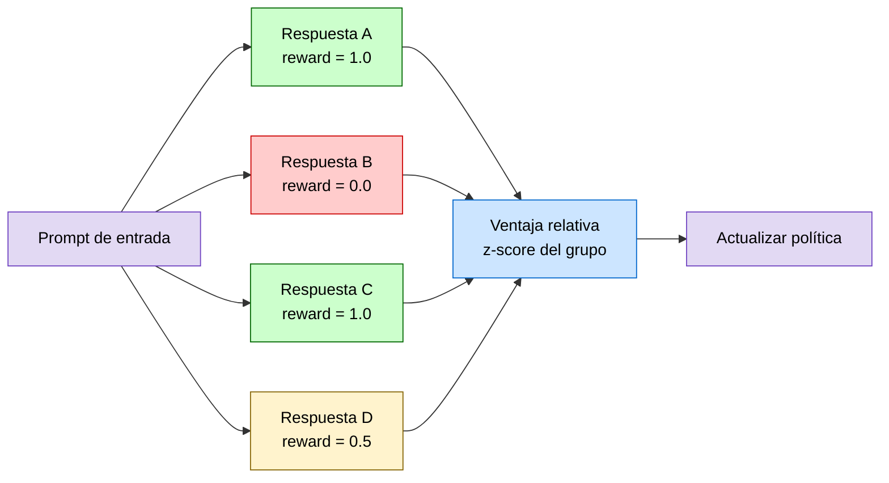
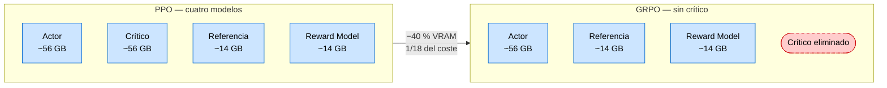
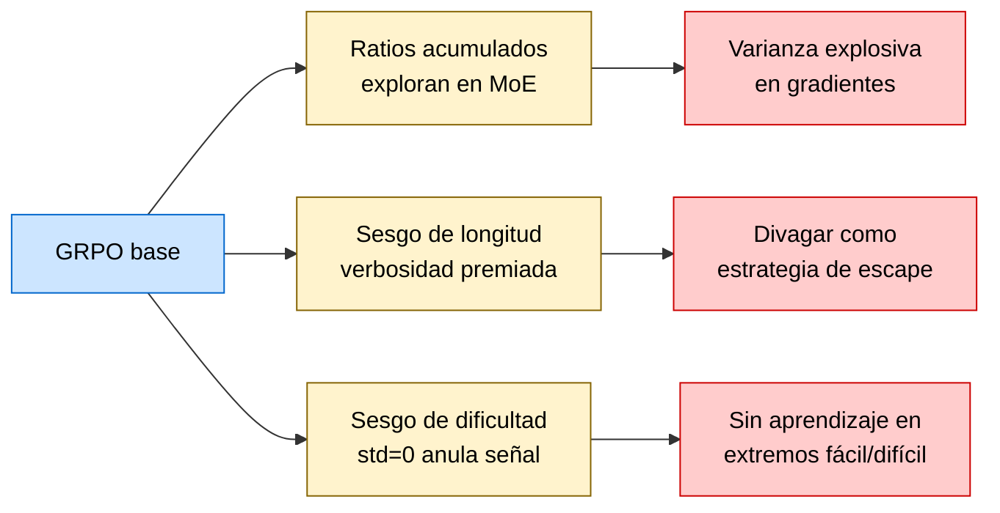
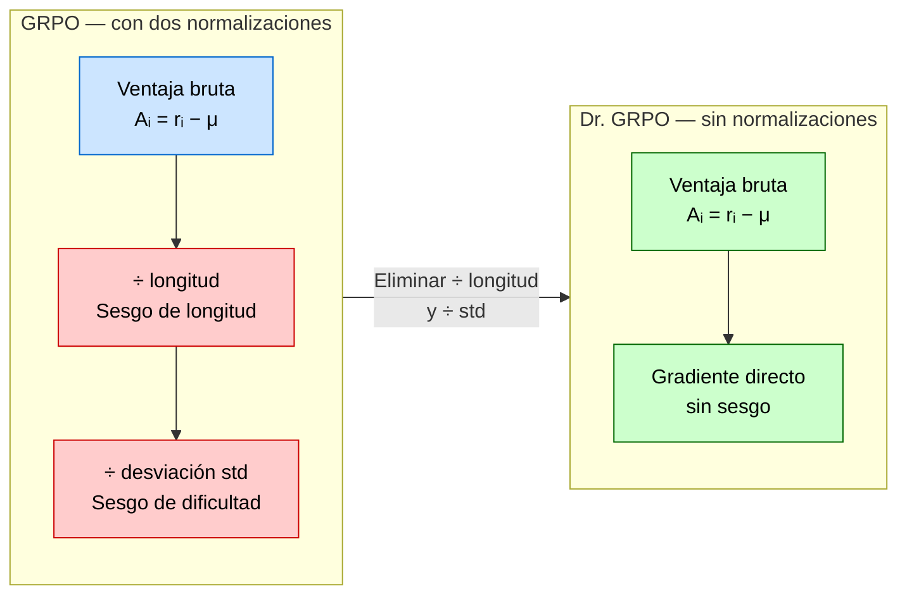
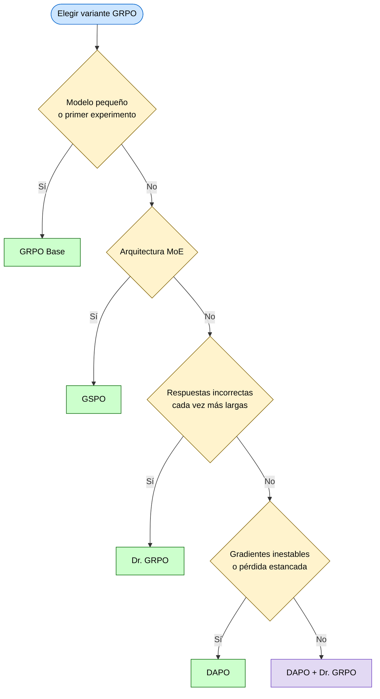

# Capítulo 6 — GRPO: Optimización de Políticas sin Crítico

> Basado en "The RL Algorithm Behind DeepSeek's Reasoning Models", The Neural Maze, Lección 6/8.

Imagina que has decidido entrenar un modelo de razonamiento matemático con reinforcement learning. Tienes la intuición correcta, el dataset correcto y, si has seguido los capítulos anteriores, probablemente PPO en mente como el algoritmo de referencia. Entonces enciendes el experimento, monitoreas el uso de memoria y ves que tus GPUs están al 95% de VRAM... antes de haber procesado un solo batch de entrenamiento. El culpable no es el modelo de lenguaje. Es el modelo de valor, ese segundo modelo neuronal del tamaño del primero que PPO necesita para funcionar. Y aquí es donde la historia de GRPO comienza.

---

## El cuello de botella de PPO

Para entender por qué GRPO existe, primero hay que entender exactamente qué dolor resuelve. **PPO** — Proximal Policy Optimization — es el algoritmo estándar de RL online para alinear LLMs, y en teoría funciona muy bien. En la práctica, entrenar con PPO a escala requiere mantener cuatro modelos simultáneamente en memoria:

1. El **modelo de política activo** (actor): el LLM que estamos optimizando.
2. El **modelo de referencia** (reference model): una copia congelada del modelo base que actúa como ancla para evitar que el modelo se aleje demasiado de su comportamiento original.
3. El ****modelo de recompensa**** (reward model): una red entrenada separadamente para puntuar la calidad de las respuestas.
4. El **modelo de valor** (critic): una red neuronal que estima, para cada estado del proceso de generación, cuánta recompensa futura podemos esperar a partir de ese punto.

El modelo de política necesita gradientes activos, así que ocupa toda su memoria de activaciones durante el forward y backward pass. El modelo de referencia y el modelo de recompensa necesitan al menos sus pesos cargados para hacer inferencia. Pero es el modelo de valor — el crítico — el que realmente rompe el presupuesto: es típicamente una red del mismo orden de magnitud que el modelo de política, y necesita sus propios gradientes para actualizarse en paralelo.

En números concretos: si estás entrenando un modelo de 7B parámetros en bfloat16, eso son aproximadamente 14 GB solo para los pesos. Con gradientes y estados del optimizador (Adam usa dos momentos adicionales por parámetro), el actor necesita en torno a 56 GB. El crítico añade otros 14 GB de pesos más su propio overhead de entrenamiento. El modelo de referencia son otros 14 GB. El reward model, otros 14 GB. Estamos hablando de más de 100 GB de VRAM para un modelo de solo 7B parámetros — y eso asumiendo que lo distribuyes perfectamente entre GPUs A100 de 80 GB cada una.

Pero el problema no es solo de memoria. Hay una fricción arquitectónica más profunda en usar un crítico con LLMs. En RL clásico — piensa en un agente aprendiendo a jugar un videojuego — el agente recibe retroalimentación en cada paso: mueve el personaje a la izquierda, gana 10 puntos; cae en un hoyo, pierde una vida. La función de valor aprende a estimar el retorno futuro porque tiene un flujo denso de señal: miles de transiciones por segundo, cada una con su recompensa inmediata.

El post-entrenamiento de LLMs no funciona así. El modelo genera una cadena de tokens — digamos, 500 tokens de razonamiento matemático — y solo al final recibe una señal binaria: ¿la respuesta final fue correcta o incorrecta? Eso significa que el crítico debe aprender a asignar una estimación de valor a cada uno de esos 500 tokens intermedios, a pesar de que ninguno de ellos tiene una recompensa propia. El token número 237 ("por lo tanto") no tiene inherentemente una recompensa: su "valor" depende de si contribuye a una respuesta correcta 263 tokens más adelante. Entrenar un crítico para hacer esa extrapolación con precisión, a lo largo de secuencias de razonamiento largas y complejas, es tanto difícil como dispendioso.

Frente a este problema, los investigadores de DeepSeek se hicieron una pregunta que parece radical a primera vista: ¿y si eliminamos el crítico por completo?

---

## GRPO: La idea del grupo como línea base

Group Relative Policy Optimization — GRPO, pronunciado "grupo R-P-O" — es el algoritmo que DeepSeek desarrolló para responder exactamente a esa pregunta. El nombre lo resume todo: en lugar de un crítico que estime el valor absoluto de cada estado, GRPO usa un grupo de respuestas generadas para el mismo prompt y las evalúa relativamente entre sí.

Antes de entrar en la mecánica, es útil entender qué es una **ventaja** (advantage) en el contexto de RL para LLMs. La ventaja de una respuesta mide cuánto mejor (o peor) fue esa respuesta comparada con lo que esperábamos. Si el crítico de PPO estima que el valor esperado de un estado es 0.6 y la recompensa real fue 0.9, la ventaja es +0.3: el resultado fue mejor de lo esperado, así que reforzamos ese comportamiento. Si la recompensa fue 0.3, la ventaja es -0.3: fue peor de lo esperado, así que lo inhibimos. La ventaja, en otras palabras, es la señal que le dice al modelo "esto fue buena o mala idea relativo a lo que anticipabas".

GRPO calcula la ventaja sin un crítico. ¿Cómo? En lugar de una sola respuesta por prompt, genera un **grupo** de $G$ respuestas (típicamente entre 4 y 8) usando la política actual. Todas parten del mismo prompt. Cada una se evalúa con el mismo mecanismo de recompensa — un modelo de recompensa entrenado, o una función de verificación directa como "¿es numéricamente correcta la respuesta?". El resultado es un conjunto de puntuaciones $\{r_1, r_2, \ldots, r_G\}$.

La ventaja de la respuesta $i$ se calcula así:

$$\hat{A}_i = \frac{r_i - \mu_G}{\sigma_G}$$

Donde $\mu_G$ es la media de las recompensas del grupo y $\sigma_G$ es su desviación estándar. Esto es, sencillamente, una normalización z-score aplicada a las puntuaciones del grupo.

Vamos a ponerle números concretos. Supón que GRPO genera cuatro respuestas a un problema de matemáticas y les asigna estas recompensas:

| Respuesta | Recompensa $r_i$ |
|-----------|-----------------|
| A         | 1.0 (correcta)  |
| B         | 0.0 (incorrecta)|
| C         | 1.0 (correcta)  |
| D         | 0.5 (parcialmente correcta)|

La media del grupo es $\mu_G = (1.0 + 0.0 + 1.0 + 0.5) / 4 = 0.625$. La desviación estándar, calculando la varianza $(0.375^2 + 0.625^2 + 0.375^2 + 0.125^2)/4 \approx 0.148$, da $\sigma_G \approx 0.385$.

Las ventajas quedan:

- Respuesta A: $(1.0 - 0.625) / 0.385 \approx +0.97$
- Respuesta B: $(0.0 - 0.625) / 0.385 \approx -1.62$
- Respuesta C: $(1.0 - 0.625) / 0.385 \approx +0.97$
- Respuesta D: $(0.5 - 0.625) / 0.385 \approx -0.32$

El resultado es intuitivo: las respuestas correctas reciben ventaja positiva y el modelo aprende a imitarlas. Las incorrectas reciben ventaja negativa y el modelo aprende a evitarlas. La respuesta parcialmente correcta recibe una penalización leve. Todo esto sin que ningún modelo de valor haya intervenido: el grupo mismo es la línea base.

> **Descripción visual:** Diagrama de flujo horizontal. A la izquierda, un rectángulo violeta claro etiquetado "Prompt de entrada" del que parten cuatro flechas hacia cuatro bloques de respuestas dispuestos verticalmente en el centro: dos rectángulos verdes (Respuesta A y C, reward 1.0), uno rojo (Respuesta B, reward 0.0) y uno amarillo (Respuesta D, reward 0.5). Todas las respuestas convergen con flechas hacia un bloque azul claro "Ventaja relativa / z-score del grupo", que a su vez conecta hacia un bloque violeta final "Actualizar política". Fondo blanco, tipografía sans-serif, estilo técnico minimalista. Es como grading on a curve en un examen universitario — no necesitas una rúbrica absoluta si puedes comparar a los estudiantes entre sí.

### El objetivo de entrenamiento de GRPO

Con las ventajas calculadas, GRPO actualiza el modelo minimizando un objetivo que combina dos elementos: el objetivo de política recortado (heredado de PPO) y una penalización KL explícita.

La política en este contexto significa el propio LLM: una función parametrizada por sus pesos $\theta$ que, dado un prompt $x$, produce una distribución de probabilidad sobre el siguiente token. Escribimos esta política como $\pi_\theta$. La política antigua (la que generó las respuestas del grupo, antes de la actualización) la llamamos $\pi_{\theta_{old}}$, y el modelo de referencia original (el punto de partida, que actúa como ancla) lo llamamos $\pi_{ref}$.

El **ratio de importancia** para un token específico $t$ de la respuesta $i$ mide cuánto más (o menos) probable es ese token bajo la política nueva comparada con la antigua:

$$\rho_{i,t} = \frac{\pi_\theta(o_{i,t} \mid x, o_{i,<t})}{\pi_{\theta_{old}}(o_{i,t} \mid x, o_{i,<t})}$$

Si $\rho = 1.0$, las dos políticas asignan exactamente la misma probabilidad a ese token. Si $\rho = 2.0$, la política nueva lo considera dos veces más probable. Este ratio es la corrección que permite reutilizar las respuestas generadas anteriormente sin sesgar el gradiente.

El objetivo de política de GRPO, que queremos maximizar, es:

$$\mathcal{J}_{GRPO}(\theta) = \mathbb{E}\left[\frac{1}{G}\sum_{i=1}^{G}\frac{1}{|o_i|}\sum_{t=1}^{|o_i|} \min\left(\rho_{i,t}\hat{A}_i,\; \text{clip}(\rho_{i,t}, 1-\varepsilon, 1+\varepsilon)\hat{A}_i\right) - \beta \cdot D_{KL}(\pi_\theta \| \pi_{ref})\right]$$

Esta ecuación tiene tres piezas que vale la pena diseccionar una por una.

**Primera pieza: el objetivo recortado.** La expresión $\min(\rho_{i,t}\hat{A}_i, \text{clip}(\rho_{i,t}, 1-\varepsilon, 1+\varepsilon)\hat{A}_i)$ limita cuánto puede cambiar el ratio de importancia en una sola actualización. Con $\varepsilon = 0.2$ (el valor estándar), el ratio solo puede moverse dentro del rango $[0.8, 1.2]$. Si el modelo quería triplicar la probabilidad de un token (ratio = 3.0), GRPO solo permite que llegue a 1.2 en esta iteración. Esto evita que un solo batch destruya semanas de entrenamiento previo.

Volvamos al ejemplo numérico: supón que la respuesta A tenía un token con probabilidad 20% bajo $\pi_{\theta_{old}}$ y el gradiente quiere subirla a 80% bajo $\pi_\theta$. El ratio sería $0.80/0.20 = 4.0$. Con el clipping a 1.2, el gradiente efectivo se calcula como si el ratio fuera solo 1.2, no 4.0. El modelo aprende en esa dirección, pero da un paso pequeño y seguro.

**Segunda pieza: la normalización por longitud.** El término $1/|o_i|$ promedia el objetivo sobre el número de tokens de la respuesta $i$. Esto parece razonable — respuestas más largas tienen más tokens, así que tiene sentido dividir — pero introduce un problema que exploraremos en profundidad en la siguiente sección.

**Tercera pieza: la penalización KL.** $D_{KL}(\pi_\theta \| \pi_{ref})$ mide cuánto se ha alejado la política actual del modelo de referencia original. La **divergencia KL** (Kullback-Leibler) entre dos distribuciones $P$ y $Q$ se define como:

$$D_{KL}(P \| Q) = \sum_x P(x) \log\frac{P(x)}{Q(x)}$$

En términos intuitivos: si el modelo original asignaba 40% de probabilidad a una respuesta y el modelo actualizado le asigna 80%, la KL captura ese desplazamiento. Un valor de KL cercano a cero significa que el modelo apenas ha cambiado; un valor grande significa que ha derivado significativamente de su comportamiento original.

El parámetro $\beta$ controla cuánto pesamos esta penalización. Con $\beta = 0.0$, el modelo puede derivar libremente — optimizará la recompensa sin importar cuánto cambie. Con $\beta$ muy alto, el modelo apenas se mueve, preservando su comportamiento pero sin aprender mucho. En la práctica, $\beta$ suele estar entre 0.01 y 0.1.

La diferencia clave de GRPO respecto a PPO aquí es arquitectónica: en PPO, la penalización KL se incorpora directamente dentro del cálculo de recompensa, de modo que las ventajas ya llevan contaminación del término de regularización. GRPO la separa limpiamente: primero calcula ventajas puras basadas en el rendimiento relativo del grupo, y luego aplica la KL como un término independiente en la función de pérdida. El resultado es una señal de aprendizaje más limpia: el modelo sabe con claridad qué parte del gradiente viene de "fuiste mejor que tus compañeros de grupo" y qué parte viene de "te estás alejando demasiado de tu comportamiento original".

### El impacto en recursos: de cluster a escritorio

El beneficio práctico de eliminar el crítico es difícil de exagerar. Con PPO entrenando un modelo de 7B, necesitas aproximadamente:

- Actor (pesos + gradientes + optimizador): ~56 GB
- Crítico (pesos + gradientes + optimizador): ~56 GB  
- Referencia (solo inferencia): ~14 GB
- Reward model (solo inferencia): ~14 GB
- Total: ~140 GB de VRAM

Con GRPO, el crítico desaparece:

- Actor: ~56 GB
- Referencia: ~14 GB
- Reward model: ~14 GB
- Total: ~84 GB de VRAM

> **Descripción visual:** Diagrama horizontal con dos bloques agrupados, PPO a la izquierda y GRPO a la derecha, conectados por una flecha con etiqueta que indica la reducción del 40 % de VRAM. El bloque PPO contiene cuatro rectángulos azul claro (Actor, Crítico, Referencia, Reward Model). El bloque GRPO tiene tres rectángulos azul claro y un óvalo con borde rojo discontinuo marcado "Crítico eliminado". Fondo blanco, tipografía sans-serif, estilo limpio y técnico.

Una reducción de aproximadamente el 40%. Pero la historia no termina ahí: si además usas una función de verificación directa en lugar de un reward model (por ejemplo, comparar la respuesta numérica con la solución correcta), el reward model también desaparece y el total cae a ~70 GB. Para un modelo de 1.5B parámetros, que es el tamaño que DeepSeek usó en varios de sus experimentos públicos, esto cabe holgadamente en una GPU de 16 GB de VRAM — el hardware que puede comprar un desarrollador individual.

Los informes de DeepSeek estimaron que el costo total de entrenamiento con GRPO es aproximadamente un dieciocho-avo del costo equivalente con RL tradicional. Eso no es una mejora marginal: es la diferencia entre un experimento que cuesta $100.000 en compute y uno que cuesta $5.500.

---

## Las grietas en el barniz: limitaciones de GRPO base

GRPO es elegante y eficiente, pero su diseño contiene tres fragilidades que se vuelven problemáticas a medida que los modelos escalan. Para apreciarlas bien, hay que entender primero el mecanismo de **importance sampling** que subyace al algoritmo.

### El problema del importance sampling acumulado

Generar respuestas completas de un LLM grande es caro. Si tuviéramos que generar respuestas nuevas con la política actualizada en cada paso de gradiente, el entrenamiento sería prohibitivamente lento. La solución estándar en RL para LLMs — tanto en PPO como en GRPO — es **importance sampling**: generamos un lote de respuestas con la política en un momento $t$, y luego hacemos múltiples pasos de gradiente sobre esas mismas respuestas, corrigiendo el sesgo con el ratio $\rho_{i,t}$ que definimos antes.

Mientras la política no cambie demasiado entre la generación y la actualización, el ratio es cercano a 1.0 y la corrección es precisa. El problema surge cuando el modelo ha aprendido lo suficiente como para que su política actual difiera significativamente de la política con la que se generaron las respuestas. En ese punto, algunos ratios se disparan muy por encima de 1.0 (el modelo actual habría generado ese token con mucha más probabilidad) o colapsan hacia 0.0 (casi nunca lo generaría ahora). Esto introduce ruido masivo en los gradientes.

Ahora viene la parte que hace a GRPO especialmente vulnerable: el ratio de importancia de una **secuencia completa** es el producto de los ratios individuales de cada token. Si una respuesta tiene 500 tokens, y cada token tiene un ratio de, digamos, 1.1 (un desvío aparentemente pequeño del 10%), el ratio de secuencia es $1.1^{500} \approx 1.45 \times 10^{20}$. Un número astronómico generado por pequeñas imprecisiones en cada token.

En la práctica no llega a esos extremos porque el clipping lo limita, pero la varianza se acumula. Y el problema es peor en arquitecturas **MoE** — Mixture of Experts — como los modelos DeepSeek. En una MoE, cada token es procesado por un subconjunto de "expertos" seleccionados dinámicamente por un router. Si la política vieja enrutó un token al experto 3 y 7, pero la política nueva lo enruta al experto 1 y 5 (expertos completamente distintos), el ratio de ese token puede ser extremo simplemente porque los dos modelos tienen arquitecturas de activación diferentes para esa entrada. GRPO hereda toda esta volatilidad sin ningún mecanismo para atenuarla sistemáticamente.

### El sesgo de longitud: verbosidad como estrategia de supervivencia

El segundo problema es más sutil y tiene consecuencias comportamentales directas y observables. La función de objetivo de GRPO promedia la pérdida por el número de tokens de cada respuesta ($1/|o_i|$). La intención es justa: no queremos que una respuesta larga domine el gradiente solo porque tiene más tokens. Pero esta normalización crea un incentivo perverso para las respuestas incorrectas.

Pensemos en dos respuestas incorrectas a un problema de matemáticas:

- **Respuesta corta incorrecta** (50 tokens): "La respuesta es 42." — Recompensa: 0.
- **Respuesta larga incorrecta** (2000 tokens): Un extenso desarrollo con cálculos erróneos que concluye "por lo tanto, la respuesta es 42." — Recompensa: 0.

Ambas reciben la misma penalización en recompensa absoluta. Pero con la normalización por longitud, el gradiente de penalización para cada token de la respuesta corta es $\text{penalización}/50$, mientras que para cada token de la respuesta larga es $\text{penalización}/2000$. La respuesta larga recibe una penalización por token 40 veces menor.

El modelo lo aprende gradualmente: cuando no sabe la respuesta — cuando todas sus respuestas en el grupo van a ser incorrectas — la estrategia óptima según el objetivo matemático es ser lo más verboso posible. No resuelve el problema, pero minimiza la penalización por token. Con el tiempo, los modelos entrenados con GRPO puro tienden a generar respuestas largas y ramificadas cuando están inseguros, no porque eso les ayude a razonar mejor, sino porque el gradiente los ha entrenado a hacerlo.

Este fenómeno se ha documentado empíricamente: modelos entrenados extensamente con GRPO a veces generan razonamientos de varios miles de tokens para problemas simples, llenando espacio con reformulaciones del problema, casos especiales innecesarios y comprobaciones redundantes. Es verbosidad aprendida como escudo.

### El sesgo de dificultad: el modelo aprende de lo que ya sabe

El tercer problema ocurre en los extremos del espectro de dificultad. Recuerda que la ventaja se normaliza dividiendo por la desviación estándar del grupo:

$$\hat{A}_i = \frac{r_i - \mu_G}{\sigma_G}$$

Considera dos casos problemáticos:

**Caso 1 — Pregunta trivial:** El modelo genera ocho respuestas al mismo problema fácil y las ocho son correctas. Todas reciben recompensa 1.0. La media es 1.0, la desviación estándar es 0. División por cero — técnicamente undefined, en la práctica una pequeña constante de estabilidad hace que el gradiente sea enorme. El modelo recibe señal de gradiente gigantesca de un problema donde ya lo sabe todo.

**Caso 2 — Pregunta imposible:** El modelo genera ocho respuestas a un problema extremadamente difícil y las ocho fallan. Todas reciben recompensa 0.0. Media 0.0, desviación estándar 0. Mismo problema: gradiente artificial. El modelo recibe una penalización fuerte de preguntas que todavía no puede resolver.

**Caso 3 — Pregunta de dificultad media:** Cuatro respuestas correctas, cuatro incorrectas. Media 0.5, desviación estándar ~0.5. Las ventajas son $\pm 1.0$ — bien calibradas. El modelo aprende de un problema donde hay señal genuina.

El resultado: el entrenamiento de GRPO se sesga hacia los extremos de dificultad, que son precisamente donde menos se puede aprender. Las preguntas demasiado fáciles no enseñan nada nuevo. Las demasiado difíciles tampoco. El rango de aprendizaje real está en las preguntas de dificultad media — y es exactamente allí donde la normalización produce señales más moderadas y el optimizador presta menos atención.

En la zona pedagógicamente óptima, la señal es débil. En las zonas triviales e imposibles, la señal es fuerte. Es el equivalente a un sistema de calificaciones que ignora a los estudiantes medios y se obsesiona con los que ya sacaron 10 y los que sacaron 0.

> **Descripción visual:** Diagrama de flujo horizontal con tres columnas. La columna izquierda tiene un rectángulo azul claro etiquetado "GRPO base". La columna central tiene tres rectángulos amarillo dorado (las tres causas: ratios acumulados, sesgo de longitud, sesgo de dificultad). La columna derecha tiene tres rectángulos rojo claro (los tres efectos: varianza explosiva, divagar, sin aprendizaje en extremos). Las flechas van de izquierda a derecha con puntas triangulares grises. Fondo blanco, tipografía sans-serif, estilo técnico diagnóstico.

---

## Las variantes que reparan GRPO

Reconocidos estos problemas, la comunidad investigadora respondió con rapidez. En el período 2024-2025 emergieron tres variantes principales que abordan las limitaciones descritas de maneras complementarias. Cada una se puede entender como un parche quirúrgico a un problema específico.

### DAPO: precisión en la señal de gradiente

Dynamic Advantage Policy Optimization — DAPO — es la variante más comprehensiva, y ataca los tres problemas con cuatro intervenciones distintas.

**Intervención 1: Token-Level Gradient Loss.** DAPO corrige el sesgo de longitud cambiando cómo se promedian los gradientes. En lugar de promediar por respuesta y luego por grupo, DAPO promedia directamente sobre todos los tokens de todas las respuestas del grupo. La diferencia parece sutil pero tiene consecuencias importantes.

En GRPO, una respuesta de 2000 tokens y una de 50 tokens contribuyen igual al gradiente del grupo (cada una cuenta como "una respuesta"). Dentro de cada respuesta, el gradiente se diluye entre sus tokens. En DAPO, todos los tokens del batch contribuyen por igual, independientemente de qué respuesta los generó. Una respuesta de 2000 tokens tiene 40 veces más tokens que una de 50, y todos esos tokens participan directamente en el gradiente sin que la longitud los diluya artificialmente.

El efecto práctico: las cadenas de razonamiento largas y correctas reciben un gradiente de refuerzo proporcional a su longitud — cuanto más razonamiento útil produjiste, más te refuerzo. Y las cadenas largas incorrectas reciben una penalización igualmente proporcional, eliminando el escudo que la longitud proporcionaba en GRPO.

**Intervención 2: Overlong Reward Shaping.** Para que el modelo no compense el loss token-level volviéndose aún más verboso de otras formas, DAPO añade una penalización suave progresiva por longitud excesiva. Define un umbral $L_{max}$ — digamos, 2048 tokens — y cualquier respuesta que lo supere sin haber llegado a una conclusión correcta recibe una penalización creciente. La penalización no es un cliff (corte abrupto), sino una rampa: cuanto más largo, peor la recompensa ajustada, de forma continua. El modelo aprende que la verbosidad sin resultado tiene un costo explícito.

**Intervención 3: Clip-Higher, clipping asimétrico.** GRPO y PPO usan clipping simétrico: el ratio de importancia no puede subir más de $1 + \varepsilon$ ni bajar más de $1 - \varepsilon$. DAPO observa que este clipping simétrico es innecesariamente conservador en una dirección: cuando queremos subir la probabilidad de un token que el modelo actualmente asigna con baja probabilidad (porque la respuesta fue buena pero el token era infrecuente), el límite superior $1 + \varepsilon$ frena ese aprendizaje demasiado pronto.

DAPO implementa clipping asimétrico: el límite inferior se mantiene en $1 - \varepsilon$ (para no castigar demasiado agresivamente tokens de respuestas malas), pero el límite superior se eleva a $1 + \varepsilon_{high}$ donde $\varepsilon_{high} > \varepsilon$. Tokens en respuestas buenas con probabilidades bajas tienen más margen para crecer hacia probabilidades altas, acelerando el aprendizaje de secuencias raras pero correctas.

**Intervención 4: Dynamic Sampling.** Esta es quizá la más elegante. DAPO añade una restricción al proceso de generación de grupos: cada grupo evaluado debe contener al menos una respuesta correcta y al menos una incorrecta. Si el modelo genera un grupo donde todas las respuestas son correctas (o todas incorrectas), ese grupo se descarta y se reemplaza.

¿Por qué? Porque un grupo uniformemente correcto o incorrecto produce ventajas todas iguales a cero (media igual a todas las recompensas, desviación estándar cero, ventaja cero). Gradiente cero. Compute desperdiciado completamente. Dynamic Sampling garantiza que cada evaluación de grupo produce al menos algún gradiente útil. Además, estructuralmente asegura que el modelo siempre esté aprendiendo de comparaciones que tienen señal — lo que es bueno comparado con lo que es malo, sin casos degenerados.

### GSPO: corrección al nivel matemático fundamental

Group Sequence Policy Optimization — GSPO — toma un ángulo diferente. En lugar de añadir correcciones encima de GRPO, identifica el error matemático de base y lo corrige directamente.

El error es la discordancia de granularidad: la recompensa se asigna al nivel de **secuencia** (¿fue correcta la respuesta completa?) pero el importance sampling se aplica al nivel de **token** (¿cuánto cambió la probabilidad de cada token individual?). Combinar una señal de nivel de secuencia con correcciones de nivel de token es como medir el rendimiento de un equipo de fútbol por el número total de pases individuales correctos, en lugar de por si ganaron el partido.

GSPO resuelve esto elevando todo al nivel de secuencia. En lugar de un ratio de importancia por token, define un ratio de importancia por secuencia:

$$\rho_i^{seq} = \exp\left(\frac{1}{|o_i|}\sum_{t=1}^{|o_i|} \log\frac{\pi_\theta(o_{i,t})}{\pi_{\theta_{old}}(o_{i,t})}\right)$$

Este es la **media geométrica** de los ratios individuales de tokens, expresada como exponencial de la media de los logaritmos. La media geométrica tiene una propiedad estadística fundamental: es mucho más robusta a valores extremos que la media aritmética. Si un token tiene un ratio de 10.0 y los otros 499 tienen ratio de 1.0, la media aritmética del producto sería explosiva; la media geométrica sería $(10.0 \times 1.0^{499})^{1/500} \approx 1.005$ — casi sin perturbación.

Esta única corrección matemática tiene un efecto cascada sobre la estabilidad del entrenamiento. Las varianzas en los gradientes caen dramáticamente porque ya no se acumulan multiplicativamente token a token. El clipping del ratio ahora opera sobre una cantidad que mide el cambio de la secuencia completa, no de tokens individuales, lo que lo hace mucho más interpretable y predecible.

El impacto más llamativo de GSPO es en arquitecturas MoE, como DeepSeek-V3 o los modelos Mixtral. En estas arquitecturas, el problema del importance sampling se agravaba porque diferentes tokens se enrutaban a diferentes expertos, y si la política nueva tomaba decisiones de enrutamiento distintas a las de la política vieja, los ratios individuales explotaban aunque la secuencia completa fuera razonablemente similar.

GSPO, al evaluar el ratio de la secuencia completa, es agnóstico a las decisiones de enrutamiento internas: solo mide si la probabilidad total de la secuencia cambió, no cuáles expertos procesaron cada token. Esto elimina la necesidad de una técnica llamada "Routing Replay" — un workaround costoso que congelaba las rutas de expertos durante el entrenamiento para estabilizar el importance sampling en MoE. Con GSPO, la estabilización ocurre matemáticamente, sin overhead adicional.

### Dr. GRPO: la corrección minimalista

Dr. GRPO — nombre que en inglés juega con "GRPO Done Right" — adopta la filosofía opuesta a DAPO: en lugar de añadir mecanismos, elimina los que crean sesgo.

Los investigadores hicieron un análisis de la función objetivo de GRPO y encontraron que dos términos de normalización que parecen inocuos son en realidad la fuente directa del sesgo de longitud y del sesgo de dificultad:

1. La normalización por longitud de secuencia ($1/|o_i|$): introduce el sesgo de longitud.
2. La normalización por desviación estándar del grupo ($1/\sigma_G$): introduce el sesgo de dificultad.

La solución de Dr. GRPO es simplemente quitarlos. La función objetivo queda:

$$\mathcal{J}_{DrGRPO}(\theta) = \mathbb{E}\left[\frac{1}{G}\sum_{i=1}^{G}\sum_{t=1}^{|o_i|} \min\left(\rho_{i,t}(r_i - \mu_G),\; \text{clip}(\rho_{i,t}, 1-\varepsilon, 1+\varepsilon)(r_i - \mu_G)\right) - \beta \cdot D_{KL}(\pi_\theta \| \pi_{ref})\right]$$

La ventaja ahora es simplemente $r_i - \mu_G$ — la desviación de la recompensa respecto a la media del grupo, sin dividir por la desviación estándar. Y el promedio es sobre todos los tokens de todas las respuestas, sin ponderar por la longitud de cada respuesta.

Volvamos al ejemplo de antes para ver qué cambia en el caso del sesgo de dificultad:

- **Pregunta trivial** (todos correctos, $r_i = 1.0$): $r_i - \mu_G = 1.0 - 1.0 = 0.0$ para todas las respuestas. Gradiente cero. Sin señal espuria.
- **Pregunta imposible** (todos incorrectos, $r_i = 0.0$): $r_i - \mu_G = 0.0 - 0.0 = 0.0$ para todas. Gradiente cero. Sin señal espuria.
- **Pregunta de dificultad media**: La mitad correctas (1.0), mitad incorrectas (0.0). Media 0.5. Ventajas: $\pm 0.5$. Gradiente bien calibrado.

Dr. GRPO produce automáticamente gradiente cero cuando no hay nada que aprender, y gradiente proporcional a la variabilidad real dentro del grupo cuando sí hay señal. Es un estimador matemáticamente insesgado de la ventaja, en contraste con la versión normalizada de GRPO.

El resultado empírico es notable para ser tan simple: los modelos entrenados con Dr. GRPO dejan de desarrollar el comportamiento de verbosidad defensiva, porque la penalización por token ya no se diluye con la longitud. La longitud promedio de respuestas incorrectas cae significativamente — el modelo aprende que ser largo y equivocado no tiene ventaja sobre ser corto y equivocado.

> **Descripción visual:** Diagrama horizontal con dos subgrafos apilados verticalmente unidos por una flecha de transformación. El subgrafo superior "GRPO original" muestra una cadena de tres rectángulos: el primero azul claro (Ventaja bruta), el segundo y tercero rojo claro (divisiones que introducen sesgo). El subgrafo inferior "Dr. GRPO" muestra solo dos rectángulos verdes (Ventaja bruta y Gradiente directo). La flecha de transformación está etiquetada "Eliminar ÷ longitud y ÷ std". Fondo blanco, tipografía sans-serif, estilo comparativo limpio.

---

## Comparando las variantes: cuándo usar cada una

Con tres variantes encima de la mesa, la pregunta práctica es cuál elegir para un proyecto dado. Aquí hay un mapa de decisión:

| Situación | Recomendación | Razón |
|-----------|---------------|-------|
| Primer experimento, modelo ≤ 3B | GRPO base | Simple de implementar; los problemas de escala no son críticos aún |
| Modelo > 7B, training largo | DAPO | Las cuatro intervenciones abordan todos los problemas conocidos de GRPO |
| Arquitectura MoE | GSPO | Elimina el problema de routing volatility sin overhead adicional |
| Diagnóstico claro de verbosidad excesiva | Dr. GRPO | Solución quirúrgica, mínimo cambio de código |
| Máximo control sobre hiperparámetros | DAPO | Más knobs, pero también más decisiones que tomar |

> **Descripción visual:** Árbol de decisión vertical. En la cima, un óvalo azul claro "Elegir variante GRPO". Debajo, cuatro rombos amarillo dorado con preguntas de diagnóstico encadenadas hacia abajo. Cada rombo tiene una rama "Sí" que lleva a un rectángulo verde con el nombre de la variante recomendada (GRPO Base, GSPO, Dr. GRPO, DAPO). La rama "No" final del último rombo lleva a un rectángulo violeta "DAPO + Dr. GRPO". Flechas etiquetadas Sí/No. Fondo blanco, tipografía sans-serif, estilo de diagrama de decisión técnico.

Una nota práctica: DAPO y Dr. GRPO no son mutuamente excluyentes. Puedes implementar el token-level gradient loss de DAPO (que es esencialmente lo mismo que eliminar la normalización por longitud de Dr. GRPO) junto con el dynamic sampling de DAPO. Muchos equipos terminan con una variante híbrida que toma lo mejor de cada aproximación.

---

## El legado de GRPO: democratización del RL para LLMs

Es difícil sobreestimar el impacto que tuvo GRPO en el campo. Antes de su publicación, el RL online para LLMs era prerrogativa de organizaciones con clústeres de cientos de GPUs. La implementación de referencia de PPO para modelos de 70B requería decenas de nodos A100 funcionando en paralelo con infraestructura de networking especializada.

GRPO desplazó el umbral hacia abajo por un factor de diez o más. Los equipos que trabajan con modelos de 1.5B a 7B pueden ejecutar experimentos completos de RL en una o dos GPUs de gama alta. Las universidades sin acceso a compute clouds industriales pueden investigar post-entrenamiento con RL. Los desarrolladores individuales pueden iterar sobre ideas en sus propias máquinas.

Este cambio de accesibilidad tiene consecuencias directas sobre el ritmo de la investigación: cuando más equipos pueden experimentar, más rápido se descubren problemas como el sesgo de longitud y el sesgo de dificultad, y más rápido emergen correcciones como DAPO, GSPO y Dr. GRPO. La historia de GRPO es la historia de una idea simple — sustituir el crítico por el grupo — que abrió una puerta que resultó llevar a toda una habitación de investigación activa.

Las variantes que hemos explorado no son el punto final de esta historia. Son la generación actual de una línea de investigación que seguirá evolucionando mientras los modelos de razonamiento sigan escalando. Lo que el próximo capítulo traerá es la pregunta que estas variantes aún no responden completamente: ¿cómo diseñamos las funciones de recompensa que alimentan a GRPO y sus variantes? ¿Cuándo es suficiente una señal binaria de corrección/incorrección, y cuándo necesitamos recompensas más matizadas? Esa es la pieza que completa el puzzle.

---

## Tags

#técnica/grpo #técnica/policy-gradient #concepto/importance-sampling #técnica/dapo #técnica/gspo #técnica/dr-grpo #concepto/reward-model #técnica/ppo #nivel/intermedio #tipo/lección #estado/completo
