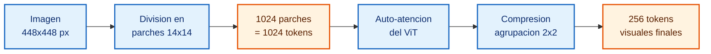
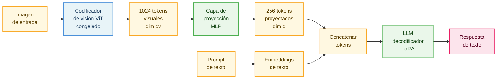
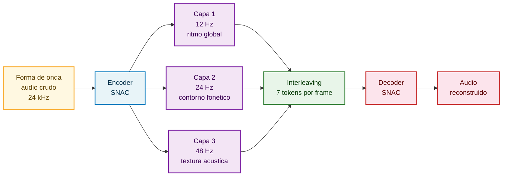
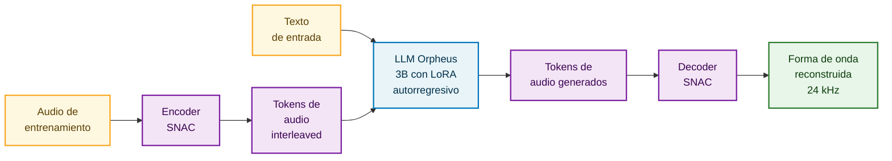
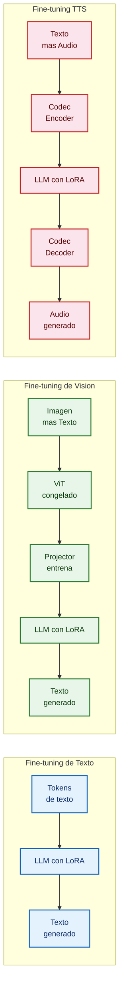

# Capítulo 7 — Más Allá del Texto: Fine-tuning Multimodal para Visión y Síntesis de Voz

> Basado en "Beyond Text: A Guide to Vision & TTS Finetuning" y "The Builder's Guide to Multimodal Finetuning (Vision + TTS)", The Neural Maze, Lección y Lab 7/8.

Durante seis capítulos hemos estado haciendo lo mismo: tomar un modelo que convierte texto en texto, y hacer que lo haga mejor. Esa es la columna vertebral del fine-tuning moderno, y las técnicas que has aprendido — **LoRA**, **QLoRA**, **SFT**, RLHF — todas viven cómodamente en ese mundo. Pero hay un problema: el mundo real no es texto.

Un radiólogo no diagnostica leyendo un párrafo; diagnostica mirando una radiografía de tórax. Un podcaster no escribe su contenido — lo habla. Y un cliente que llama al soporte de una empresa no quiere recibir un JSON como respuesta; quiere escuchar una voz humana que le resuelva el problema. Si nos quedamos en el dominio texto-a-texto, estamos dejando encima de la mesa algunas de las aplicaciones más valiosas del fine-tuning.

Lo que hace que este capítulo sea especialmente satisfactorio es el siguiente hecho: las técnicas que ya dominas se aplican casi sin cambios a los modelos multimodales. Las arquitecturas cambian en cómo codifican o decodifican señales no textuales, pero el bucle de entrenamiento es el mismo. Adjuntas adaptadores LoRA al backbone transformer, preparas un dataset, y lanzas el entrenamiento. La mecánica es familiar. Lo que cambia es el rango de problemas que puedes resolver.

En este capítulo exploraremos dos direcciones multimodales: el fine-tuning de modelos de visión-lenguaje (VLM — Vision-Language Models, modelos que entienden imágenes y generan texto) y el fine-tuning de síntesis de voz (TTS — Text-to-Speech, sistemas que convierten texto en habla). Para cada uno construiremos la intuición de la arquitectura, entenderemos por qué funcionan las técnicas que usamos, y luego pasaremos al laboratorio concreto: fine-tuning de Qwen3-VL sobre conversión de escritura a mano en LaTeX, y fine-tuning de Orpheus-TTS para clonar una voz específica.

---

## Por qué importa el fine-tuning multimodal

Antes de entrar en arquitecturas, vale la pena detenerse en el "para qué". No toda tarea justifica la complejidad adicional de trabajar con múltiples modalidades. Pero hay categorías de problemas donde un modelo de texto, por más grande y capaz que sea, simplemente no puede llegar — porque la información que necesita no existe en formato texto.

Considera el caso de la inspección de calidad industrial. Una cámara en una línea de producción captura imágenes de piezas manufacturadas. El defecto que interesa detectar — una microfisura en una cerámica, un desalineamiento de 0.3mm, una burbuja de aire bajo la pintura — no es algo que se pueda describir en un prompt y esperar que el modelo "deduzca". El modelo tiene que ver la imagen. Un VLM de propósito general preentrenado en imágenes de internet sabe que las fisuras existen, pero no sabe qué aspecto tiene una "fisura hairline en cerámica mate bajo luz de fábrica". Para eso necesitas fine-tuning con cientos de ejemplos etiquetados de tu dominio específico.

El mismo razonamiento aplica a la medicina. Los VLMs de propósito general cometen errores en terminología clínica y pasan por alto hallazgos sutiles en imágenes médicas — no porque sean modelos mediocres, sino porque la distribución de imágenes médicas de alta especificidad está subrepresentada en sus datos de preentrenamiento. Un modelo finetuneado sobre pares imagen-informe de un dominio concreto (radiografías de tórax de una red hospitalaria, fondo de ojo para retinopatía diabética, histología de biopsias de piel) aprende exactamente la terminología, los formatos de informe, y los patrones visuales que importan en ese contexto.

Para el monitoreo agrícola, la situación es análoga: las enfermedades de cultivos costaron aproximadamente 220 mil millones de dólares en pérdidas globales solo en 2022. La detección temprana requiere identificar diferencias visuales sutiles — un hongo en etapa inicial se parece mucho a un déficit de nitrógeno, pero las implicaciones de tratamiento son completamente distintas. Un VLM finetuneado sobre imágenes etiquetadas de una región y cultivo específico aprende esas diferencias. Un agricultor puede sacar el teléfono, fotografiar una hoja, y recibir un diagnóstico diferencial en segundos.

En el dominio de la voz, el fine-tuning TTS resuelve un problema que la clonación de voz zero-shot no puede: la profundidad de personalización. Un sistema TTS base puede escuchar 10 segundos de tu voz e imitarte superficialmente — captura el timbre general, pero no tus patrones de énfasis, tu forma de pausar antes de una idea importante, tus vocales regionales. Es como pedirle a alguien que te imite después de escucharte en una llamada de elevador. El fine-tuning, en cambio, es como pasar semanas estudiando tus grabaciones hasta poder reproducir cada matiz de tu delivery. Con apenas 30 minutos de audio limpio de un solo hablante, se puede finetunear un modelo TTS para producir resultados que un oyente no distingue de la voz original.

---

## Parte I — Visión: cómo un modelo aprende a ver

### La arquitectura de los modelos de visión-lenguaje

Todo modelo de visión-lenguaje moderno — Qwen3-VL, Llama 3.2 Vision, Gemma 3, PaliGemma — comparte la misma estructura de tres etapas. La variedad entre ellos está en los detalles de cada etapa, no en la estructura. Entender esta arquitectura te permitirá razonar sobre cualquier VLM que encuentres, no solo los que usamos en el lab.

**Etapa 1: El codificador de visión (vision encoder).**

El codificador de visión es el componente que transforma una imagen en una representación que el modelo puede procesar. Piensa en él como el "sistema visual" del modelo: convierte píxeles en algo semántico.

En casi todos los VLMs modernos, este componente es un Vision Transformer o ViT (pronunciado "vit"). El ViT aplica al dominio visual la misma arquitectura transformer que ya conoces del procesamiento de texto. Funciona así: la imagen se divide en pequeños cuadrados llamados parches (patches) — típicamente de 14×14 o 16×16 píxeles. Cada parche se proyecta linealmente en un vector de alta dimensión (un embedding), exactamente como un token de texto se proyecta en su embedding. La secuencia de todos estos embeddings de parches se procesa con capas de **auto-atención** (self-attention), igual que en un transformer de texto.

Hagamos los números concretos para que esto sea tangible. Una imagen de 448×448 píxeles con parches de 14×14 produce $\frac{448}{14} \times \frac{448}{14} = 32 \times 32 = 1024$ parches. Eso es 1024 tokens visuales, cada uno de dimensión $d_v$ (la dimensión oculta del codificador de visión, típicamente 1024 o 1280). El codificador procesa esta secuencia de 1024 vectores y produce 1024 vectores de características visuales enriquecidos con información contextual — un vector por parche, pero donde cada vector ya "sabe" lo que hay en los parches vecinos gracias a la auto-atención.



> **Descripción visual:** Diagrama de flujo horizontal con cinco bloques conectados por flechas. El primer bloque (azul oscuro) dice "Imagen 448x448 px". El segundo (azul) dice "Division en parches 14x14". El tercero (naranja) resalta el numero resultante "1024 parches = 1024 tokens". El cuarto (azul) dice "Auto-atencion del ViT". El quinto (naranja) dice "256 tokens visuales finales" tras la compresion. Las flechas son grises. Estilo minimalista, fondo blanco.

La magia del ViT es que fue preentrenado sobre enormes colecciones de pares imagen-texto (modelos como CLIP o SigLIP usaron cientos de millones de pares). Durante ese preentrenamiento, el ViT aprendió a codificar información visual en sus vectores de manera que sea semánticamente significativa. Un parche que muestra ojos humanos produce un vector diferente al de un parche que muestra árboles. El codificador ya sabe diferenciar esos conceptos visuales — y eso es exactamente por qué, como veremos, no necesitas entrenarlo de nuevo.

La salida del codificador se puede expresar formalmente:

$$\mathbf{V} = \text{ViT}_{\text{frozen}}(\mathbf{I}) \in \mathbb{R}^{N_v \times d_v}$$

donde $\mathbf{I}$ es la imagen de entrada, $N_v$ es el número de tokens visuales (1024 en nuestro ejemplo), y $d_v$ es la dimensión de embedding del codificador. El subíndice "frozen" es fundamental — volveremos a él.

**Etapa 2: La capa de proyección (projector).**

Aquí surge un problema: los 1024 vectores visuales de dimensión $d_v$ viven en un espacio matemático diferente al de los embeddings de texto que el LLM espera. Es como tener dos idiomas que no comparten vocabulario. La capa de proyección es el traductor entre esos dos idiomas.

En la práctica, esta capa es a menudo un MLP (Multi-Layer Perceptron — red neuronal de capas densas) de dos o tres capas, o en algunos modelos una capa de cross-attention. Lo que hace es transformar cada vector visual de dimensión $d_v$ a un vector de dimensión $d$, donde $d$ es la dimensión oculta del LLM. Si el LLM es un modelo de 7B parámetros con dimensión $d = 4096$, y el ViT produce vectores de $d_v = 1024$, el projector aprende una transformación lineal (más no-linealidad) que mapea $1024 \rightarrow 4096$.

$$\mathbf{V'} = \text{Projector}(\mathbf{V}) \in \mathbb{R}^{N'_v \times d}$$

Muchos modelos también aplican compresión aquí: agrupan parches adyacentes para reducir el número de tokens. Por ejemplo, agrupar parches en grupos de 2×2 reduce $N_v$ a $N'_v = N_v / 4$. Si teníamos 1024 tokens visuales, pasamos a 256. Esto importa porque cada token visual extra añade costo cuadrático en la atención del LLM — y una imagen de alta resolución sin compresión puede producir tantos tokens que la secuencia se vuelve prohibitiva. Con compresión 4×, los 1024 tokens se reducen a 256, equivalente a 256 palabras de texto en el contexto del LLM.

**Etapa 3: El decodificador LLM.**

Este es exactamente el transformer autoregresivo que has estado finetuneando durante todo el libro. Recibe una secuencia concatenada: primero los tokens visuales proyectados, luego los tokens de texto del prompt del usuario. Genera una respuesta de texto token a token, como siempre.

$$\hat{y} = \text{LLM}_{\theta + \Delta\theta}([\mathbf{V'}; \mathbf{h}_t])$$

donde $\mathbf{h}_t$ son los embeddings de los tokens de texto del prompt, $\theta$ son los pesos originales del LLM (congelados), y $\Delta\theta$ son los adaptadores LoRA que entrenamos. La pérdida se calcula únicamente sobre los tokens de texto generados — no sobre los tokens visuales, que actúan como contexto de entrada, no como objetivo de predicción:

$$\mathcal{L} = -\sum_{i} \log P_{\theta + \Delta\theta}(y_i \mid \mathbf{V'}, \mathbf{h}_t, y_{<i})$$

Esta fórmula es idéntica a la pérdida de SFT estándar que vimos en los capítulos anteriores. La única diferencia es que el contexto ahora incluye $\mathbf{V'}$, los tokens visuales proyectados. El mecanismo de entrenamiento es el mismo.



> **Descripción visual:** Diagrama de flujo horizontal con dos ramas de entrada que convergen en el LLM. La rama superior muestra la imagen pasando por un bloque azul claro (ViT congelado, indicado con candado), luego un bloque amarillo de tokens visuales, luego un bloque verde (projector entrenable), y tokens proyectados. La rama inferior muestra el texto de prompt pasando a embeddings de texto amarillos. Ambas ramas se unen en un nodo gris de concatenación, que alimenta al LLM (verde, entrenable con LoRA), que produce la respuesta (rosa). Estilo limpio, fondo blanco, tipografía sans-serif, flechas grises con punta sólida.

### Por qué el codificador de visión permanece congelado

Esta es la decisión de diseño más importante del fine-tuning de VLMs, y merece una explicación profunda porque en la superficie puede parecer contraintuitiva: si quieres que el modelo "vea mejor" en tu dominio, ¿no deberías entrenar también el componente que hace la visión?

La respuesta corta es no, y aquí está el razonamiento largo.

El codificador de visión fue preentrenado con cientos de millones (o miles de millones) de pares imagen-texto. Durante ese proceso aprendió representaciones visuales extraordinariamente ricas: sabe qué es una radiografía vs una fotografía de paisaje, sabe que una laceración en una pieza industrial es diferente a una grieta natural en una roca, sabe distinguir la hoja sana de una hoja con hongos. Esas representaciones son lo que hace que el modelo sea valioso en primer lugar.

Si entrenas el codificador de visión con tu pequeño dataset de dominio (digamos 500 imágenes de fracturas cerámicas), corres el riesgo de sobreescribir esas representaciones ricas con algo muy específico y mucho menos generalizable. El proceso de aprender "fractura cerámica" puede destruir lo que el modelo sabía sobre "fractura de metal" o "arañazo superficial". Esto es lo que los investigadores llaman **olvido catastrófico** (catastrophic forgetting), y es especialmente devastador para componentes que tomaron miles de millones de pares de entrenamiento para alcanzar su calidad actual.

El objetivo del fine-tuning de dominio no es cambiar cómo el modelo ve las imágenes — es cambiar cómo el LLM interpreta y describe lo que ve. Un modelo base puede mirar una radiografía de tórax y saber que hay estructuras anatómicas, zonas de mayor y menor densidad, y anomalías. Lo que no sabe es nombrar esas anomalías con la terminología correcta de radiología, estructurar el informe según el protocolo hospitalario, o priorizar los hallazgos según su urgencia clínica. Eso es conocimiento del LLM, no del codificador visual.

Entonces la estrategia es:
- Codificador de visión: congelado. No recibe gradientes, no se actualiza.
- Capa de proyección: puede ser entrenable o no, dependiendo del modelo y la tarea.
- LLM decodificador: recibe adaptadores LoRA en sus capas de atención, exactamente como en fine-tuning de texto.

El resultado práctico es impresionante: el costo de entrenamiento de un VLM con esta estrategia es esencialmente igual al de un LLM de texto del mismo tamaño. El codificador añade costo en inferencia (tienes que codificar la imagen), pero durante el entrenamiento está congelado — no hay gradientes que propagar por él, no hay memoria adicional para sus activaciones intermedias en el backward pass.

### Cuándo sí conviene entrenar el codificador de visión

Hay un caso donde vale la pena experimentar con entrenar (parcialmente) el codificador: cuando la distribución visual de tu tarea es genuinamente diferente a la de los datos de preentrenamiento. La escritura a mano matemática es un buen ejemplo — los corpus de preentrenamiento de visión están dominados por fotografías naturalistas, diagramas digitales y texto tipografiado. La escritura a mano con notación matemática (integrales, sumatorias, letras griegas a mano) es una distribución visual bastante distinta.

En esos casos, finetunear también el codificador — con una tasa de aprendizaje muy baja, para no destruir las representaciones existentes — puede dar mejoras adicionales. La regla práctica: empieza siempre con el codificador congelado. Si los resultados son insuficientes después de un ciclo de entrenamiento completo sobre el decodificador, entonces experimenta con descongelar las últimas capas del codificador con lr ~10x más pequeña.

### Consideraciones prácticas que el artículo menciona pero no explica

**La trampa de la resolución.** Cada pixel importa en términos computacionales. Una imagen de 224×224 con parches de 14×14 produce $(224/14)^2 = 256$ tokens visuales. Una imagen de 448×448 produce 1024 tokens — cuatro veces más. Una imagen de 896×896 produciría 4096 tokens solo de la imagen, más los tokens del prompt y la respuesta. Eso es un contexto enorme. El costo de atención es cuadrático en la longitud de secuencia, así que duplicar la resolución cuadruplica los tokens visuales, lo que puede octuplica (o más) el uso de VRAM según la implementación.

La mayoría de los VLMs modernos soportan resolución dinámica — el modelo acepta imágenes de cualquier tamaño y las procesa eficientemente. Pero durante el fine-tuning, debes decidir un rango de resolución razonable. La recomendación del artículo de 300-1000px es sensata: por debajo de 300px pierdes detalles importantes en tareas como OCR o inspección industrial; por encima de 1000px en una GPU de consumo puedes quedarte sin VRAM en el primer batch. Empieza en el punto medio del rango (600-700px) y ajusta según lo que permite tu hardware.

**La trampa del aspect ratio variable.** Si tus imágenes tienen formas muy diferentes — algunas cuadradas, otras panorámicas, otras verticales — el número de tokens visuales por muestra varía enormemente. Meter en un mismo batch una imagen de 256 tokens y otra de 1024 tokens es ineficiente: hay que rellenar la imagen pequeña con tokens de padding hasta alcanzar la longitud de la grande. Cuando hay mucha varianza, estás desperdiciando cómputo en padding. Estrategia práctica: agrupa las imágenes por aspect ratio similar al crear los batches, o simplemente normaliza todas las imágenes a un mismo tamaño durante el preprocesamiento.

**La trampa del olvido de dominio general.** Si finetuneas un VLM exclusivamente sobre imágenes de radiología, el modelo puede "olvidar" cómo responder preguntas visuales generales — si le preguntas qué hay en una fotografía de un gato, puede responder de forma extraña o degenerada. Esto ocurre porque el fine-tuning sobreajusta la distribución de activaciones del LLM hacia los patrones de los informes médicos, y los pesos originales que manejaban la variedad visual general se alejan de su estado preentrenado.

La solución estándar es mezclar datos: 80% de imágenes de tu dominio específico, 20% de un dataset VQA general (Visual Question Answering — preguntas y respuestas sobre imágenes de temática general). Esto actúa como un "ancla" que mantiene las capacidades generales mientras el modelo aprende el dominio nuevo. No es una regla fija — con datasets muy pequeños (bajo 1000 ejemplos) la mezcla puede dilur demasiado la señal de dominio. Experimenta con ratios 90/10 y 80/20.

---

## Parte II — Voz: cómo un modelo aprende a hablar

### El problema que TTS moderno resolvió

La síntesis de voz tradicional (TTS en su forma clásica) era una cadena de etapas independientes, cada una con su propio modelo, sus propios hiperparámetros, y sus propios modos de fallo:

1. **Normalización de texto:** convertir "Sr." en "señor", "25/12" en "veinticinco de diciembre", expandir abreviaciones.
2. **Conversión a fonemas:** descomponer el texto en unidades de sonido (fonemas). El inglés tiene ~44 fonemas, el español ~24. Esta etapa requiere conocimiento lingüístico extenso y maneja mal las excepciones.
3. **Modelado de prosodia:** decidir el ritmo, el tono, el énfasis. Una pregunta sube al final. Una afirmación descends. Una exclamación tiene energía alta. Modelar esto requería reglas artesanales o modelos estadísticos separados.
4. **Síntesis de forma de onda:** convertir la representación fonética con prosodia en audio real, típicamente a través de una representación intermedia llamada mel-spectrogram — una representación visual del audio que muestra cómo varía la energía en diferentes frecuencias a lo largo del tiempo.

Cada etapa propagaba sus errores a la siguiente. Un error en la normalización (convertir mal una abreviatura) producía un error en los fonemas, que producía prosodia incorrecta, que producía audio defectuoso. El sistema completo era frágil y requería ingeniería especializada para mantener.

El TTS moderno basado en LLMs tira todo eso a la basura con una idea conceptualmente simple pero poderosa: tratar el audio como otro idioma más.

En lugar de predecir el siguiente token de texto, el LLM predice el siguiente token de audio. La arquitectura es el mismo transformer autoregresivo que ya conoces. El único ingrediente nuevo es un codec de audio neuronal — esencialmente, un "tokenizador para el sonido" — que convierte formas de onda de audio continuas en secuencias de números enteros discretos, y que puede reconstruir el audio a partir de esos números.

### El codec de audio neuronal: tokenizando el sonido

El codec es la pieza clave que hace posible el TTS basado en LLMs. Entenderlo en profundidad es esencial para entender por qué el fine-tuning funciona como funciona.

Un codec de audio neuronal tiene dos componentes principales:

**El encoder del codec** transforma una forma de onda de audio crudo (una secuencia de muestras numéricas que representan la presión del aire a lo largo del tiempo) en una secuencia de códigos enteros discretos. Es análogo a un tokenizador de texto: así como un tokenizador convierte "hola mundo" en `[28120, 49445]`, el encoder del codec convierte 1 segundo de audio en, digamos, `[2341, 891, 3027, ...]`. Estos enteros se toman de un codebook aprendido durante el entrenamiento del codec — un vocabulario de fragmentos de audio.

**El decoder del codec** hace el proceso inverso: toma los códigos enteros y reconstruye la forma de onda de audio. La reconstrucción no es perfecta (es compresión con pérdida, como MP3), pero los codecs modernos logran calidad notable incluso a tasas de bits bajas.

La innovación clave de codecs modernos como SNAC (Multi-Scale Neural Audio Codec), EnCodec, o DAC es su estructura jerárquica de múltiples capas de cuantización. Esto requiere explicación detallada porque es central para entender el formato de los datos de entrenamiento.

Imagina que quieres describir una canción a alguien que nunca la ha escuchado. Podrías hacerlo en tres niveles de detalle:
- **Nivel grueso:** "Es una balada lenta en mi menor, con voz masculina grave, tempo de 70 BPM."
- **Nivel medio:** "En el compás 3 hay un crescendo, la vocal 'a' en 'amor' se estira dos tiempos, hay vibrato al final de cada frase."
- **Nivel fino:** "La voz tiene una calidad ligeramente ronca, con un pequeño suspiro antes del coro, las consonantes sibilantes tienen un ligero siseo característico de esa persona."

El codec SNAC que usa Orpheus-TTS opera exactamente con esta filosofía en tres capas:

**Capa 1 (gruesa, ~12 Hz):** Captura la estructura global — ritmo, prosodia general, identidad del hablante. Produce 1 token por frame temporal. Si el audio dura 1 segundo, esta capa produce ~12 tokens.

**Capa 2 (media, ~24 Hz):** Captura patrones fonéticos y contornos de entonación. Corre el doble de rápido que la capa 1, produciendo 2 tokens por frame de la capa 1. En 1 segundo: ~24 tokens.

**Capa 3 (fina, ~48 Hz):** Captura la textura acústica — respiraciones, crujidos vocales, calidad tímbrica sutil. Corre cuatro veces más rápido que la capa 1, produciendo 4 tokens por frame de la capa 1. En 1 segundo: ~48 tokens.



> **Descripcion visual:** Diagrama de flujo horizontal con forma de abanico. A la izquierda, un bloque amarillo "Forma de onda audio crudo 24 kHz" apunta al encoder SNAC (azul). Desde el encoder salen tres flechas paralelas hacia tres bloques morados verticales que representan las capas jerarquicas: Capa 1 (ritmo global, 12 Hz), Capa 2 (contorno fonetico, 24 Hz), Capa 3 (textura acustica, 48 Hz). Las tres capas convergen en un bloque verde "Interleaving 7 tokens por frame". De ahi salen dos bloques rojos: Decoder SNAC y Audio reconstruido. Estilo limpio, fondo blanco, flechas con punta triangular.

En total, 1 segundo de audio se representa con $12 + 24 + 48 = 84$ tokens (aproximadamente 83 según la implementación exacta). Esto es manejable para un LLM. Un texto de 200 palabras (~266 tokens) corresponde a, digamos, 4 segundos de habla (~332 tokens de audio). La proporción es razonable.

Para que el LLM pueda procesar esta estructura jerárquica como una secuencia plana (el LLM solo sabe de secuencias), los tokens de las tres capas se entrelazan (interleave) en un patrón específico. Por cada frame temporal, la secuencia es:

$$[c^1_t, \; c^2_{2t}, \; c^3_{4t}, \; c^3_{4t+1}, \; c^2_{2t+1}, \; c^3_{4t+2}, \; c^3_{4t+3}]$$

donde $c^l_i$ es el token $i$-ésimo de la capa $l$. Esto produce 7 tokens por frame. Para 1 segundo de audio (12 frames a 12 Hz): $12 \times 7 = 84$ tokens. Para 10 segundos: 840 tokens. Este número importa mucho cuando calculamos los límites de generación, como veremos.

```mermaid
flowchart LR
    subgraph FRAME["1 frame temporal (1/12 seg)"]
        direction TB
        T1["Token capa 1\nritmo global"]
        T2A["Token capa 2a\nfonetica"]
        T3A["Token capa 3a\ntextura"]
        T3B["Token capa 3b\ntextura"]
        T2B["Token capa 2b\nfonetica"]
        T3C["Token capa 3c\ntextura"]
        T3D["Token capa 3d\ntextura"]
    end

    FRAME --> SEQ["Secuencia plana\n7 tokens por frame\n84 tokens por seg"]
    SEQ --> LLM["LLM predice\ncada token\nen orden"]

    classDef c1 fill:#bbdefb,stroke:#1565c0,stroke-width:2px,color:#0d2d6e
    classDef c2 fill:#c8e6c9,stroke:#2e7d32,stroke-width:2px,color:#0a3d0a
    classDef c3 fill:#f8bbd9,stroke:#ad1457,stroke-width:2px,color:#5a0020
    classDef proc fill:#fff8e1,stroke:#f9a825,stroke-width:2px,color:#5a3e00

    class T1 c1
    class T2A,T2B c2
    class T3A,T3B,T3C,T3D c3
    class SEQ,LLM proc
```



> **Descripcion visual:** Diagrama de flujo horizontal. A la izquierda, un recuadro contenedor gris "1 frame temporal (1/12 seg)" agrupa verticalmente 7 bloques de colores: uno azul (Token capa 1, ritmo global), dos verdes (Tokens capa 2a y 2b, fonetica), y cuatro rosas (Tokens capa 3a-3d, textura). El contenedor apunta a un bloque amarillo "Secuencia plana, 7 tokens por frame, 84 tokens por seg", que a su vez apunta a un bloque amarillo "LLM predice cada token en orden". Estilo limpio, fondo blanco, tipografia sans-serif.

### Cómo el LLM aprende a generar habla

Con el codec en mano, el pipeline de entrenamiento es conceptualmente sencillo.

**Preparación de datos:** dado un dataset de pares (texto, audio), se pasa cada audio por el encoder del codec para obtener las secuencias de tokens. Se extiende el vocabulario del LLM para incluir los IDs de tokens de audio — si el LLM original tiene 128,266 tokens de texto, los tokens de audio se asignan a partir del ID 128,267 en adelante, sin colisión.

La extensión de vocabulario funciona así. Cada capa del codec tiene un codebook de 4,096 entradas (es decir, 4,096 posibles valores). Con 3 capas, necesitamos $3 \times 4{,}096 = 12{,}288$ IDs adicionales, pero en la práctica se añaden offsets por capa para que el modelo pueda distinguir a qué capa pertenece cada token:

$$\text{ID\_en\_vocabulario} = c^l_i + V_\text{text} + (l-1) \times 4096$$

donde $V_\text{text} = 128{,}266$ es el tamaño del vocabulario de texto original y $l \in \{1,2,3\}$ es la capa del codec. Así, un token de valor 2341 de la capa 1 se mapea a $2341 + 128266 + 0 = 130607$. El mismo valor 2341 de la capa 2 se mapea a $2341 + 128266 + 4096 = 134703$. Son IDs distintos, por lo que el LLM los trata como tokens distintos — lo cual es correcto, porque representan cantidades diferentes.

**Entrenamiento:** el LLM aprende a predecir los tokens de audio dados los tokens de texto, con pérdida estándar de next-token prediction:

$$\mathcal{L}_\text{TTS} = -\sum_{i=1}^{|s|} \log P_{\theta + \Delta\theta}(s_i \mid t_1, \ldots, t_{|t|}, s_1, \ldots, s_{i-1})$$

donde $t = (t_1, \ldots, t_{|t|})$ son los tokens de texto de entrada y $s = (s_1, \ldots, s_{|s|})$ es la secuencia interleaved de tokens de audio. Los $\Delta\theta$ son, nuevamente, los adaptadores LoRA.

**Inferencia:** en tiempo de inferencia, el LLM recibe los tokens de texto y genera autoregresivamente los tokens de audio, uno por uno. Cuando termina de generar (llega a un token especial de fin de habla), los tokens de audio generados se pasan al decoder del codec para reconstruir la forma de onda.



> **Descripcion visual:** Diagrama de flujo horizontal con dos ramas de entrada que convergen en el LLM. La rama superior muestra "Texto de entrada" (amarillo) apuntando directamente al LLM Orpheus (azul). La rama inferior muestra "Audio de entrenamiento" (amarillo) pasando por el Encoder SNAC (morado) produciendo "Tokens de audio interleaved" (morado) que alimentan tambien al LLM. El LLM genera "Tokens de audio generados" (morado), que pasan por el Decoder SNAC (morado) para producir "Forma de onda reconstruida 24 kHz" (verde). Estilo limpio, fondo blanco, flechas grises con punta solida.

El LLM no "sabe" que está generando habla. Desde su perspectiva, está prediciendo el siguiente token en una secuencia, como siempre. Lo que hace que el sistema funcione es que el espacio de tokens de audio es lo suficientemente estructurado — gracias al entrenamiento del codec — para que el LLM pueda aprender patrones significativos en él.

### Por qué el fine-tuning supera a la clonación zero-shot

Los modelos TTS base modernos pueden hacer clonación de voz zero-shot: le das 10 segundos de audio de una voz, y el modelo intenta generar nueva habla con esa voz. El resultado es... aceptable. Captura el timbre general, las frecuencias básicas de la voz. Pero falla en los detalles que hacen reconocible a una persona: sus patrones de énfasis específicos, cómo sube el tono en las preguntas retóricas, cuánto tiempo pausa antes de una idea importante, sus vocales regionales, su tendencia a acelerar en los fragmentos emocionantes.

La clonación zero-shot es como contratar a un imitador que te escuchó hablar durante 10 segundos en un elevador. El fine-tuning es como contratar a alguien que pasó semanas estudiando cada uno de tus videos y podcasts.

En términos más técnicos: la clonación zero-shot funciona condicionando la generación en una representación del audio de referencia (el embedding de estilo de voz). Esa representación captura información estadística gruesa — frecuencia fundamental media, timbre global, ritmo general. El fine-tuning, en cambio, modifica los pesos del modelo para que el espacio de generación completo del LLM esté sesgado hacia los patrones de esa voz específica. No es un condicionamiento externo; es conocimiento internalizado.

La cantidad de audio necesaria para fine-tuning de voz es sorprendentemente pequeña: 30 minutos de audio limpio de un solo hablante suele ser suficiente para alta calidad. Lo que más importa es la calidad sobre la cantidad: condiciones de grabación consistentes, mínimo ruido de fondo, transcripciones precisas. 30 minutos de audio de alta calidad supera a 5 horas de audio con ruido de fondo y transcripciones incorrectas.

### Consideraciones prácticas de TTS que requieren atención especial

**El límite de duración por tokens.** Esto es crítico para el despliegue en producción y raramente se menciona en los tutoriales. Si tu codec produce 83 tokens por segundo de audio, y la longitud máxima de contexto del LLM es 2048 tokens (parámetro `max_seq_length` en el entrenamiento), entonces la duración máxima de audio generada es:

$$\text{duración máxima} = \frac{2048 \text{ tokens}}{83 \text{ tokens/segundo}} \approx 24.7 \text{ segundos}$$

Para Orpheus-TTS con max_seq_length = 2048, esto significa que no puedes generar más de ~24 segundos de audio de una vez. Para textos más largos — un artículo de 500 palabras, que hablaría durante 3-4 minutos — necesitas dividir el texto en fragmentos y generar el audio por partes. Esto introduce el problema de la consistencia entre fragmentos: la voz no debe cambiar de carácter entre el fragmento 1 y el fragmento 5. Orpheus maneja esto razonablemente bien porque la voz está internalizada en los pesos, no solo condicionada por un embedding externo.

**El repetition penalty: el control de calidad más importante en TTS.** Los modelos TTS basados en LLMs tienen una tendencia peculiar: sin un mecanismo corrector, pueden entrar en bucles de repetición, generando la misma sílaba o el mismo patrón fonético indefinidamente. Esto ocurre porque en el espacio de tokens de audio, las secuencias repetitivas son estadísticamente comunes (piensa en un sonido largo sostenido — es una repetición de frames similares) y el LLM puede quedar "atrapado" en un mínimo local de ese tipo.

El `repetition_penalty` — que típicamente multiplica por $(1/p)^\gamma$ la probabilidad de tokens que ya aparecieron en la secuencia generada, reduciendo su probabilidad de ser seleccionados — es la solución estándar. En generación de texto, un `repetition_penalty` de 1.1 es una precaución leve. En TTS, es prácticamente obligatorio con valores $\geq 1.1$. Sin él, o con valores demasiado bajos, el modelo puede producir minutos de "ta-ta-ta-ta-ta..." en lugar de habla. Con valores demasiado altos (>1.3), el modelo evita demasiado los patrones repetitivos y puede producir sonidos extraños o degradados, ya que cierto grado de repetición es natural en el habla continua.

**Tamaño del modelo vs calidad de audio.** En el dominio del texto, más parámetros generalmente implica mejor rendimiento — un modelo de 70B supera a uno de 7B en casi todas las benchmarks de razonamiento y conocimiento. En TTS, la relación es más compleja. La calidad del audio percibida por un oyente humano satura con tamaños relativamente pequeños de modelo, mientras que la latencia (el tiempo que tarda el modelo en generar el audio) escala directamente con el tamaño. Para aplicaciones de tiempo real — call centers, asistentes de voz — una latencia de 200ms marca la diferencia entre una experiencia fluida y una conversación entrecortada. Orpheus con 3B parámetros puede lograr ~200ms de latencia para streaming en hardware razonable. Un modelo de 70B necesitaría hardware mucho más especializado para acercarse a eso. Para TTS, el sweet spot práctico son modelos de 1-3B parámetros.

---

## Los modelos: Qwen3-VL y Orpheus-TTS

### Qwen3-VL (8B) — El modelo de visión

Qwen3-VL es el VLM más reciente de la serie Qwen de Alibaba. Existe en variantes densas de 2B, 4B, 8B y 32B parámetros, además de variantes Mixture-of-Experts (MoE — arquitecturas donde solo una fracción de los parámetros se activa por token, permitiendo modelos muy grandes con costo computacional menor). Para el lab usamos la versión densa de 8B, que ofrece una buena relación entre capacidad y entrenabilidad.

Varias características de Qwen3-VL merecen explicación detallada porque afectan directamente cómo lo finetuneas:

**Ventana de contexto de 256K tokens.** Los LLMs estándar tienen ventanas de contexto de 4K a 128K tokens. Qwen3-VL soporta hasta 256K tokens de forma nativa, extensible a 1M. En la práctica para fine-tuning de imágenes individuales esto no cambia mucho — las imágenes raras veces superan los 2K tokens después de compresión. Donde importa es para el procesamiento de documentos multipágina (puedes pasar un PDF completo como secuencia de imágenes de páginas) y para razonamiento sobre video (múltiples frames del mismo video).

**DeepStack: fusión de características multi-escala.** El Qwen2.5-VL anterior usaba únicamente la salida de la última capa del ViT. El problema con esto es que las últimas capas del ViT capturan semántica de alto nivel ("hay una cara humana") pero pierden detalles de bajo nivel ("la letra está mal formada", "hay una microgrieta"). Qwen3-VL introduce DeepStack, que fusiona características de múltiples niveles del ViT — capas intermedias (que retienen más información espacial y de bajo nivel) con la capa final (que tiene la semántica más rica). Esto mejora significativamente las tareas que requieren atención a detalles finos, como OCR de texto pequeño, detección de defectos industriales, o lectura de escritura a mano.

**Interleaved-MRoPE — posiciones en tres dimensiones.** Los transformers estándar usan embeddings posicionales unidimensionales: cada token tiene una posición 1, 2, 3, ... en la secuencia. Pero las imágenes y los videos tienen estructura espacial bidimensional (fila, columna) y los videos añaden la dimensión temporal. MRoPE (Multimodal Rotary Position Embedding) es una extensión de los embeddings posicionales rotatorios (RoPE) que asigna posiciones en tres dimensiones: tiempo, altura y anchura. Esto permite al modelo razonar sobre la posición espacial de objetos en la imagen ("el texto en la esquina superior izquierda") y la posición temporal en videos ("el marcador aparece a los 2:34"). La versión interleaved de Qwen3-VL asigna frecuencias posicionales completas en cada dimensión, lo que mejora la comprensión de secuencias visuales largas.

**Modo de razonamiento (thinking mode).** Las ediciones Instruct y Thinking de Qwen3-VL pueden activar o desactivar el razonamiento en cadena (chain-of-thought) explícito. Para tareas de OCR simple, el thinking mode añade overhead sin beneficio visible. Para problemas matemáticos visuales complejos ("resuelve la ecuación en esta imagen paso a paso"), el thinking mode puede ser la diferencia entre una respuesta correcta y una incorrecta.

### Orpheus-TTS (3B) — El modelo de voz

Orpheus-TTS, construido por Canopy Labs, es un sistema TTS open-source basado en el backbone Llama 3B. Si has finetuneado Llama para generación de texto, ya entiendes el 90% de la arquitectura de Orpheus. La diferencia es que fue entrenado para predecir tokens de audio en lugar de tokens de texto.

Usa el codec SNAC (Multi-Scale Neural Audio Codec) a 24kHz — 24,000 muestras de audio por segundo, que es calidad de telefonía HD (mejor que la telefonía tradicional de 8kHz, similar a lo que escuchas en una videollamada de buena calidad). Con las 3 capas del codec a 12/24/48 Hz, produce aproximadamente 83 tokens por segundo de audio.

Una característica especialmente interesante son las **emotive tags** — etiquetas de expresividad inline. El modelo reconoce etiquetas como `<laugh>`, `<sigh>`, `<chuckle>`, `<gasp>` dentro del texto, y las usa para guiar el estilo de generación. "Esto es increíble `<laugh>` no puedo creerlo" generará una risa natural integrada en el habla. Esto es posible porque esas etiquetas forman parte del vocabulario del modelo preentrenado — fueron incluidas en los datos de entrenamiento de Orpheus como secuencias especiales asociadas con los patrones de audio correspondientes.

Las 8 voces preset (tara, leah, jess, leo, dan, mia, zac, zoe) se seleccionan prefijando el prompt con el nombre de la voz: `"tara: Hola, soy Tara"`. El fine-tuning puede añadir una voz nueva al repertorio del modelo, o afinar una de las voces existentes hacia una personalización específica.

---

## El laboratorio, parte 1 — Escritura a mano en LaTeX con Qwen3-VL

Con la teoría de VLMs bien entendida, pasemos a construirlo con las manos. La tarea: finetunear Qwen3-VL 8B para convertir fotografías de fórmulas matemáticas escritas a mano en código LaTeX limpio y compilable. El modelo base puede describir una imagen en términos generales, pero no sabe producir LaTeX preciso desde notación manuscrita — eso requiere aprender el formato específico de salida y mejorar su capacidad de leer escritura no tipografiada.

El entorno es Google Colab con una GPU T4 gratuita. Usamos Unsloth, la librería de optimización de fine-tuning que hemos estado usando en capítulos anteriores, con su clase `FastVisionModel` especializada para VLMs.

### Paso 1: Carga del modelo en 4 bits

```python
from unsloth import FastVisionModel
import torch

model, tokenizer = FastVisionModel.from_pretrained(
    "unsloth/Qwen3-VL-8B-Instruct-unsloth-bnb-4bit",
    load_in_4bit = True,
    use_gradient_checkpointing = "unsloth",
)
```

La diferencia respecto a un modelo de texto es mínima: `FastVisionModel` en lugar de `FastLanguageModel`. Unsloth maneja internamente la carga del codificador de visión, la capa de proyección, y el LLM backbone como un único objeto coherente. La cuantización a 4 bits (QLoRA) aplica al LLM y potencialmente a la proyección, pero el codificador de visión se mantiene con mayor precisión — degradar la precisión del codificador afecta directamente la calidad de las características visuales extraídas.

Una implicación práctica: aunque cargamos en 4 bits, el modelo Qwen3-VL 8B ocupa alrededor de 5-6 GB de VRAM en la T4 (que tiene 16 GB). El resto del VRAM queda para activaciones, gradientes y los adaptadores LoRA.

### Paso 2: Añadir adaptadores LoRA con control granular

```python
model = FastVisionModel.get_peft_model(
    model,
    finetune_vision_layers     = True,  # ¿Entrenar el ViT?
    finetune_language_layers   = True,  # ¿Entrenar el LLM?
    finetune_attention_modules = True,  # ¿Entrenar atención?
    finetune_mlp_modules       = True,  # ¿Entrenar capas MLP?
    r = 16,
    lora_alpha = 16,
    lora_dropout = 0,
    bias = "none",
    random_state = 3407,
)
```

Unsloth expone cuatro interruptores independientes para decidir qué se entrena. Esto es más granular que en el fine-tuning de texto estándar. Algunas guías de diseño:

- `finetune_language_layers = True` siempre. El LLM es el que aprende el formato de salida.
- `finetune_vision_layers`: para la mayoría de tareas, empieza con `False`. Para escritura a mano (distribución visual inusual), prueba `True` y compara los resultados.
- `finetune_attention_modules` y `finetune_mlp_modules`: si activas el entrenamiento de alguna parte, entrenar ambos (atención y MLP) suele dar mejores resultados que entrenar solo uno.

El rango `r = 16` y `lora_alpha = 16` (lo que hace que el factor de escala $\alpha/r = 1.0$) es un buen punto de partida para tareas de visión de complejidad media. Para tareas que requieren mayor capacidad de adaptación (dominios muy alejados de los datos de preentrenamiento), prueba `r = 32` o `r = 64`.

### Paso 3: Preparar el dataset

```python
from datasets import load_dataset
dataset = load_dataset("unsloth/LaTeX_OCR", split = "train")
```

El dataset LaTeX_OCR contiene pares de imágenes de fórmulas manuscritas con su representación en LaTeX. La estructura de cada muestra es simple: una imagen PIL y una cadena de texto LaTeX.

El paso crítico es convertir cada muestra al formato de conversación que los VLMs esperan:

```python
instruction = "Write the LaTeX representation for this image."

def convert_to_conversation(sample):
    conversation = [
        { "role": "user",
          "content" : [
            {"type" : "text",  "text"  : instruction},
            {"type" : "image", "image" : sample["image"]} ]
        },
        { "role" : "assistant",
          "content" : [
            {"type" : "text",  "text"  : sample["text"]} ]
        },
    ]
    return { "messages" : conversation }

converted_dataset = [convert_to_conversation(sample) for sample in dataset]
```

La estructura `{"type": "image"}` es el único elemento nuevo respecto al formato de conversación de texto que ya conoces de SFT. El tokenizador de Qwen3-VL sabe cómo procesar este formato: convierte la imagen en tokens visuales usando el codificador de visión, los proyecta a la dimensión del LLM, y los concatena con los tokens de texto del prompt antes de pasarlos al LLM.

Una nota sobre el proceso de tokenización: cuando el tokenizador procesa la imagen, primero la redimensiona para que encaje dentro del presupuesto de tokens configurado (controlado por `max_pixels` o parámetros similares en el modelo), luego la pasa por el ViT, y finalmente proyecta los tokens visuales. Este proceso ocurre dentro de la función `tokenizer()` — no tienes que manejarlo manualmente.

### Paso 4: Baseline antes del entrenamiento

Antes de entrenar, siempre es útil documentar el comportamiento base. Esto sirve tanto para verificar que el setup es correcto como para medir el impacto real del fine-tuning:

```python
FastVisionModel.for_inference(model)

image = dataset[2]["image"]
messages = [
    {"role": "user", "content": [
        {"type": "image"},
        {"type": "text", "text": "Write the LaTeX representation for this image."}
    ]}
]
input_text = tokenizer.apply_chat_template(messages, add_generation_prompt=True)
inputs = tokenizer(image, input_text, add_special_tokens=False, return_tensors="pt").to("cuda")
_ = model.generate(**inputs, max_new_tokens=128, use_cache=True, temperature=1.5, min_p=0.1)
```

El modelo base intentará producir algo LaTeX-like, pero típicamente cometerá errores: usará `\frac` donde debería haber `\int`, omitirá subíndices, o producirá LaTeX sintácticamente inválido. Esto es exactamente lo esperado — el modelo sabe que "esta imagen contiene una fórmula matemática" gracias al ViT, pero no sabe el idioma específico de LaTeX para expresarla.

`FastVisionModel.for_inference()` llama internamente es importante: activa el modo de inferencia de Unsloth, que desactiva el cálculo de gradientes y optimiza la generación. Luego de entrenamiento necesitas llamar `FastVisionModel.for_training()` para volver al modo de entrenamiento.

### Paso 5: Entrenamiento con SFTTrainer

```python
from unsloth.trainer import UnslothVisionDataCollator
from trl import SFTTrainer, SFTConfig

FastVisionModel.for_training(model)

trainer = SFTTrainer(
    model = model,
    tokenizer = tokenizer,
    data_collator = UnslothVisionDataCollator(model, tokenizer),
    train_dataset = converted_dataset,
    args = SFTConfig(
        per_device_train_batch_size = 2,
        gradient_accumulation_steps = 4,
        warmup_steps = 5,
        max_steps = 30,
        learning_rate = 2e-4,
        logging_steps = 1,
        optim = "adamw_8bit",
        weight_decay = 0.001,
        lr_scheduler_type = "linear",
        seed = 3407,
        output_dir = "outputs",
        report_to = "none",
        # Requeridos para fine-tuning de visión — no omitir:
        remove_unused_columns = False,
        dataset_text_field = "",
        dataset_kwargs = {"skip_prepare_dataset": True},
        max_length = 2048,
    ),
)
trainer_stats = trainer.train()
```

Tres diferencias respecto al SFTTrainer estándar de texto merecen atención:

`UnslothVisionDataCollator` — este collator personalizado maneja el proceso de agrupar muestras de diferentes tamaños en un batch. En el fine-tuning de texto, el collator simplemente rellena con padding tokens. Para visión, también necesita procesar las imágenes (pasarlas por el ViT, proyectar los tokens) para cada muestra del batch. El collator estándar de HuggingFace no sabe cómo hacer esto; el de Unsloth sí.

Los tres campos adicionales de `SFTConfig` — `remove_unused_columns=False`, `dataset_text_field=""`, `dataset_kwargs={"skip_prepare_dataset": True}` — son necesarios porque el SFTTrainer está diseñado para text-only y hace algunas suposiciones sobre el formato del dataset que no se cumplen cuando hay imágenes. `remove_unused_columns=False` evita que el Trainer descarte la columna de imágenes (que no reconoce como "texto"). `skip_prepare_dataset=True` le dice al Trainer que no intente tokenizar el dataset en el preprocessing — queremos que la tokenización ocurra dentro del collator, que es cuando tenemos la imagen disponible.

`max_steps = 30` para el demo vs `num_train_epochs = 1` para producción. En 30 pasos con batch size efectivo de 8 (2 × 4 gradient accumulation), el modelo ve 240 ejemplos — suficiente para ver mejoras claras en un demo de 5 minutos en T4. Para un dataset completo de miles de pares, un epoch completo puede tomar horas y producir resultados mucho más robustos.

### Paso 6: Evaluación y guardado

Después del entrenamiento, el modelo produce LaTeX limpio y compilable para las mismas imágenes que antes describía imprecisamente. La diferencia visual es dramática: donde antes generaba `x + y = z`, ahora genera `\frac{\partial^2 f}{\partial x^2} + \frac{\partial^2 f}{\partial y^2} = 0` — sintácticamente correcto, semánticamente preciso, directamente compilable.

Para guardar y desplegar:

```python
# Guardar adaptadores LoRA (opción mínima, para HuggingFace Hub)
model.save_pretrained("qwen_lora")
tokenizer.save_pretrained("qwen_lora")

# Exportar a GGUF para despliegue local con llama.cpp u Ollama
model.save_pretrained_gguf("qwen_finetune", tokenizer, quantization_method="q4_k_m")
```

La opción GGUF es especialmente útil para despliegue local: permite ejecutar el modelo en CPU (con degradación de velocidad) o con aceleración GPU parcial en hardware de consumo, sin necesidad de la infraestructura completa de HuggingFace + PyTorch.

---

## El laboratorio, parte 2 — Clonación de voz con Orpheus-TTS

Ahora cambiamos de modalidad completamente. Finetuneamos Orpheus-TTS sobre un dataset de voz para que el modelo aprenda a generar habla en esa voz específica, con sus características únicas de timbre, ritmo y expresividad.

### Paso 1: Carga del modelo en precisión completa

```python
from unsloth import FastLanguageModel
import torch

model, tokenizer = FastLanguageModel.from_pretrained(
    model_name = "unsloth/orpheus-3b-0.1-ft",
    max_seq_length = 2048,
    dtype = None,
    load_in_4bit = False,
)
```

Nótese el regreso a `FastLanguageModel` — porque Orpheus es un Llama 3B estándar bajo el capó. Y crucialmente, `load_in_4bit = False`. Este detalle importa: la calidad del audio de salida de un modelo TTS es perceptiblemente sensible a la cuantización del modelo. Mientras que para generación de texto la diferencia entre 4-bit y full-precision puede ser imperceptible en tareas de alto nivel, para TTS la cuantización a 4 bits puede introducir artefactos audibles — pequeñas distorsiones, pérdida de claridad en ciertas frecuencias, o inconsistencias en la prosodia. Si tu GPU tiene suficiente VRAM (el modelo de 3B ocupa ~12 GB en full bfloat16), usa precisión completa.

### Paso 2: Adaptadores LoRA con rango alto

```python
model = FastLanguageModel.get_peft_model(
    model,
    r = 64,
    target_modules = ["q_proj", "k_proj", "v_proj", "o_proj",
                      "gate_proj", "up_proj", "down_proj"],
    lora_alpha = 64,
    lora_dropout = 0,
    bias = "none",
    use_gradient_checkpointing = "unsloth",
    random_state = 3407,
)
```

El rango `r = 64` es significativamente mayor que el `r = 16` del ejemplo de visión. ¿Por qué? El fine-tuning de voz necesita capturar patrones acústicos sutiles — timbre, microritmo, calidad vocal — que son inherentemente de alta dimensionalidad. Con `r = 16`, los adaptadores LoRA tienen matrices de bajo rango que pueden no tener suficiente capacidad expresiva para capturar esos patrones. Con `r = 64`, los adaptadores pueden representar transformaciones más ricas en el espacio de activaciones del LLM.

La relación entre `r` y el número de parámetros adicionales es lineal: con `r = 64` versus `r = 16`, tienes 4 veces más parámetros en los adaptadores. Para Llama 3B con los módulos especificados, `r = 64` añade aproximadamente 20-30M de parámetros entrenables — manejable en VRAM y suficiente para capturar la personalidad vocal de un hablante.

### Paso 3: El proceso crítico de tokenización de audio

Esta es la parte más técnica del lab y donde más valor añade entender el mecanismo en detalle.

```python
from datasets import load_dataset
dataset = load_dataset("MrDragonFox/Elise", split="train")
```

El dataset MrDragonFox/Elise contiene grabaciones de audio de un único hablante (la voz "Elise") con sus transcripciones. Es un dataset diseñado para fine-tuning TTS: audio consistente, buenas condiciones de grabación, transcripciones precisas.

La siguiente función es el corazón del pipeline de datos:

```python
from snac import SNAC
import torchaudio.transforms as T

snac_model = SNAC.from_pretrained("hubertsiuzdak/snac_24khz")
snac_model = snac_model.to("cuda")

def tokenise_audio(waveform):
    # 1. Convertir a tensor PyTorch
    waveform = torch.from_numpy(waveform).unsqueeze(0)
    waveform = waveform.to(dtype=torch.float32)
    
    # 2. Resamplear a 24kHz (el codec SNAC opera a 24kHz)
    resample_transform = T.Resample(orig_freq=ds_sample_rate, new_freq=24000)
    waveform = resample_transform(waveform)
    
    # 3. Codificar con SNAC para obtener las 3 capas de tokens
    waveform = waveform.unsqueeze(0).to("cuda")
    with torch.inference_mode():
        codes = snac_model.encode(waveform)
    # codes[0]: capa 1 (12Hz), shape [1, 1, T_1]
    # codes[1]: capa 2 (24Hz), shape [1, 1, T_2]  con T_2 = 2*T_1
    # codes[2]: capa 3 (48Hz), shape [1, 1, T_3]  con T_3 = 4*T_1
    
    # 4. Interleave: 7 tokens por frame, con offsets por capa
    all_codes = []
    for i in range(codes[0].shape[1]):
        all_codes.append(codes[0][0][i].item() + 128266)           # capa 1: offset base
        all_codes.append(codes[1][0][2*i].item() + 128266 + 4096)  # capa 2a: offset+4096
        all_codes.append(codes[2][0][4*i].item() + 128266 + 2*4096)   # capa 3a
        all_codes.append(codes[2][0][(4*i)+1].item() + 128266 + 3*4096) # capa 3b
        all_codes.append(codes[1][0][(2*i)+1].item() + 128266 + 4*4096) # capa 2b
        all_codes.append(codes[2][0][(4*i)+2].item() + 128266 + 5*4096) # capa 3c
        all_codes.append(codes[2][0][(4*i)+3].item() + 128266 + 6*4096) # capa 3d
    
    return all_codes
```

Veamos el interleaving con números concretos para que la lógica sea clara. Supongamos que el primer frame produce los siguientes tokens raw de cada capa:
- Capa 1, frame 0: valor 2341
- Capa 2, frames 0-1: valores 891, 1203
- Capa 3, frames 0-3: valores 3027, 415, 2890, 1077

El interleaving produce la secuencia de 7 tokens:
1. $2341 + 128266 = 130607$ (capa 1)
2. $891 + 128266 + 4096 = 133253$ (capa 2, frame 0)
3. $3027 + 128266 + 8192 = 139485$ (capa 3, frame 0)
4. $415 + 128266 + 12288 = 140969$ (capa 3, frame 1)
5. $1203 + 128266 + 16384 = 145853$ (capa 2, frame 1)
6. $2890 + 128266 + 20480 = 151636$ (capa 3, frame 2)
7. $1077 + 128266 + 24576 = 153919$ (capa 3, frame 3)

Cada uno de estos 7 números es un ID único en el vocabulario extendido del modelo. El LLM aprende a predecirlos en este orden, y la estructura del interleaving garantiza que cuando predice el token de capa 3 (que aporta detalle acústico fino), ya ha generado el token de capa 1 (que establece el contexto rítmico global) para ese mismo frame temporal.

### Paso 4: Formato de las secuencias de entrenamiento

```python
def create_input_ids(example):
    text_prompt = example["text"]
    text_ids = tokenizer.encode(text_prompt, add_special_tokens=True)
    text_ids.append(end_of_text)

    input_ids = (
        [start_of_human]
        + text_ids
        + [end_of_human]
        + [start_of_ai]
        + [start_of_speech]
        + example["codes_list"]
        + [end_of_speech]
        + [end_of_ai]
    )
    example["input_ids"] = input_ids
    example["labels"] = input_ids
    example["attention_mask"] = [1] * len(input_ids)
    return example
```

La estructura de la secuencia de entrenamiento es un protocolo de conversación especial: `[SOH]` (Start Of Human) marca el inicio del texto de entrada, `[EOH]` su final. Luego `[SOA]` (Start Of AI), `[SOS]` (Start Of Speech), la secuencia de tokens de audio, `[EOS]` (End Of Speech), y `[EOA]` (End Of AI).

Observa que `labels = input_ids` — el modelo aprende a predecir tanto los tokens de texto como los tokens de audio. Pero en la práctica, el aprendizaje significativo ocurre sobre los tokens de audio: el modelo ya sabe encodear texto (no necesita aprender eso de nuevo), pero necesita aprender qué secuencias de audio corresponden a qué texto para esta voz específica.

El paso de deduplicación de frames es una limpieza de datos inteligente:

```python
def remove_duplicate_frames(example):
    vals = example["codes_list"]
    result = vals[:7]  # Siempre mantener el primer frame
    for i in range(7, len(vals), 7):
        current_first = vals[i]       # Token de capa 1 del frame actual
        previous_first = result[-7]   # Token de capa 1 del frame anterior
        if current_first != previous_first:
            result.extend(vals[i:i+7])
    example["codes_list"] = result
    return example
```

El token de capa 1 (el más grueso) captura la estructura rítmica global. Si dos frames consecutivos tienen el mismo token de capa 1, significa que son "cuasi-silencio" o una consonante sostenida sin movimiento fonético significativo. Remover estas duplicaciones elimina las secciones mudas o repetitivas del audio, lo que produce datos de entrenamiento más limpios y eficientes.

### Paso 5: Entrenamiento con el Trainer estándar

```python
from transformers import TrainingArguments, Trainer

trainer = Trainer(
    model = model,
    train_dataset = dataset,
    args = TrainingArguments(
        per_device_train_batch_size = 1,
        gradient_accumulation_steps = 4,
        warmup_steps = 5,
        max_steps = 60,
        learning_rate = 2e-4,
        logging_steps = 1,
        optim = "adamw_8bit",
        weight_decay = 0.001,
        lr_scheduler_type = "linear",
        seed = 3407,
        output_dir = "outputs",
        report_to = "none",
    ),
)
trainer_stats = trainer.train()
```

Usamos el `Trainer` estándar en lugar de `SFTTrainer`. La razón: `SFTTrainer` está diseñado para recibir texto crudo y tokenizarlo internamente. Nosotros ya hemos hecho la tokenización compleja (codec SNAC + interleaving + offsets) en el paso anterior, y el resultado está en `input_ids`. El `SFTTrainer` intentaría rehacer esa tokenización y rompería el formato. El `Trainer` base acepta directamente `input_ids` precomputados.

`per_device_train_batch_size = 1` refleja que las secuencias de TTS son largas. Un clip de audio de 10 segundos produce ~830 tokens, más el texto (~50-100 tokens) más los tokens especiales. Una secuencia de entrenamiento puede tener 900-1000 tokens. Con batch size de 1 y gradient_accumulation de 4, el batch efectivo es 4, lo que permite entrenar de forma estable sin quedarse sin VRAM.

`max_steps = 60` — más pasos que en el ejemplo de visión porque los patrones acústicos son más sutiles y requieren más ejemplos para consolidarse. Para un fine-tuning de producción sobre 30 minutos de audio (aproximadamente 1000-2000 clips dependiendo de la longitud media de cada frase), un epoch completo puede ser suficiente.

### Paso 6: Inferencia — escuchando los resultados

```python
FastLanguageModel.for_inference(model)
snac_model.to("cpu")  # Liberar GPU para la generación del LLM

prompts = [
    "Hey there my name is Elise, <giggles> and I'm a speech generation model.",
]
```

La secuencia de inferencia es el proceso inverso al entrenamiento: el LLM genera autoregresivamente los tokens de audio, que luego se pasan al decoder del SNAC para reconstruir la forma de onda.

`snac_model.to("cpu")` libera VRAM de GPU durante la fase de generación del LLM. La GPU se necesita para la generación autoregresiva (que es donde está el cuello de botella computacional). Luego, cuando los tokens de audio ya están generados, se mueve SNAC de vuelta a GPU (o se usa CPU) para el decoding, que es más barato computacionalmente.

La etiqueta `<giggles>` en el prompt es un ejemplo de las emotive tags de Orpheus. El modelo finetuneado, habiendo aprendido los patrones de audio de la voz Elise, intentará generar esa risa en el estilo y timbre específicos de Elise — no como una risa genérica, sino integrada con la calidad vocal específica aprendida.

La diferencia audible entre el modelo base y el finetuneado es el indicador más honesto del éxito. El modelo base genera voces con los estilos genéricos de sus 8 voces preset. El modelo finetuneado genera en el timbre, el ritmo, y la personalidad de la voz de Elise del dataset de entrenamiento.

### Paso 7: Guardado para producción

```python
# Adaptadores LoRA (ligeros, para iterar rápido)
model.save_pretrained("orpheus_lora")
tokenizer.save_pretrained("orpheus_lora")

# Modelo merged en 16 bits (para despliegue con máxima calidad)
model.save_pretrained_merged("orpheus_finetune_16bit", tokenizer, save_method="merged_16bit")
```

Para TTS el modelo merged en 16 bits es a menudo la elección correcta para producción. La calidad del audio es perceptiblemente mejor que con adaptadores LoRA en 4 bits. El tamaño es mayor (3B × 2 bytes × float16 ≈ 6 GB), pero la diferencia en calidad de audio vale el costo de almacenamiento en la mayoría de aplicaciones.

---

## Qué aprendimos y qué sigue

La conclusión central de este capítulo es la misma que motivó el diseño de los sistemas que hemos estudiado: las modalidades cambian, la mecánica no. El fine-tuning de un VLM o un sistema TTS es conceptualmente idéntico al fine-tuning de texto que hemos estado haciendo. Los adaptadores LoRA van sobre las capas de atención del transformer backbone. Los datos se formatean como conversaciones (usuario-asistente o texto-audio). El entrenamiento usa pérdida de next-token prediction. El optimizador es AdamW.

Lo que varía son los pasos de preprocesamiento — y esos pasos reflejan la física del problema: las imágenes tienen estructura espacial que el codificador de visión traduce a tokens; el audio tiene estructura temporal jerárquica que el codec neuronal traduce a secuencias discretas. Pero una vez esos preprocesadores hacen su trabajo, el LLM ve exactamente lo mismo que siempre: una secuencia de tokens, y la tarea de predecir el siguiente.

Lo que esto habilita en términos de aplicaciones es notable. Con visión, puedes construir sistemas que lean documentos, inspeccionen productos industriales, analicen imágenes médicas, o conviertan cualquier información visual en texto estructurado. Con TTS, puedes construir asistentes de voz personalizados, sistemas de narración automática, call centers con voces consistentes, o content engines que generen audio en cualquier voz.



> **Descripcion visual:** Diagrama de flujo horizontal dividido en tres columnas paralelas representando subgrafos. La columna izquierda (tonos azules) muestra "Fine-tuning de Texto" con tres bloques verticales simples: tokens de texto, LLM con LoRA, texto generado. La columna central (tonos verdes) muestra "Fine-tuning de Vision" con cinco bloques: imagen mas texto, ViT congelado, projector que entrena, LLM con LoRA, texto generado. La columna derecha (tonos rojos) muestra "Fine-tuning TTS" con cinco bloques: texto mas audio, codec encoder, LLM con LoRA, codec decoder, audio generado. Estilo comparativo, fondo blanco, tipografia sans-serif, cada columna enmarcada con borde gris punteado.

| Dimensión | Fine-tuning de texto | Fine-tuning de visión | Fine-tuning TTS |
|---|---|---|---|
| Backbone | Transformer LLM | Transformer LLM | Transformer LLM |
| Adaptadores | LoRA sobre atención | LoRA sobre atención (y opcionalmente ViT) | LoRA sobre atención |
| Input extra | — | ViT + projector | Codec neuronal (encoder) |
| Output extra | — | — | Codec neuronal (decoder) |
| Formato de datos | Conversaciones texto | Conversaciones texto + imagen | Texto + tokens de audio |
| Librería de carga | FastLanguageModel | FastVisionModel | FastLanguageModel |
| Cuantización 4-bit | Sí | Sí | Con precaución (calidad) |
| Rango LoRA típico | r=8-32 | r=16-32 | r=32-64 |
| Costo principal | LLM forward/backward | LLM forward/backward | LLM forward/backward |

El denominador común de esa tabla es que el costo principal — en tiempo, en VRAM, en complejidad — siempre es el LLM forward y backward pass. Los componentes adicionales (codificadores, decoders, codecs) son relativamente baratos una vez que los entiendes. Y LoRA sigue siendo la herramienta de elección porque permite entrenar adaptadores compactos sobre un backbone congelado, exactamente lo que queremos en todos los casos.

---

## Tags

#modelo/vision-language-model #técnica/fine-tuning-multimodal #modelo/vision-transformer #técnica/text-to-speech #modelo/neural-audio-codec #técnica/lora #concepto/olvido-catastrófico #nivel/intermedio #tipo/lección #estado/completo

